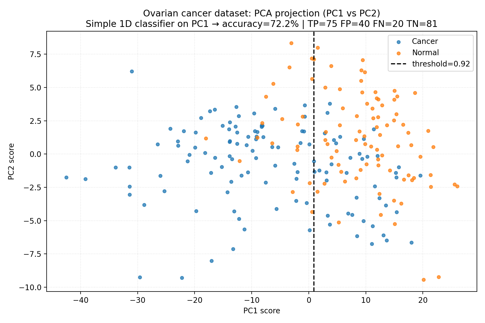

# Lab02 | PCA
## Capitolo 1: Introduzione alla PCA e Concetti Fondamentali
### Obiettivo della PCA: Riduzione della Dimensionalità
[00:00] L'Analisi delle Componenti Principali (Principal Component Analysis, PCA) è una tecnica statistica utilizzata per la riduzione della dimensionalità. Questa metodologia si rivela particolarmente efficace quando si lavora con insiemi di dati caratterizzati da un elevato numero di feature (variabili). Esempi tipici includono le immagini, dove ogni pixel può essere considerato una feature, o i dati provenienti da sensori. L'obiettivo primario della PCA è ridurre il numero di feature per rendere i dati più facilmente interpretabili, gestibili e per semplificare successive analisi.
### Convenzioni e Definizioni Preliminari
[00:15] Prima di addentrarsi negli aspetti operativi della PCA, è fondamentale stabilire le convenzioni notazionali che verranno utilizzate, in particolare per quanto riguarda la disposizione dei campioni (samples) e delle feature nella matrice dei dati. La comprensione di queste convenzioni è cruciale, poiché la posizione dei campioni (se disposti sulle righe o sulle colonne) determina il modo in cui vengono calcolate le componenti principali. Verrà quindi presentata una breve revisione teorica per allineare le conoscenze necessarie per il laboratorio.
### Direzioni e Componenti Principali
[00:30] Si introducono due definizioni chiave che costituiscono il nucleo della PCA: le direzioni principali e le componenti principali.
- **Direzioni Principali (Principal Directions)**: Sono i vettori (direzioni) che corrispondono agli autovettori della matrice di covarianza, indicata con $C$. Queste direzioni sono di fondamentale importanza perché rappresentano gli assi lungo i quali la varianza dei dati è massima. L'idea alla base della PCA è quella di ruotare il sistema di riferimento originale dei dati in modo che i nuovi assi coincidano con queste direzioni. Massimizzare la varianza permette infatti di catturare la maggior quantità di informazione significativa contenuta nei dati.
- **Componenti Principali (Principal Components)**: Sono il risultato della proiezione dei dati originali sulle direzioni principali. Rappresentano le coordinate dei dati nel nuovo sistema di riferimento definito dalle direzioni principali.
### Convenzione sulla Matrice dei Dati
[01:04] Nel contesto di questo laboratorio, si adotta la seguente convenzione per la matrice dei dati $X$:
$$
X \in \mathbb{R}^{M \times N}
$$
dove:
- $M$ è il numero di feature (ad esempio, il numero di pixel in un'immagine).
- $N$ è il numero di campioni (osservazioni).
[01:17] Generalmente, in questa configurazione, il numero di feature $M$ è elevato, ma il numero di campioni $N$ è ancora maggiore ($N > M$). La matrice $X$ è quindi tipicamente una matrice "alta e stretta", con più righe (feature) che colonne (campioni).
### Assunzione di Dati Centrati
[01:31] Un'assunzione fondamentale per l'applicazione della PCA è che la matrice dei dati $X$ sia **centrata**, ovvero che abbia media nulla.
- **Dati Centrati**: Un insieme di dati si definisce centrato se la sua media aritmetica è uguale a zero.
[01:38] Se i dati originali non fossero centrati, il primo passo preliminare consisterebbe nel calcolare la media di $X$ e sottrarla da ogni campione. Per semplicità notazionale, si assume che questa operazione di centratura sia già stata eseguita. Questa assunzione è necessaria per una corretta definizione e calcolo della matrice di covarianza.
## Capitolo 2: Calcolo delle Componenti Principali tramite SVD
### Matrice di Covarianza e Decomposizione SVD
[01:50] La matrice di covarianza campionaria $C$ è definita come:
$$
C = \frac{1}{N-1} X X^T
$$
dove $N$ è il numero di campioni.
[01:58] Utilizzando la Decomposizione a Valori Singolari (Singular Value Decomposition, SVD) della matrice dei dati $X$, che è data da $X = U \Sigma V^T$, possiamo riscrivere la matrice di covarianza in un'altra forma. Sostituendo l'espressione della SVD nella formula di $C$, si ottiene:
$$
C = \frac{1}{N-1} (U \Sigma V^T) (U \Sigma V^T)^T
$$
Applicando la proprietà della trasposizione di un prodotto di matrici, $(AB)^T = B^T A^T$, l'espressione diventa:
$$
C = \frac{1}{N-1} U \Sigma V^T V \Sigma^T U^T
$$
[02:07] Poiché la matrice $V$ è ortogonale, per definizione si ha che $V^T V = I$ (matrice identità). Inoltre, la matrice $\Sigma$ è pseudo-diagonale, il che implica che la sua trasposta è uguale a se stessa ($\Sigma^T = \Sigma$). L'espressione si semplifica quindi in:
$$
C = \frac{1}{N-1} U \Sigma^2 U^T
$$
[02:18] Questa formula rappresenta la diagonalizzazione della matrice di covarianza $C$. Da questa scomposizione si evince che le colonne della matrice $U$ sono gli autovettori di $C$. Di conseguenza, le colonne di $U$ rappresentano le **direzioni principali** dei dati.
### Calcolo delle Componenti Principali
[02:30] Le componenti principali si ottengono proiettando i dati originali (centrati) sulle direzioni principali. Geometricamente, l'operazione di proiezione di un vettore su un altro corrisponde al loro prodotto scalare (o prodotto interno).
[02:41] Per calcolare la componente del primo campione ($x_1$, ovvero la prima colonna della matrice $X$) sulla prima direzione principale ($u_1$, la prima colonna della matrice $U$), si esegue il prodotto scalare tra il vettore $u_1$ e il vettore $x_1$.
[02:54] Per generalizzare questo calcolo a tutti i campioni e a tutte le direzioni principali in modo efficiente, si utilizza un prodotto matriciale. La matrice delle componenti principali (PC) è data dalla seguente formula:
$$
PC = U^T X
$$
[02:58] Analizziamo nel dettaglio questa operazione. La prima riga della matrice $U^T$ (che corrisponde alla prima colonna di $U$, cioè il vettore $u_1$) viene moltiplicata scalarmente per la prima colonna della matrice $X$ (il campione $x_1$). Il risultato di questa operazione è la proiezione del primo campione sulla prima componente principale.
[03:08] Allo stesso modo, se si considera la seconda riga di $U^T$ (corrispondente a $u_2$) e la si moltiplica per la prima colonna di $X$, si ottiene la proiezione del primo campione sulla seconda componente principale. L'intera operazione matriciale $U^T X$ calcola sistematicamente le proiezioni di tutti i campioni su tutte le direzioni principali, restituendo la matrice delle componenti principali.
## Capitolo 3: Convenzione Alternativa e Dimostrazione Pratica
### Convenzione Alternativa: Matrice Trasposta (Campioni per Feature)
[03:25] Si considera ora il caso alternativo in cui la matrice dei dati $X$ sia trasposta rispetto alla convenzione precedente. In questa configurazione, la matrice $X$ ha dimensioni $N \times M$, ovvero $X \in \mathbb{R}^{N \times M}$, dove le righe rappresentano i campioni e le colonne rappresentano le feature.
[03:35] Con questa convenzione, la matrice di covarianza $C$ viene calcolata come:
$$
C = \frac{1}{N-1} X^T X
$$
[03:41] Sostituendo la SVD di $X$ (che in questo caso è $X = U \Sigma V^T$, ma con dimensioni delle matrici diverse rispetto a prima), si ottiene:
$$
C = \frac{1}{N-1} (U \Sigma V^T)^T (U \Sigma V^T) = \frac{1}{N-1} V \Sigma^T U^T U \Sigma V^T
$$
Poiché la matrice $U$ è ortogonale ($U^T U = I$) e $\Sigma$ è pseudo-diagonale, l'espressione si semplifica in:
$$
C = \frac{1}{N-1} V \Sigma^2 V^T
$$
[03:51] In questo scenario, la diagonalizzazione della matrice di covarianza mostra che gli autovettori di $C$ sono le colonne della matrice $V$. Pertanto, con questa convenzione, le **direzioni principali** sono le colonne della matrice $V$.
### Invarianza del Metodo
[03:56] Entrambe le convenzioni presentate sono valide e portano a risultati coerenti. La scelta della convenzione influenza unicamente quale delle due matrici della SVD ($U$ o $V$) contiene le direzioni principali.
[04:04] Nel corso di questo laboratorio, si utilizzerà la prima convenzione, dove ogni colonna della matrice $X$ rappresenta un campione. Tuttavia, è importante ricordare che il metodo funziona in modo del tutto analogo anche con la convenzione trasposta; è sufficiente scambiare i ruoli di $U$ e $V$ nell'interpretazione dei risultati.
[04:15] Le direzioni principali, essendo gli assi che orientano i dati lungo le direzioni di massima variabilità, sono quelle che spiegano la maggior parte della varianza e, di conseguenza, descrivono al meglio la struttura intrinseca dei dati.
### Esercizio 1: Struttura della Dimostrazione Pratica
[04:45] Il primo esercizio ha una natura prettamente accademica ed è progettato per mostrare in modo pratico e visivo il funzionamento della PCA.
[04:55] La procedura che verrà seguita è articolata nei seguenti passaggi:
1.  **Generazione di dati**: Si generano dati casuali che seguono una distribuzione normale (gaussiana) e sono indipendenti nelle due dimensioni (2D). Questo rappresenta un caso ideale, desiderato da ogni statistico, in cui le ipotesi per l'applicazione di strumenti potenti sono pienamente verificate.
2.  **Applicazione di una trasformazione geometrica**: Ai dati ideali viene applicata una trasformazione (rotazione, traslazione, dilatazione) per simulare le caratteristiche dei dati reali, che raramente sono "puliti", normali e indipendenti.
3.  **Applicazione della PCA**: Si applica l'algoritmo della PCA ai dati trasformati.
4.  **Verifica**: Si dimostra che la PCA è in grado di "invertire" la trasformazione applicata, recuperando la struttura dei dati originali. In particolare, si mostra come la PCA possa identificare la trasformazione geometrica applicata inizialmente, senza avere alcuna conoscenza a priori su di essa.
## Capitolo 4: Implementazione dell'Esercizio 1 - Preparazione dei Dati
### Importazione delle Librerie e Impostazione del Seed
[05:48] La prima fase dell'implementazione consiste nell'importare le librerie necessarie per l'analisi: `numpy` per i calcoli numerici e `matplotlib` per la visualizzazione grafica dei dati.
[05:54] Viene impostato un "seed" per il generatore di numeri casuali.
- **Seed**: È un valore iniziale utilizzato da un algoritmo di generazione di numeri pseudo-casuali. Fissare il seed garantisce che la sequenza di numeri "casuali" generata sia sempre la stessa ad ogni esecuzione del codice, rendendo l'esperimento riproducibile.
### Definizione delle Direzioni di Trasformazione
[06:04] Si definiscono due vettori ortogonali, le cui direzioni sono determinate da un angolo $\theta_1 = \pi/6$ (corrispondente a 30 gradi).
[06:12] Il secondo angolo, $\theta_2$, è definito aggiungendo $\pi/2$ (90 gradi) a $\theta_1$, garantendo così l'ortogonalità tra le due direzioni.
[06:19] Vengono quindi calcolati i due vettori di direzione, $z_1$ e $z_2$, che saranno utilizzati per trasformare i dati. Stampando i valori di $z_1$ e $z_2$, si può verificare che sono vettori unitari con un'orientazione di 30 gradi rispetto agli assi cartesiani.
### Definizione della Trasformazione Geometrica
[06:30] La trasformazione geometrica che verrà applicata ai dati è una combinazione di una rotazione, una traslazione e una dilatazione (scaling).
- **Traslazione**: Viene definita da un vettore di traslazione $B = [20, 30]^T$.
- **Rotazione e Dilatazione**: Sono definite congiuntamente da una matrice di trasformazione $A$.
[06:40] Si generano 1000 punti dati iniziali, chiamati `Y`, le cui componenti sono generate in modo indipendente secondo una distribuzione normale. Questi rappresentano i dati di partenza "ideali".
[06:47] La trasformazione geometrica completa per ottenere i dati finali $X_i$ a partire da un punto iniziale $Y_i$ è data dalla formula:
$$
X_i = A Y_i + B
$$
[06:52] La matrice $A$ combina la rotazione (definita implicitamente dai vettori di direzione $z_1$ e $z_2$) e una dilatazione (definita da due costanti di scaling $\rho_1$ e $\rho_2$).
[07:00] I valori numerici scelti per la trasformazione (ad esempio, 20, 30 per la traslazione) sono arbitrari. L'obiettivo dell'esercizio non è legato a questi valori specifici, ma è dimostrare che la PCA può recuperare la trasformazione applicata, qualunque essa sia, senza conoscerla a priori. La trasformazione serve a creare dati "sporchi" che simulano un dataset reale, non più centrato e con correlazioni tra le feature.
### Creazione dei Dati Iniziali e Trasformazione
[07:40] Si definiscono i valori di dilatazione $\rho_1$ e $\rho_2$ e il numero di punti da generare, $N=1000$.
[07:45] Vengono generati i punti originali, chiamati `seeds`. Visualizzandoli con un grafico a dispersione (scatter plot), si osserva una nuvola di punti di forma circolare e centrata nell'origine, tipica di una distribuzione gaussiana bivariata con componenti indipendenti e varianza unitaria.
[07:52] L'opzione `axis('equal')` nel grafico assicura che le scale degli assi X e Y siano identiche. Questo è fondamentale per evitare distorsioni visive e apprezzare correttamente la forma geometrica della distribuzione dei punti.
### Costruzione della Matrice di Trasformazione A
[08:15] La matrice di trasformazione $A$ viene costruita combinando i vettori di direzione $z_1$ e $z_2$ con le costanti di dilatazione $\rho_1$ e $\rho_2$.
[08:20] I vettori $z_1$ e $z_2$ vengono prima scalati, moltiplicandoli per le rispettive costanti di dilatazione, e poi impilati come colonne per formare la matrice $A$, che risulta essere una matrice di dimensioni $2 \times 2$.
### Applicazione della Trasformazione e Broadcasting
[08:38] La trasformazione $X = A \cdot Y + B$ viene applicata a tutti i punti simultaneamente. Invece di utilizzare un ciclo `for`, che sarebbe computazionalmente inefficiente, si sfrutta la capacità di calcolo vettorizzato di NumPy.
[08:55] L'operazione `A @ seed` (dove `seed` è la matrice $2 \times N$ contenente i punti $Y$) esegue la moltiplicazione tra la matrice $A$ ($2 \times 2$) e la matrice dei dati `seed`. NumPy gestisce questa operazione moltiplicando la matrice $A$ per ogni colonna della matrice `seed`.
[09:04] Successivamente, si deve aggiungere il vettore di traslazione $B$. A questo punto interviene il concetto di **broadcasting**.
- **Broadcasting**: È un meccanismo di NumPy che permette di eseguire operazioni aritmetiche tra array (vettori o matrici) di forme diverse. NumPy "espande" implicitamente l'array di dimensioni inferiori per renderlo compatibile con l'array di dimensioni superiori, senza creare copie fisiche dei dati in memoria.
[09:08] La matrice risultante `A @ seed` ha dimensioni $2 \times N$. Non è possibile sommare puntualmente un vettore unidimensionale a una matrice. Per abilitare il broadcasting in modo corretto, è necessario che anche il vettore $B$ sia un oggetto a due dimensioni.
[09:15] In NumPy, un vettore `B` definito come `np.array([20, 30])` è un oggetto monodimensionale. Per poterlo sommare a una matrice, deve essere convertito in una matrice colonna di dimensioni $2 \times 1$. Questo si ottiene aggiungendo una nuova dimensione all'array.
[09:25] È cruciale distinguere tra le seguenti strutture dati in NumPy:
- Un array 1D: `np.array([20, 30])` (ha 1 dimensione).
- Un array 2D (matrice colonna): `np.array([[20], [30]])` (ha dimensioni $2 \times 1$).
- Un array 2D (matrice riga): `np.array([[20, 30]])` (ha dimensioni $1 \times 2$).
[09:58] Per eseguire correttamente il broadcasting in questa operazione, NumPy richiede che l'oggetto da sommare sia una matrice con un numero di righe compatibile (in questo caso, 2). Aggiungendo la dimensione extra a $B$ per trasformarlo in un vettore colonna, NumPy "trasmette" (espande) questo vettore per sommarlo a ciascuna delle $N$ colonne della matrice `A @ seed`.
### Visualizzazione dei Dati Trasformati
[10:28] Dopo aver applicato la trasformazione completa, si ottengono i dati finali, contenuti nella matrice $X$.
[10:35] Visualizzando questi nuovi dati, si osserva che la nuvola di punti, originariamente circolare e centrata, è stata trasformata in una forma ovale (ellittica), allungata, ruotata e traslata. La distribuzione non è più centrata nell'origine e la sua scala è cambiata.
[10:50] L'obiettivo dell'esercizio è dimostrare che la PCA, applicata a questi dati trasformati $X$, può recuperare la trasformazione originale e, idealmente, riportare i dati a una distribuzione simile a quella di partenza.


### Visualizzazione delle Direzioni di Trasformazione
[11:00] Per una migliore comprensione visiva, si aggiungono al grafico delle frecce che rappresentano le direzioni originali della trasformazione ($z_1$ e $z_2$).
[11:08] La funzione `pyplot.arrow` viene utilizzata per disegnare segmenti orientati (frecce). Questa funzione richiede come input le coordinate di inizio della freccia e la sua lunghezza lungo gli assi X e Y.
[11:20] Le frecce vengono disegnate partendo dal centro della nuova distribuzione, ovvero il punto di traslazione $B$. La loro lunghezza e orientamento sono determinati dai vettori di direzione $z_1, z_2$ scalati per le rispettive costanti di dilatazione $\rho_1, \rho_2$.
[11:40] Il grafico risultante mostra la nuvola di dati di forma ellittica con due frecce ortogonali che indicano gli assi principali della trasformazione geometrica che è stata applicata.
## Capitolo 5: Implementazione della PCA e Soluzione dell'Esercizio
### Compito: Calcolare e Visualizzare le Direzioni Principali
[12:05] Il passo successivo consiste nell'implementare l'algoritmo della PCA. I passaggi da seguire sono:
1.  **Centrare i dati**: Calcolare la media della matrice dei dati trasformati $X$ e sottrarla da ogni colonna di $X$. La funzione `numpy.mean` può essere utilizzata a questo scopo, specificando l'asse corretto.
2.  **Applicare la SVD**: Eseguire la Decomposizione a Valori Singolari sulla matrice dei dati centrata. In questo contesto, l'applicazione della PCA equivale a calcolare la SVD dei dati centrati.
3.  **Visualizzare i risultati**: Una volta ottenuta la SVD, si devono visualizzare i primi due vettori singolari a sinistra (le prime due colonne della matrice $U$), che rappresentano le direzioni principali stimate.
[12:20] Questi vettori, che rappresentano le direzioni, devono essere riscalati per un fattore legato alla varianza per essere visivamente confrontabili con le direzioni originali della trasformazione.
[12:25] Per la visualizzazione, si può riutilizzare il codice precedente per disegnare le frecce, sostituendo i vettori originali $z_1, z_2$ con le prime due colonne di $U$ ($u_1, u_2$) e le costanti di dilatazione $\rho_1, \rho_2$ con i valori singolari corrispondenti, opportunamente scalati.
[12:40] Il risultato atteso è che le direzioni trovate dalla PCA (le colonne di $U$) coincidano perfettamente (a meno di un segno) con le direzioni $z_1$ e $z_2$ utilizzate per generare i dati.
### Spiegazione Intuitiva della PCA
[13:20] La PCA opera identificando un nuovo sistema di assi cartesiani tale per cui questi assi sono allineati con le direzioni di massima varianza dei dati. Poiché i dati trasformati presentano un allungamento maggiore lungo certe direzioni, la PCA troverà proprio quelle direzioni come assi principali.
[13:35] In questo caso specifico, partendo da una distribuzione normale e applicando una trasformazione lineare, la PCA permette di "invertire" tale trasformazione e tornare alla distribuzione originale. In un contesto generale con dati reali, la PCA non rivela necessariamente la distribuzione di probabilità sottostante, ma riorienta gli assi per massimizzare la varianza, semplificando così la struttura dei dati e rendendola più interpretabile.
### Soluzione: Centratura dei Dati
[00:00] La prima parte della soluzione riguarda la centratura del vettore di dati `x`. Poiché il suo valore medio non è nullo, il primo passo consiste nel calcolare tale media.
[00:06] Osservando la struttura di `x`, si nota che è una matrice con due righe e 1000 colonne. La sua forma (`shape`) indica che ogni colonna rappresenta un punto in uno spazio bidimensionale (2D).
[00:15] Per calcolare la media, si utilizza la funzione `numpy.mean`. La media `x_mean` viene calcolata come segue:
```python
x_mean = numpy.mean(x, axis=1)
```
[00:18] L'argomento `axis=1` è fondamentale. In NumPy, l'asse 1 corrisponde alle colonne. Specificare `axis=1` indica alla funzione di calcolare la media lungo le colonne, ovvero di calcolare la media di ciascuna riga separatamente.
[00:25] Come verifica, il risultato atteso è un punto in 2D, rappresentante la media lungo la prima coordinata (asse x) e la media lungo la seconda coordinata (asse y). Controllando la forma (`shape`) del risultato, si ottiene un oggetto monodimensionale con due componenti, che è esattamente ciò che si desidera.
[00:38] Successivamente, si definisce `x_bar` come la matrice `x` a cui è stata sottratta la media. L'operazione è `x - x_mean`.
[00:44] Eseguendo questa sottrazione direttamente, si genera un errore. L'errore è dovuto al fatto che non è possibile eseguire una differenza elemento per elemento (`element-wise`) tra due oggetti con forme (`shapes`) diverse: una matrice $2 \times 1000$ e un vettore 1D di lunghezza 2.
[00:51] L'obiettivo è sottrarre a ciascuna colonna di `x` il vettore delle medie. Per fare ciò in NumPy, è necessario sfruttare il meccanismo del **broadcasting**.
[00:58] Per abilitare il broadcasting, è necessario modificare le dimensioni del vettore `x_mean`, trasformandolo da vettore monodimensionale a matrice colonna. Questo si ottiene aggiungendo una nuova dimensione:
```python
x_mean[:, numpy.newaxis]
```
[01:06] Se si visualizza la forma di questo nuovo oggetto, si noterà la presenza di doppie parentesi quadre, che indicano una struttura a matrice. Nello specifico, si tratta di una matrice con due righe e una colonna ($2 \times 1$).
[01:13] Poiché ora entrambi gli operandi sono matrici (una $2 \times 1000$ e una $2 \times 1$), NumPy può applicare il broadcasting per sottrarre il vettore colonna delle medie da ogni colonna della matrice `x`. Il risultato è la matrice `x_bar`, correttamente centrata rispetto alla media.
### Soluzione: Calcolo della SVD e delle Direzioni Principali
[01:20] Ora che si dispone della matrice `x_bar` a media nulla, è possibile calcolare la Decomposizione a Valori Singolari (SVD).
```python
u, s, vt = np.linalg.svd(x_bar, full_matrices=False)
```
[01:25] L'argomento `full_matrices=False` viene utilizzato per ottenere una SVD "economica" (economy SVD). Questo approccio è spesso preferibile perché scarta le componenti non necessarie, come le colonne singolari e gli zeri extra che non contribuiscono all'informazione utile, ottimizzando l'uso della memoria.
[01:34] La matrice `u` contiene le direzioni principali stimate. Per visualizzarle, è necessario estrarle singolarmente.
[01:38] La prima direzione principale, `u1`, corrisponde alla prima colonna della matrice `u`. Si estrae selezionando tutte le righe e la colonna di indice 0.
[01:43] La seconda direzione principale, `u2`, corrisponde alla seconda colonna della matrice `u`, quindi si selezionano tutte le righe e la colonna di indice 1.
[01:47] Successivamente, si calcola il vettore `r`, che rappresenta la stima della deviazione standard dei dati proiettati lungo le direzioni principali. La formula è:
$$
r = \frac{s}{\sqrt{n-1}}
$$
dove:
- $s$ è il vettore dei valori singolari ottenuti dalla SVD.
- $n$ è il numero di punti (campioni) nel dataset.
[01:52] Questa formula deriva dal fatto che i valori singolari al quadrato, $\sigma^2$, sono proporzionali alla varianza dei dati lungo le rispettive direzioni principali. Estraendo la radice quadrata, si ottiene una stima della deviazione standard.
### Soluzione: Visualizzazione dei Risultati della PCA
[01:58] Per la visualizzazione grafica, si riutilizza il codice del grafico precedente, adattandolo per mostrare i risultati ottenuti dalla PCA.
[02:03] Il grafico originale mostrava i dati e la trasformazione geometrica nota a priori. Ora, si assume che tale trasformazione non sia nota e si sovrappongono le stime ottenute dalla PCA.
[02:10] Dal punto di vista statistico, lo stimatore della media della popolazione è la media campionaria, `x_mean`. Pertanto, nel grafico, il centro della distribuzione `b` (la media reale della trasformazione) viene sostituito con le coordinate della media campionaria, `x_mean[0]` e `x_mean[1]`.
[02:22] La dilatazione `rho1` lungo la prima direzione, che rappresentava la deviazione standard reale, viene sostituita dalla sua stima, `r[0]`.
[02:32] Analogamente, la dilatazione `rho2` lungo la seconda direzione viene sostituita dalla stima `r[1]`.
[02:38] Infine, le direzioni reali della trasformazione, `z1` e `z2`, vengono sostituite con le direzioni che spiegano la massima varianza stimate dalla PCA, ovvero le direzioni principali `u1` e `u2`.
[02:50] Il grafico finale mostra due serie di vettori sovrapposti:
- In **rosso**: le direzioni e le magnitudini della trasformazione geometrica originale, che è stata applicata artificialmente ai dati.
- In **nero**: le direzioni e le magnitudini stimate tramite la PCA, basandosi esclusivamente sui dati osservati.
[03:00] Questo confronto visivo dimostra in modo efficace che la PCA è in grado di trovare le due direzioni (`u1` e `u2`) che meglio spiegano la varianza dei dati.
[03:05] "Spiegare la massima varianza" significa che lungo queste direzioni i dati presentano la maggiore dispersione (`scatter`), rendendole le più informative per comprendere la struttura sottostante dei dati stessi.
### Soluzione: Confronto Numerico e Calcolo delle Componenti Principali
[03:21] Per un confronto più rigoroso, si stampano i valori numerici dei vettori delle direzioni reali (`z1`, `z2`) e di quelle stimate dalla PCA (`u1`, `u2`).
[03:26] Si osserva che i vettori sono numericamente molto simili, ma possono presentare un segno opposto.
[03:30] Questa differenza di segno è un comportamento atteso e non costituisce un errore. La PCA identifica una direzione (una retta nello spazio), ma non il suo orientamento (il verso).
[03:34] Moltiplicare un autovettore (vettore di direzione) per -1 non cambia la direzione stessa, ma solo il suo verso. Poiché tutte le componenti del vettore vengono moltiplicate per -1, la coerenza del sistema di riferimento rimane inalterata.
[03:42] Di conseguenza, ci si può aspettare che le direzioni stimate siano identiche a quelle reali a meno di un fattore di segno.
[03:47] Le componenti principali, indicate con `phi`, vengono calcolate proiettando i dati centrati `x_bar` sulle direzioni principali `u`. La formula matriciale è:
$$
\phi = U^T X_{\text{bar}}
$$
[03:53] Il risultato `phi` è una matrice in cui ogni riga rappresenta una componente principale diversa. La prima riga contiene le proiezioni di tutti i dati sulla prima direzione principale, la seconda riga contiene le proiezioni sulla seconda, e così via.
[04:02] Infine, si realizza un grafico a dispersione (`scatter plot`) delle prime due componenti principali.
[04:06] Sull'asse x si riporta la prima componente principale (prima riga di `phi`), e sull'asse y la seconda componente principale (seconda riga di `phi`).
[04:19] Per evitare distorsioni visive nella rappresentazione, si imposta l'aspetto degli assi su "equal" (`plt.axis('equal')`), garantendo che le scale siano le stesse.
[04:23] Il risultato è una nuvola di punti che assomiglia ai dati originali, ma è stata ruotata in modo che gli assi principali siano allineati con gli assi cartesiani.
[04:26] Con questa trasformazione, i dati sono stati proiettati in un nuovo sistema di riferimento dove gli assi x e y corrispondono alle direzioni di massima varianza.
[04:35] Per riottenere la "nuvola di punti sferica" originale, è necessario applicare anche un'operazione di riscalamento (inversione della dilatazione). Questo si ottiene dividendo ciascuna componente principale per la stima della deviazione standard corrispondente.
[04:42] Si divide quindi la prima riga di `phi` per `r[0]` e la seconda riga per `r[1]`.
[04:48] Il risultato di questa operazione è una nuvola di punti quasi perfettamente sferica, simile a una distribuzione normale standard. La stima non è perfetta a causa della natura campionaria dei dati, ma il risultato è una nuvola di punti rotonda e ben definita, dimostrando che la PCA ha effettivamente "invertito" la trasformazione originale.
[04:56] Il vettore `r` contiene le stime della deviazione standard, calcolate come il rapporto tra i valori singolari `s` e la radice quadrata di `n-1`, dove `n` è il numero di campioni.
## Capitolo 6: Applicazione della PCA al Dataset MNIST
### Introduzione al Dataset MNIST
[05:10] Il secondo esercizio introduce un'applicazione pratica della PCA su un dataset reale, noto come MNIST.
[05:18] Il dataset MNIST è uno dei più famosi nel campo del machine learning e del riconoscimento della scrittura a mano (`handwriting recognition`). Contiene un gran numero di immagini di cifre scritte a mano (da 0 a 9), e l'obiettivo tipico è addestrare un modello a classificarle correttamente.
[05:25] Sebbene la SVD e la PCA siano strumenti potenti, per questo tipo di compito esistono metodi più avanzati e specifici (come le reti neurali convoluzionali). L'esercizio propone una versione semplificata del problema di classificazione.
[05:32] L'obiettivo sarà utilizzare la SVD per distinguere tra due cifre specifiche, ad esempio gli zeri e i nove. Non si affronterà il problema completo di classificare tutte le dieci cifre, anche perché mancano gli strumenti di classificazione più complessi necessari per tale compito.
[05:45] Il dataset MNIST è un benchmark standard utilizzato per valutare le prestazioni di molti algoritmi, in particolare le reti neurali, e ha una propria pagina Wikipedia dedicata.
### Caricamento e Preparazione dei Dati
[05:54] Per iniziare, è necessario caricare i dati. Se si esegue la prima cella di codice senza aver caricato i file necessari nell'ambiente di lavoro, si otterrà un errore.
[06:01] Similmente a come sono state caricate le immagini in esercizi precedenti, ora è necessario caricare il dataset. Si utilizza l'interfaccia della macchina virtuale per caricare i due file forniti: `mnist_train.csv` e `mnist_test.csv`.
[06:15] La presenza di due file distinti introduce una delle migliori pratiche del machine learning: la suddivisione del dataset in un insieme di addestramento (`training set`) e un insieme di test (`test set`).
[06:21] Questa separazione è cruciale per verificare le prestazioni reali di un algoritmo. L'algoritmo viene addestrato (o "impara") su un sottoinsieme dei dati (il training set) e poi viene testato su dati che non ha mai visto prima (il test set).
[06:29] Questo approccio previene il fenomeno dell'**overfitting** (sovra-adattamento).
- **Overfitting**: Una condizione in cui un modello di machine learning impara a memoria le specificità e il rumore del training set, invece di catturare la struttura generale dei dati. Un modello in overfitting ha ottime prestazioni sul training set ma scarse capacità di generalizzare a nuovi dati.
[06:38] Per una valutazione onesta e realistica delle prestazioni di un algoritmo, è indispensabile riservare una parte del dataset per il test, da utilizzare solo alla fine del processo di addestramento.
[06:46] Si inizia caricando il training set, che è un file in formato CSV (Comma-Separated Values), utilizzando una funzione di NumPy. La sua dimensione viene stampata per un primo controllo.
### Gestione della Corruzione dei Dati ed Esplorazione
[06:53] Una domanda comune nella pratica riguarda la gestione della corruzione dei dati, ovvero la presenza di dati anomali, errati o corrotti all'interno del dataset.
[06:59] In un contesto reale, la pulizia e la verifica della qualità dei dati (`data cleaning`) sono compiti avanzati e di fondamentale importanza.
[07:06] Un primo passo consiste sempre in un'ampia verifica manuale. È prassi comune dedicare una quantità significativa di tempo a ispezionare campioni casuali del dataset per identificare problemi macroscopici e farsi un'idea della qualità dei dati.
[07:18] Questa fase di esplorazione umana aiuta a comprendere la natura dei dati e a individuare eventuali anomalie evidenti. La quantità di tempo dedicata a questa fase dipende dalla scala e dall'importanza del progetto.
[07:34] Successivamente, si applicano tecniche computazionalmente "economiche" (`cheap`) per analizzare i dati su larga scala, ad esempio per clusterizzarli e identificare outlier (valori anomali).
[07:39] La SVD e la PCA sono strumenti eccellenti per questo scopo. Applicando la PCA, gli outlier (punti corrotti o anomali) tendono a trovarsi molto distanti dal cluster principale dei dati, quando vengono proiettati sulle prime componenti principali.
[07:52] Un'altra tecnica molto utilizzata per la visualizzazione e l'identificazione di outlier in dati ad alta dimensionalità è t-SNE (t-Distributed Stochastic Neighbor Embedding).
[07:57] Solo dopo questa fase di pre-elaborazione e pulizia dei dati si procede all'applicazione di modelli più sofisticati e computazionalmente costosi, come le reti neurali convoluzionali.
[08:03] Questo delinea una pipeline di lavoro tipica nell'analisi dei dati. La PCA si rivela uno strumento pratico e fondamentale per la verifica iniziale della qualità dei dati.
### Riorganizzazione del Dataset
[08:10] La forma del dataset caricato da file è di 20.000 campioni per 785 feature. Ogni riga rappresenta un'immagine "appiattita" (`flattened`) in un vettore.
[08:17] Per tornare alla convenzione usata in precedenza, dove ogni colonna rappresenta un campione, è necessario trasporre la matrice.
[08:23] La struttura del file CSV è tale che la prima colonna contiene le etichette (`labels`), ovvero la cifra reale (da 0 a 9) rappresentata dall'immagine, mentre le 784 colonne successive contengono i valori dei pixel dell'immagine.
[08:32] Si traspone quindi la matrice per adottare la convenzione in cui ogni colonna è un campione e ogni riga è una feature (un pixel).
[08:40] In un contesto reale o in una prova d'esame, queste informazioni sulla struttura del file verrebbero sempre fornite.
[08:48] Le etichette, che si trovavano nella prima colonna del file originale, dopo la trasposizione diventano la prima riga della nuova matrice.
[08:54] Per separare i dati dalle etichette, si seleziona la prima riga per ottenere le etichette e tutte le righe dalla seconda in poi per ottenere i dati delle immagini. La sintassi `[1:, :]` in NumPy significa "prendi tutte le righe a partire da quella con indice 1 (la seconda) fino alla fine, e tutte le colonne".
[09:20] Questa operazione produce due oggetti distinti:
- `labels_full`: un vettore di interi contenente le etichette reali per ciascuno dei 20.000 campioni.
- `data_full`: una matrice con 784 righe (i pixel) e 20.000 colonne (i campioni). Le immagini sono di piccole dimensioni, $\sqrt{784} \times \sqrt{784}$, ovvero $28 \times 28$ pixel.
### Esplorazione Visiva del Dataset
[09:30] La prima fase dell'analisi consiste nell'esplorazione visiva dei dati. Si decide di visualizzare le prime 30 immagini del dataset.
[09:35] Si prepara una griglia di plot (subplot) con 3 righe e 10 colonne. Gli assi del plot vengono "appiattiti" in un unico vettore per semplificare l'accesso tramite un ciclo `for`.
[09:43] Si itera sui primi 30 campioni. Per ogni campione `i`, si estrae la colonna corrispondente dalla matrice dei dati.
[09:48] Poiché ogni colonna è un'immagine appiattita in un vettore di 784 elementi, è necessario rimodellarla (`reshape`) in una matrice quadrata di dimensioni $28 \times 28$ per poterla visualizzare come immagine.
[09:57] Si utilizza la funzione `imshow` di Matplotlib per visualizzare l'immagine, specificando una mappa di colori in scala di grigi (`cmap='gray'`).
[10:04] Il titolo di ogni immagine viene impostato con la sua etichetta reale e gli assi vengono nascosti per non appesantire il grafico e migliorare la leggibilità.
[10:10] Il risultato è una griglia di immagini di cifre scritte a mano, ognuna con la sua etichetta corrispondente. Si può notare che anche per un essere umano, alcune di queste cifre sono di difficile interpretazione, il che rende l'esempio realistico e non banale.
### Filtraggio dei Dati tramite Maschera Booleana (Bitmask)
[10:30] Il compito successivo è visualizzare le prime 30 immagini che rappresentano esclusivamente la cifra 9. Questo è un passo preparatorio per l'attività di classificazione binaria che seguirà.
[10:38] Per eseguire questa operazione di filtraggio in modo efficiente, si utilizza una tecnica chiamata **maschera booleana** (o bitmask).
[10:43] Si parte dal vettore `labels_full`, che contiene tutte le etichette del dataset.
[10:49] Eseguendo l'operazione di confronto `labels_full == 9`, si ottiene un nuovo vettore booleano della stessa lunghezza, dove ogni elemento è `True` se l'etichetta corrispondente è 9, e `False` altrimenti.
[10:55] NumPy permette di usare questo vettore booleano per indicizzare un altro array. La sintassi `data_full[:, labels_full == 9]` viene interpretata come segue:
[11:01] - `[:, ... ]`: Seleziona tutte le righe (tutti i 784 pixel).
[11:04] - `[..., labels_full == 9]`: Per le colonne, passa il vettore booleano. NumPy estrarrà automaticamente solo le colonne in cui il valore corrispondente nel vettore booleano è `True`.
[11:11] Questa operazione restituisce una nuova matrice contenente solo le immagini della cifra 9. La dimensione di questa matrice sarà ridotta (circa 2.000 campioni invece dei 20.000 originali).
[11:20] È fondamentale comprendere bene questo meccanismo di indicizzazione booleana, poiché permette di eseguire operazioni di filtraggio sui dati in modo molto efficiente e conciso.
[11:30] Una volta filtrati i dati per ottenere solo le immagini dei 9, il resto del compito è semplice: si copia e si incolla il codice di visualizzazione precedente, applicandolo al nuovo dataset filtrato, per mostrare le prime 30 immagini della cifra 9.
[11:43] La funzione `reshape(-1)` viene utilizzata per "appiattire" una matrice di assi di plot (ad esempio, una griglia $3 \times 10$) in un singolo vettore.
[11:50] Quando si crea una griglia di subplot, l'oggetto restituito da Matplotlib è una matrice di assi. Per poter iterare su di essi con un singolo ciclo (ad esempio, da 1 a 30), è più comodo trattarli come un vettore unidimensionale.
[11:56] `reshape(-1)` indica a NumPy di calcolare automaticamente la dimensione corretta per il vettore risultante. In questo caso, una matrice $3 \times 10$ viene trasformata in un vettore di 30 elementi. La struttura dei dati sottostante non cambia, ma solo il modo in cui vi si accede.
### Compito Assegnato: Applicazione della PCA per Classificazione
[12:20] Il compito successivo consiste nell'utilizzare la PCA per distinguere le cifre 0 e 9. L'esercizio è suddiviso in più passaggi guidati.
[12:28] 1.  **Filtrare e visualizzare**: Estrarre e visualizzare le prime 30 immagini che sono o uno 0 o un 9. Per questo, è utile consultare la documentazione di NumPy per trovare un modo efficiente di combinare due condizioni booleane (ad esempio, con un operatore OR logico).
[12:35] 2.  **Calcolare e visualizzare la media**: Calcolare l'immagine media di questo nuovo sottogruppo di dati (contenente solo 0 e 9) e visualizzarla. Questo è un passo necessario per centrare i dati prima di applicare la PCA.
[12:41] 3.  **Eseguire la PCA**: Applicare la SVD ai dati centrati. Stampare i valori singolari, la frazione cumulativa dei valori singolari e la frazione di varianza spiegata cumulativa.
[12:50] 4.  **Visualizzare gli assi principali**: Visualizzare le prime 30 direzioni principali (le prime 30 colonne della matrice $U$) come se fossero immagini.
[12:53] 5.  **Calcolare le componenti principali**: Calcolare le prime due componenti principali per tutti i dati del sottogruppo.
[12:55] Questi passaggi sono stati già affrontati in esercizi precedenti. È consentito e incoraggiato riutilizzare codice da notebook passati, poiché l'obiettivo è comprendere come e quando applicare le tecniche apprese, non memorizzare il codice a memoria.
## Capitolo 7: Analisi PCA delle Cifre 0 e 9
### Applicazione di Operazioni Lungo un Asse Specifico
[00:00] Quando si specifica un asse (`axis`) in un'operazione NumPy, ad esempio impostandolo uguale a un valore numerico, si indica che tale operazione deve essere eseguita lungo quella specifica dimensione dell'array.
[00:04] Se si imposta `axis=1`, l'operazione viene applicata lungo il secondo asse, che per una matrice corrisponde alle colonne.
[00:08] Questo significa che l'operazione viene eseguita "attraverso" le colonne. Ad esempio, data una matrice di dimensioni $M \times N$, specificare `axis=1` per un'operazione come la media implica calcolare $M$ medie separate, una per ogni riga, utilizzando i valori presenti nelle $N$ colonne.
[00:14] In pratica, si sta eseguendo un'operazione che collassa la dimensione specificata. Nel caso di `mean(axis=1)` su una matrice $M \times N$, il risultato sarà un vettore di lunghezza $M$.
### Preparazione del Dataset per Cifre 0 e 9
[00:34] L'obiettivo iniziale è creare un nuovo dataset contenente esclusivamente le immagini delle cifre zero e nove.
[00:38] Per prima cosa, si definiscono le cifre di interesse. In questo caso, si scelgono le cifre 0 e 9, ma l'approccio è generale e potrebbe essere applicato a qualsiasi altra coppia di cifre, come ad esempio 4 e 6.
[00:46] Successivamente, si crea una maschera booleana per filtrare i dati. Questa maschera identificherà le posizioni nel vettore delle etichette (`labels_full`) che corrispondono alle cifre desiderate.
[00:50] La maschera viene costruita combinando due condizioni: una che controlla dove le etichette sono uguali a 0 e un'altra che controlla dove sono uguali a 9.
[00:54] Poiché un'immagine può essere uno zero *oppure* un nove, è necessario combinare queste due condizioni con un operatore logico OR.
[00:58] Questo può essere realizzato utilizzando la funzione `np.logical_or` oppure, in modo più compatto e leggibile, l'operatore `|` (barra verticale), che in NumPy rappresenta l'operatore OR logico elemento per elemento.
[01:05] Le due notazioni (`np.logical_or(cond1, cond2)` e `cond1 | cond2`) producono lo stesso risultato finale, in modo analogo a come `np.matmul(A, B)` e `A @ B` rappresentano entrambi il prodotto tra matrici.
[01:13] Una volta creata la maschera booleana, la si applica sia al dataset completo delle immagini (`data_full`) sia al vettore completo delle etichette (`labels_full`).
[01:17] In questo modo, si estraggono solo le colonne (immagini) e le etichette corrispondenti alle cifre 0 e 9.
[01:22] È buona prassi verificare le dimensioni (`shape`) dei nuovi array per confermare che il filtraggio sia avvenuto correttamente e per conoscere la numerosità del nuovo dataset.
### Visualizzazione delle Immagini Filtrate
[01:26] Per visualizzare le immagini del nuovo dataset filtrato, è possibile riutilizzare il codice di plotting già scritto in precedenza, adattandolo ai nuovi dati.
[01:33] La differenza principale consiste nel sostituire il dataset originale con il nuovo dataset filtrato, che ora contiene solo 0 e 9.
[01:37] Per una verifica immediata della correttezza del filtraggio, si può aggiungere un titolo a ciascuna immagine visualizzata, mostrando la sua etichetta corrispondente.
[01:40] Il titolo viene impostato utilizzando il metodo `ax[i].set_title()`, passando l'etichetta `labels[i]` (convertita in stringa) per l'i-esima immagine.
[01:46] Il risultato della visualizzazione conferma che le immagini etichettate come "9" sono effettivamente dei nove e quelle etichettate come "0" sono effettivamente degli zeri, validando la correttezza del processo di filtraggio.
### Calcolo e Analisi dell'Immagine Media
[01:52] Il passo successivo consiste nel calcolare l'immagine media del dataset filtrato (contenente solo 0 e 9).
[01:55] L'immagine media, `A_mean`, si ottiene calcolando la media di tutte le immagini lungo l'asse delle colonne (`axis=1`) tramite la funzione `numpy.mean`.
[01:58] Anche se si sta lavorando con immagini, la convenzione per gli assi rimane la stessa utilizzata per le matrici generiche: `axis=0` per le righe, `axis=1` per le colonne.
[02:05] Per visualizzare l'immagine media, si utilizza la funzione `plt.imshow`.
[02:08] Poiché `A_mean` è un vettore (risultato del calcolo della media lungo `axis=1`), mentre `imshow` richiede una matrice 2D, è necessario rimodellarlo (`reshape`) alle dimensioni originali dell'immagine, ovvero $28 \times 28$ pixel.
[02:13] Si imposta la mappa di colori (`colormap`) su `gray` per una visualizzazione in scala di grigi, appropriata per queste immagini.
[02:16] L'immagine risultante rappresenta la media di tutte le immagini del dataset. Ogni pixel dell'immagine media corrisponde al valore medio dei pixel nella stessa posizione in tutte le immagini originali.
[02:23] Il risultato è visivamente coerente con le aspettative: si osserva chiaramente la forma arrotondata tipica dello zero, e una parte più sfumata e chiara nella parte superiore che corrisponde al tratto distintivo del nove, presente solo in una parte delle immagini utilizzate per la media.
## Capitolo 8: Analisi dei Risultati della SVD
### Calcolo della SVD e dei Valori Singolari
[02:32] Si procede ora con il calcolo della Decomposizione ai Valori Singolari (SVD) e l'analisi dei valori singolari risultanti.
[02:36] Per prima cosa, si centra il dataset sottraendo l'immagine media `A_mean` da ogni immagine nella matrice `A`. Questa operazione viene eseguita efficientemente tramite *broadcasting*.
[02:40] Per eseguire correttamente la sottrazione, è necessario che `A_mean` sia un vettore colonna, quindi si aggiunge una dimensione per renderlo compatibile con le dimensioni della matrice `A`.
[02:45] Successivamente, si calcola la SVD della matrice centrata `A_bar` utilizzando la funzione `numpy.linalg.svd`.
[02:49] L'argomento `full_matrices=False` viene utilizzato per calcolare una SVD "economica", che è più efficiente in termini di calcolo e memoria.
[02:52] Si preparano tre grafici su un'unica figura per visualizzare e analizzare i risultati della SVD.
[03:00] Nel primo grafico, si visualizzano i valori singolari (`s`) in scala semi-logaritmica sull'asse y. Questa è la rappresentazione standard per questo tipo di dato, poiché i valori singolari tendono a decrescere esponenzialmente.
[03:05] Nel secondo grafico, si mostra la frazione cumulativa dei valori singolari, calcolata come:
$$
\text{Frazione Cumulativa}(k) = \frac{\sum_{i=0}^{k-1} s_i}{\sum_{i=0}^{N-1} s_i}
$$
dove $s_i$ è l'i-esimo valore singolare e $N$ è il numero totale di valori singolari. Questo grafico mostra quanta "energia" o "informazione" (in termini di somma dei valori singolari) è contenuta nelle prime $k$ componenti.
[03:11] Il terzo grafico è concettualmente simile al secondo, ma visualizza la varianza spiegata cumulativa, utilizzando i valori singolari al quadrato:
$$
\text{Varianza Spiegata Cumulativa}(k) = \frac{\sum_{i=0}^{k-1} s_i^2}{\sum_{i=0}^{N-1} s_i^2}
$$
Questo grafico mostra quale frazione della varianza totale dei dati è catturata dalle prime $k$ componenti principali.
### Interpretazione dei Grafici della SVD
[03:20] L'analisi del grafico dei valori singolari rivela un comportamento interessante: dopo un certo punto, il loro valore scende drasticamente fino a raggiungere la precisione di macchina (`machine epsilon`), ovvero un valore numericamente indistinguibile da zero.
[03:26] Questo indica che solo un numero limitato di componenti singolari è realmente necessario per ricostruire le immagini con un'alta fedeltà. Oltre una certa soglia, le componenti aggiuntive non contribuiscono in modo significativo all'informazione contenuta nelle immagini.
[03:32] La ragione di questo crollo improvviso risiede nella struttura intrinseca delle immagini del dataset MNIST.
[03:35] Molti pixel, specialmente quelli situati ai bordi dell'immagine, sono costantemente neri (con valore zero o prossimo a zero) in quasi tutte le immagini.
[03:41] Poiché questa informazione è ridondante (è sempre la stessa per tutti i campioni), non sono necessarie componenti aggiuntive per descrivere e ricostruire queste aree. La varianza in queste regioni è nulla.
[03:47] Questa ipotesi verrà confermata visivamente in seguito, quando si visualizzeranno le direzioni principali corrispondenti ai valori singolari più bassi.
[03:52] Il calo drastico dei valori singolari è quindi spiegato dalla presenza di aree con valore di pixel costante (tipicamente zero) in tutte le immagini.
[03:56] Se l'obiettivo fosse la compressione delle immagini, si potrebbe "tagliare" lo spettro dei valori singolari nel punto in cui iniziano a diventare trascurabili, ottenendo una rappresentazione a bassa dimensionalità con una perdita minima di informazione.
[04:01] Anche i grafici della somma cumulativa e della varianza spiegata mostrano un andamento coerente: raggiungono rapidamente un plateau, indicando che i valori singolari successivi non aggiungono quasi nessuna informazione o varianza utile.
[04:10] L'uso del valore singolare al quadrato (proporzionale alla varianza) rispetto al valore singolare semplice non altera significativamente l'andamento generale del grafico, poiché la radice quadrata è una funzione monotona crescente. La relazione è analoga a quella tra varianza e deviazione standard.
### Visualizzazione e Interpretazione delle Direzioni Principali
[04:23] Le direzioni principali, che corrispondono alle colonne della matrice $U$ ottenuta dalla SVD, possono essere interpretate come i "blocchi costruttivi" fondamentali (o "immagini base") da cui tutte le immagini del dataset possono essere generate.
[04:27] Ogni immagine del dataset può essere espressa come una combinazione lineare di queste direzioni principali. I coefficienti di tale combinazione sono le componenti principali.
[04:33] Per visualizzare le prime 30 direzioni principali, si riutilizza la struttura del codice di plotting precedente.


[04:39] Al posto delle immagini originali, si visualizzano le prime 30 colonne della matrice $U$. Ogni colonna, che è un vettore di 784 elementi, viene rimodellata in una matrice $28 \times 28$ per essere visualizzata come un'immagine.
[04:48] L'osservazione delle prime direzioni principali rivela due fatti importanti.
[04:51] Primo, alcune di queste "immagini base" assomigliano a una versione stilizzata e spettrale di uno zero o di un nove.
[04:56] Questo conferma che le caratteristiche macroscopiche e più importanti delle cifre originali sono catturate dalle prime direzioni principali, quelle associate ai valori singolari più alti.
[05:01] Secondo, come già osservato in contesti precedenti, le direzioni principali evolvono da strutture su larga scala (macroscopiche) a strutture sempre più fini, dettagliate e localizzate (microscopiche) man mano che si procede verso indici più alti.
[05:09] Si passa da forme semplici e globali come cerchi e linee a pattern molto più complessi, simili a texture, che descrivono variazioni più sottili.
[05:16] Per esplorare ulteriormente questo fenomeno, si possono visualizzare direzioni principali con indici più alti, ad esempio quelle comprese tra l'indice 100 e 130.
[05:22] In questo intervallo, le "immagini base" iniziano ad assomigliare a rumore ad alta frequenza, perdendo le strutture chiare e definite che caratterizzavano le prime componenti.
[05:26] Infine, analizzando le componenti finali, quelle successive al crollo dei valori singolari (ad esempio, dopo l'indice 600), si osserva che esse rappresentano quasi esclusivamente rumore.
[05:32] Questo rumore è localizzato principalmente nelle aree periferiche dell'immagine, confermando l'ipotesi che i valori singolari di bassa significatività siano legati ai pixel costantemente neri ai bordi, la cui minima variabilità è dovuta solo al rumore numerico.
## Capitolo 9: Classificazione basata sulla PCA
### Proiezione dei Dati sulle Componenti Principali
[05:44] Per calcolare le componenti principali di una singola immagine, si esegue una proiezione, che matematicamente corrisponde a un prodotto scalare.
[05:48] Si proietta la prima immagine del dataset centrato (la prima colonna di `A_bar`) sulla prima direzione principale (la prima colonna di $U$, `U[:, 0]`).
[05:58] Il risultato di questo prodotto scalare è un singolo valore numerico: la prima componente principale per la prima immagine.
[06:02] Analogamente, per ottenere la seconda componente principale della stessa immagine, si proietta la prima colonna di `A_bar` sulla seconda direzione principale (`U[:, 1]`).
[06:09] È importante notare che questa proiezione, eseguita manualmente tramite prodotto scalare per una singola immagine, è equivalente a un'operazione di prodotto tra matrici quando si vogliono calcolare le componenti per l'intero dataset.
[06:13] Se si definisce la matrice delle componenti principali $\Phi$ come il prodotto tra la trasposta di $U$ e la matrice dei dati centrati `A_bar`, si ottiene una matrice in cui ogni colonna contiene le componenti principali di un'immagine.
$$
\Phi = U^T A_{\text{bar}}
$$
[06:19] Le componenti calcolate manualmente per la prima immagine corrisponderanno esattamente ai valori presenti nella prima colonna e nelle prime due righe della matrice $\Phi$, a meno di inevitabili errori di precisione di macchina.
### Visualizzazione delle Prime Due Componenti Principali
[06:30] Si realizza ora uno scatter plot delle prime due componenti principali per tutte le immagini del dataset (contenente solo 0 e 9).
[06:34] L'obiettivo è utilizzare colori diversi per distinguere visivamente le immagini che rappresentano uno zero da quelle che rappresentano un nove.
[06:38] Una soluzione "ingenua" per creare questo grafico comporterebbe l'uso di un ciclo `for`, in cui per ogni punto si calcolano le proiezioni (componente x e y), si imposta il colore in base all'etichetta (ad esempio, rosso per 0 e blu per 9) e si aggiunge il punto al grafico.
[06:50] Una soluzione molto più efficiente e "vettorizzata", tipica dello stile di programmazione con NumPy, consiste nell'utilizzare direttamente la matrice $\Phi$ calcolata in precedenza.
[06:54] Si estraggono la prima riga di $\Phi$ (che contiene tutte le prime componenti principali) e la seconda riga (tutte le seconde componenti principali).
[06:57] La funzione di plotting `scatter` di Matplotlib può accettare un vettore di valori numerici per l'argomento `color` e mapparli automaticamente a una scala di colori.
[07:02] Passando il vettore `labels` (contenente valori 0 e 9) come input per il colore, il grafico assegnerà automaticamente colori diversi alle due classi di cifre.
[07:06] Si possono inoltre personalizzare altri aspetti del grafico, come la dimensione (`s`) e la forma (`marker`) dei punti, per migliorare la leggibilità.
[07:13] Il risultato è un grafico in cui ogni punto (ad esempio, una 'x') rappresenta un'immagine (0 o 9) proiettata nello spazio bidimensionale delle prime due componenti principali.
[07:16] È evidente che, in questo nuovo spazio a due dimensioni, esiste una separazione abbastanza netta tra i due gruppi di cifre, che formano due cluster distinti.
### Definizione di un Classificatore Lineare Semplice
[07:22] L'obiettivo finale è classificare le immagini come 0 o 9. Non avendo ancora introdotto algoritmi di classificazione complessi, si adotta l'approccio più semplice possibile.
[07:27] Si decide di tracciare una linea verticale nel grafico delle componenti principali per separare i due cluster.
[07:30] La classificazione si baserà unicamente sul valore della prima componente principale, che è la più importante in termini di varianza spiegata. Un'immagine verrà classificata come 0 o 9 a seconda che la sua prima componente principale sia maggiore o minore di una certa soglia.
[07:37] Visivamente, questa strategia sembra promettente, dato che i due gruppi di punti sono ben clusterizzati e separati principalmente lungo l'asse orizzontale (la prima componente principale).
[07:42] Sebbene ci siano alcuni punti "fuori posto" (errori di classificazione), bisogna ricordare che il grafico rappresenta un gran numero di campioni (circa 4000 in questo caso), e questi pochi errori potrebbero essere statisticamente trascurabili.
[07:49] Si deve scegliere una soglia (`threshold`). Osservando il grafico, un valore di `threshold = 0` sembra una scelta ragionevole e intuitiva per separare i due cluster, che si trovano approssimativamente a sinistra e a destra dell'origine.
[07:56] Per visualizzare il classificatore, si può tracciare una linea verticale (`plt.axvline`) in corrispondenza della soglia scelta sul grafico a dispersione.


[08:02] Questa linea verticale rappresenta il nostro classificatore: un modello estremamente semplice e ingenuo, ma che sembra essere potenzialmente efficace per questo problema.
## Capitolo 10: Test e Valutazione del Classificatore
### Applicazione del Classificatore al Dataset di Test
[08:11] Ora si testa l'algoritmo di classificazione appena definito sul dataset di test, per valutarne le prestazioni su dati mai visti prima.
[08:15] I passaggi da eseguire sono molto simili a quelli già visti per il training set, ma applicati ai dati di test.
[08:19] Si carica il dataset di test, si estraggono le cifre di interesse (0 e 9), e si proiettano i dati utilizzando le componenti principali calcolate sul *training set*.
[08:25] Questo è il punto cruciale e concettualmente più importante della fase di test: non si deve ricalcolare la SVD sul dataset di test.
[08:28] Le direzioni principali (`U`) e l'immagine media (`A_mean`) ottenute dal training set sono considerate le stime delle vere caratteristiche della distribuzione dei dati. Queste stime vengono ora utilizzate per trasformare i nuovi dati di test.
[08:36] Si utilizzerà quindi la matrice `U` e il vettore `A_mean` calcolati sul training set per proiettare i dati di test e si verificherà se queste direzioni siano efficaci anche per dati che il modello non ha mai incontrato.
[08:44] Una volta proiettati i dati di test, si possono applicare le regole di classificazione e calcolare delle metriche di performance, come l'accuratezza.
### Implementazione della Fase di Test
[09:11] Si inizia caricando il dataset di test. I passaggi sono analoghi a quelli eseguiti per il training set.
[09:17] Si caricano i dati e le etichette dal file `mnist_test.csv`, si traspone la matrice dei dati e la si rinomina, ad esempio, `A_test`.
[09:29] Si verifica che il dataset di test contenga, ad esempio, 10.000 campioni.
[09:32] Successivamente, si filtra il dataset di test per mantenere solo le cifre 0 e 9, riutilizzando la stessa logica di mascheramento booleano applicata in precedenza.
[09:37] Si crea una `mask_test` basata sul vettore `labels_test` e la si applica sia alla matrice `A_test` che a `labels_test`.
[09:48] Per verificare la corretta esecuzione di questi passaggi, si visualizzano alcune delle immagini filtrate dal dataset di test con le relative etichette.
[09:52] La visualizzazione conferma che il caricamento e il filtraggio dei dati di test sono avvenuti correttamente.
### Proiezione dei Dati di Test e Visualizzazione
[10:07] Si procede ora con la proiezione dei dati del test set utilizzando le componenti principali calcolate sul training set.
[10:11] Si calcola la matrice delle componenti principali per il test set, `phi_test`, tramite il prodotto matriciale:
$$
\Phi_{\text{test}} = U^T (A_{\text{test}} - A_{\text{mean}})
$$
[10:15] Un punto critico è l'utilizzo della media `A_mean` calcolata sul *training set*, e non una nuova media calcolata sul test set.
[10:19] La stima della media dei dati è parte integrante della fase di addestramento (training) e non deve essere ricalcolata durante la fase di test. Il modello deve essere testato nelle stesse condizioni in cui opererebbe nel mondo reale, dove la media della popolazione non è nota.
[10:25] Sia le direzioni principali (`U`) che la media (`A_mean`) sono parametri del modello, stimati in fase di training e applicati direttamente ai nuovi dati.
[10:32] Una volta calcolata `phi_test`, si può procedere con la visualizzazione e il calcolo delle metriche di performance.
[10:37] Si riutilizza lo stesso codice di plotting dello scatter plot, ma sostituendo `phi` con `phi_test` e `labels` con `labels_test`.
[10:41] La soglia del classificatore (`threshold = 0`) non viene ridefinita, poiché è stata stabilita durante la fase di training e fa parte del modello.
[10:46] Il grafico risultante mostra che, anche per i dati di test, la linea verticale a `x=0` sembra separare qualitativamente bene i dati tra zeri e nove, suggerendo che il modello sta generalizzando correttamente.
### Valutazione delle Prestazioni del Classificatore
[10:52] L'ultimo passo consiste nel quantificare in modo oggettivo le prestazioni del classificatore.
[10:56] La classificazione si basa sulla prima componente principale, che è la prima riga della matrice `phi_test`.
[11:02] Le etichette predette (`labels_predicted`) vengono determinate confrontando la prima componente principale di ogni campione con la soglia `threshold`.
[11:06] Si crea un vettore booleano che è `True` se la componente è minore della soglia e `False` altrimenti.
[11:09] Utilizzando la funzione `np.where`, si assegna l'etichetta della cifra `digits[0]` (cioè 0) quando la condizione è vera, e `digits[1]` (cioè 9) quando è falsa.
[11:17] Il risultato è un vettore di predizioni, `labels_predicted`, contenente solo zeri e nove.
[11:21] Per valutare il modello in dettaglio, si calcolano quattro valori fondamentali, che sono gli elementi di una **matrice di confusione**:
1.  **Veri Zeri (True Zeros)**: Campioni che sono realmente zeri e sono stati classificati correttamente come zeri.
2.  **Veri Nove (True Nines)**: Campioni che sono realmente nove e sono stati classificati correttamente come nove.
3.  **Falsi Zeri (False Zeros)**: Campioni che sono nove ma sono stati classificati erroneamente come zeri.
4.  **Falsi Nove (False Nines)**: Campioni che sono zeri ma sono stati classificati erroneamente come nove.
[11:29] Ognuno di questi valori viene calcolato creando una maschera booleana che combina le condizioni sulle etichette reali (`labels_test`) e quelle predette (`labels_predicted`) con un operatore AND logico.
[11:35] Ad esempio, i veri zeri sono i campioni per cui la condizione `(labels_test == 0) & (labels_predicted == 0)` è vera.
[11:56] Per contare il numero di elementi `True` in ogni maschera booleana, si utilizza la funzione `np.sum`.
[12:05] È importante analizzare questi valori separatamente, poiché in alcuni problemi le predizioni possono essere sbilanciate (ad esempio, un numero molto maggiore di falsi zeri rispetto a falsi nove). Idealmente, gli errori dovrebbero essere bilanciati tra le classi.
### Calcolo dell'Accuratezza e Matrice di Confusione
[12:14] Una metrica sintetica molto comune per valutare un classificatore è l'**accuratezza** (accuracy).
[12:16] L'accuratezza è definita come il rapporto tra il numero di predizioni corrette e il numero totale di campioni:
$$
\text{Accuratezza} = \frac{\text{Veri Zeri} + \text{Veri Nove}}{\text{Numero Totale di Campioni}}
$$
[12:26] Il risultato mostra un'accuratezza del 95%, indicando che il classificatore è molto efficace, nonostante la sua estrema semplicità.
[12:30] Un errore di solo il 5% su un dataset di test è un risultato notevole per un classificatore basato su una singola linea verticale. Ciò dimostra la potenza della prima componente principale nel catturare l'informazione più discriminante tra le due classi.
[12:35] Si osserva inoltre che le predizioni sono relativamente bilanciate: il numero di falsi positivi e falsi negativi è simile (ad esempio, 30 e 50), così come il numero di predizioni corrette per le due classi. Questo indica che il classificatore non è sbilanciato verso una classe specifica.
[12:47] Questo intero processo di valutazione è così comune nel machine learning che la libreria `scikit-learn` fornisce una funzione apposita, `confusion_matrix`, per automatizzarlo.
[12:53] Passando alla funzione le etichette reali (`labels_test`) e quelle predette (`labels_predicted`), si ottiene una matrice $2 \times 2$ che riassume i quattro valori calcolati manualmente.
[12:58] In una matrice di confusione, l'obiettivo è avere valori alti sulla diagonale principale (le predizioni corrette) e valori bassi (idealmente zero) fuori dalla diagonale (gli errori).
[13:04] È anche importante analizzare se gli errori fuori diagonale sono bilanciati, poiché dataset sbilanciati sono comuni nei problemi reali e possono richiedere tecniche di modellazione e valutazione specifiche per essere gestiti correttamente.
[13:12] La funzione `np.where(condizione, valore_se_vero, valore_se_falso)` utilizzata per la predizione è uno strumento molto utile che restituisce un valore quando una condizione booleana è vera e un altro valore quando è falsa, applicato elemento per elemento su un array.
### Conclusioni e Prossimi Passi
[13:19] Esiste un terzo notebook, lasciato come esercizio, che applica concetti simili di classificazione basata su PCA a un dataset reale sul cancro.
[13:26] In quel caso, l'obiettivo è classificare i pazienti in due categorie (sano o malato), utilizzando un dataset autentico che viene impiegato in contesti di ricerca reali.

## Capitolo 11: Esercizio Lab02 — Diagnosi (Ovarian Cancer) con PCA
Questo esercizio riprende la stessa pipeline vista per MNIST (centering → PCA/SVD → proiezione → classificatore semplice), ma su un dataset reale.

### Dataset e obiettivo
- I dati sono in `note/Lab02/ovariancancer_obs.csv`: una matrice $X$ con una riga per campione e molte feature numeriche (alta dimensionalità).
- Le etichette sono in `note/Lab02/ovariancancer_grp.csv`: due classi (ad esempio `Cancer` vs `Normal`).
- Obiettivo: separare le due classi in modo semplice usando poche componenti principali.

### Preprocessing e PCA
1. **Centratura**: si sottrae la media di ciascuna feature (colonna) per ottenere $X_c = X - \mu$.
2. **PCA via SVD**: si applica una SVD a $X_c$ per ottenere le direzioni principali e proiettare i campioni nello spazio delle componenti principali.
3. **Proiezione**: usando le prime due componenti, ogni paziente diventa un punto in 2D (PC1, PC2), utile per ispezionare visivamente la separabilità.

### Classificatore lineare “a soglia” su PC1
Come nel caso MNIST, si può costruire un classificatore estremamente semplice:
- si usa solo **PC1**;
- si sceglie una soglia $t$ e si assegna la classe in base al segno/posizione rispetto a $t$.

Una scelta pratica per $t$ è il punto medio tra le medie di PC1 per le due classi (soglia “tra i centroidi” lungo PC1). In generale conviene anche controllare quale verso della disuguaglianza massimizza l’accuratezza (dipende da come PC1 orienta i punti).



### Valutazione
La valutazione segue la stessa logica della matrice di confusione:
- corretti per `Cancer` (TP), corretti per `Normal` (TN)
- errori `Cancer→Normal` (FN) e `Normal→Cancer` (FP)

Nota: questa baseline è utile per capire “quanto” la separazione è già catturata dalla prima componente, ma per una valutazione robusta serve uno split train/test (o cross-validation) e, tipicamente, classificatori più flessibili.
