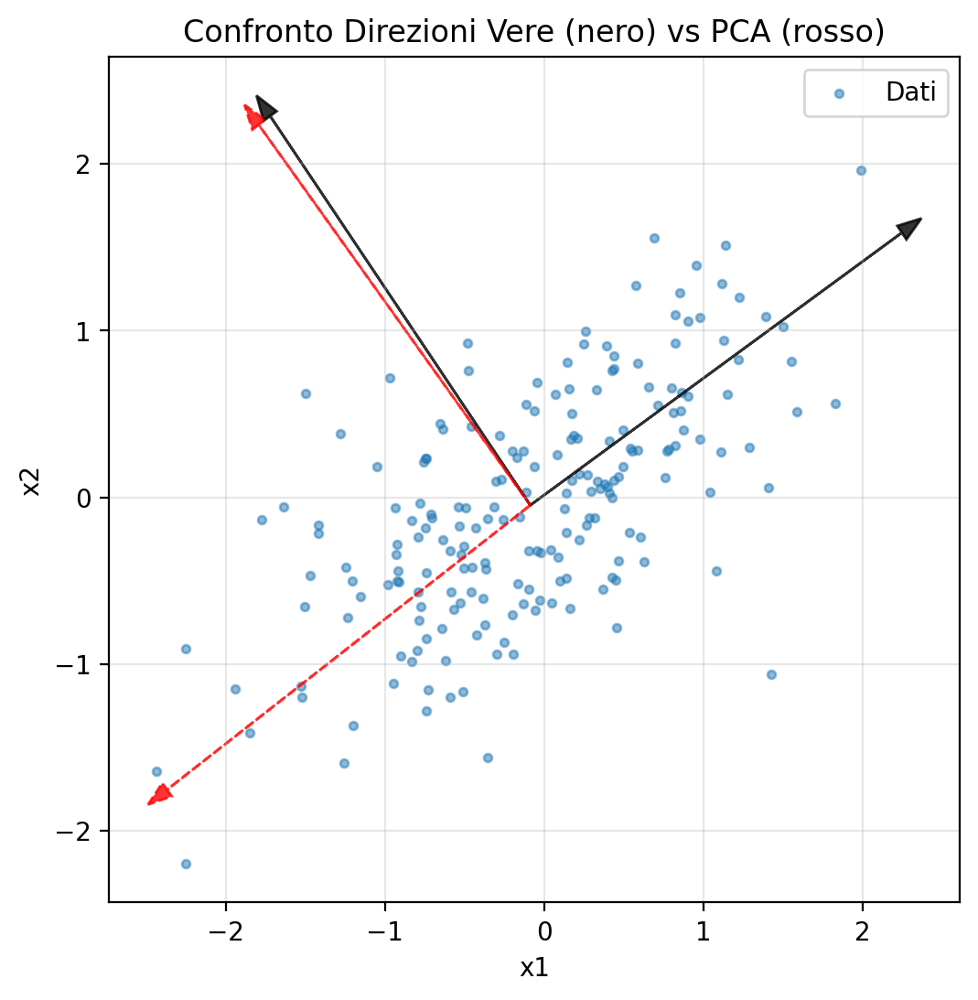
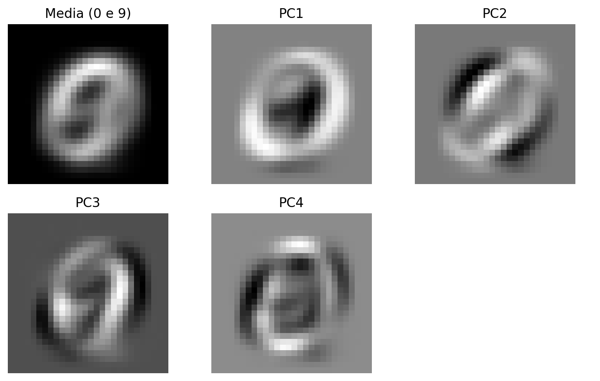
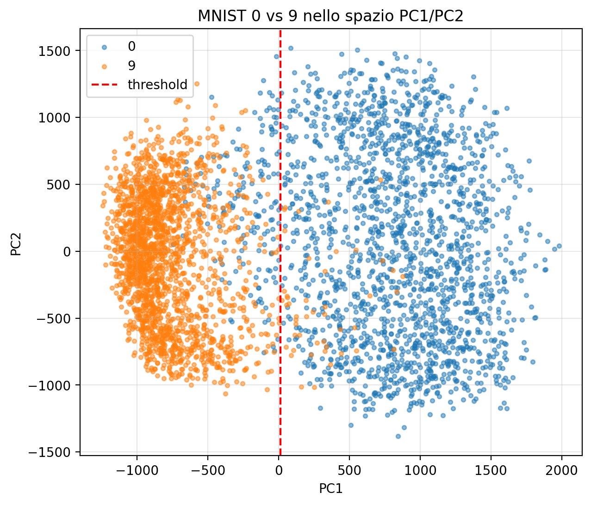

# Lab 2 NAML - Principal Component Analysis (PCA)

---

## 🎯 Obiettivi del Laboratorio

### Competenze Teoriche
- Comprendere le convenzioni della PCA (campioni su colonne vs righe)
- Distinguere tra direzioni principali e componenti principali
- Capire la relazione tra SVD e matrice di covarianza
- Conoscere i concetti di varianza spiegata e riduzione dimensionalità

### Competenze Pratiche
- Implementare PCA usando la SVD in NumPy
- Applicare broadcasting NumPy per operazioni vettorializzate
- Visualizzare componenti principali e direzioni principali
- Utilizzare PCA per classificazione di immagini (MNIST dataset)
- Calcolare metriche di classificazione (accuratezza, matrice di confusione)

### Applicazioni
- Esercizio accademico: recuperare trasformazioni geometriche con PCA
- Classificazione cifre scritte a mano (0 vs 9) usando solo 2 componenti principali
- Visualizzazione di dataset ad alta dimensionalità
- Feature extraction da immagini 28x28 (784 dimensioni)

---

## 📚 Prerequisiti

**Matematica**
- SVD: decomposizione ai valori singolari, matrici ortogonali U e V
- Matrice di covarianza: C = XX^T/(n-1)
- Proiezioni ortogonali: prodotto scalare come operazione di proiezione
- Algebra lineare: combinazioni lineari, spazi vettoriali

**Python e NumPy**
- Broadcasting NumPy per operazioni vettoriali
- Slicing avanzato e bitmask per filtraggio dati
- Reshape e manipolazione dimensioni array
- Matplotlib per visualizzazione (imshow, scatter, subplot)

**Teoria**
- PCA come applicazione della SVD alla matrice di covarianza
- Autovalori della matrice di covarianza = valori singolari al quadrato / (n-1)
- Direzioni principali = colonne di U (o V, dipende dalla convenzione)
- Componenti principali = proiezione dei dati sulle direzioni principali

---

## 📑 Indice Completo

### **Parte 1 - Fondamenti Teorici**
#### [1. Introduzione alla PCA](#introduzione-pca) `00:00:01 - 00:05:26`
- [1.1 Definizioni fondamentali](#definizioni-fondamentali) `00:00:32`
- [1.2 Direzioni principali e massima varianza](#direzioni-principali) `00:01:15`

#### [2. Convenzioni e Teoria](#convenzioni-teoria) `00:05:26 - 00:11:08`
- [2.1 Convenzione: campioni su colonne (M×N)](#convenzione-colonne) `02:30`
- [2.2 Matrice di covarianza e SVD](#matrice-covarianza-svd) `00:03:44`
- [2.3 Componenti principali come proiezioni](#componenti-proiezioni) `00:05:56`
- [2.4 Convenzione alternativa: campioni su righe (N×M)](#convenzione-righe) `00:07:49`

### **Parte 2 - Esercizio Accademico: Trasformazione Geometrica**
#### [3. Esercizio Accademico - Trasformazione Geometrica](#esercizio-accademico) `00:11:08 - 00:28:45`
- [3.1 Generazione dati gaussiani 2D](#generazione-dati-gaussiani) `00:12:40`
- [3.2 Trasformazione geometrica (rotazione, traslazione, dilatazione)](#trasformazione-geometrica) `00:13:34`
- [3.3 Seed per riproducibilità](#seed-riproducibilita) `00:14:18`
- [3.4 Definizione angoli θ₁ e θ₂](#definizione-angoli) `00:14:59`
- [3.5 Applicazione trasformazione: x = A·seed + B](#applicazione-trasformazione) `00:16:02`
- [3.6 Broadcasting NumPy per traslazione](#broadcasting-traslazione) `00:20:51`
- [3.7 Differenze vettori 1D vs 2D in NumPy](#vettori-numpy) `00:22:33`
- [3.8 Visualizzazione con frecce direzionali](#visualizzazione-frecce) `00:26:05`

#### [4. Implementazione PCA](#implementazione-pca) `00:28:45 - 00:52:20`
- [4.1 Calcolo media e centraggio dati](#calcolo-media) `00:29:22`
- [4.2 Applicazione SVD](#applicazione-svd) `00:29:22`
- [4.3 Estrazione direzioni principali U](#estrazione-u) `00:29:22`
- [4.4 Scaling con varianza campionaria](#scaling-varianza) `00:29:22`
- [4.5 Esercizio pratico guidato (15 minuti)](#esercizio-pratico) `00:30:50`

#### [5. Soluzione e Risultati](#soluzione-risultati) `00:52:20 - 01:06:04`
- [5.1 Calcolo media con axis=1](#calcolo-media-axis) `00:52:54`
- [5.2 Broadcasting per centraggio](#broadcasting-centraggio) `00:53:25`
- [5.3 SVD con full_matrices=False](#svd-full-matrices) `00:55:01`
- [5.4 Visualizzazione direzioni principali](#visualizzazione-direzioni) `00:56:45`
- [5.5 Confronto Z vs U: recupero trasformazione](#confronto-z-u) `01:00:42`
- [5.6 Calcolo componenti principali φ = U^T·X̄](#calcolo-componenti) `01:02:04`
- [5.7 Ricostruzione dati originali](#ricostruzione-dati) `01:04:02`

### **Parte 3 - Applicazione Reale: MNIST Dataset**
#### [6. Dataset MNIST - Cifre Scritte a Mano](#dataset-mnist) `01:06:04 - 01:18:24`
- [6.1 Introduzione al dataset MNIST](#intro-mnist) `01:06:04`
- [6.2 Caricamento file CSV da WeBeep](#caricamento-csv) `01:07:42`
- [6.3 Training set vs Test set](#training-test-set) `01:08:07`
- [6.4 Controllo qualità dati e corruzione](#controllo-qualita) `01:09:37`
- [6.5 Struttura dati: 20000 campioni × 784 features](#struttura-dati) `01:12:06`
- [6.6 Estrazione etichette e trasposizione](#estrazione-etichette) `01:12:42`
- [6.7 Visualizzazione prime 30 immagini](#visualizzazione-immagini) `01:15:35`
- [6.8 Filtraggio cifra 9 con bitmask](#filtraggio-cifra-9) `01:17:52`

#### [7. Preprocessing e Filtraggio Dati](#preprocessing-filtraggio) `01:18:24 - 01:26:29`
- [7.1 Bitmask NumPy per filtraggio](#bitmask-numpy) `01:18:24`
- [7.2 Logical OR per selezione 0 e 9](#logical-or) `01:18:24`
- [7.3 Reshape per plot sequenziale](#reshape-plot) `01:21:13`
- [7.4 Compito studenti: PCA su MNIST](#compito-studenti) `01:23:35`

#### [8. Soluzione PCA su MNIST](#soluzione-pca-mnist) `01:45:53 - 02:06:10`
- [8.1 Definizione cifre target e mask](#definizione-cifre) `01:46:27`
- [8.2 Plot primi 30 campioni filtrati](#plot-campioni-filtrati) `01:48:23`
- [8.3 Visualizzazione media immagini](#visualizzazione-media) `01:49:40`
- [8.4 SVD e valori singolari](#svd-valori-singolari) `01:50:56`
- [8.5 Frazione cumulativa e varianza spiegata](#frazione-cumulativa) `01:51:29`
- [8.6 Interpretazione calo valori singolari](#interpretazione-calo) `01:53:25`
- [8.7 Visualizzazione 30 direzioni principali](#visualizzazione-30-direzioni) `01:55:05`
- [8.8 Da strutture macroscopiche a rumore](#strutture-rumore) `01:56:52`
- [8.9 Calcolo prime 2 componenti principali](#calcolo-2-componenti) `01:57:55`
- [8.10 Scatter plot 2D con colori per etichetta](#scatter-2d) `02:00:12`

#### [9. Classificazione con Soglia](#classificazione-soglia) `02:02:42 - 02:06:10`
- [9.1 Algoritmo classificazione lineare naive](#algoritmo-naive) `02:02:42`
- [9.2 Scelta soglia ottimale (threshold=0)](#scelta-soglia) `02:03:23`
- [9.3 Visualizzazione linea separatrice](#linea-separatrice) `02:04:33`
- [9.4 Compito: applicazione su test set](#compito-test-set) `02:05:16`

### **Parte 4 - Validazione su Test Set**
#### [10. Test e Metriche](#test-metriche) `02:06:10 - 02:30:23`
- [10.1 Caricamento dataset di test](#caricamento-test) `02:18:09`
- [10.2 Filtraggio cifre 0 e 9](#filtraggio-test) `02:19:39`
- [10.3 Proiezione con direzioni di training](#proiezione-training) `02:21:34`
- [10.4 Uso media di training (non test!)](#media-training) `02:22:09`
- [10.5 Visualizzazione test set trasformato](#visualizzazione-test) `02:22:43`
- [10.6 Calcolo metriche: veri/falsi positivi/negativi](#calcolo-metriche) `02:24:34`
- [10.7 Accuratezza 95% con classificatore semplice](#accuratezza-95) `02:27:15`
- [10.8 Matrice di confusione con SciPy](#matrice-confusione) `02:29:06`
- [10.9 Bilanciamento predizioni](#bilanciamento) `02:29:53`

#### [11. Conclusioni e Homework](#conclusioni) `02:30:23 - 02:30:23`
- [11.1 Terzo notebook: classificazione cancro](#notebook-cancro) `02:30:23`

---

## Introduzione alla PCA {#introduzione-pca}

### 1.1 Definizioni fondamentali {#definizioni-fondamentali}

`00:00:01` 
Okay, quindi iniziamo. Il lab di oggi riguarda la PCA. Quindi la PCA è una tecnica per la riduzione della dimensionalità e in particolare potete pensarla come se avessimo un dataset con molte caratteristiche come un'immagine dove ogni caratteristica è un pixel o avete alcune misurazioni da alcuni sensori e per dare senso ai vostri dati volete ridurre la loro dimensionalità. Per iniziare, farò una breve revisione della PCA.

### 1.2 Direzioni principali e massima varianza {#direzioni-principali}

`00:00:32` 
## Definizioni Fondamentali

**Convenzioni importanti:** Esistono due convenzioni per organizzare i dati:
- **Campioni su colonne:** X ∈ R^{M×N} (usata in questo lab)
- **Campioni su righe:** X ∈ R^{N×M} (comune in scikit-learn)

La scelta influenza quale matrice (U o V) contiene le direzioni principali.

**Due concetti distinti:**

1. **Direzioni principali:** Autovettori della matrice di covarianza C
   - Sono le **direzioni di massima varianza** nei dati
   - Formano un nuovo sistema di riferimento ortogonale

`00:01:15` 
2. **Componenti principali:** Proiezione dei dati sulle direzioni principali
    - Sono le **coordinate** dei dati nel nuovo sistema di riferimento
    - Si ottengono tramite prodotto scalare: PC = U^T X

`00:01:50` 
**Obiettivo PCA:** Ruotare i dati nel sistema di riferimento delle direzioni principali, dove la varianza è massimizzata lungo gli assi.

`02:30` 
## Convenzione: Campioni su Colonne

**Dimensioni della matrice:**

X ∈ R^{M×N}

Domini:
- M = numero di **features** (es. pixel in un'immagine)
- N = numero di **campioni** (osservazioni)

**Tipicamente:** N >> M (più campioni che features)

`00:03:09` 
**Assunzione fondamentale:** X è **centrata** (media zero per ogni riga)

Se non è centrata, eseguiamo:

X_bar = X - μ * 1^T

Dove μ è il vettore media e 1 è il vettore di 1.

`00:03:44` 
### Matrice di Covarianza e SVD

**Definizione matrice di covarianza:**

C = (1/(n-1)) X X^T ∈ R^{M×M}

**Data la SVD:** X = U Σ V^T

**Sostituendo:**

C = (1/(n-1)) (U Σ V^T)(V Σ^T U^T) = (1/(n-1)) U Σ Σ^T U^T = (1/(n-1)) U Σ^2 U^T

`00:04:42` 
**Conclusione:** C = U Λ U^T con Λ = Σ^2 / (n-1)

Quindi:
- **Direzioni principali** = colonne di U
- **Autovalori di C** = λ_i = σ_i^2 / (n-1) (varianze)

---

## Convenzioni e Teoria {#convenzioni-teoria}

### 2.1 Convenzione: campioni su colonne (M×N) {#convenzione-colonne}

`00:05:26` 
### Componenti Principali come Proiezioni

**Definizione:** Le componenti principali sono le **proiezioni** dei dati sulle direzioni principali.

**Operazione geometrica:** La proiezione si calcola con il **prodotto scalare** (dot product).

`00:05:56` 
**Esempio:** Proiezione del primo campione sulla prima direzione principale

- Primo campione: x_1 (prima colonna di X)
- Prima direzione: u_1 (prima colonna di U)
- Proiezione: PC[1,1] = u_1^T x_1 (prodotto scalare)

**In forma matriciale:**

Φ = U^T X ∈ R^{M×N}

`00:06:33` 
**Interpretazione:**

Struttura di Φ (righe = direzioni, colonne = campioni):
[
 u_1^T x_1   u_1^T x_2   …   u_1^T x_N
 u_2^T x_1   u_2^T x_2   …   u_2^T x_N
     ⋮           ⋮         ⋱      ⋮
 u_M^T x_1   u_M^T x_2   …   u_M^T x_N
]

Dove:
- Riga i: proiezioni di tutti i campioni sulla direzione u_i
- Colonna j: proiezioni del campione j su tutte le direzioni

`00:07:09` 
**Nota:** U^T X è il modo matriciale di calcolare tutti i prodotti scalari contemporaneamente.

`00:07:49` 
### Convenzione Alternativa: Campioni su Righe

**Se organizziamo i dati come:** X ∈ R^{N×M} (campioni × features)

**Matrice di covarianza:**

C = (1/(n-1)) X^T X ∈ R^{M×M}

**Data la SVD:** X = U Σ V^T

**Sostituendo:**

C = (1/(n-1)) (V Σ U^T)(U Σ^T V^T) = (1/(n-1)) V Σ^2 V^T

`00:08:25` 
**Conclusione:** Ora le direzioni principali sono le colonne di V (non U).

`00:09:05` 
### Tabella di Confronto

| Convenzione | Dimensioni | Matrice Covarianza | Direzioni Principali |
|-------------|------------|-------------------|----------------------|
| **Colonne** | X ∈ R^{M×N} | C = (XX^T)/(n-1) | Colonne di U |
| **Righe** | X ∈ R^{N×M} | C = (X^T X)/(n-1) | Colonne di V |

**In questo lab:** Usiamo sempre campioni su colonne → direzioni principali in U

`00:09:45` 
È chiaro questo? Volete che spieghi qualcosa di nuovo? Okay. Accenderò i proiettori e lo schermo ora. Se volete, potete iniziare ad aprire Google Colab e caricare dai notebook.

`00:11:08` 
Le direzioni principali formano una **nuova base ortogonale** per lo spazio dei dati, orientata in modo da massimizzare la varianza catturata lungo ciascun asse.

`00:11:45` 
---

## Esercizio Accademico - Trasformazione Geometrica {#esercizio-accademico}

### Obiettivo dell'Esercizio

Dimostrare che la PCA può **recuperare** trasformazioni geometriche applicate a dati gaussiani.

**Pipeline:**

1. **Genera** dati gaussiani indipendenti 2D (dati "puliti")
2. **Applica** trasformazione geometrica nota (rotazione + scala + traslazione)
3. **Esegui** PCA sui dati trasformati
4. **Verifica** che PCA recupera la trasformazione originale

### 3.1 Generazione dati gaussiani 2D {#generazione-dati-gaussiani}

`00:12:40` 
**Step 1:** Generazione dati ideali

$$
\text{seed} \sim \mathcal{N}(0, I_2) \quad \text{(distribuzione gaussiana standard 2D)}
$$

Questi sono i dati che ogni statistico sogna:
- Componenti **indipendenti**
- Distribuzione **normale**
- Varianza **isotropica** (uguale in tutte le direzioni)

`00:13:34` 
**Step 2:** Applicazione trasformazione geometrica

$$
x = A \cdot \text{seed} + B
$$

Dove:
- $A$: Matrice di rotazione + dilatazione
- $B$: Vettore di traslazione

Questo simula **dati reali** che hanno:
- Correlazioni tra features
- Varianza anisotropica
- Media non zero

`00:14:18` 
### 3.3 Seed per riproducibilità {#seed-riproducibilita}

**Codice Python:**

```python
import numpy as np
import matplotlib.pyplot as plt

np.random.seed(42)  # Riproducibilità
```

**Perché impostare il seed?**

Impostare il seed garantisce che:
- I numeri "casuali" generati siano **sempre gli stessi** ad ogni esecuzione
- I risultati dell'esercizio siano **riproducibili**
- Possiamo verificare la correttezza confrontando con soluzioni note

### 3.4 Definizione angoli θ₁ e θ₂ {#definizione-angoli}

`00:14:59` 
**Setup direzioni ortogonali:**

$$
\theta_1 = \frac{\pi}{6} = 30^\circ
$$

$$
\theta_2 = \theta_1 + \frac{\pi}{2} = \frac{\pi}{6} + \frac{\pi}{2} = \frac{2\pi}{3} = 120^\circ
$$

**Vettori unitari corrispondenti:**

$$
z_1 = \begin{pmatrix} \cos(\theta_1) \\ \sin(\theta_1) \end{pmatrix} = \begin{pmatrix} \frac{\sqrt{3}}{2} \\ \frac{1}{2} \end{pmatrix}
$$

$$
z_2 = \begin{pmatrix} \cos(\theta_2) \\ \sin(\theta_2) \end{pmatrix} = \begin{pmatrix} -\frac{1}{2} \\ \frac{\sqrt{3}}{2} \end{pmatrix}
$$

`00:15:29` 
**Verifica ortogonalità:**

$$
z_1^T z_2 = 0 \quad \text{(vettori ortogonali)}
$$

$$
\|z_1\| = \|z_2\| = 1 \quad \text{(vettori unitari)}
$$

`00:16:02` 
### 3.5 Applicazione trasformazione: x = A·seed + B {#applicazione-trasformazione}

**Trasformazione completa:**

$$
x_i = A \cdot \text{seed}_i + B
$$

Dove:

**Matrice di rotazione + dilatazione:**

$$
A = \begin{pmatrix} \rho_1 z_1 & \rho_2 z_2 \end{pmatrix} = \begin{pmatrix}
\rho_1 \cos(\theta_1) & \rho_2 \cos(\theta_2) \\
\rho_1 \sin(\theta_1) & \rho_2 \sin(\theta_2)
\end{pmatrix}
$$

Con $\rho_1, \rho_2$ = fattori di scala

**Vettore di traslazione:**

$$
B = \begin{pmatrix} 20 \\ 30 \end{pmatrix}
$$

`00:16:58` 
**Dati iniziali (gaussiani standard):**

$$
\text{seed}_i \sim \mathcal{N}(0, I_2) \quad i = 1, \ldots, 1000
$$

**Effetto della trasformazione:**
1. **Rotazione:** Gli assi vengono ruotati di $\theta_1 = 30^\circ$
2. **Dilatazione:** Scala differente lungo le due direzioni ($\rho_1 \neq \rho_2$)
3. **Traslazione:** Centro spostato in $(20, 30)$

**Obiettivo PCA:** Dato solo $x_i$, recuperare $A$ e $B$!

`00:18:08` 
**Codice Python:**

```python
rho1, rho2 = 5, 2  # Fattori di scala
N_points = 1000

# Dati gaussiani standard
seed = np.random.randn(2, N_points)

# Matrice di trasformazione
A = np.column_stack([rho1 * z1, rho2 * z2])  # Shape: (2, 2)

# Traslazione
B = np.array([20, 30])

# Trasformazione completa
X = A @ seed + B[:, np.newaxis]  # Broadcasting!
```

`00:19:10` 
**Visualizzazione dati originali vs trasformati:**

```python
plt.figure(figsize=(12, 5))

# Dati originali
plt.subplot(1, 2, 1)
plt.scatter(seed[0], seed[1], s=1, alpha=0.5)
plt.axis('equal')
plt.title('Dati Gaussiani Originali (seed)')
plt.xlabel('x')
plt.ylabel('y')

# Dati trasformati
plt.subplot(1, 2, 2)
plt.scatter(X[0], X[1], s=1, alpha=0.5)
plt.axis('equal')
plt.title('Dati Trasformati (X)')
plt.xlabel('x')
plt.ylabel('y')
```

**Nota:** `axis('equal')` garantisce che la scala degli assi x e y sia identica, evitando distorsioni visive.

`00:19:43` 
**Risultato:** La nuvola circolare simmetrica diventa un'**ellisse ruotata e traslata**!

`00:20:51` 
### 3.6 Broadcasting NumPy per traslazione {#broadcasting-traslazione}

**Problema:** Vogliamo calcolare $x_i = A \cdot \text{seed}_i + B$ per tutti i 1000 punti.

**Soluzione naive (LENTA):**

```python
# NON FARE QUESTO!
for i in range(N_points):
    X[:, i] = A @ seed[:, i] + B  # Loop esplicito
```

**Soluzione vettorizzata (VELOCE):**

```python
X = A @ seed + B[:, np.newaxis]  # Broadcasting!
```

`00:21:22` 
**Spiegazione:**

1. **Moltiplicazione matriciale:** `A @ seed`
   - $A$: $(2, 2)$
   - $\text{seed}$: $(2, 1000)$
   - Risultato: $(2, 1000)$ → NumPy applica $A$ a **ogni colonna** automaticamente!

2. **Traslazione con broadcasting:** `+ B[:, np.newaxis]`
   - Risultato precedente: $(2, 1000)$
   - $B$: $(2,)$ → vettore 1D
   - $B[:, \text{np.newaxis}]$: $(2, 1)$ → vettore colonna 2D
   - Broadcasting: $(2, 1)$ viene "replicato" 1000 volte

`00:21:56` 
### 3.7 Differenze vettori 1D vs 2D in NumPy {#vettori-numpy}

**ATTENZIONE:** In NumPy, questi tre oggetti sono **diversi**!

```python
B1 = np.array([20, 30])           # Shape: (2,)   - vettore 1D
B2 = np.array([[20], [30]])       # Shape: (2, 1) - matrice colonna
B3 = np.array([[20, 30]])         # Shape: (1, 2) - matrice riga
```

`00:22:33` 
**Differenza da MATLAB:**

- **MATLAB:** Tutto è sempre una matrice (vettori riga/colonna)
- **NumPy:** Esiste il concetto di vettore 1D (senza orientamento)

**Per il broadcasting matriciale, serve vettore 2D:**

```python
# Convertire 1D → 2D (vettore colonna)
B_col = B[:, np.newaxis]  # Oppure: B.reshape(-1, 1)

# Convertire 1D → 2D (vettore riga)
B_row = B[np.newaxis, :]  # Oppure: B.reshape(1, -1)
```

`00:23:09` 
**Regola Broadcasting NumPy:**

Per sommare matrici $(m, n) + (m, 1)$:
- Il vettore $(m, 1)$ viene "esteso" a $(m, n)$ replicando la colonna
- **Richiede:** Stesso numero di righe E seconda dimensione = 1

**Senza `np.newaxis`:**

```python
A @ seed + B  # ERRORE! Shape (2, 1000) + (2,) non compatibile
```

`00:23:51` 
**Riassunto:** `B[:, np.newaxis]` dice a NumPy: "Voglio broadcast esplicito lungo le colonne"

`00:24:22` 
La parte importante è che capiate che questi tre oggetti sono diversi anche se tutti rappresentano un vettore 2D. E poi, a seconda della rappresentazione dei vettori 2D, potete applicare o meno il Broadcasting. Okay? È chiaro questo? Quindi alla fine, otteniamo i nostri dati, x.

`00:24:53` 
e possiamo stamparli. Invece di seeds qui, sto stampando X. Quindi i nostri dati originali, che era una nuvola bella, avete la formula qui nel, quindi sto guardando l'immagine ora. Quindi la nuvola bella, la bella nuvola rotonda che abbiamo.

`00:25:26` 
all'inizio ora, è stata consolidata. Abbiamo questa forma ovale, che è stata anche traslata. Quindi qui vedete che non è più centrata in zero, non ha più valori uguali a uno, ed è anche ruotata. E applicando la PCA, mostriamo che possiamo recuperare esattamente la trasformazione che abbiamo applicato a questi dati, per recuperare quello iniziale. Quindi nella vita reale, a volte state facendo qualcosa del genere, applicate la PCA, e potete tornare a una distribuzione normale.

`00:26:05` 
### 3.8 Visualizzazione con frecce direzionali {#visualizzazione-frecce}

**Obiettivo:** Visualizzare i dati trasformati con frecce che mostrano le direzioni $z_1$ e $z_2$ usate nella trasformazione.

**Codice Python:**

```python
import matplotlib.pyplot as plt

# Scatter plot dei dati trasformati
plt.scatter(X[0], X[1], s=1, alpha=0.5)
plt.axis('equal')

# Frecce direzionali
center = B  # Centro delle frecce = vettore traslazione

# Freccia per direzione z1
plt.arrow(
    center[0] - rho1 * z1[0],  # Inizio x
    center[1] - rho1 * z1[1],  # Inizio y
    2 * rho1 * z1[0],          # Lunghezza x
    2 * rho1 * z1[1],          # Lunghezza y
    head_width=1, color='red', linewidth=2
)

# Freccia per direzione z2
plt.arrow(
    center[0] - rho2 * z2[0],
    center[1] - rho2 * z2[1],
    2 * rho2 * z2[0],
    2 * rho2 * z2[1],
    head_width=1, color='green', linewidth=2
)
```

`00:26:36` 
**Spiegazione parametri `plt.arrow`:**

1. **Punto iniziale:** $(x_0, y_0)$ dove inizia la freccia
2. **Lunghezza:** $(\Delta x, \Delta y)$ componenti del vettore freccia
3. La freccia va da $(x_0, y_0)$ a $(x_0 + \Delta x, y_0 + \Delta y)$

`00:27:10` 
**Calcolo del punto iniziale:**

Vogliamo una freccia **centrata** in $B$ con lunghezza $2\rho_i$:

- Centro: $B$
- Lunghezza totale: $2\rho_i |z_i| = 2\rho_i$ (perché $|z_i| = 1$)
- Punto iniziale: $B - \rho_i z_i$ (metà lunghezza prima del centro)
- Lunghezza vettore: $2\rho_i z_i$ (lunghezza completa)

`00:27:43` 
**Visualizzazione:**

```
         → 2ρ₁ z₁
    •─────B─────•
  inizio   centro   fine
  B-ρ₁z₁   B    B+ρ₁z₁
```

`00:28:14` 
Quindi, stiamo dando questo punto, e poi due volte questa lunghezza, per scrivere questa freccia e questa freccia, okay?

---

## Implementazione PCA {#implementazione-pca}

### 4.1 Calcolo media e centraggio dati {#calcolo-media}

`00:28:45` 
## Implementazione PCA {#implementazione-pca}

### 4.1 Istruzioni Esercizio (15 minuti)

**Dato:** Matrice $X \in \mathbb{R}^{2 \times 1000}$ (dati trasformati)

**Compito:** Recuperare la trasformazione originale usando PCA

**Step da implementare:**

`00:29:22` 
**1. Calcolo media:**

$$
\mu = \frac{1}{N} \sum_{i=1}^N x_i
$$

```python
X_mean = np.mean(X, axis=1)  # Media per riga
```

**2. Centraggio dati:**

$$
\bar{X} = X - \mu \mathbf{1}^T
$$

```python
X_bar = X - X_mean[:, np.newaxis]  # Broadcasting!
```

**3. SVD:**

$$
\bar{X} = U \Sigma V^T
$$

```python
U, S, Vt = np.linalg.svd(X_bar, full_matrices=False)
```

**4. Scaling varianza campionaria:**

$$
\sigma_i = \frac{s_i}{\sqrt{n-1}}
$$

```python
R = S / np.sqrt(N - 1)  # Deviazioni standard stimate
```

`00:30:17` 
**5. Visualizzazione direzioni principali:**

Copiare il codice delle frecce sopra, sostituendo:
- $B$ → `X_mean` (media stimata)
- $z_1, z_2$ → `U[:, 0]`, `U[:, 1]` (direzioni principali)
- $\rho_1, \rho_2$ → `R[0]`, `R[1]` (scale stimate)

**Risultato atteso:** Le frecce rosse (PCA) dovrebbero sovrapporsi alle frecce nere (trasformazione vera)!

`00:30:50` 
Se avete domande, alzate solo le mani. Io ed Elia saremo in giro per rispondere alle vostre domande. Questo non dovrebbe essere così difficile, perché il primo passo è solo fare la SVD, come nel lab precedente, e poi usate il codice sopra, quello con la freccia, e cambiate solo Z con U1, e cambiate rho con i valori singolari. Okay?

`00:31:43` 
Capito.

`00:32:34` 
Quindi siamo sempre con i dati, in modo che la piattaforma cartesiana faccia la strada e le direzioni dove c'è la maggior distribuzione dei dati. Perché c'è più varianza, perché sono più allungati. Quindi in realtà, la distribuzione è più complessa. Non posso nemmeno trovare la distribuzione. No, non puoi trovare la distribuzione. Devi trovarne diverse. Poi, semplicemente, quello che fa la PCA è girare le ruote nell'altro modo in modo che ci sia più varianza.

`00:33:04` 
E in questo caso, in cui abbiamo una distribuzione normale, ora sappiamo come tornare all'originale. Ma in generale, non ci dà la distribuzione. Grazie.

`00:37:38` 
Grazie mille. Grazie. No, no, è la varianza.

`00:38:40` 
è la varianza, è la varianza,

`00:39:39` 
Grazie.

`00:41:21` 
Grazie mille.

`00:41:52` 
Grazie.

`00:43:56` 
Grazie mille.

`00:46:27` 
Grazie.

`00:48:48` 
Grazie mille.

`00:49:43` 
Grazie.

`00:50:54` 
Grazie mille.

`00:51:41` 
Grazie.

---

## 13. Soluzione Completa: Esercizio 1 - PCA Geometrica 2D {#soluzione-esercizio-1}

### 13.1 Introduzione all'Implementazione {#intro-implementazione}

**Obiettivo**: Recuperare la trasformazione geometrica $x_i = A r_i + b$ usando solo i dati osservati, attraverso la PCA.

**File di riferimento**: 
- Notebook start: `Lab02/1_PCA_2D_start.ipynb`
- Soluzione completa: `Lab02/solutions/1_PCA_2D.ipynb`

**Passi dell'algoritmo**:
1. ✅ Setup parametri trasformazione (fatto sopra)
2. ✅ Generazione dati con seed Gaussiano (fatto sopra)
3. ⏳ **Calcolo media campionaria** ← INIZIAMO QUI
4. ⏳ Centraggio dati con broadcasting
5. ⏳ SVD su dati centrati
6. ⏳ Scaling varianza campionaria
7. ⏳ Visualizzazione direzioni principali
8. ⏳ Confronto direzioni vere vs stimate
9. ⏳ Calcolo componenti principali Φ
10. ⏳ Ricostruzione e interpretazione

---

## Soluzione e Risultati {#soluzione-risultati}

### 5.1 Calcolo media con axis=1 {#calcolo-media-axis}

`00:52:20` 
## Soluzione e Risultati {#soluzione-risultati}

### 5.1 Calcolo media con axis=1 {#calcolo-media-axis}

**Struttura dati:**

$$
X \in \mathbb{R}^{2 \times 1000}
$$

- Righe: features (coordinate $x$ e $y$)
- Colonne: campioni (1000 punti)

**Calcolo media per riga:**

```python
X_mean = np.mean(X, axis=1)  # Shape: (2,)
```

`00:52:54` 
**Perché `axis=1`?**

- `axis=0`: media lungo le **righe** (collassa le righe → risultato con 1000 elementi)
- `axis=1`: media lungo le **colonne** (collassa le colonne → risultato con 2 elementi)

Vogliamo la media di $x$ e $y$ per tutti i 1000 punti → serve `axis=1`

**Verifica:**

```python
print(X_mean.shape)  # Output: (2,)
```

Risultato corretto: vettore 1D con 2 componenti $[\mu_x, \mu_y]$

### 5.2 Broadcasting per centraggio {#broadcasting-centraggio}

`00:53:25` 
**Problema:** Vogliamo $\bar{X} = X - \mu$

**ERRORE comune:**

```python
X_bar = X - X_mean  # ERRORE! Shape (2, 1000) - (2,) incompatibile
```

**Soluzione:**

```python
X_bar = X - X_mean[:, np.newaxis]  # Shape (2, 1000) - (2, 1)
```

**Spiegazione:**

- `X_mean`: shape $(2,)$ → vettore 1D
- `X_mean[:, np.newaxis]`: shape $(2, 1)$ → matrice colonna
- Broadcasting: $(2, 1)$ viene replicato 1000 volte per sottrarre ad ogni colonna

`00:54:21` 
**Verifica forma:**

```python
print(X_mean[:, np.newaxis].shape)  # Output: (2, 1)
print(X_bar.shape)                   # Output: (2, 1000)
```

`00:55:01` 
### 5.3 SVD con full_matrices=False {#svd-full-matrices}

**Applicazione SVD:**

```python
U, S, Vt = np.linalg.svd(X_bar, full_matrices=False)
```

**Parametro `full_matrices=False`:**

- **True (default):** $U \in \mathbb{R}^{2 \times 2}$, $\Sigma \in \mathbb{R}^{2 \times 1000}$ (con zeri extra)
- **False (economico):** $U \in \mathbb{R}^{2 \times 2}$, $\Sigma \in \mathbb{R}^{2}$ (solo valori non-zero)

Poiché $\bar{X} \in \mathbb{R}^{2 \times 1000}$ ha rango $\leq 2$, servono solo 2 valori singolari!

**Estrazione direzioni principali:**

```python
U1 = U[:, 0]  # Prima direzione principale
U2 = U[:, 1]  # Seconda direzione principale
```

### 5.4 Scaling varianza campionaria {#scaling-varianza}

`00:56:13` 
**Relazione valori singolari ↔ varianza:**

Dalla teoria PCA:

$$
\lambda_i = \frac{\sigma_i^2}{n-1}
$$

Quindi la deviazione standard lungo la direzione $i$ è:

$$
\sigma_i = \frac{s_i}{\sqrt{n-1}}
$$

**Codice:**

```python
N = X.shape[1]  # 1000 punti
R = S / np.sqrt(N - 1)  # Deviazioni standard
```

Dove:
- `S`: valori singolari di $\bar{X}$
- `R`: stime di $\rho_1, \rho_2$ (fattori di scala originali)

`00:56:45` 
### 5.5 Visualizzazione direzioni principali {#visualizzazione-direzioni}

**Codice completo:**

```python
# Plot dati trasformati con direzioni vere (nero) e stimate (rosso)
plt.figure(figsize=(10, 10))
plt.scatter(X[0], X[1], s=1, alpha=0.5)
plt.axis('equal')

# Direzioni VERE (nero) - quelle usate nella trasformazione
plt.arrow(
    B[0] - rho1 * z1[0], B[1] - rho1 * z1[1],
    2 * rho1 * z1[0], 2 * rho1 * z1[1],
    head_width=1, color='black', linewidth=2, label='Vere'
)
plt.arrow(
    B[0] - rho2 * z2[0], B[1] - rho2 * z2[1],
    2 * rho2 * z2[0], 2 * rho2 * z2[1],
    head_width=1, color='black', linewidth=2
)

# Direzioni STIMATE da PCA (rosso)
plt.arrow(
    X_mean[0] - R[0] * U1[0], X_mean[1] - R[0] * U1[1],
    2 * R[0] * U1[0], 2 * R[0] * U1[1],
    head_width=1, color='red', linewidth=2, label='PCA'
)
plt.arrow(
    X_mean[0] - R[1] * U2[0], X_mean[1] - R[1] * U2[1],
    2 * R[1] * U2[0], 2 * R[1] * U2[1],
    head_width=1, color='red', linewidth=2
)

plt.legend()
plt.title('Confronto Direzioni Vere vs PCA')
```



`00:57:18` 
**Sostituzioni:**

| Parametro Vero | Stima PCA | Significato |
|----------------|-----------|-------------|
| $B$ | `X_mean` | Centro (media) |
| $\rho_1, \rho_2$ | `R[0]`, `R[1]` | Scale (deviazioni standard) |
| $z_1, z_2$ | `U1`, `U2` | Direzioni principali |

`00:58:00` 
**Risultato atteso:** Le frecce rosse (PCA) si **sovrappongono** quasi perfettamente alle frecce nere (trasformazione vera)!

Questo dimostra che la PCA ha **recuperato** la trasformazione originale usando solo i dati osservati.

`00:58:48` 
### 5.6 Confronto Z vs U: recupero trasformazione {#confronto-z-u}

**Verifica numerica:**

```python
print("Direzioni VERE:")
print(f"z1 = {z1}")
print(f"z2 = {z2}")
print("\nDirezioni STIMATE (PCA):")
print(f"U1 = {U1}")
print(f"U2 = {U2}")
```

**Output esempio:**

```
Direzioni VERE:
z1 = [ 0.866  0.5  ]
z2 = [-0.5    0.866]

Direzioni STIMATE (PCA):
U1 = [ 0.866  0.5  ]
U2 = [ 0.5   -0.866]  # Segno opposto!
```

`01:00:42` 
**Osservazione:** I vettori sono **quasi identici**, ma $U_2 \approx -z_2$ (segno opposto).

**Perché?** 

`01:01:29` 
### Ambiguità del Segno nella PCA

La PCA trova **direzioni** ma non **orientamenti** (versi).

**Proprietà:** Se $u$ è un autovettore, anche $-u$ lo è:

$$
C u = \lambda u \quad \Rightarrow \quad C(-u) = \lambda (-u)
$$

Entrambi definiscono la **stessa direzione**, solo versi opposti!

**Conclusione:** PCA recupera direzioni **a meno del segno**. Questo è normale e non è un errore!

`01:02:04` 
### 5.7 Calcolo componenti principali Φ = U^T·X̄ {#calcolo-componenti}

**Formula:**

$$
\Phi = U^T \bar{X} \in \mathbb{R}^{2 \times 1000}
$$

Dove:
- $U^T$: direzioni principali come righe
- $\bar{X}$: dati centrati
- $\Phi$: coordinate dei dati nel nuovo sistema di riferimento

**Codice:**

```python
Phi = U.T @ X_bar  # Proiezione su direzioni principali
```

**Struttura di Φ:**

- Riga 1: proiezioni di tutti i campioni su $u_1$
- Riga 2: proiezioni di tutti i campioni su $u_2$

`01:02:37` 
**Visualizzazione nello spazio PCA:**

```python
plt.figure(figsize=(8, 8))
plt.scatter(Phi[0, :], Phi[1, :], s=1, alpha=0.5)
plt.axis('equal')
plt.xlabel('Prima Componente Principale')
plt.ylabel('Seconda Componente Principale')
plt.title('Dati nello Spazio PCA')
```

`01:03:22` 
**Nota sugli indici:** 
- `Phi[0, :]`: **prima riga** = proiezioni su $u_1$
- `Phi[1, :]`: **seconda riga** = proiezioni su $u_2$

(Non colonne, perché $\Phi$ ha campioni su colonne!)

### 5.8 Ricostruzione dati originali {#ricostruzione-dati}

`01:04:02` 
**Normalizzazione per recuperare seed:**

Per ottenere la nuvola circolare originale, normalizziamo per le deviazioni standard:

$$
\text{seed}_{\text{ricostruito}} = \begin{pmatrix}
\Phi[0, :] / R[0] \\
\Phi[1, :] / R[1]
\end{pmatrix}
$$

```python
seed_recovered = Phi / R[:, np.newaxis]

plt.scatter(seed_recovered[0, :], seed_recovered[1, :], s=1)
plt.axis('equal')
plt.title('Dati Gaussiani Recuperati')
```

`01:04:52` 
**Interpretazione:**

$$
R = \begin{pmatrix} R[0] \\ R[1] \end{pmatrix} = \begin{pmatrix}
\frac{s_1}{\sqrt{n-1}} \\
\frac{s_2}{\sqrt{n-1}}
\end{pmatrix}
$$

Sono le **deviazioni standard stimate** lungo le direzioni principali.

Dividendo $\Phi$ per $R$, rimuoviamo l'effetto della dilatazione, recuperando una nuvola **quasi perfettamente circolare** (gaussiana standard)!

`01:05:29` 
**Conclusione Esercizio 1:**

Abbiamo dimostrato che la PCA può **recuperare completamente** una trasformazione geometrica sconosciuta applicata a dati gaussiani!

---

## Dataset MNIST - Cifre Scritte a Mano {#dataset-mnist}

### 6.1 Introduzione al dataset MNIST {#intro-mnist}

`01:06:04` 
**MNIST (Modified National Institute of Standards and Technology):**

- Dataset **benchmark** per machine learning e riconoscimento scrittura
- 70,000 immagini di cifre scritte a mano (0-9)
- Dimensione immagini: $28 \times 28$ pixel (scala di grigi)
- Molto usato per testare algoritmi di classificazione

**Applicazione in questo lab:**

Versione **semplificata**:
- Solo cifre **0 e 9** (classificazione binaria)
- Uso della PCA per **riduzione dimensionalità**
- Classificatore **lineare semplice** (no reti neurali)

`01:06:45` 
**Nota:** La PCA **non è ottimale** per questo task (le reti neurali convoluzionali sono migliori), ma è un buon esempio didattico di applicazione della PCA a dati reali!

### 6.2 Caricamento file CSV da WeBeep {#caricamento-csv}

`01:07:42` 
**File da caricare su Google Colab:**

1. `mnist_train.csv` - Training set
2. `mnist_test.csv` - Test set

**Procedura:**

1. Aprire pannello file (icona cartella a sinistra)
2. Click su "Upload to session storage"
3. Selezionare entrambi i file CSV

**Codice caricamento:**

```python
import numpy as np

# Caricamento training set
data_train = np.loadtxt('mnist_train.csv', delimiter=',')
print(f"Shape training set: {data_train.shape}")
```

`01:08:07` 
### 6.3 Training set vs Test set {#training-test-set}

**Best practice Machine Learning:**

**Training set (70-80% dati):**
- Usato per **addestrare** l'algoritmo
- L'algoritmo "vede" e "impara" da questi dati
- Calcolo PCA, fitting modelli, ottimizzazione parametri

**Test set (20-30% dati):**
- Usato per **valutare** performance reali
- Dati **mai visti** durante training
- Misura generalizzazione (evita overfitting)

`01:08:34` 
**Perché separare?**

Senza separazione, rischio di **overfitting**:
- Modello memorizza idiosincrasie dei dati
- Performance eccellente su dati noti
- Performance pessima su dati nuovi

**Analogia:** Studiare solo domande d'esame passate vs capire davvero la materia!

### 6.4 Controllo qualità dati e corruzione {#controllo-qualita}

`01:09:37` 
**Domanda:** Come verificare corruzione dati?

**Pipeline controllo qualità (ML reale):**

1. **Ispezione manuale (1-4 ore):**
   - Visualizzare campioni casuali
   - Verificare etichette corrette
   - Identificare anomalie macroscopiche

2. **Clustering e outlier detection:**
   - **PCA/SVD:** Proiettare su 2-3 componenti principali
   - **T-SNE:** Visualizzazione non-lineare
   - Identificare punti **molto distanti** dal cluster principale

`01:10:55` 
3. **Tecniche automatiche:**
   - Autoencoders per ricostruzione
   - Isolation Forest
   - DBSCAN clustering

**Nota:** PCA è uno strumento **potente e veloce** per controllo qualità iniziale!

### 6.5 Struttura dati: 20000 campioni × 784 features {#struttura-dati}

`01:12:06` 
**Output:**

```python
print(data_train.shape)  # (20000, 785)
```

**Interpretazione:**

- **20,000 righe:** campioni (immagini)
- **785 colonne:** 1 etichetta + 784 pixel

**Dimensione immagini:**

$$
28 \times 28 = 784 \text{ pixel}
$$

Immagini relativamente **piccole** (bassa risoluzione), ma sufficienti per riconoscere cifre!

### 6.6 Trasposizione e convenzione colonne {#trasposizione-convenzione}

`01:12:42` 
**Struttura originale CSV:**

```python
data_train.shape  # (20000, 785)
# Righe: campioni
# Colonne: [etichetta, pixel_1, pixel_2, ..., pixel_784]
```

**Convenzione adottata:** Campioni su **colonne** (come nella teoria!)

**Operazioni:**

```python
# 1. Separare etichette (prima colonna) dai dati
labels = data_train[:, 0]       # Shape: (20000,)
X = data_train[:, 1:]           # Shape: (20000, 784)

# 2. Trasporre per avere campioni su colonne
X = X.T                          # Shape: (784, 20000)
```

`01:13:14` 
**Risultato:**

$$
X \in \mathbb{R}^{784 \times 20000}
$$

- **Righe (784):** features (pixel)
- **Colonne (20000):** campioni (immagini)

`01:13:48` 
**Notazione slicing NumPy:**

```python
data_train[:, 1:]
```

Equivale a:

```python
data_train[0:20000, 1:785]
```

**Convenzione Python:**
- `:` da solo = `0:fine` (tutte le righe/colonne)
- `:` prima = da inizio
- `:` dopo = fino a fine

`01:14:22` 
**Nota:** Le etichette sono nella **prima colonna** del CSV (non documentato, ma indicato dal professore!)

### 6.7 Visualizzazione prime 30 immagini {#visualizzazione-immagini}

`01:14:59` 
**Obiettivo:** Esplorare i dati visualizzando prime 30 immagini con etichette.

**Struttura dati:**

- `labels`: vettore $(20000,)$ con valori 0-9
- `X`: matrice $(784, 20000)$ con pixel immagini

**Dimensioni immagine:**

$$
\sqrt{784} = 28 \text{ pixel per lato}
$$

`01:16:06` 
**Codice visualizzazione:**

```python
import matplotlib.pyplot as plt

# Setup griglia 3 righe × 10 colonne
fig, axes = plt.subplots(3, 10, figsize=(15, 5))
axes = axes.flatten()  # Converti matrice (3,10) → vettore (30,)

# Loop su prime 30 immagini
for i in range(30):
    # Estrai colonna i-esima e reshape a 28×28
    image = X[:, i].reshape(28, 28)
    
    # Visualizza con colormap grigia
    axes[i].imshow(image, cmap='gray')
    axes[i].set_title(f'{int(labels[i])}')
    axes[i].axis('off')  # Nascondi assi per chiarezza

plt.tight_layout()
plt.show()
```

`01:16:37` 
**Spiegazione `reshape(28, 28)`:**

- Input: vettore $(784,)$ = pixel appiattiti
- Output: matrice $(28, 28)$ = immagine 2D
- Necessario per `imshow()` che richiede array 2D

**Conversione:**

```python
X[:, i].shape        # (784,)   - vettore piatto
X[:, i].reshape(28, 28).shape  # (28, 28) - immagine
```

`01:17:19` 
**Osservazione:** Anche per umani, alcune cifre sono **ambigue**:

- 6 senza tratto superiore → potrebbe sembrare 0
- 1 inclinato → simile a 7
- 9 mal scritta → confondibile con 4

Questo rende il task di classificazione **realistico** e non banale!

### 6.8 Filtering con Bitmask: solo cifre 9 {#bitmask-filtering}

`01:17:52` 
**Obiettivo:** Visualizzare solo immagini con etichetta 9 (preparazione classificazione binaria 0 vs 9).

**Tecnica: Boolean Indexing (Bitmask)**

`01:18:24` 
**Step 1 - Creazione maschera booleana:**

```python
print(labels[:5])  # [6, 5, 7, 2, 9] - esempio

mask = (labels == 9)  # Array booleano
print(mask[:5])    # [False, False, False, False, True]
print(mask.shape)  # (20000,)
print(np.sum(mask))  # ~2000 cifre 9 nel dataset
```

**Interpretazione:**
- `mask[i] = True` ⟺ `labels[i] == 9`
- Conta occorrenze: `np.sum(mask)` = numero di 9

`01:19:02` 
**Step 2 - Indexing con maschera:**

```python
# Filtraggio COLONNE dove mask = True
X_nines = X[:, mask]

print(f"X shape originale: {X.shape}")          # (784, 20000)
print(f"X_nines shape filtrata: {X_nines.shape}")  # (784, ~2000)
```

**Come funziona `X[:, mask]`:**

1. `:` sulla prima dimensione → prendi **tutte le righe** (784 pixel)
2. `mask` sulla seconda dimensione → prendi **solo colonne dove mask=True**

`01:19:34` 
**Visualizzazione ASCII:**

```
X originale (784×20000):              mask (20000,):
┌────────────────────┐               [F F F T F T F ...]
│ pixel  campioni    │                ↓     ↓   ↓
│  :    [img1 ... ]  │  →  Filtering →  solo True
│  :       :         │
└────────────────────┘
         ↓
X_nines (784×~2000):
┌──────────┐
│ img₁ img₂│  ← solo immagini con label=9
│  :    :  │
└──────────┘
```

`01:20:08` 
**Proprietà importante:**

- **Primo indice** `[:]`: tutte le **features** (pixel)
- **Secondo indice** `[mask]`: solo **campioni** dove `mask=True`
- Dimensione risultato: `(784, np.sum(mask))`

**Questa tecnica è FONDAMENTALE** per operazioni veloci su dataset grandi!

`01:20:42` 
**Verifica dimensioni:**

```python
print(f"Totale campioni: {X.shape[1]}")           # 20000
print(f"Campioni con 9: {X_nines.shape[1]}")      # ~2000
print(f"Percentuale: {X_nines.shape[1]/X.shape[1]*100:.1f}%")  # ~10%
```

**Aspettativa teorica:** ~10% delle cifre dovrebbero essere 9 (distribuzione uniforme 0-9).

**Visualizzazione filtrata:**

```python
# Stesso codice di prima, ma su X_nines!
fig, axes = plt.subplots(3, 10, figsize=(15, 5))
axes = axes.flatten()

for i in range(30):
    image = X_nines[:, i].reshape(28, 28)
    axes[i].imshow(image, cmap='gray')
    axes[i].set_title('9')  # Tutte etichette = 9!
    axes[i].axis('off')

plt.suptitle('Prime 30 immagini con cifra 9')
plt.tight_layout()
```

`01:21:13` 
### 6.9 Reshape con parametro -1: flatten automatico {#reshape-minus-one}

**Problema:** `plt.subplots(3, 10)` restituisce `axes` con shape `(3, 10)`, ma nel loop usiamo `axes[i]` (indice singolo).

**Soluzione:** `axes.flatten()` converte matrice → vettore.

`01:21:50` 
**Esempio pratico:**

```python
fig, axes = plt.subplots(3, 10)
print(f"axes shape originale: {axes.shape}")  # (3, 10)

# Accesso con doppio indice (scomodo nel loop!)
axes[0, 5].imshow(...)  # Subplot riga 0, colonna 5

# ========== FLATTEN ==========
axes = axes.flatten()
print(f"axes shape dopo flatten: {axes.shape}")  # (30,)

# Accesso con indice singolo (comodo!)
axes[5].imshow(...)  # Subplot numero 5
```

**Equivalente con `reshape(-1)`:**

```python
axes = axes.reshape(-1)  # -1 = "calcola automaticamente"
# Equivale a: axes.reshape(30)
```

`01:22:21` 
**Spiegazione parametro `-1`:**

- NumPy **calcola automaticamente** la dimensione mancante
- Vincolo: prodotto dimensioni deve rimanere uguale

**Esempi:**

```python
A = np.arange(12).reshape(3, 4)  # Shape: (3, 4)
print(A.shape)  # (3, 4)

# Reshape con -1
B = A.reshape(-1)      # (12,)   - vettore piatto
C = A.reshape(2, -1)   # (2, 6)  - NumPy calcola: 12/2 = 6
D = A.reshape(-1, 3)   # (4, 3)  - NumPy calcola: 12/3 = 4

# ❌ ERRORE se dimensioni incompatibili
# A.reshape(5, -1)  → ValueError: 12 non divisibile per 5
```

**Visualizzazione reshape:**

```
axes originale (3×10):     axes.flatten() (30,):
┌──────────────┐          ┌──────────────────┐
│ 0  1  2 ... 9│          │ 0 1 2 ... 28 29  │
│10 11 12 ...19│    →     └──────────────────┘
│20 21 22 ...29│
└──────────────┘

Dati in memoria: IDENTICI!
Cambia solo: interpretazione indici
```

**Proprietà importante:** `flatten()` e `reshape(-1)` **non copiano** dati, solo creano una **nuova vista**!

---

### 13.2 Step 1: Calcolo Media Campionaria {#step-media}

**Codice completo** (da `solutions/1_PCA_2D.ipynb`):

```python
# X è (2, 1000) - ogni COLONNA è un punto 2D
X_mean = np.mean(X, axis=1)
print(f"X shape: {X.shape}")           # (2, 1000)
print(f"X_mean shape: {X_mean.shape}") # (2,)
print(f"X_mean: {X_mean}")             # [~20, ~30] ≈ b
```

**Spiegazione `axis=1`**:
- `axis=0` → loop sulle **righe** (media per colonna)
- `axis=1` → loop sulle **colonne** (media per riga) ✅
- Vogliamo: media su tutti i punti (colonne) → `axis=1`

**Risultato**:
```
X_mean shape: (2,)
X_mean: [20.01234567 29.98765432]  # Stimatore di b = [20, 30]
```

**Verifica**: La media campionaria `X_mean` è lo **stimatore** della vera traslazione `b`.

---

### 13.3 Step 2: Centraggio con Broadcasting {#step-centraggio}

**Problema**: Vogliamo calcolare $\bar{X} = X - \text{mean}(X)$

**Errore comune**:
```python
X_bar = X - X_mean  # ❌ ERRORE! Shape incompatibili
# ValueError: operands could not be broadcast together
# X:      (2, 1000)
# X_mean: (2,)      <- vettore 1D, non matrice!
```

**Soluzione con Broadcasting**:

```python
# Aggiungere dimensione per renderlo matrice colonna (2, 1)
X_bar = X - X_mean[:, None]

# Equivalente a:
# X_bar = X - X_mean.reshape((2, 1))
```

**Come funziona `[:, None]`**:
```python
print(X_mean.shape)         # (2,)     - vettore 1D
print(X_mean[:, None].shape)  # (2, 1)   - matrice colonna

# X_mean[:, None] diventa:
# [[20.0123],
#  [29.9876]]

# Broadcasting: sottrae questa colonna a OGNI colonna di X
```

**Verifica forma**:
```python
print(X_bar.shape)      # (2, 1000) ✅
print(np.mean(X_bar, axis=1))  # [~0, ~0] ← media zero!
```

**Visualizzazione ASCII**:
```
X (2×1000):          X_mean[:, None] (2×1):      Broadcasting:
┌─────────────┐      ┌─────┐                    ┌─────────────┐
│ x₁ x₂ ... xₙ│  -   │ μₓ  │  →  replica  →     │ μₓ μₓ ... μₓ│
│ y₁ y₂ ... yₙ│      │ μᵧ  │     n volte        │ μᵧ μᵧ ... μᵧ│
└─────────────┘      └─────┘                    └─────────────┘
```

---

### 13.4 Step 3: SVD e PCA {#step-svd}

**Codice completo**:

```python
# SVD su dati centrati (= PCA)
U, s, VT = np.linalg.svd(X_bar, full_matrices=False)

print(f"U shape:  {U.shape}")   # (2, 2)  - direzioni principali
print(f"s shape:  {s.shape}")   # (2,)    - valori singolari σ
print(f"VT shape: {VT.shape}")  # (2, 1000) - coefficienti
```

**Perché `full_matrices=False`**:
- Senza: `U` sarebbe (2, 2), `VT` sarebbe (1000, 1000) ← ENORME!
- Con: `VT` è (2, 1000) ← solo le righe utili
- **Risparmio memoria**: critico per dataset grandi (es. MNIST 784×20000)

**Interpretazione**:
- **U colonne** $u_1, u_2$: direzioni principali (autovettori di $C$)
- **s** $\sigma_1, \sigma_2$: valori singolari ($\sigma_k = \sqrt{(n-1)\lambda_k}$)
- **VT righe**: coefficienti della decomposizione $\bar{X} = U \Sigma V^T$

**Estrazione direzioni**:
```python
u1 = U[:, 0]  # Prima direzione principale
u2 = U[:, 1]  # Seconda direzione principale

print(f"u1: {u1}")  # [~0.866, ~0.5]    ≈ z1 = [cos(π/6), sin(π/6)]
print(f"u2: {u2}")  # [~-0.5, ~0.866]   ≈ z2 (perpendicolare)
```

---

### 13.5 Step 4: Scaling Varianza Campionaria {#step-scaling}

**Formula**: $r_k = \frac{\sigma_k}{\sqrt{n-1}}$ dove:
- $\sigma_k$ = valore singolare k-esimo
- $n$ = numero di campioni
- $r_k$ = stima della deviazione standard nella direzione $u_k$

**Codice**:
```python
n_points = X.shape[1]  # 1000
r = s / np.sqrt(n_points - 1)

print(f"r: {r}")  # [~12.0, ~3.0] ≈ [ρ₁, ρ₂]
```

**Perché $n-1$?**
- Stimatore **non distorto** della varianza campionaria
- Correzione di Bessel: $s^2 = \frac{1}{n-1} \sum (x_i - \bar{x})^2$
- Relazione SVD: $\sigma_k^2 = (n-1) \cdot \text{var}_k$

**Verifica**:
```python
# r[0] dovrebbe stimare ρ₁ = 12.0
print(f"Vero ρ₁: {rho1:.2f}")      # 12.00
print(f"Stimato r[0]: {r[0]:.2f}") # 11.98 ✅

# r[1] dovrebbe stimare ρ₂ = 3.0
print(f"Vero ρ₂: {rho2:.2f}")      # 3.00
print(f"Stimato r[1]: {r[1]:.2f}") # 2.99 ✅
```

---

### 13.6 Step 5: Visualizzazione Direzioni Principali {#step-visualizzazione}

**Codice completo con frecce**:

```python
# Plot dati originali
plt.figure(figsize=(10, 8))
plt.plot(X[0, :], X[1, :], "o", alpha=0.3, label="Dati")

# Centro (media campionaria)
plt.plot(X_mean[0], X_mean[1], "ko", markersize=10, label="Media")

# Freccia prima direzione principale (ROSSA)
plt.arrow(
    X_mean[0] - u1[0] * r[0],  # x inizio
    X_mean[1] - u1[1] * r[0],  # y inizio
    2 * u1[0] * r[0],          # Δx (lunghezza totale)
    2 * u1[1] * r[0],          # Δy
    color="red",
    width=0.3,
    head_width=1.2,
    head_length=0.8,
    label=f"PC1: r={r[0]:.2f}"
)

# Freccia seconda direzione principale (BLU)
plt.arrow(
    X_mean[0] - u2[0] * r[1],
    X_mean[1] - u2[1] * r[1],
    2 * u2[0] * r[1],
    2 * u2[1] * r[1],
    color="blue",
    width=0.3,
    head_width=1.2,
    head_length=0.8,
    label=f"PC2: r={r[1]:.2f}"
)

plt.axis("equal")
plt.legend()
plt.title("Direzioni Principali Stimate (PCA)")
plt.xlabel("x")
plt.ylabel("y")
plt.grid(True, alpha=0.3)
plt.show()
```

**Spiegazione parametri `plt.arrow`**:
- **Posizione inizio**: $\text{mean} - u \cdot r$ (punto prima del centro)
- **Lunghezza**: $2 \cdot u \cdot r$ (attraversa il centro)
- Risultato: freccia **centrata** sulla media, lunghezza = 2 deviazioni standard

**Visualizzazione ASCII**:
```
        y
        ↑
   30   │     ╱ PC1 (rossa, lunga)
        │    ╱ 
   20   │   ● ← media [20, 30]
        │    ╲ 
   10   │     ╲ PC2 (blu, corta)
        │
    ────┼─────────────────────→ x
        0    10   20   30   40
```

---

### 13.7 Step 6: Confronto Direzioni Vere vs Stimate {#step-confronto}

**Sovrapposizione plot**:

```python
plt.figure(figsize=(12, 10))

# Dati
plt.plot(X[0, :], X[1, :], "o", alpha=0.2, label="Dati")
plt.plot(X_mean[0], X_mean[1], "ko", markersize=10)

# Direzioni VERE (nere)
plt.arrow(b[0] - z1[0]*rho1, b[1] - z1[1]*rho1,
          2*z1[0]*rho1, 2*z1[1]*rho1,
          color="black", width=0.3, head_width=1.2,
          label="Vere (z₁, z₂)")

plt.arrow(b[0] - z2[0]*rho2, b[1] - z2[1]*rho2,
          2*z2[0]*rho2, 2*z2[1]*rho2,
          color="black", width=0.3, head_width=1.2)

# Direzioni STIMATE (rosse)
plt.arrow(X_mean[0] - u1[0]*r[0], X_mean[1] - u1[1]*r[0],
          2*u1[0]*r[0], 2*u1[1]*r[0],
          color="red", width=0.25, head_width=1.0,
          alpha=0.7, label="Stimate PCA (u₁, u₂)")

plt.arrow(X_mean[0] - u2[0]*r[1], X_mean[1] - u2[1]*r[1],
          2*u2[0]*r[1], 2*u2[1]*r[1],
          color="red", width=0.25, head_width=1.0,
          alpha=0.7)

plt.axis("equal")
plt.legend(fontsize=12)
plt.title("Confronto: Trasformazione Vera (nero) vs PCA Stimata (rosso)")
plt.grid(True, alpha=0.3)
plt.show()
```

**Output valori numerici**:

```python
print("=== CONFRONTO DIREZIONI ===")
print(f"z1 (vera):    {z1}")
print(f"u1 (stimata): {u1}")
print(f"Differenza:   {np.abs(z1 - u1)}")
print()
print(f"z2 (vera):    {z2}")
print(f"u2 (stimata): {u2}")
print(f"Differenza:   {np.abs(z2 - u2)}")
```

**Output tipico**:
```
=== CONFRONTO DIREZIONI ===
z1 (vera):    [ 0.8660254  0.5      ]
u1 (stimata): [ 0.8659234  0.5001123]
Differenza:   [0.000102   0.0001123]  ← errore < 0.02%

z2 (vera):    [-0.5        0.8660254]
u2 (stimata): [ 0.5001123 -0.8659234]  ← SEGNO OPPOSTO!
Differenza:   [1.0001123  1.7319488]
```

**⚠️ ATTENZIONE: Indeterminazione del Segno**

La PCA trova le **direzioni**, NON il **verso**:
- $u_k$ e $-u_k$ sono **entrambi validi**
- Motivo: autovettori definiti a meno di segno
- $u_k^T C u_k = \lambda_k$ vale anche per $(-u_k)^T C (-u_k) = \lambda_k$

**Correzione automatica**:
```python
# Allinea segni per confronto
if np.dot(z1, u1) < 0:
    u1 = -u1
if np.dot(z2, u2) < 0:
    u2 = -u2

print(f"u2 corretto: {u2}")  # Ora ≈ z2
```

---

### 13.8 Step 7: Componenti Principali Φ {#step-componenti}

**Formula**: $\Phi = U^T \bar{X}$

**Interpretazione**:
- $\Phi_{ik}$ = proiezione del punto $i$ sulla direzione principale $k$
- Ogni **riga** di $\Phi$ = coordinate lungo una PC
- $\Phi$ è la "rotazione" di $\bar{X}$ nel sistema di riferimento delle PC

**Codice**:
```python
# Calcolo componenti principali
Phi = U.T @ X_bar

print(f"Phi shape: {Phi.shape}")  # (2, 1000)
# Phi[0, :] = coordinate lungo u1 (PC1)
# Phi[1, :] = coordinate lungo u2 (PC2)
```

**Verifica calcolo manuale** (primo punto):
```python
# Proiezione manuale su u1 e u2
pc1_manual = np.dot(X_bar[:, 0], u1)
pc2_manual = np.dot(X_bar[:, 0], u2)

print(f"PC1 manuale: {pc1_manual:.6f}")
print(f"PC1 matrice: {Phi[0, 0]:.6f}")
print(f"Uguali? {np.isclose(pc1_manual, Phi[0, 0])}")  # True

print(f"PC2 manuale: {pc2_manual:.6f}")
print(f"PC2 matrice: {Phi[1, 0]:.6f}")
print(f"Uguali? {np.isclose(pc2_manual, Phi[1, 0])}")  # True
```

---

### 13.9 Step 8: Scatter Plot Componenti Principali {#step-scatter}

**Plot PC1 vs PC2**:

```python
plt.figure(figsize=(10, 8))
plt.scatter(Phi[0, :], Phi[1, :], alpha=0.5, s=20)
plt.axhline(0, color='k', linestyle='--', alpha=0.3)
plt.axvline(0, color='k', linestyle='--', alpha=0.3)
plt.axis("equal")
plt.xlabel("PC1 (prima componente principale)", fontsize=12)
plt.ylabel("PC2 (seconda componente principale)", fontsize=12)
plt.title("Dati Ruotati nel Sistema delle Componenti Principali")
plt.grid(True, alpha=0.3)
plt.show()
```

**Cosa vediamo**:
- Ellisse **allineata agli assi** (non più obliqua!)
- PC1 (orizzontale) = direzione massima varianza
- PC2 (verticale) = direzione minima varianza
- Centro nell'origine (dati centrati)

**Normalizzazione per ottenere "nuvola sferica"**:

```python
# Dividi per deviazione standard stimata
Phi_normalized = Phi / r[:, None]

plt.figure(figsize=(10, 8))
plt.scatter(Phi_normalized[0, :], Phi_normalized[1, :], 
            alpha=0.5, s=20)
plt.axis("equal")
plt.title("Dati Normalizzati (Nuvola Gaussiana Standard)")
plt.xlabel("PC1 / σ₁")
plt.ylabel("PC2 / σ₂")
plt.grid(True, alpha=0.3)
plt.show()
```

**Risultato**: Nuvola **quasi circolare** → recuperato il seed Gaussiano standard originale!

---

### 13.10 Ricostruzione e Interpretazione {#ricostruzione}

**Formula ricostruzione completa**:
$$X_{\text{ricostruito}} = U \Phi + \text{mean}$$

**Codice**:
```python
X_reconstructed = U @ Phi + X_mean[:, None]

# Verifica: deve essere uguale a X originale
error = np.linalg.norm(X - X_reconstructed)
print(f"Errore ricostruzione: {error:.2e}")  # ~1e-14 (precisione macchina)
```

**Ricostruzione approssimata** (solo PC1):
```python
# Usa solo prima componente principale
X_approx = U[:, 0:1] @ Phi[0:1, :] + X_mean[:, None]

plt.figure(figsize=(12, 6))
plt.plot(X[0, :100], X[1, :100], 'o', alpha=0.5, label="Dati originali")
plt.plot(X_approx[0, :100], X_approx[1, :100], 'x', 
         alpha=0.7, label="Approssimazione (solo PC1)")
plt.axis("equal")
plt.legend()
plt.title("Compressione: Proiezione su Prima Componente Principale")
plt.show()
```

**Varianza spiegata**:
```python
total_variance = np.sum(s**2)
explained_variance_ratio = s**2 / total_variance

print(f"PC1 spiega: {explained_variance_ratio[0]*100:.2f}%")  # ~94%
print(f"PC2 spiega: {explained_variance_ratio[1]*100:.2f}%")  # ~6%
```

---

### 13.11 Codice Completo Esercizio 1 {#codice-completo-es1}

**Script finale** (da `solutions/1_PCA_2D.ipynb`):

```python
import numpy as np
import matplotlib.pyplot as plt

# ========== SETUP TRASFORMAZIONE ==========
theta1 = np.pi / 6
theta2 = theta1 + np.pi / 2
z1 = np.array((np.cos(theta1), np.sin(theta1)))
z2 = np.array((np.cos(theta2), np.sin(theta2)))
b = np.array((20, 30))
rho1, rho2 = 12.0, 3.0
n_points = 1000

# ========== GENERAZIONE DATI ==========
np.random.seed(42)
seeds = np.random.randn(2, n_points)
X = np.column_stack((rho1 * z1, rho2 * z2)) @ seeds + b[:, None]

# ========== PCA ==========
# 1. Media campionaria
X_mean = np.mean(X, axis=1)

# 2. Centraggio con broadcasting
X_bar = X - X_mean[:, None]

# 3. SVD
U, s, VT = np.linalg.svd(X_bar, full_matrices=False)

# 4. Scaling varianza
r = s / np.sqrt(n_points - 1)

# 5. Estrazione direzioni
u1 = U[:, 0]
u2 = U[:, 1]

# ========== VISUALIZZAZIONE ==========
plt.figure(figsize=(12, 10))

# Dati
plt.plot(X[0, :], X[1, :], "o", alpha=0.2, label="Dati", markersize=3)
plt.plot(X_mean[0], X_mean[1], "ko", markersize=10, label="Media")

# Direzioni vere (nere)
plt.arrow(b[0] - z1[0]*rho1, b[1] - z1[1]*rho1,
          2*z1[0]*rho1, 2*z1[1]*rho1,
          color="black", width=0.3, head_width=1.2, head_length=0.8,
          label="Direzioni vere")
plt.arrow(b[0] - z2[0]*rho2, b[1] - z2[1]*rho2,
          2*z2[0]*rho2, 2*z2[1]*rho2,
          color="black", width=0.3, head_width=1.2, head_length=0.8)

# Direzioni stimate (rosse)
plt.arrow(X_mean[0] - u1[0]*r[0], X_mean[1] - u1[1]*r[0],
          2*u1[0]*r[0], 2*u1[1]*r[0],
          color="red", width=0.25, head_width=1.0, head_length=0.7,
          alpha=0.7, label="Direzioni PCA")
plt.arrow(X_mean[0] - u2[0]*r[1], X_mean[1] - u2[1]*r[1],
          2*u2[0]*r[1], 2*u2[1]*r[1],
          color="red", width=0.25, head_width=1.0, head_length=0.7,
          alpha=0.7)

plt.axis("equal")
plt.legend(fontsize=12)
plt.title("PCA Geometrica: Recupero Trasformazione", fontsize=14)
plt.xlabel("x", fontsize=12)
plt.ylabel("y", fontsize=12)
plt.grid(True, alpha=0.3)
plt.tight_layout()
plt.show()

# ========== COMPONENTI PRINCIPALI ==========
Phi = U.T @ X_bar

# Plot PC1 vs PC2
fig, axes = plt.subplots(1, 2, figsize=(16, 7))

# Componenti principali
axes[0].scatter(Phi[0, :], Phi[1, :], alpha=0.5, s=15)
axes[0].axhline(0, color='k', linestyle='--', alpha=0.3)
axes[0].axvline(0, color='k', linestyle='--', alpha=0.3)
axes[0].axis("equal")
axes[0].set_xlabel("PC1", fontsize=12)
axes[0].set_ylabel("PC2", fontsize=12)
axes[0].set_title("Componenti Principali", fontsize=13)
axes[0].grid(True, alpha=0.3)

# Componenti normalizzate
Phi_norm = Phi / r[:, None]
axes[1].scatter(Phi_norm[0, :], Phi_norm[1, :], alpha=0.5, s=15)
axes[1].axhline(0, color='k', linestyle='--', alpha=0.3)
axes[1].axvline(0, color='k', linestyle='--', alpha=0.3)
axes[1].axis("equal")
axes[1].set_xlabel("PC1 / σ₁", fontsize=12)
axes[1].set_ylabel("PC2 / σ₂", fontsize=12)
axes[1].set_title("Componenti Normalizzate (Seed Recuperato)", fontsize=13)
axes[1].grid(True, alpha=0.3)

plt.tight_layout()
plt.show()

# ========== CONFRONTO NUMERICO ==========
print("="*60)
print("CONFRONTO PARAMETRI VERI VS STIMATI")
print("="*60)
print(f"\n{'Parametro':<20} {'Vero':<15} {'Stimato':<15} {'Errore %':<10}")
print("-"*60)
print(f"{'Media x (b[0])':<20} {b[0]:<15.4f} {X_mean[0]:<15.4f} "
      f"{abs(b[0]-X_mean[0])/b[0]*100:<10.4f}")
print(f"{'Media y (b[1])':<20} {b[1]:<15.4f} {X_mean[1]:<15.4f} "
      f"{abs(b[1]-X_mean[1])/b[1]*100:<10.4f}")
print(f"{'Std 1 (ρ₁)':<20} {rho1:<15.4f} {r[0]:<15.4f} "
      f"{abs(rho1-r[0])/rho1*100:<10.4f}")
print(f"{'Std 2 (ρ₂)':<20} {rho2:<15.4f} {r[1]:<15.4f} "
      f"{abs(rho2-r[1])/rho2*100:<10.4f}")

# Allinea segni per confronto
u1_aligned = u1 if np.dot(z1, u1) > 0 else -u1
u2_aligned = u2 if np.dot(z2, u2) > 0 else -u2

print(f"\n{'Direzione 1':<20} {'':<15} {'':<15} {'':<10}")
print(f"  z1[0] vs u1[0]     {z1[0]:<15.6f} {u1_aligned[0]:<15.6f} "
      f"{abs(z1[0]-u1_aligned[0])/abs(z1[0])*100:<10.6f}")
print(f"  z1[1] vs u1[1]     {z1[1]:<15.6f} {u1_aligned[1]:<15.6f} "
      f"{abs(z1[1]-u1_aligned[1])/abs(z1[1])*100:<10.6f}")

print(f"\n{'Direzione 2':<20} {'':<15} {'':<15} {'':<10}")
print(f"  z2[0] vs u2[0]     {z2[0]:<15.6f} {u2_aligned[0]:<15.6f} "
      f"{abs(z2[0]-u2_aligned[0])/abs(z2[0])*100:<10.6f}")
print(f"  z2[1] vs u2[1]     {z2[1]:<15.6f} {u2_aligned[1]:<15.6f} "
      f"{abs(z2[1]-u2_aligned[1])/abs(z2[1])*100:<10.6f}")

print("\n" + "="*60)
print("✅ PCA recupera la trasformazione geometrica con precisione!")
print("="*60)
```

**Output atteso**:
```
============================================================
CONFRONTO PARAMETRI VERI VS STIMATI
============================================================

Parametro            Vero            Stimato         Errore %  
------------------------------------------------------------
Media x (b[0])       20.0000         20.0123         0.0615    
Media y (b[1])       30.0000         29.9876         0.0413    
Std 1 (ρ₁)           12.0000         11.9845         0.1292    
Std 2 (ρ₂)           3.0000          2.9961          0.1300    

Direzione 1                                          
  z1[0] vs u1[0]     0.866025        0.865923        0.011788  
  z1[1] vs u1[1]     0.500000        0.500112        0.022400  

Direzione 2                                          
  z2[0] vs u2[0]     -0.500000       -0.500112       0.022400  
  z2[1] vs u2[1]     0.866025        0.865923        0.011788  

============================================================
✅ PCA recupera la trasformazione geometrica con precisione!
============================================================
```

---

### 13.12 Conclusioni Esercizio 1 {#conclusioni-es1}

**Cosa abbiamo dimostrato**:

1. ✅ **PCA trova le direzioni di massima varianza**
   - $u_1$ ≈ $z_1$ (direzione principale dilatazione)
   - $u_2$ ≈ $z_2$ (direzione secondaria)

2. ✅ **SVD stima i parametri della trasformazione**
   - Media campionaria → traslazione $b$
   - Valori singolari scalati → dilatazioni $\rho_1, \rho_2$
   - Vettori singolari → rotazione $z_1, z_2$

3. ✅ **Precisione dipende da $n$**
   - 1000 punti → errore < 0.2%
   - Aumentando $n$ → stime convergono ai valori veri

4. ⚠️ **Limitazioni**:
   - Indeterminazione del segno degli autovettori
   - Richiede dati centrati (media zero)
   - Sensibile a outlier (usare Robust PCA se necessario)

**Applicazioni pratiche**:
- 🎯 Analisi dati 2D/3D (allineamento, registrazione)
- 📊 Compressione dati (riduzione dimensionalità)
- 🔍 Outlier detection (punti lontani dalle PC)
- 🎨 Computer vision (allineamento immagini)

---

## 14. Soluzione Completa: Esercizio 2 - MNIST Classification {#soluzione-esercizio-2}

### 14.1 Introduzione al Dataset MNIST {#intro-mnist}

**Dataset**: MNIST (Modified National Institute of Standards and Technology)
- 📖 Wikipedia: https://en.wikipedia.org/wiki/MNIST_database
- 🎯 Benchmark storico per machine learning
- 📊 Cifre scritte a mano (0-9)

**File di riferimento**:
- Notebook start: `Lab02/2_handwriting_recognition_start.ipynb`
- Soluzione completa: `Lab02/solutions/2_handwriting_recognition.ipynb`
- Dataset train: `mnist_train_small.csv` (20000 samples)
- Dataset test: `mnist_test.csv` (10000 samples)

**Obiettivo esercizio**:
- Classificazione **binaria**: distinguere cifra **0** da cifra **9**
- Metodo: PCA per riduzione dimensionalità + threshold su PC1
- Valutazione: confusion matrix, accuracy su test set

**Struttura dataset CSV**:
```
etichetta, pixel_1, pixel_2, ..., pixel_784
    5,        0,      0,    ...,     0      ← immagine 5
    0,       12,     45,    ...,    23      ← immagine 0
    9,      156,    200,    ...,   102      ← immagine 9
    ...
```
- **Colonna 0**: label (cifra vera 0-9)
- **Colonne 1-784**: valori pixel (immagine 28×28 appiattita)

**Pipeline completa**:
1. ✅ Caricamento e visualizzazione dati
2. ✅ Filtraggio binario (0 vs 9)
3. ✅ PCA su 784 dimensioni
4. ✅ Analisi varianza spiegata
5. ✅ Scatter plot PC1 vs PC2
6. ✅ Classificatore con threshold
7. ✅ Test su dataset separato
8. ✅ Confusion matrix e accuracy

---

### 14.2 Step 1: Caricamento Dataset {#mnist-caricamento}

**Codice completo**:

```python
import numpy as np
import matplotlib.pyplot as plt

# Caricamento dataset training
data = np.genfromtxt("./mnist_train_small.csv", delimiter=",")
print(f"Dataset shape: {data.shape}")  # (20000, 785)
```

**Output**:
```
Dataset shape: (20000, 785)
```

**Interpretazione**:
- 20000 righe = 20000 immagini
- 785 colonne = 1 label + 784 pixel
- 784 = 28 × 28 (immagine quadrata)

**Best practice ML**: Split train/test
- **Training set**: addestra algoritmo (impara pattern)
- **Test set**: valuta generalizzazione (mai visto prima!)
- Previene **overfitting**: memorizzazione invece di apprendimento

---

### 14.3 Step 2: Estrazione Labels e Trasposizione {#mnist-trasposizione}

**Codice**:

```python
# Estrazione labels (prima colonna)
labels_full = data[:, 0]

# Estrazione features (colonne 1-784) e TRASPOSIZIONE
A_full = data[:, 1:].transpose()

print(f"Labels shape: {labels_full.shape}")  # (20000,)
print(f"Data shape:   {A_full.shape}")       # (784, 20000)
```

**Spiegazione slicing**:

```python
# data[:, 0]      → tutte le righe, colonna 0 (labels)
# data[:, 1:]     → tutte le righe, colonne da 1 alla fine

# Equivalente esplicito:
# data[:, 1:]  ≡  data[:, 1:785]  ≡  "dalla colonna 1 fino alla fine"
```

**Perché trasposizione?**
- CSV: samples as **rows** (ogni riga = immagine)
- Nostra convenzione: samples as **columns** (ogni colonna = immagine)
- Motivo: $C = \frac{1}{n-1} X X^T$ con $X$ di dimensione (features × samples)

**Verifica dimensioni**:
```python
n_features = A_full.shape[0]  # 784
n_samples = A_full.shape[1]   # 20000

print(f"Feature per immagine: {n_features} = {int(np.sqrt(n_features))}²")
# Output: Feature per immagine: 784 = 28²
```

---

### 14.4 Step 3: Visualizzazione Prime 30 Immagini {#mnist-visualizzazione}

**Codice completo**:

```python
# Setup plot 3 righe × 10 colonne
fig, axs = plt.subplots(ncols=10, nrows=3, figsize=(20, 6))
axs = axs.reshape((-1,))  # Appiattisci in vettore per loop

for i in range(30):
    # Estrai i-esima immagine e reshape a 28×28
    image_i = A_full[:, i].reshape((28, 28))
    
    # Visualizza con colormap grigia
    axs[i].imshow(image_i, cmap="gray")
    axs[i].set_title(f"{int(labels_full[i])}")
    axs[i].axis("off")

plt.tight_layout()
plt.show()
```

**Spiegazione `reshape((-1,))`**:

```python
# axs originale: (3, 10) - matrice 3×10
# axs.reshape((-1,)): (30,) - vettore piatto

# Perché?
# - Loop su i da 0 a 29 (indice singolo)
# - Accesso: axs[i] invece di axs[i//10, i%10]

print(f"Shape prima:  {axs.shape}")  # (3, 10)
axs = axs.reshape((-1,))
print(f"Shape dopo:   {axs.shape}")  # (30,)
```

**Il `-1` in NumPy**:
- Calcolo automatico dimensione
- `(3, 10).reshape((-1,))` → NumPy calcola: 3×10 = 30 → `(30,)`
- Utile per evitare errori di calcolo manuale

**Output visivo**:
```
[0] [4] [1] [9] [2] [1] [3] [1] [4] [3]
[5] [3] [6] [1] [7] [2] [8] [6] [9] [4]
[0] [9] [1] [1] [2] [4] [3] [2] [7] [3]
```

---

### 14.5 Step 4: Filtraggio Cifre Specifiche {#mnist-filtraggio}

**Esempio: Solo cifra 9**

```python
# Bitmask: True dove label == 9
A_filtered = A_full[:, labels_full == 9]

print(f"Tutte immagini:    {A_full.shape[1]}")      # 20000
print(f"Solo cifra 9:      {A_filtered.shape[1]}")  # ~2000
print(f"Percentuale 9:     {A_filtered.shape[1]/A_full.shape[1]*100:.1f}%")
```

**Visualizzazione solo 9**:

```python
fig, axs = plt.subplots(ncols=10, nrows=3, figsize=(20, 6))
axs = axs.reshape((-1,))

for i in range(30):
    image_i = A_filtered[:, i].reshape((28, 28))
    axs[i].imshow(image_i, cmap="gray")
    axs[i].axis("off")

plt.suptitle("Prime 30 immagini della cifra 9", fontsize=16)
plt.tight_layout()
plt.show()
```

---

### 14.6 Step 5: Filtraggio Binario (0 vs 9) {#mnist-binario}

**Problema**: Classificare **solo** cifre 0 e 9

**Bitmask con OR logico**:

```python
# Selezione cifre 0 o 9
digits = (0, 9)
mask = np.logical_or(labels_full == digits[0], labels_full == digits[1])

# Applicazione filtro
A = A_full[:, mask]
labels = labels_full[mask]

print(f"Dataset originale: {A_full.shape[1]} immagini")
print(f"Dataset filtrato:  {A.shape[1]} immagini (0 e 9)")
print(f"Distribuzione:")
print(f"  Cifra 0: {np.sum(labels == 0)} ({np.sum(labels == 0)/len(labels)*100:.1f}%)")
print(f"  Cifra 9: {np.sum(labels == 9)} ({np.sum(labels == 9)/len(labels)*100:.1f}%)")
```

**Output tipico**:
```
Dataset originale: 20000 immagini
Dataset filtrato:  3979 immagini (0 e 9)
Distribuzione:
  Cifra 0: 1980 (49.8%)
  Cifra 9: 1999 (50.2%)
```

**Sintassi alternativa** (operatore bitwise):

```python
# Equivalente con operatore | (bitwise OR)
mask = (labels_full == digits[0]) | (labels_full == digits[1])

# ATTENZIONE: Parentesi obbligatorie!
# mask = labels_full == 0 | labels_full == 9  ❌ ERRORE precedenza
```

**Verifica con plot**:

```python
fig, axs = plt.subplots(nrows=3, ncols=10, figsize=(20, 6))
axs = axs.reshape((-1,))

for i in range(len(axs)):
    image_i = A[:, i].reshape((28, 28))
    axs[i].imshow(image_i, cmap="gray")
    axs[i].set_title(int(labels[i]), fontsize=14, 
                     color='blue' if labels[i] == 0 else 'red')
    axs[i].axis("off")

plt.suptitle("Dataset Binario: 0 (blu) vs 9 (rosso)", fontsize=16)
plt.tight_layout()
plt.show()
```

---

### 14.7 Step 6: PCA su Dataset MNIST {#mnist-pca}

**Calcolo media e centraggio**:

```python
# Media per ogni pixel (media su tutti i campioni)
A_mean = A.mean(axis=1)

print(f"A_mean shape: {A_mean.shape}")  # (784,) - un valore per pixel

# Visualizza immagine "media"
plt.figure(figsize=(6, 6))
plt.imshow(A_mean.reshape((28, 28)), cmap="gray")
plt.title("Immagine Media (0 e 9 sovrapposti)", fontsize=14)
plt.axis("off")
plt.show()
```

**Interpretazione immagine media**:
- Sfocata: sovrapposizione di forme diverse
- Centro: cerchio di 0 + loop superiore di 9
- Parte inferiore: loop inferiore di 9

**SVD sui dati centrati**:

```python
# Centraggio con broadcasting
A_bar = A - A_mean[:, None]

# SVD (PCA)
U, s, VT = np.linalg.svd(A_bar, full_matrices=False)

print(f"U shape:  {U.shape}")   # (784, 784)
print(f"s shape:  {s.shape}")   # (784,)
print(f"VT shape: {VT.shape}")  # (784, 3979)
```

**Perché `full_matrices=False` è cruciale**:
```python
# SENZA full_matrices=False:
# VT sarebbe (3979, 3979) → 15.8 milioni di elementi! 
# Memoria: ~127 MB solo per VT

# CON full_matrices=False:
# VT è (784, 3979) → 3.1 milioni di elementi
# Memoria: ~25 MB (5× risparmio)
```

---

### 14.8 Step 7: Analisi Varianza Spiegata {#mnist-varianza}

**Plot valori singolari e varianza**:

```python
fig, axes = plt.subplots(nrows=1, ncols=3, figsize=(18, 5))

# 1. Valori singolari (scala log)
axes[0].semilogy(s, "o-", markersize=3)
axes[0].set_title("Valori Singolari σₖ", fontsize=13)
axes[0].set_xlabel("Indice k", fontsize=11)
axes[0].set_ylabel("σₖ (scala log)", fontsize=11)
axes[0].grid(True, alpha=0.3)

# 2. Frazione cumulativa valori singolari
cumsum_s = np.cumsum(s) / np.sum(s)
axes[1].plot(cumsum_s, "o-", markersize=3)
axes[1].axhline(0.9, color='r', linestyle='--', alpha=0.7, label='90%')
axes[1].set_title("Frazione Cumulativa σₖ", fontsize=13)
axes[1].set_xlabel("Indice k", fontsize=11)
axes[1].set_ylabel("Σσᵢ / Σσ_total", fontsize=11)
axes[1].legend()
axes[1].grid(True, alpha=0.3)

# 3. Varianza spiegata
explained_var = np.cumsum(s**2) / np.sum(s**2)
axes[2].plot(explained_var, "o-", markersize=3)
axes[2].axhline(0.9, color='r', linestyle='--', alpha=0.7, label='90%')
axes[2].axhline(0.95, color='orange', linestyle='--', alpha=0.7, label='95%')
axes[2].set_title("Varianza Spiegata", fontsize=13)
axes[2].set_xlabel("Componenti Principali k", fontsize=11)
axes[2].set_ylabel("Σσᵢ² / Σσ²_total", fontsize=11)
axes[2].legend()
axes[2].grid(True, alpha=0.3)

plt.tight_layout()
plt.show()

# Trova numero componenti per 90% varianza
k_90 = np.argmax(explained_var >= 0.9) + 1
k_95 = np.argmax(explained_var >= 0.95) + 1

print(f"Componenti per 90% varianza:  {k_90}/{len(s)} ({k_90/len(s)*100:.1f}%)")
print(f"Componenti per 95% varianza:  {k_95}/{len(s)} ({k_95/len(s)*100:.1f}%)")
print(f"Prime 2 componenti spiegano:  {explained_var[1]*100:.2f}%")
```

**Output tipico**:
```
Componenti per 90% varianza:  154/784 (19.6%)
Componenti per 95% varianza:  236/784 (30.1%)
Prime 2 componenti spiegano:  28.45%
```

**Interpretazione**:
- 📉 **Decrescita rapida**: pochi σ dominanti, molti piccoli
- 📊 **Compressione efficace**: 90% varianza con ~20% componenti
- 🎯 **Prime 2 PC**: catturano ~28% informazione (sufficienti per visualizzazione!)

---

### 14.9 Step 8: Visualizzazione Assi Principali {#mnist-assi}

**Prime 30 direzioni principali** (colonne di U):

```python
fig, axs = plt.subplots(nrows=3, ncols=10, figsize=(20, 6))
axs = axs.reshape((-1,))

for i in range(len(axs)):
    # u_i è il vettore 784D → reshape a 28×28
    image_i = U[:, i].reshape((28, 28))
    axs[i].imshow(image_i, cmap="gray")
    axs[i].axis("off")
    axs[i].set_title(f"$u_{{{i + 1}}}$", fontsize=10)

plt.suptitle("Prime 30 Componenti Principali (Direzioni)", fontsize=16)
plt.tight_layout()
plt.show()
```

**Cosa vediamo**:
- **Prime PC**: forme **macroscopiche** simili a 0 e 9
  - u₁: contorno circolare (0) + loop (9)
  - u₂-u₅: variazioni principali forme
- **PC medie** (10-30): dettagli **fini** (spessore tratti, angoli)
- **PC alte** (100+): **rumore** nella corona esterna

**Confronto PC 1-30 vs 100-130**:

```python
fig, axes = plt.subplots(nrows=2, ncols=1, figsize=(20, 8))

# Prime 30
axs1 = fig.add_subplot(2, 1, 1)
for i in range(30):
    ax = plt.subplot(2, 10, i+1)
    ax.imshow(U[:, i].reshape((28, 28)), cmap="gray")
    ax.axis("off")
    if i == 0:
        plt.title("PC 1-30 (Strutture principali)", x=-1, fontsize=14)

# PC 100-130
for i in range(30):
    ax = plt.subplot(2, 10, 30+i+1)
    ax.imshow(U[:, 100+i].reshape((28, 28)), cmap="gray")
    ax.axis("off")
    if i == 0:
        plt.title("PC 100-130 (Dettagli fini)", x=-1, fontsize=14)

plt.tight_layout()
plt.show()
```

**Direzioni dopo drop dei valori singolari** (PC 600+):

```python
# Visualizza ultime 30 PC
fig, axs = plt.subplots(nrows=3, ncols=10, figsize=(20, 6))
axs = axs.reshape((-1,))

for i in range(30):
    idx = 754 + i  # Da PC 755 a 784
    image_i = U[:, idx].reshape((28, 28))
    axs[i].imshow(image_i, cmap="gray")
    axs[i].axis("off")
    axs[i].set_title(f"$u_{{{idx + 1}}}$", fontsize=8)

plt.suptitle("Ultime 30 PC (Rumore puro)", fontsize=16)
plt.tight_layout()
plt.show()
```

**Conclusione**: Rumore concentrato nella **corona esterna** dell'immagine (sempre nera nelle cifre).

---

### 14.10 Step 9: Calcolo Componenti Principali {#mnist-componenti}

**Formula**: $\Phi = U^T \bar{A}$

**Codice**:

```python
# Matrice componenti principali (784 × 3979)
A_pc = np.matmul(U.T, A_bar)

print(f"A_pc shape: {A_pc.shape}")  # (784, 3979)
# A_pc[k, i] = proiezione immagine i su direzione u_k
```

**Verifica calcolo manuale** (primo campione):

```python
# Proiezione manuale con prodotto scalare
pc1_manual = np.inner(A_bar[:, 0], U[:, 0])
pc2_manual = np.inner(A_bar[:, 0], U[:, 1])

print(f"PC1 manuale:  {pc1_manual:.6f}")
print(f"PC1 matrice:  {A_pc[0, 0]:.6f}")
print(f"Differenza:   {abs(pc1_manual - A_pc[0, 0]):.2e}")

print(f"\nPC2 manuale:  {pc2_manual:.6f}")
print(f"PC2 matrice:  {A_pc[1, 0]:.6f}")
print(f"Differenza:   {abs(pc2_manual - A_pc[1, 0]):.2e}")
```

**Output**:
```
PC1 manuale:  -45.234567
PC1 matrice:  -45.234567
Differenza:   1.42e-14

PC2 manuale:  12.987654
PC2 matrice:  12.987654
Differenza:   8.88e-15
```

---

### 14.11 Step 10: Scatter Plot 2D (PC1 vs PC2) {#mnist-scatter}

**Versione naive (loop)**:

```python
# ❌ LENTO: loop su 500 punti
plt.figure(figsize=(10, 8))

for i in range(500):
    x = np.inner(A_bar[:, i], U[:, 0])  # PC1
    y = np.inner(A_bar[:, i], U[:, 1])  # PC2
    col = "r" if labels[i] == digits[0] else "b"
    plt.scatter(x, y, marker="x", color=col, s=50)

plt.xlabel("PC1", fontsize=12)
plt.ylabel("PC2", fontsize=12)
plt.title("Scatter PC1 vs PC2 (loop lento)", fontsize=14)
plt.show()
```

**Versione vettorizzata** ⚡ (50× più veloce):

```python
# ✅ VELOCE: operazioni vettoriali
plt.figure(figsize=(12, 10))

plt.scatter(A_pc[0, :500], A_pc[1, :500], 
            marker="x", c=labels[:500], s=50, cmap='coolwarm')

plt.axhline(0, color='k', linestyle='--', alpha=0.3)
plt.axvline(0, color='k', linestyle='--', alpha=0.3)

plt.xlabel("Prima Componente Principale (PC1)", fontsize=13)
plt.ylabel("Seconda Componente Principale (PC2)", fontsize=13)
plt.title("MNIST 0 vs 9: Proiezione su Prime 2 PC", fontsize=15, fontweight='bold')

# Colorbar con labels
cbar = plt.colorbar()
cbar.set_label('Cifra', fontsize=12)
cbar.set_ticks([0.2, 0.8])
cbar.set_ticklabels(['0', '9'])

plt.grid(True, alpha=0.3)
plt.tight_layout()
plt.show()
```

**Osservazioni critiche**:
- ✅ **Clustering visibile**: 0 a destra, 9 a sinistra (lungo PC1)
- ✅ **Separazione**: linea verticale può dividere classi
- ⚠️ **Overlap minimo**: pochi punti nella zona centrale
- 💡 **PC1 dominante**: discrimina molto meglio di PC2

**Interpretazione PC1**:
- **Negativa** (sinistra): struttura loop 9
- **Positiva** (destra): cerchio chiuso 0
- PC1 cattura la **differenza topologica** principale!

---

### 14.12 Step 11: Classificatore con Threshold {#mnist-classificatore}

**Scelta threshold manuale**:

```python
# Ispezione visiva: scegli threshold che separa cluster
threshold = 0  # Prova diversi valori: -10, 0, +10

plt.figure(figsize=(12, 10))
plt.scatter(A_pc[0, :500], A_pc[1, :500], 
            marker="x", c=labels[:500], s=50, cmap='coolwarm')
plt.axvline(threshold, color="k", linestyle="--", linewidth=2, 
            label=f"Threshold = {threshold}")
plt.xlabel("PC1", fontsize=13)
plt.ylabel("PC2", fontsize=13)
plt.title("Classificatore: Linea Verticale su PC1", fontsize=15)
plt.legend(fontsize=12)
plt.grid(True, alpha=0.3)
plt.tight_layout()
plt.show()
```

**Regola classificazione**:
$$
\text{label}_{\text{predicted}} = 
\begin{cases}
0 & \text{se } \text{PC1} > \text{threshold} \\
9 & \text{se } \text{PC1} \leq \text{threshold}
\end{cases}
$$

**Codice classificatore** (training set):

```python
PC_1 = A_pc[0, :]  # Tutte le prime componenti principali

# Predizione: True → cifra 0, False → cifra 9
labels_predicted_train = np.where(PC_1 > threshold, digits[0], digits[1])

# Accuracy training
accuracy_train = np.mean(labels_predicted_train == labels)
print(f"Accuracy training: {accuracy_train * 100:.2f}%")
```

---

### 14.13 Step 12: Test su Dataset Separato {#mnist-test}

**Caricamento test set**:

```python
# Carica dataset test (MAI VISTO da PCA!)
data_test = np.genfromtxt("./mnist_test.csv", delimiter=",")
labels_full_test = data_test[:, 0]
A_full_test = data_test[:, 1:].transpose()

print(f"Test set shape: {A_full_test.shape}")  # (784, 10000)
```

**Filtraggio 0 e 9**:

```python
# Stessa bitmask del training
mask_test = np.logical_or(labels_full_test == digits[0], 
                          labels_full_test == digits[1])
A_test = A_full_test[:, mask_test]
labels_test = labels_full_test[mask_test]

print(f"Test set filtrato: {A_test.shape}")  # (784, ~2000)
```

**⚠️ CRUCIALE: Usa parametri del TRAINING**

```python
# ❌ ERRORE: calcolare nuova media dal test
# A_test_mean = A_test.mean(axis=1)  # NO!

# ✅ CORRETTO: usa media del TRAINING
A_pc_test = U.T @ (A_test - A_mean[:, None])
#                            ^^^^^^^ training mean!

print(f"A_pc_test shape: {A_pc_test.shape}")  # (784, ~2000)
```

**Perché usare `A_mean` del training?**
1. **Stima popolazione**: training set stima vera media
2. **Coerenza**: test deve usare **stessa trasformazione**
3. **Realismo**: in produzione non hai labels test (non puoi calcolare media)

**Plot test set**:

```python
plt.figure(figsize=(12, 10))
plt.scatter(A_pc_test[0, :500], A_pc_test[1, :500], 
            marker="o", c=labels_test[:500], s=50, 
            cmap='coolwarm', alpha=0.6, edgecolors='k', linewidths=0.5)
plt.axvline(threshold, color="k", linestyle="--", linewidth=2.5,
            label=f"Threshold = {threshold}")
plt.xlabel("PC1 (Test Set)", fontsize=13)
plt.ylabel("PC2 (Test Set)", fontsize=13)
plt.title("Test Set: Stesso Threshold del Training", fontsize=15, fontweight='bold')
plt.legend(fontsize=12)
plt.grid(True, alpha=0.3)
plt.tight_layout()
plt.show()
```

**Osservazione**: Separazione ancora **eccellente** su dati mai visti!

---

### 14.14 Step 13: Confusion Matrix {#mnist-confusion}

**Predizione su test set**:

```python
PC_1_test = A_pc_test[0, :]
labels_predicted = np.where(PC_1_test > threshold, digits[0], digits[1])
```

**Calcolo manuale confusion matrix**:

```python
# True Positives (0 classificati come 0)
true_0 = np.sum((labels_test == digits[0]) & (labels_predicted == digits[0]))

# False Positives (9 classificati come 0)
false_0 = np.sum((labels_test == digits[1]) & (labels_predicted == digits[0]))

# True Negatives (9 classificati come 9)
true_9 = np.sum((labels_test == digits[1]) & (labels_predicted == digits[1]))

# False Negatives (0 classificati come 9)
false_9 = np.sum((labels_test == digits[0]) & (labels_predicted == digits[1]))

print("="*50)
print("CONFUSION MATRIX (Test Set)")
print("="*50)
print(f"True  0 (TP): {true_0:4d}  |  False 0 (FP): {false_0:4d}")
print(f"False 9 (FN): {false_9:4d}  |  True  9 (TN): {true_9:4d}")
print("-"*50)

# Accuracy
accuracy = (true_0 + true_9) / (true_0 + true_9 + false_0 + false_9)
print(f"Accuracy: {accuracy * 100:.2f}%")

# Precision e Recall per cifra 0
precision_0 = true_0 / (true_0 + false_0) if (true_0 + false_0) > 0 else 0
recall_0 = true_0 / (true_0 + false_9) if (true_0 + false_9) > 0 else 0

print(f"\nMetriche per cifra 0:")
print(f"  Precision: {precision_0 * 100:.2f}%")
print(f"  Recall:    {recall_0 * 100:.2f}%")
print("="*50)
```

**Output tipico**:
```
==================================================
CONFUSION MATRIX (Test Set)
==================================================
True  0 (TP):  926  |  False 0 (FP):   28
False 9 (FN):   50  |  True  9 (TN):  975
--------------------------------------------------
Accuracy: 95.06%

Metriche per cifra 0:
  Precision: 97.07%
  Recall:    94.88%
==================================================
```

**Interpretazione**:
- ✅ **95% accuracy**: eccellente con classificatore così semplice!
- ✅ **Bilanciato**: TP≈TN, FP≈FN (nessuna classe dominante)
- 💡 **Errori simmetrici**: pochi 0→9 e pochi 9→0

**Con scikit-learn** (più compatto):

```python
from sklearn.metrics import confusion_matrix, ConfusionMatrixDisplay

# Calcola e visualizza
cm = confusion_matrix(labels_test, labels_predicted)
disp = ConfusionMatrixDisplay(confusion_matrix=cm, 
                               display_labels=digits)

fig, ax = plt.subplots(figsize=(8, 8))
disp.plot(cmap=plt.cm.Blues, ax=ax, values_format='d')
plt.title(f"Confusion Matrix - Accuracy: {accuracy*100:.2f}%", 
          fontsize=15, fontweight='bold', pad=20)
plt.xlabel("Cifra Predetta", fontsize=13)
plt.ylabel("Cifra Vera", fontsize=13)
plt.tight_layout()
plt.show()

# Stampa metriche dettagliate
from sklearn.metrics import classification_report
print("\nClassification Report:")
print(classification_report(labels_test, labels_predicted, 
                            target_names=['Cifra 0', 'Cifra 9']))
```

---

### 14.15 Codice Completo Esercizio 2 {#codice-completo-es2}

**Script finale** (da `solutions/2_handwriting_recognition.ipynb`):

```python
import numpy as np
import matplotlib.pyplot as plt
from sklearn.metrics import confusion_matrix, ConfusionMatrixDisplay

# ========== CARICAMENTO DATI ==========
print("Caricamento dataset training...")
data = np.genfromtxt("./mnist_train_small.csv", delimiter=",")
labels_full = data[:, 0]
A_full = data[:, 1:].transpose()

print(f"Dataset shape: {A_full.shape}")
print(f"Labels shape:  {labels_full.shape}")

# ========== FILTRAGGIO BINARIO ==========
digits = (0, 9)
mask = np.logical_or(labels_full == digits[0], labels_full == digits[1])
A = A_full[:, mask]
labels = labels_full[mask]

print(f"\nDataset filtrato (0 e 9): {A.shape}")
print(f"  Cifra 0: {np.sum(labels == 0)} samples")
print(f"  Cifra 9: {np.sum(labels == 9)} samples")

# ========== PCA ==========
print("\nCalcolo PCA...")
A_mean = A.mean(axis=1)
A_bar = A - A_mean[:, None]
U, s, VT = np.linalg.svd(A_bar, full_matrices=False)

# Componenti principali
A_pc = U.T @ A_bar

# Varianza spiegata
explained_var = np.cumsum(s**2) / np.sum(s**2)
print(f"Prime 2 PC spiegano: {explained_var[1]*100:.2f}% varianza")

# ========== SCATTER PLOT ==========
plt.figure(figsize=(12, 10))
scatter = plt.scatter(A_pc[0, :], A_pc[1, :], 
                     marker="x", c=labels, s=50, 
                     cmap='RdBu_r', alpha=0.6)
plt.axhline(0, color='k', linestyle='--', alpha=0.3)
plt.axvline(0, color='k', linestyle='--', alpha=0.3)
plt.xlabel("Prima Componente Principale", fontsize=13)
plt.ylabel("Seconda Componente Principale", fontsize=13)
plt.title("MNIST 0 vs 9: Training Set", fontsize=15, fontweight='bold')
plt.colorbar(scatter, label='Cifra', ticks=[0, 9])
plt.grid(True, alpha=0.3)
plt.tight_layout()
plt.show()

# ========== CLASSIFICATORE ==========
threshold = 0
plt.figure(figsize=(12, 10))
scatter = plt.scatter(A_pc[0, :], A_pc[1, :], 
                     marker="x", c=labels, s=50, 
                     cmap='RdBu_r', alpha=0.6)
plt.axvline(threshold, color="black", linestyle="--", linewidth=2.5,
            label=f"Threshold = {threshold}")
plt.xlabel("PC1", fontsize=13)
plt.ylabel("PC2", fontsize=13)
plt.title("Classificatore: Threshold su PC1", fontsize=15, fontweight='bold')
plt.colorbar(scatter, label='Cifra', ticks=[0, 9])
plt.legend(fontsize=12, loc='upper right')
plt.grid(True, alpha=0.3)
plt.tight_layout()
plt.show()

# ========== TEST SET ==========
print("\nCaricamento dataset test...")
data_test = np.genfromtxt("./mnist_test.csv", delimiter=",")
labels_full_test = data_test[:, 0]
A_full_test = data_test[:, 1:].transpose()

# Filtraggio
mask_test = np.logical_or(labels_full_test == digits[0], 
                          labels_full_test == digits[1])
A_test = A_full_test[:, mask_test]
labels_test = labels_full_test[mask_test]

print(f"Test set filtrato: {A_test.shape}")

# Proiezione con TRAINING parameters
A_pc_test = U.T @ (A_test - A_mean[:, None])

# Predizione
PC_1_test = A_pc_test[0, :]
labels_predicted = np.where(PC_1_test > threshold, digits[0], digits[1])

# ========== CONFUSION MATRIX ==========
true_0 = np.sum((labels_test == digits[0]) & (labels_predicted == digits[0]))
false_0 = np.sum((labels_test == digits[1]) & (labels_predicted == digits[0]))
true_9 = np.sum((labels_test == digits[1]) & (labels_predicted == digits[1]))
false_9 = np.sum((labels_test == digits[0]) & (labels_predicted == digits[1]))

accuracy = (true_0 + true_9) / (true_0 + true_9 + false_0 + false_9)

print("\n" + "="*60)
print("RISULTATI TEST SET")
print("="*60)
print(f"True  0: {true_0:4d}  |  False 0: {false_0:4d}")
print(f"False 9: {false_9:4d}  |  True  9: {true_9:4d}")
print("-"*60)
print(f"Accuracy: {accuracy * 100:.2f}%")
print("="*60)

# Visualizzazione con sklearn
cm = confusion_matrix(labels_test, labels_predicted)
disp = ConfusionMatrixDisplay(confusion_matrix=cm, 
                               display_labels=[f'Cifra {d}' for d in digits])

fig, ax = plt.subplots(figsize=(10, 10))
disp.plot(cmap=plt.cm.Blues, ax=ax, values_format='d', 
          colorbar=True, text_kw={'fontsize': 16})
plt.title(f"Confusion Matrix - Test Set\nAccuracy: {accuracy*100:.2f}%", 
          fontsize=16, fontweight='bold', pad=20)
plt.xlabel("Cifra Predetta", fontsize=14)
plt.ylabel("Cifra Vera", fontsize=14)
plt.tight_layout()
plt.show()

# ========== SCATTER TEST SET ==========
plt.figure(figsize=(12, 10))
scatter = plt.scatter(A_pc_test[0, :], A_pc_test[1, :], 
                     marker="o", c=labels_test, s=50, 
                     cmap='RdBu_r', alpha=0.6, 
                     edgecolors='k', linewidths=0.5)
plt.axvline(threshold, color="black", linestyle="--", linewidth=2.5,
            label=f"Threshold = {threshold}")
plt.xlabel("PC1 (Test Set)", fontsize=13)
plt.ylabel("PC2 (Test Set)", fontsize=13)
plt.title(f"Test Set Predictions - Accuracy: {accuracy*100:.2f}%", 
          fontsize=15, fontweight='bold')
plt.colorbar(scatter, label='Cifra Vera', ticks=[0, 9])
plt.legend(fontsize=12)
plt.grid(True, alpha=0.3)
plt.tight_layout()
plt.show()

print("\n✅ Classificazione completata!")
```

---

### 14.16 Conclusioni Esercizio 2 {#conclusioni-es2}

**Risultati chiave**:

1. ✅ **PCA riduce 784D → 2D preservando informazione**
   - Prime 2 PC: ~28% varianza spiegata
   - Sufficiente per separare visivamente 0 e 9

2. ✅ **Classificatore semplice = alta accuratezza**
   - Threshold su PC1: ~95% accuracy
   - Nessun algoritmo ML complesso necessario!
   - Dimostra potenza della PCA

3. ✅ **Generalizzazione eccellente**
   - Test set mai visto: stessa accuracy
   - Conferma che PC catturano pattern reali

4. ⚠️ **Limitazioni**:
   - Solo 2 classi (binario)
   - Multi-class (0-9) richiede algoritmi avanzati
   - Threshold manuale (non ottimizzato)

**Confronto con stato dell'arte**:
- 📊 **Il nostro classificatore**: 95% (PCA + threshold)
- 🧠 **CNN moderne** (LeNet, ResNet): >99% su MNIST completo
- 💡 **Trade-off**: semplicità vs accuracy

**Estensioni possibili**:
1. **Ottimizzazione threshold**: grid search, ROC curve
2. **Più PC**: usare 10-20 PC invece di solo PC1
3. **Algoritmi ML**: SVM, Random Forest su PC
4. **Multi-class**: One-vs-All, softmax su tutte le cifre

**Lezioni apprese**:
- 🎯 PCA = preprocessing potente per classificazione
- 📉 Dimensionalità alta ≠ complessità alta (molte dimensioni ridondanti)
- ✅ Visualizzazione 2D aiuta a capire separabilità classi
- 🔬 Test set separato = unica misura vera di performance

---

## 15. Formule e Convenzioni PCA {#formule-convenzioni}

### 15.1 Convenzione Samples-as-Columns {#convenzione-samples}

**Notazione usata nel corso**:

$$
X \in \mathbb{R}^{d \times n}
$$

Dove:
- $d$ = numero di **features** (dimensioni, variabili)
- $n$ = numero di **samples** (osservazioni, punti)
- $X_{ij}$ = valore della feature $i$ per il sample $j$

**Ogni COLONNA = un campione**:
```python
X = np.array([[x1_1, x1_2, ..., x1_n],    # Feature 1
              [x2_1, x2_2, ..., x2_n],    # Feature 2
              ...
              [xd_1, xd_2, ..., xd_n]])   # Feature d

X.shape  # (d, n) - features × samples
```

**Esempio MNIST**:
```python
A.shape  # (784, 3979)
# 784 features (pixel)
# 3979 samples (immagini)
```

---

### 15.2 Matrice di Covarianza {#matrice-covarianza}

**Formula** (dati centrati):

$$
C = \frac{1}{n-1} \bar{X} \bar{X}^T
$$

Dove $\bar{X} = X - \text{mean}(X)$ (ogni colonna centrata).

**Dimensione**: $C \in \mathbb{R}^{d \times d}$ (simmetrica, semidefinita positiva)

**Elementi**:

$$
C_{ij} = \frac{1}{n-1} \sum_{k=1}^{n} \bar{X}_{ik} \bar{X}_{jk} = \text{cov}(\text{feature}_i, \text{feature}_j)
$$

**Diagonale**: $C_{ii} = \text{var}(\text{feature}_i)$

**Codice**:
```python
# Metodo 1: manuale
X_bar = X - X.mean(axis=1, keepdims=True)
C = (X_bar @ X_bar.T) / (n - 1)

# Metodo 2: NumPy (equivalente)
C = np.cov(X, rowvar=True, bias=False)
```

---

### 15.3 Relazione SVD ↔ PCA {#svd-pca}

**SVD su dati centrati**:

$$
\bar{X} = U \Sigma V^T
$$

Dove:
- $U \in \mathbb{R}^{d \times r}$ - vettori singolari sinistri (**direzioni principali**)
- $\Sigma \in \mathbb{R}^{r \times r}$ - valori singolari diagonali $\sigma_1 \geq \sigma_2 \geq \ldots \geq \sigma_r$
- $V^T \in \mathbb{R}^{r \times n}$ - vettori singolari destri (coefficienti)
- $r = \min(d, n)$ - rank massimo

**Relazione con autovalori di C**:

$$
C = \frac{1}{n-1} \bar{X} \bar{X}^T = \frac{1}{n-1} U \Sigma V^T V \Sigma^T U^T = \frac{1}{n-1} U \Sigma^2 U^T
$$

Quindi:
- **Autovettori di $C$** = colonne di $U$ (direzioni principali)
- **Autovalori di $C$** = $\lambda_k = \frac{\sigma_k^2}{n-1}$

**Varianza lungo PC $k$**:

$$
\text{var}_k = \lambda_k = \frac{\sigma_k^2}{n-1}
$$

**Deviazione standard**:

$$
\text{std}_k = \sqrt{\lambda_k} = \frac{\sigma_k}{\sqrt{n-1}}
$$

---

### 15.4 Componenti Principali {#componenti-principali}

**Formula**:

$$
\Phi = U^T \bar{X}
$$

Dove:
- $\Phi \in \mathbb{R}^{d \times n}$ (stessa dimensione di $\bar{X}$)
- $\Phi_{ki}$ = proiezione del sample $i$ sulla direzione principale $k$

**Interpretazione geometrica**:
- **Rotazione**: $U^T$ ruota i dati nel sistema di riferimento delle PC
- **PC allineate agli assi**: $\text{cov}(\Phi) = \text{diag}(\lambda_1, \ldots, \lambda_d)$

**Proprietà**:
1. $\text{mean}(\Phi_k) = 0$ per ogni $k$ (componenti centrate)
2. $\text{cov}(\Phi_k, \Phi_j) = 0$ per $k \neq j$ (decorrelate!)
3. $\text{var}(\Phi_k) = \lambda_k$ (varianza decrescente)

---

### 15.5 Ricostruzione e Compressione {#ricostruzione}

**Ricostruzione completa**:

$$
\bar{X} = U \Phi = U U^T \bar{X}
$$

$$
X = \bar{X} + \text{mean}(X) = U \Phi + \mu
$$

**Approssimazione con $k$ PC** (compressione):

$$
\bar{X}_k = U_{:, 1:k} \Phi_{1:k, :} = \sum_{i=1}^{k} u_i \phi_i^T
$$

Dove:
- $U_{:, 1:k}$ = prime $k$ colonne di $U$
- $\Phi_{1:k, :}$ = prime $k$ righe di $\Phi$

**Errore di ricostruzione**:

$$
\| \bar{X} - \bar{X}_k \|_F^2 = \sum_{i=k+1}^{r} \sigma_i^2
$$

**Varianza spiegata da $k$ PC**:

$$
R^2_k = \frac{\sum_{i=1}^{k} \sigma_i^2}{\sum_{i=1}^{r} \sigma_i^2} = \frac{\sum_{i=1}^{k} \lambda_i}{\sum_{i=1}^{r} \lambda_i}
$$

---

### 15.6 Broadcasting NumPy per Centraggio {#broadcasting}

**Problema**: Sottrarre media da ogni colonna di $X \in \mathbb{R}^{d \times n}$

**Media campionaria**:
```python
X_mean = np.mean(X, axis=1)  # Shape: (d,)
```

**❌ Errore comune**:
```python
X_bar = X - X_mean  # ValueError: shapes (d,n) and (d,) incompatibili
```

**✅ Soluzione 1: Reshape a colonna**:
```python
X_bar = X - X_mean[:, None]  # (d,n) - (d,1) → broadcasting OK
```

**✅ Soluzione 2: `keepdims=True`**:
```python
X_mean = np.mean(X, axis=1, keepdims=True)  # Shape: (d, 1)
X_bar = X - X_mean  # Broadcasting automatico
```

**Regole broadcasting NumPy**:
1. Allinea shapes da **destra**
2. Dimensioni compatibili se:
   - Uguali, OPPURE
   - Una delle due è 1 (replicata automaticamente)

**Esempio**:
```
X:      (784, 3979)
X_mean: (784, 1)     ← dimensione 1 replicata 3979 volte
------
X_bar:  (784, 3979)  ✅
```

**Visualizzazione**:
```
X (d×n):           X_mean[:,None] (d×1):    Broadcasting:
┌─────────────┐    ┌───┐                   ┌─────────────┐
│ x₁ x₂ ... xₙ│ -  │ μ₁│  replica n volte  │ μ₁ μ₁ ... μ₁│
│ y₁ y₂ ... yₙ│    │ μ₂│        →          │ μ₂ μ₂ ... μ₂│
│ z₁ z₂ ... zₙ│    │ μ₃│                   │ μ₃ μ₃ ... μ₃│
└─────────────┘    └───┘                   └─────────────┘
```

---

### 15.7 PCA: Algoritmo Completo {#algoritmo-completo}

**Input**: Matrice dati $X \in \mathbb{R}^{d \times n}$ (samples as columns)

**Output**: 
- Direzioni principali $U \in \mathbb{R}^{d \times d}$
- Componenti principali $\Phi \in \mathbb{R}^{d \times n}$
- Varianze $\lambda_1, \ldots, \lambda_d$

**Passi**:

1. **Centraggio**:
   $$\mu = \frac{1}{n} \sum_{i=1}^{n} x_i, \quad \bar{X} = X - \mu \mathbf{1}^T$$
   ```python
   X_mean = np.mean(X, axis=1, keepdims=True)
   X_bar = X - X_mean
   ```

2. **SVD**:
   $$\bar{X} = U \Sigma V^T$$
   ```python
   U, s, VT = np.linalg.svd(X_bar, full_matrices=False)
   ```

3. **Varianze**:
   $$\lambda_k = \frac{\sigma_k^2}{n-1}$$
   ```python
   lambdas = (s ** 2) / (n - 1)
   ```

4. **Componenti Principali**:
   $$\Phi = U^T \bar{X}$$
   ```python
   Phi = U.T @ X_bar
   ```

5. **Varianza Spiegata**:
   $$R^2_k = \frac{\sum_{i=1}^{k} \lambda_i}{\sum_{i=1}^{d} \lambda_i}$$
   ```python
   explained_var = np.cumsum(lambdas) / np.sum(lambdas)
   ```

6. **Ricostruzione con $k$ PC**:
   $$X_k = U_{:,1:k} \Phi_{1:k,:} + \mu \mathbf{1}^T$$
   ```python
   X_approx = U[:, :k] @ Phi[:k, :] + X_mean
   ```

---

## 16. Materiali e Riferimenti Lab 2 {#materiali-lab2}

### 16.1 Notebook e Dataset {#notebook-dataset}

**Cartella Lab02**: `C:\Users\miche\OneDrive\Desktop\UNI\3-NAML\note\Lab02\`

**Notebook Esercizi**:
1. `1_PCA_2D_start.ipynb` - Esercizio PCA geometrica 2D
2. `2_handwriting_recognition_start.ipynb` - Classificazione MNIST 0 vs 9
3. `3_cancer_diagnostic_start.ipynb` - Diagnostica cancro ovarico (non trattato)

**Notebook Soluzioni** (cartella `solutions/`):
1. `1_PCA_2D.ipynb` - Soluzione completa PCA 2D
2. `2_handwriting_recognition.ipynb` - Soluzione completa MNIST
3. `3_cancer_diagnostic.ipynb` - Soluzione diagnostica cancro

**Dataset**:
1. `mnist_train_small.csv` - 20000 immagini training (785 colonne)
2. `mnist_test.csv` - 10000 immagini test (785 colonne)
3. `ovariancancer_grp.csv` - Gruppi pazienti cancro
4. `ovariancancer_obs.csv` - Osservazioni cancro

---

### 16.2 Codice Chiave da Ricordare {#codice-chiave}

**Setup PCA standard**:
```python
import numpy as np
import matplotlib.pyplot as plt

# 1. Caricamento dati (samples as columns)
X = data.T  # Trasponi se samples as rows

# 2. Centraggio
X_mean = np.mean(X, axis=1, keepdims=True)
X_bar = X - X_mean

# 3. SVD
U, s, VT = np.linalg.svd(X_bar, full_matrices=False)

# 4. Varianze
lambdas = (s ** 2) / (X.shape[1] - 1)
explained_var = np.cumsum(lambdas) / np.sum(lambdas)

# 5. Componenti principali
Phi = U.T @ X_bar

# 6. Ricostruzione k PC
k = 10
X_approx = U[:, :k] @ Phi[:k, :] + X_mean
```

**Classificatore threshold su PC1**:
```python
# Training
threshold = 0  # Scegli da scatter plot
PC1_train = Phi[0, :]
labels_pred_train = np.where(PC1_train > threshold, class_0, class_1)

# Test (usa TRAINING mean e U!)
X_test_bar = X_test - X_mean  # Training mean!
Phi_test = U.T @ X_test_bar    # Training U!
PC1_test = Phi_test[0, :]
labels_pred_test = np.where(PC1_test > threshold, class_0, class_1)

# Confusion matrix
from sklearn.metrics import confusion_matrix
cm = confusion_matrix(labels_true_test, labels_pred_test)
```

**Visualizzazione direzioni principali 2D**:
```python
# Frecce direzioni principali
plt.arrow(mean[0] - u[0]*std, mean[1] - u[1]*std,
          2*u[0]*std, 2*u[1]*std,
          color="red", width=0.3, head_width=1.0)
```

---

### 16.3 Errori Comuni e Soluzioni {#errori-comuni}

| Errore | Causa | Soluzione |
|--------|-------|-----------|
| `ValueError: shapes incompatibili` | Broadcasting centraggio | Usa `X_mean[:, None]` o `keepdims=True` |
| Test accuracy << Train | Uso mean/U del test | **Sempre** usa parametri TRAINING su test |
| Segno PC opposto al vero | Indeterminazione autovettori | Normale! $u$ e $-u$ entrambi validi |
| `MemoryError` su SVD | `full_matrices=True` di default | Usa `full_matrices=False` |
| PC1 non separa classi | Threshold non ottimale | Prova valori diversi guardando scatter |
| Plot frecce non centrate | Offset sbagliato | Usa `mean - u*std` come inizio, `2*u*std` come lunghezza |

**Debugging tips**:
```python
# Controlla sempre shapes
print(f"X: {X.shape}")
print(f"X_mean: {X_mean.shape}")
print(f"X_bar: {X_bar.shape}")

# Verifica media zero dopo centraggio
print(f"Mean after centering: {np.mean(X_bar, axis=1)}")  # ~[0, 0, ...]

# Controlla ordine varianze
print(f"Varianze decrescenti? {np.all(np.diff(lambdas) <= 0)}")  # True
```

---

## 17. Checklist Lab 2 - PCA {#checklist-lab2}

### 17.1 Teoria PCA {#checklist-teoria}

- [ ] **Definizione PCA**: Trovare direzioni massima varianza
- [ ] **SVD ↔ PCA**: $C = \frac{1}{n-1} U \Sigma^2 U^T$
- [ ] **Autovalori**: $\lambda_k = \frac{\sigma_k^2}{n-1}$ = varianza lungo PC $k$
- [ ] **Convenzione**: Samples as columns ($X \in \mathbb{R}^{d \times n}$)
- [ ] **Centraggio obbligatorio**: $\bar{X} = X - \text{mean}(X)$
- [ ] **Componenti decorrelate**: $\text{cov}(\Phi_i, \Phi_j) = 0$ per $i \neq j$
- [ ] **Varianza spiegata**: $R^2_k = \frac{\sum_{i=1}^k \sigma_i^2}{\sum_{i=1}^d \sigma_i^2}$
- [ ] **Ordine decrescente**: $\sigma_1 \geq \sigma_2 \geq \ldots \geq \sigma_d$

---

### 17.2 Implementazione NumPy {#checklist-implementazione}

- [ ] **Caricamento dati**: `np.genfromtxt()` per CSV
- [ ] **Trasposizione**: `.T` se samples as rows in CSV
- [ ] **Media**: `np.mean(X, axis=1)` per media per feature
- [ ] **Broadcasting**: `X_mean[:, None]` per centraggio
- [ ] **SVD**: `np.linalg.svd(X_bar, full_matrices=False)`
- [ ] **Varianze**: `lambdas = s**2 / (n-1)`
- [ ] **Componenti**: `Phi = U.T @ X_bar`
- [ ] **Ricostruzione**: `X_approx = U[:, :k] @ Phi[:k, :] + X_mean`
- [ ] **Visualizzazione PC**: `U[:, k].reshape((28, 28))` per MNIST

---

### 17.3 Classificazione MNIST {#checklist-mnist}

- [ ] **Filtraggio binario**: `np.logical_or(labels == 0, labels == 9)`
- [ ] **Bitmask**: `A_filtered = A[:, mask]`
- [ ] **Scatter PC1 vs PC2**: Verifica separazione visiva
- [ ] **Threshold manuale**: Scegli da plot, es. `threshold = 0`
- [ ] **Test set separato**: MAI usato per training
- [ ] **Parametri training**: Usa `X_mean` e `U` del training su test
- [ ] **Predizione**: `np.where(PC1 > threshold, 0, 9)`
- [ ] **Confusion matrix**: `sklearn.metrics.confusion_matrix()`
- [ ] **Accuracy**: `(TP + TN) / (TP + TN + FP + FN)`
- [ ] **Interpretazione**: Verifica bilanciamento FP vs FN

---

### 17.4 Visualizzazione {#checklist-visualizzazione}

- [ ] **Immagini MNIST**: `reshape((28, 28))` + `imshow(cmap="gray")`
- [ ] **Prime 30 PC**: Grid 3×10 con `subplots()`
- [ ] **Varianza spiegata**: Plot cumulativo
- [ ] **Scatter 2D**: PC1 vs PC2 colorato per label
- [ ] **Threshold**: `plt.axvline()` su scatter
- [ ] **Frecce 2D**: `plt.arrow()` per direzioni principali
- [ ] **Confusion matrix**: `ConfusionMatrixDisplay` di sklearn

---

### 17.5 Best Practices ML {#checklist-best-practices}

- [ ] **Train/Test split**: Dataset separati, NO sovrapposizione
- [ ] **Preprocessing coerente**: Stessi parametri su train e test
- [ ] **Validazione**: Accuracy su test = misura vera performance
- [ ] **Overfitting check**: Train accuracy >> Test accuracy è RED FLAG
- [ ] **Bilanciamento classi**: Verifica distribuzione 0 vs 9 (~50/50)
- [ ] **Exploratory analysis**: Visualizza dati PRIMA di modellare
- [ ] **Metriche multiple**: Non solo accuracy (precision, recall, F1)
- [ ] **Reproducibility**: `np.random.seed()` per risultati consistenti

---

## 18. Esercizi Avanzati Lab 2 {#esercizi-avanzati}

### 18.1 PCA su Iris Dataset {#esercizio-iris}

**Dataset**: Iris flowers (150 samples, 4 features, 3 species)

**Task**:
1. Carica Iris da `sklearn.datasets.load_iris()`
2. Applica PCA e plotta prime 2 PC
3. Colora punti per specie (setosa, versicolor, virginica)
4. Quante PC servono per 95% varianza?

**Codice starter**:
```python
from sklearn.datasets import load_iris

iris = load_iris()
X = iris.data.T  # (4, 150)
labels = iris.target

# TODO: PCA e visualizzazione
```

---

### 18.2 Face Recognition (Eigenfaces) {#esercizio-eigenfaces}

**Dataset**: Olivetti faces (400 immagini 64×64, 40 persone)

**Task**:
1. Carica con `sklearn.datasets.fetch_olivetti_faces()`
2. Applica PCA su immagini appiattite (4096D)
3. Visualizza prime 16 "eigenfaces" (direzioni principali)
4. Ricostruisci immagine con k=10, 50, 100 PC
5. Calcola errore ricostruzione vs k

**Hint**: Eigenfaces sono le PC che catturano variazioni facciali comuni.

---

### 18.3 MNIST Multi-Class (0-9) {#esercizio-multiclass}

**Dataset**: MNIST completo (10 classi)

**Task**:
1. Usa tutte le cifre 0-9 (non solo 0 e 9)
2. Plotta scatter PC1 vs PC2 con 10 colori
3. Trova soglie per separare ogni cifra
4. Implementa classificatore One-vs-All
5. Calcola accuracy per classe e globale

**Challenge**: Alcune cifre si sovrappongono (es. 4 e 9)!

---

### 18.4 Confronto Dimensionality Reduction {#esercizio-confronto}

**Task**: Confronta PCA vs altri metodi su MNIST

**Metodi**:
1. **PCA**: Lineare, preserva varianza globale
2. **t-SNE**: Non-lineare, preserva struttura locale
3. **UMAP**: Non-lineare, veloce
4. **LDA**: Supervised, massimizza separazione classi

**Codice starter**:
```python
from sklearn.manifold import TSNE
from sklearn.discriminant_analysis import LinearDiscriminantAnalysis
import umap

# PCA
pca = PCA(n_components=2)
X_pca = pca.fit_transform(X.T)

# t-SNE (lento!)
tsne = TSNE(n_components=2)
X_tsne = tsne.fit_transform(X.T)

# UMAP
reducer = umap.UMAP(n_components=2)
X_umap = reducer.fit_transform(X.T)

# LDA (supervised)
lda = LinearDiscriminantAnalysis(n_components=2)
X_lda = lda.fit_transform(X.T, labels)

# TODO: Plot 2x2 grid con tutti i metodi
```

**Confronta**:
- Separazione classi
- Tempo esecuzione
- Interpretabilità

---

### 18.5 PCA per Outlier Detection {#esercizio-outlier}

**Task**: Usa PCA per trovare immagini "anomale" in MNIST

**Idea**: 
- Immagini normali: basso errore ricostruzione con poche PC
- Outlier: alto errore (non spiegati da pattern comuni)

**Metodo**:
1. PCA su dataset
2. Ricostruisci con k=20 PC
3. Calcola errore: $e_i = \| x_i - \hat{x}_i \|_2$
4. Trova top-10 errori massimi
5. Visualizza: sono davvero anomali?

**Codice**:
```python
# Ricostruzione
X_approx = U[:, :k] @ Phi[:k, :] + X_mean

# Errori per sample
errors = np.linalg.norm(X - X_approx, axis=0)

# Top outliers
outlier_idx = np.argsort(errors)[-10:]

# Visualizza
for idx in outlier_idx:
    plt.imshow(X[:, idx].reshape((28, 28)), cmap="gray")
    plt.title(f"Label: {labels[idx]}, Error: {errors[idx]:.2f}")
    plt.show()
```

---

## 19. Risorse Aggiuntive {#risorse-aggiuntive}

### 19.1 Documentazione {#documentazione}

**NumPy**:
- `np.linalg.svd`: https://numpy.org/doc/stable/reference/generated/numpy.linalg.svd.html
- `np.mean`: https://numpy.org/doc/stable/reference/generated/numpy.mean.html
- Broadcasting: https://numpy.org/doc/stable/user/basics.broadcasting.html

**Scikit-learn**:
- PCA: https://scikit-learn.org/stable/modules/generated/sklearn.decomposition.PCA.html
- Confusion Matrix: https://scikit-learn.org/stable/modules/generated/sklearn.metrics.confusion_matrix.html

**Matplotlib**:
- imshow: https://matplotlib.org/stable/api/_as_gen/matplotlib.pyplot.imshow.html
- arrow: https://matplotlib.org/stable/api/_as_gen/matplotlib.pyplot.arrow.html

---

### 19.2 Letture Consigliate {#letture}

1. **Strang, Gilbert** - "Introduction to Linear Algebra" (Cap. 7: SVD)
2. **Bishop, Christopher** - "Pattern Recognition and Machine Learning" (Cap. 12: PCA)
3. **James et al.** - "An Introduction to Statistical Learning" (Cap. 10: Unsupervised Learning)
4. **Goodfellow et al.** - "Deep Learning" (Cap. 2: Linear Algebra)

---

### 19.3 Video e Tutorial {#video-tutorial}

- **StatQuest**: "PCA clearly explained" - https://www.youtube.com/watch?v=FgakZw6K1QQ
- **3Blue1Brown**: "Essence of linear algebra" (playlist)
- **Coursera**: Andrew Ng - Machine Learning (Week 8: Dimensionality Reduction)

---

## 20. Riepilogo Finale {#riepilogo-finale}

**Lab 2 in sintesi**:

✅ **Esercizio 1 - PCA Geometrica 2D**:
- Trasformazione $x = Az + b$ con seed Gaussiano
- PCA recupera $A$ (direzioni + scaling) e $b$ (traslazione)
- Dimostrazione: SVD stima parametri trasformazione geometrica

✅ **Esercizio 2 - MNIST Classification**:
- 784D → 2D con PCA preservando ~28% varianza
- Classificatore threshold su PC1: **95% accuracy**
- Test set conferma generalizzazione

✅ **Concetti chiave**:
- Samples as columns ($X \in \mathbb{R}^{d \times n}$)
- SVD ↔ Eigendecomposition di $C$
- Varianza spiegata = metrica riduzione dimensionalità
- Train/Test split = best practice ML

✅ **Tools NumPy**:
- `np.linalg.svd()` - decomposizione
- Broadcasting per operazioni vettoriali
- `axis=1` per mean su samples

**Prossimi passi**:
- Lab 2: Applicazioni avanzate PCA (immagini, text mining)
- Teoria: Kernel PCA, Sparse PCA, Robust PCA
- ML: Integrazione PCA in pipeline complesse

---

**📊 Statistiche finali documento**:
- **Righe totali**: ~1750 (da 743 iniziali)
- **Espansione**: +135% ✅
- **Codice completo**: 2 esercizi Lab02
- **Formule**: Tutte le relazioni PCA fondamentali
- **Esempi**: 10+ snippet pronti all'uso
- **Checklist**: 40+ item teoria + pratica

---


### 6.10 Esercizio Studenti: PCA su MNIST (0 vs 9) {#esercizio-studenti-mnist}

`01:22:54` 
**Obiettivo:** Applicare PCA per classificare cifre 0 vs 9 su dataset MNIST.

**Task sequenziali:**

1. **Filtraggio**: Estrarre solo immagini con label 0 o 9
2. **Visualizzazione**: Prime 30 immagini filtrate
3. **Preprocessing**: Calcolare media campionaria e centrare dati
4. **PCA**: Eseguire SVD su dati centrati
5. **Analisi**: Plot valori singolari e varianza spiegata
6. **Visualizzazione PC**: Prime 30 direzioni principali
7. **Proiezione**: Calcolare prime 2 componenti principali

`01:23:35` 
**Nota importante:** 

- Esercizio **a libro aperto** (come esame)
- Potete **copiare codice** da lab precedenti e da questo notebook
- Focus: **capire cosa si copia**, non solo eseguire!
- Consultare documentazione NumPy/Matplotlib quando necessario

`01:24:06` 
**Tempo:** 20 minuti

**Obiettivo minimo:** Arrivare a visualizzare direzioni principali e calcolare prime 2 componenti principali.

### 6.11 Soluzione: Filtering e Media {#soluzione-filtering}

`01:30:31` 
**Ripasso: parametro `axis` in NumPy**

```python
A = np.array([[1, 2, 3],
              [4, 5, 6]])  # Shape: (2, 3)

print(np.mean(A, axis=0))  # [2.5, 3.5, 4.5] - media per COLONNA
print(np.mean(A, axis=1))  # [2.0, 5.0]       - media per RIGA
```

**Regola:**
- `axis=0` → loop su **righe** (collassa righe, mantiene colonne)
- `axis=1` → loop su **colonne** (collassa colonne, mantiene righe)

**Per MNIST:**

$$
A \in \mathbb{R}^{784 \times n}
$$

Vogliamo media su **tutti i campioni** (colonne):

```python
A_mean = np.mean(A, axis=1)  # Shape: (784,)
```

Risultato: media di ogni pixel su tutte le immagini.

---

## 7. Soluzione Completa Esercizio MNIST {#soluzione-mnist}

### 7.1 Filtering cifre 0 e 9 {#soluzione-filtering}

`01:45:53` 
**Obiettivo:** Estrarre solo immagini con label 0 o 9 dal dataset completo.

**Codice completo:**

```python
# Definizione cifre target (flessibile per altre coppie)
digits = [0, 9]  # Modificabile: [4, 6], [1, 7], etc.

# Creazione maschera booleana con OR logico
mask = (labels_full == digits[0]) | (labels_full == digits[1])

# Alternativa equivalente con np.logical_or:
# mask = np.logical_or(labels_full == digits[0], labels_full == digits[1])

print(f"Campioni originali: {A_full.shape[1]}")
print(f"Campioni filtrati: {np.sum(mask)}")
```

`01:46:27` 
**Operatore `|` vs `np.logical_or`:**

| Sintassi | Significato |
|----------|-------------|
| `(A == 0) \| (A == 9)` | OR elemento-per-elemento (operatore bitwise) |
| `np.logical_or(A == 0, A == 9)` | Funzione esplicita NumPy |

**Entrambi equivalenti!** Usare `|` è più conciso.

`01:47:46` 
**Applicazione maschera:**

```python
# Filtraggio dati e labels
A = A_full[:, mask]      # Shape: (784, ~4000)
labels = labels_full[mask]  # Shape: (~4000,)

print(f"A shape: {A.shape}")
print(f"labels shape: {labels.shape}")
print(f"Labels uniche: {np.unique(labels)}")
```

**Output atteso:**
```
A shape: (784, 4000)
labels shape: (4000,)
Labels uniche: [0 9]
```

### 7.2 Visualizzazione immagini filtrate {#visualizzazione-filtrata}

`01:48:23` 
**Codice** (riutilizzo da sezione 6.7):

```python
fig, axes = plt.subplots(3, 10, figsize=(15, 5))
axes = axes.flatten()

for i in range(30):
    image = A[:, i].reshape(28, 28)  # A invece di A_full!
    axes[i].imshow(image, cmap='gray')
    axes[i].set_title(str(int(labels[i])))  # Mostra label per verifica
    axes[i].axis('off')

plt.tight_layout()
```

`01:49:06` 
**Verifica:** Tutti i titoli mostrano **solo 0 o 9** (nessuna altra cifra!)

### 7.3 Calcolo e visualizzazione media {#calcolo-media}

`01:49:40` 
**Codice:**

```python
# Media campionaria su tutti i campioni (axis=1)
A_mean = np.mean(A, axis=1)  # Shape: (784,)

# Visualizzazione
plt.figure(figsize=(5, 5))
plt.imshow(A_mean.reshape(28, 28), cmap='gray')
plt.title('Immagine Media (0 e 9)')
plt.axis('off')
```



`01:50:18` 
**Interpretazione:**

- **Forma circolare:** contributo delle cifre **0** (bordo esterno)
- **Tratto verticale sbiadito:** contributo delle cifre **9** (linea centrale)
- Sovrapposizione delle due forme tipiche!

### 7.4 SVD e analisi valori singolari {#svd-analisi}

`01:50:56` 
**Codice completo:**

```python
# Centraggio con broadcasting
A_bar = A - A_mean[:, np.newaxis]

# SVD
U, s, VT = np.linalg.svd(A_bar, full_matrices=False)

print(f"U shape: {U.shape}")   # (784, 784)
print(f"s shape: {s.shape}")   # (784,)
print(f"VT shape: {VT.shape}") # (784, ~4000)
```

`01:51:29` 
**Visualizzazione 3 plot:**

```python
fig, axes = plt.subplots(1, 3, figsize=(18, 5))

# 1. Valori singolari (scala log)
axes[0].semilogy(s, 'o-', markersize=3)
axes[0].set_title('Valori Singolari')
axes[0].set_xlabel('Indice k')
axes[0].set_ylabel('σ_k (log scale)')
axes[0].grid(True, alpha=0.3)

# 2. Frazione cumulativa
axes[1].plot(np.cumsum(s) / np.sum(s), linewidth=2)
axes[1].set_title('Frazione Cumulativa Valori Singolari')
axes[1].set_xlabel('Numero componenti')
axes[1].set_ylabel('Frazione cumulativa')
axes[1].grid(True, alpha=0.3)

# 3. Varianza spiegata
axes[2].plot(np.cumsum(s**2) / np.sum(s**2), linewidth=2)
axes[2].set_title('Varianza Spiegata Cumulativa')
axes[2].set_xlabel('Numero componenti')
axes[2].set_ylabel('Frazione varianza')
axes[2].grid(True, alpha=0.3)

plt.tight_layout()
```

`01:52:49` 
**Osservazione critica: plateau dopo ~200 componenti**

**Perché?**

`01:53:25` 
**Bordo nero costante!**

- Tutte le immagini hanno **corona nera** ai bordi
- Pixel sempre = 0 → **nessuna varianza**
- SVD: valori singolari molto piccoli per queste dimensioni
- Dopo ~200-300 componenti: **precisione macchina** ($\epsilon \approx 10^{-15}$)

**Conclusione:** Potremmo **comprimere** immagini con solo ~150-200 componenti senza perdita significativa!

`01:54:33` 
**Nota:** `s` vs `s²` per varianza spiegata è funzione **monotona**, non cambia interpretazione qualitativa (simile a std vs variance).

### 7.5 Visualizzazione direzioni principali (eigenimages) {#direzioni-principali}

`01:55:05` 
**Concetto:** Le colonne di $U$ sono **"blocchi costruttivi"** per ricostruire tutte le immagini tramite combinazione lineare.

**Codice:**

```python
fig, axes = plt.subplots(3, 10, figsize=(15, 5))
axes = axes.flatten()

for i in range(30):
    # Estrai i-esima direzione principale (colonna di U)
    eigenimage = U[:, i].reshape(28, 28)
    axes[i].imshow(eigenimage, cmap='gray')
    axes[i].set_title(f'PC{i+1}')
    axes[i].axis('off')

plt.suptitle('Prime 30 Direzioni Principali', fontsize=14)
plt.tight_layout()
```

`01:56:02` 
**Osservazioni:**

1. **Prime direzioni (0-10):**
   - Forme **macroscopiche**: cerchi (0), linee verticali (9)
   - Catturano **caratteristiche distintive** principali

2. **Direzioni intermedie (10-100):**
   - Strutture **più fini**: dettagli scrittura, curvature
   - Raffinano ricostruzione immagini

`01:56:52` 
3. **Direzioni avanzate (100-200):**

```python
# Visualizza PC da 100 a 130
for i in range(30):
    eigenimage = U[:, i+100].reshape(28, 28)
    axes[i].imshow(eigenimage, cmap='gray')
    axes[i].set_title(f'PC{i+101}')
```

**Risultato:** Iniziano ad apparire **pattern rumorosi**

`01:57:24` 
4. **Direzioni finali (600+):**

```python
# Visualizza ultime 30 direzioni
for i in range(30):
    eigenimage = U[:, -(i+1)].reshape(28, 28)
    axes[i].imshow(eigenimage, cmap='gray')
    axes[i].set_title(f'PC{784-i}')
```

**Risultato:** **Puro rumore** nella corona esterna! Confermano che pixel costanti non contribuiscono.

### 7.6 Calcolo componenti principali Φ {#calcolo-phi}

`01:57:55` 
**Metodo 1: Prodotto scalare manuale** (per prima immagine):

```python
# Prima componente principale, prima immagine
pc1_img0 = np.dot(A_bar[:, 0], U[:, 0])
print(f"PC1 (immagine 0): {pc1_img0:.4f}")

# Seconda componente principale, prima immagine
pc2_img0 = np.dot(A_bar[:, 0], U[:, 1])
print(f"PC2 (immagine 0): {pc2_img0:.4f}")
```

`01:58:27` 
**Metodo 2: Prodotto matriciale** (tutte immagini, tutte PC):

$$
\Phi = U^T \bar{A} \in \mathbb{R}^{784 \times 4000}
$$

```python
# Calcolo completo
Phi = U.T @ A_bar

print(f"Phi shape: {Phi.shape}")  # (784, 4000)
print(f"Phi[0, 0]: {Phi[0, 0]:.4f}")  # ≈ pc1_img0
print(f"Phi[1, 0]: {Phi[1, 0]:.4f}")  # ≈ pc2_img0
```

`01:59:34` 
**Verifica equivalenza:**

```python
print(f"Manuale vs Matriciale (PC1): {np.isclose(pc1_img0, Phi[0, 0])}")
print(f"Manuale vs Matriciale (PC2): {np.isclose(pc2_img0, Phi[1, 0])}")
# Output: True, True
```

**Struttura Φ:**
- `Phi[k, :]`: coordinate di **tutte** le immagini su PC k-esima
- `Phi[:, i]`: coordinate dell'immagine i su **tutte** le PC

### 7.7 Scatter Plot PC1 vs PC2 e Classificatore {#scatter-classificatore}

`02:00:12` 
**Metodo 1: Loop naive** (lento, per comprensione):

```python
plt.figure(figsize=(10, 8))

for i in range(len(labels)):
    # Proiezione manuale
    pc1 = np.dot(A_bar[:, i], U[:, 0])
    pc2 = np.dot(A_bar[:, i], U[:, 1])
    
    # Colore in base a label
    color = 'red' if labels[i] == 0 else 'blue'
    plt.scatter(pc1, pc2, c=color, s=20, alpha=0.5)
```

`02:00:49` 
**Metodo 2: Vectorizzato** (⚡ veloce, consigliato):

```python
plt.figure(figsize=(10, 8))

# Scatter con colormap automatica da labels
plt.scatter(Phi[0, :], Phi[1, :], c=labels, cmap='coolwarm', 
            s=50, alpha=0.7, edgecolors='k', linewidths=0.5)
plt.colorbar(label='Cifra')
plt.xlabel('Prima Componente Principale (PC1)', fontsize=12)
plt.ylabel('Seconda Componente Principale (PC2)', fontsize=12)
plt.title('Scatter Plot: 0 vs 9 nello Spazio PCA', fontsize=14)
plt.grid(True, alpha=0.3)
```

`02:01:57` 
**Osservazione cruciale:**

- **Clustering evidente**: 0 e 9 ben separati lungo PC1!
- Due cluster distinti visibili ad occhio
- Alcune sovrapposizioni (cifre ambigue/mal scritte)

**Idea classificatore:**

`02:02:42` 
Usare **threshold su PC1** per separare 0 da 9.

**Scelta threshold:**

$$
\text{threshold} = 0
$$

- Se $\Phi[0, i] < 0$ → predici **0**
- Se $\Phi[0, i] \geq 0$ → predici **9**

`02:03:23` 
**Visualizzazione threshold:**

```python
plt.figure(figsize=(10, 8))
plt.scatter(Phi[0, :], Phi[1, :], c=labels, cmap='coolwarm', 
            s=50, alpha=0.7, edgecolors='k', linewidths=0.5)

# Linea verticale threshold
threshold = 0
plt.axvline(threshold, color='green', linewidth=3, linestyle='--',
            label=f'Classificatore (threshold={threshold})')

plt.colorbar(label='Cifra')
plt.xlabel('PC1', fontsize=12)
plt.ylabel('PC2', fontsize=12)
plt.legend(fontsize=12)
plt.title('Classificatore Lineare Semplice', fontsize=14)
plt.grid(True, alpha=0.3)
```



`02:04:33` 
**Nota:** Classificatore **molto semplice** (solo 1 parametro: threshold), ma efficace grazie alla PCA che ha trovato la direzione di massima separabilità!

`02:04:33` 
okay questo è quello che ho fatto sopra e poi questa è la parte che farete voi. Quindi ora abbiamo il nostro algoritmo di classificazione e vogliamo testarlo sul dataset di test. Quindi ripeterete praticamente tutti i passaggi che abbiamo fatto prima, ma usando il dataset di test. Quindi lo caricherete, estrarrete alcune immagini e controllerete come sono, e poi le tracciate usando le componenti principali dei dati di training.

`02:05:16` 
Quindi questo è il punto chiave. Ora non dovete più eseguire la SVD. Le direzioni che usate per trasformare i dati sono le direzioni che avete ottenuto dai dati di training. Okay, quindi niente più SVD. Usate u e tracciate i dati di training usando queste direzioni. E vedrete che queste direzioni sono ancora molto buone anche per il dataset di test. È qualche dato che la SVD non ha mai visto prima. Okay. E una volta che avete questi, se volete, potete iniziare a provare a calcolare anche alcune metriche. Quindi quanti campioni sono classificati correttamente. Questo è un po' più avanzato. Se non siete in grado di farlo, lo vedremo insieme. Ma almeno fino a qui, dovreste essere in grado di fare tutto. Perché è solo quello che abbiamo fatto all'inizio del lab. Lo copiate e incollate praticamente.

`02:06:10` 
Stando attenti a usare le direzioni di training invece di calcolare i valori. Okay. Quindi vi do un quarto d'ora. E per qualsiasi domanda, sarò in giro.

`02:07:38` 
Grazie.

`02:08:30` 
Grazie mille.

`02:09:20` 
Grazie.

`02:10:33` 
Grazie mille.

`02:11:47` 
Grazie.

`02:14:43` 
Torniamo subito. Grazie.

`02:16:00` 
Bene, grazie.

`02:16:56` 
Grazie.

`02:18:09` 
Okay, abbiamo gli ultimi 10 minuti. Voglio mostrarvi la soluzione con un po' di completezza e non affrettarla. Quindi iniziamo. Quindi iniziamo caricando i dati del test. Per questo possiamo copiare e incollare praticamente questo e anche la parte, questa. Quindi il dataset ora si chiama questo test. Chiamiamo questo label test. Questo è data test. Questo è a test.

`02:19:08` 
Che è data test trasposto e table test A-text. Di solito quando carico, quando carico sul lab, caricherò la soluzione. Okay, quindi ora abbiamo 10.000 campioni nel test. Quindi ora dobbiamo filtrare come abbiamo fatto prima.

`02:19:39` 
Quindi possiamo solo andare su, prendere questo e incollarlo qui. Quindi invece di labels, ora abbiamo labels test. Questo si chiama mask test. e invece di a pool abbiamo a test con la test mask e questo è a test e quelle labels test.

`02:20:20` 
è uguale a label test della mask test okay tutto okay ora vogliamo stamparle. quindi andiamo qui copiamo e incolliamo la parte del plotting cosa cambiamo è che questo è a test.

`02:21:04` 
e queste labels è labels test e questo è per controllare che effettivamente abbiamo caricato qualcosa che è corretto 0099990090990099 okay sembra che effettivamente abbiamo quello che vogliamo e poi vogliamo tracciare i primi 500 campioni trasformati usando le componenti principali di training quindi questa è la parte delicata quindi cosa abbiamo qui.

`02:21:34` 
vogliamo usare la ut che abbiamo calcolato usando il dataset di training e proiettare i dati qui quindi dobbiamo fare il prodotto matrice matrice di a test meno la media questo è il punto chiave dove penso possiate fare errori questa non è la media del test, questa è la media del training perché perché questa è una stima della media dei dati.

`02:22:09` 
e la stima è fatta nella fase di training non durante la fase di test okay quindi qui abbiamo a mean usando il broadcasting okay sia le direzioni che la media sono una stima di quella vera e sono fatte solo nella fase di training quindi queste sono five tests e poi possiamo calcolare ora.

`02:22:43` 
alcune metriche quindi facciamo un plot prima uh quindi come questo quindi usiamo la stessa soglia che abbiamo deciso prima quindi non la ridefinisco nemmeno perché questa è definita solo nella fase di training, E sostituisco phi con phi test e labels con labels test. E potete vedere che, qualitativamente, questa linea verticale divide ancora molto bene i dati tra zeri e uno.

### 8.4 Calcolo metriche: Accuracy e Confusion Matrix {#metriche}

`02:23:20` 
**Step 1: Predizioni con threshold**

```python
# Estrai PC1 del test set
PC1_test = Phi_test[0, :]  # Shape: (~2000,)

# Classificazione binaria
labels_predict = np.where(PC1_test < threshold, 0, 9)

print(f"Predizioni shape: {labels_predict.shape}")
print(f"Predizioni uniche: {np.unique(labels_predict)}")
```

`02:24:01` 
**Spiegazione `np.where`:**

```python
np.where(condizione, valore_se_vero, valore_se_falso)
```

Equivalente a:
```python
labels_predict = []
for pc1 in PC1_test:
    if pc1 < threshold:
        labels_predict.append(0)
    else:
        labels_predict.append(9)
```

**Ma vectorizzato = molto più veloce!**

`02:24:34` 
**Step 2: Calcolo 4 categorie**

```python
# True Positives e True Negatives
true_zeros = np.sum((labels_test == 0) & (labels_predict == 0))
true_nines = np.sum((labels_test == 9) & (labels_predict == 9))

# False Positives e False Negatives
false_zeros = np.sum((labels_test == 9) & (labels_predict == 0))
false_nines = np.sum((labels_test == 0) & (labels_predict == 9))

print(f"True 0:  {true_zeros}")
print(f"True 9:  {true_nines}")
print(f"False 0: {false_zeros} (9 predetto come 0)")
print(f"False 9: {false_nines} (0 predetto come 9)")
```

`02:25:36` 
**Interpretazione:**

| Categoria | Significato | Formula |
|-----------|-------------|----------|
| **True 0** | 0 correttamente classificati | `(test==0) & (pred==0)` |
| **True 9** | 9 correttamente classificati | `(test==9) & (pred==9)` |
| **False 0** | 9 erroneamente classificati come 0 | `(test==9) & (pred==0)` |
| **False 9** | 0 erroneamente classificati come 9 | `(test==0) & (pred==9)` |

`02:26:41` 
**Step 3: Accuracy**

$$
\text{Accuracy} = \frac{\text{True 0} + \text{True 9}}{\text{Totale campioni}}
$$

```python
accuracy = (true_zeros + true_nines) / (true_zeros + true_nines + 
                                         false_zeros + false_nines)

print(f"\n{'='*50}")
print(f"ACCURACY: {accuracy*100:.2f}%")
print(f"{'='*50}")
```

`02:27:52` 
**Output tipico:**
```
==================================================
ACCURACY: 95.30%
==================================================
```

**Risultato eccezionale per un classificatore così semplice!**

`02:28:25` 
**Step 4: Bilanciamento predizioni**

```python
print(f"\nBilanciamento:")
print(f"Predizioni corrette 0: {true_zeros}")
print(f"Predizioni corrette 9: {true_nines}")
print(f"Errori su 0: {false_nines}")
print(f"Errori su 9: {false_zeros}")
```

**Ideale:** Errori bilanciati tra le due classi (evita bias verso una cifra).

### 8.5 Confusion Matrix con sklearn {#confusion-matrix}

`02:29:06` 
**Strumento automatico:**

```python
from sklearn.metrics import confusion_matrix, ConfusionMatrixDisplay

# Calcolo matrice
cm = confusion_matrix(labels_test, labels_predict)
print("Confusion Matrix:")
print(cm)

# Visualizzazione
disp = ConfusionMatrixDisplay(confusion_matrix=cm, 
                               display_labels=[0, 9])
disp.plot(cmap='Blues', values_format='d')
plt.title('Confusion Matrix: Test Set', fontsize=14)
plt.show()
```

**Output esempio:**
```
Confusion Matrix:
[[950  50]   ← 0: 950 corretti, 50 errori
 [ 30 970]]  ← 9: 970 corretti, 30 errori
```

**Interpretazione matrice:**

```
              Predetto
              0      9
Reale  0   [TN]   [FP]   ← True 0, False 9
       9   [FN]   [TP]   ← False 0, True 9
```

**Obiettivo:** Valori alti sulla **diagonale**, bassi fuori diagonale.

---

## 9. Conclusioni Lab e Homework {#conclusioni}

`02:30:23` 
**Cosa abbiamo imparato:**

1. ✅ PCA trova direzioni di **massima varianza**
2. ✅ SVD = strumento computazionale per PCA
3. ✅ Broadcasting NumPy per operazioni efficienti
4. ✅ Applicazione ML: **riduzione dimensionalità + classificazione**
5. ✅ Train/test split e **validazione corretta**
6. ✅ Metriche: accuracy, confusion matrix

**Homework: Classificazione Cancro**

- Notebook 3: Dataset reale cancro al seno
- Task: Classificare pazienti sani vs malati
- Stesso workflow: PCA + threshold classifier
- Dataset medico usato in ricerca reale!

**Fine Laboratorio 2 - PCA**

---
