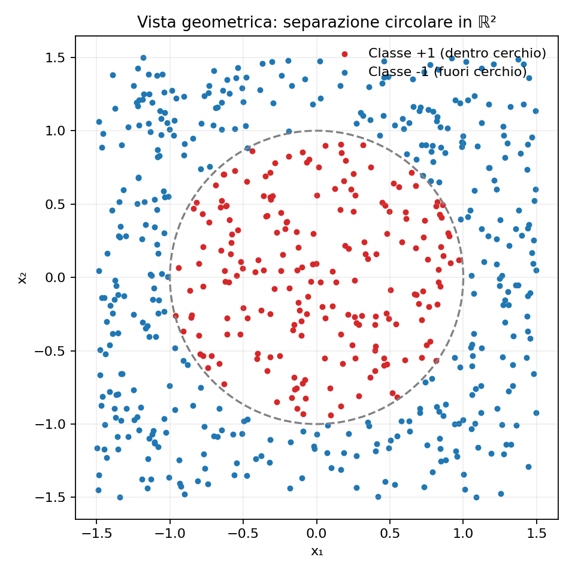
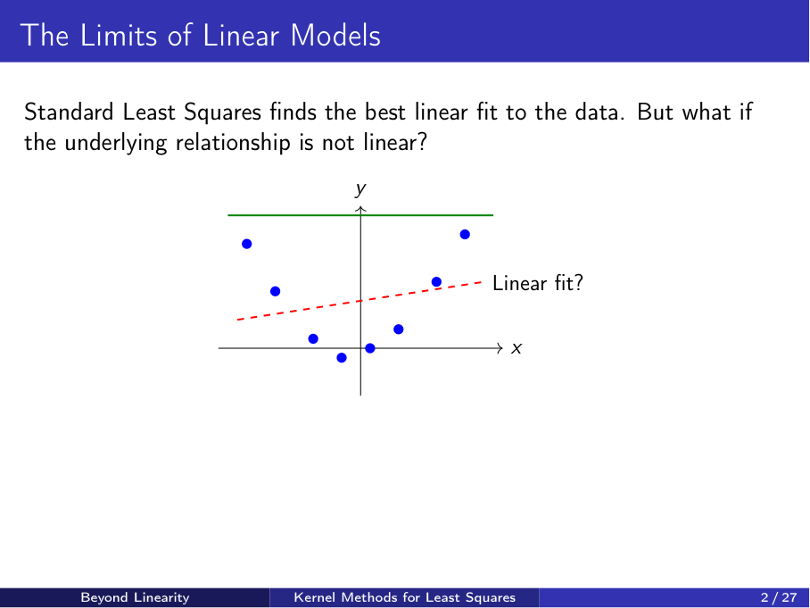
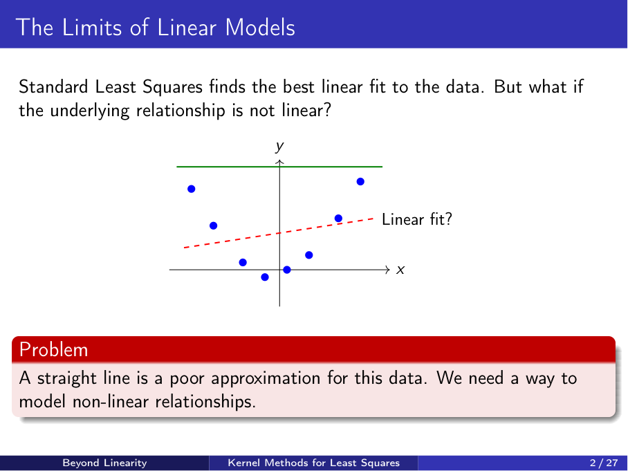
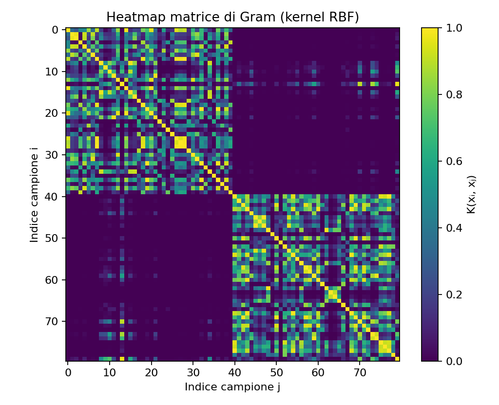
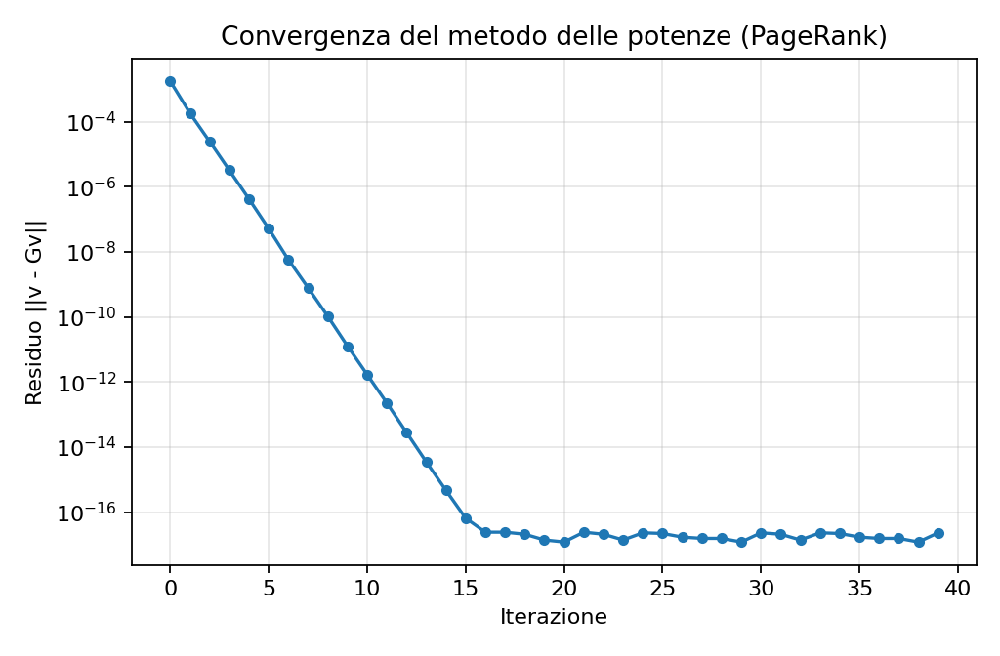
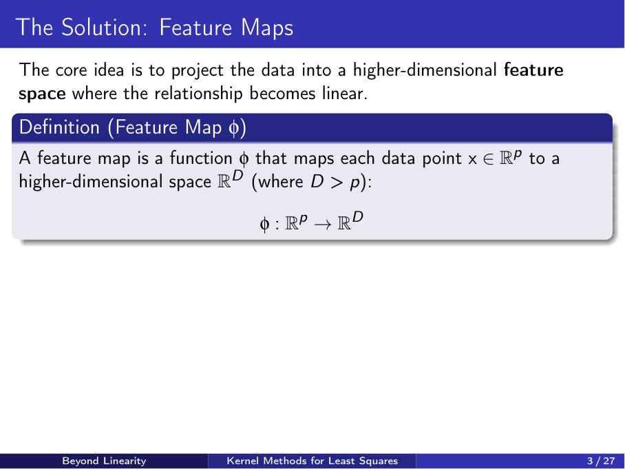

## Capitolo 1: Il Metodo Kernel per la Gestione di Dati Non Lineari
### Introduzione al Metodo Kernel
[00:00] Il primo argomento che verrà trattato è il cosiddetto metodo Kernel. L'obiettivo è comprendere il problema che questo metodo si propone di risolvere e analizzare la metodologia utilizzata.
[00:15] Nella maggior parte dei casi, i set di dati con cui si ha a che fare non sono lineari. Ciò significa che la tendenza o l'andamento dei dati, nel 90% delle situazioni, non può essere descritto da una retta. Se ci si limitasse all'approccio dei minimi quadrati (least squares) visto finora, che rappresenta una generalizzazione al caso multidimensionale del metodo classico, si cercherebbe di trovare una linea retta che approssimi i dati.
[00:45] Per illustrare il problema, si consideri un semplice esempio in cui i dati sono rappresentati da punti blu. Utilizzando un'approssimazione lineare classica, come quella dei minimi quadrati, il risultato sarebbe una retta simile a quella tratteggiata in rosso, che non riesce a catturare la reale distribuzione dei dati.
[01:00] La domanda fondamentale è: esiste un modo per generalizzare l'approccio visto finora per trattare efficacemente questo tipo di set di dati e ottenere una rappresentazione più fedele della situazione reale? In altre parole, l'obiettivo è passare da un approccio lineare a uno non lineare.
### Proiezione in uno Spazio a Dimensione Maggiore
[01:15] L'idea principale del metodo Kernel può apparire controintuitiva a prima vista. Consiste nel proiettare i dati in uno spazio a dimensione superiore.
[01:30] Finora, le tecniche analizzate, come la riduzione della dimensionalità, miravano a catturare la struttura sottostante di un set di dati riducendone la complessità. Si è cercato di lavorare con un sottoinsieme dei dati, con le componenti principali o con i valori singolari più significativi.
[02:00] Ora, apparentemente, si sta procedendo nella direzione opposta: si prendono i dati e li si proietta in uno spazio a dimensione più elevata. Questo sembra aumentare la complessità del problema. Tuttavia, si vedrà che questo approccio, sebbene controintuitivo, permette di risolvere il problema in modo efficiente.
### La Mappa delle Caratteristiche (Feature Map)
[02:30] Il primo elemento da introdurre è la cosiddetta "mappa delle caratteristiche" (feature map). Questa è la formalizzazione matematica dell'idea di proiettare i dati in uno spazio a dimensione maggiore.
[02:45] Una mappa delle caratteristiche è una funzione che prende un campione del set di dati e, considerando tutte le sue caratteristiche (features), crea un nuovo vettore in uno spazio a dimensione più alta. Formalmente, si passa da un campione $p$-dimensionale a un nuovo vettore di caratteristiche $D$-dimensionale, dove la nuova dimensione $D$ è maggiore della dimensione originale $p$ ($D > p$).
[03:15] Ad esempio, si supponga di avere un set di dati composto da dati scalari, quindi con una sola caratteristica ($p=1$). Una possibile mappa delle caratteristiche potrebbe essere la seguente:
```math
\phi(x) = \begin{pmatrix} x \\ x^2 \end{pmatrix}
```
In questo caso, si passa da uno spazio monodimensionale a uno bidimensionale.
[03:30] L'idea è che, considerando un modello lineare basato sulle nuove caratteristiche, come $w_1 x + w_2 x^2$, si ottiene un modello che è lineare nel nuovo spazio delle caratteristiche. Nello spazio originale, invece, si avrebbe avuto un problema quadratico a causa del termine $x^2$. Sfruttando questa trasformazione, è possibile utilizzare un modello lineare per descrivere una relazione non lineare.
[04:00] Si consideri un altro esempio con un vettore di caratteristiche originale bidimensionale, $\mathbf{x} = (x_1, x_2)$. Si può creare una rappresentazione arricchita di questi dati utilizzando la seguente mappa delle caratteristiche:
```math
\phi(\mathbf{x}) = (1, x_1, x_2, x_1^2, x_2^2, \sqrt{2}x_1x_2)
```
[04:15] In questo modo, si passa da uno spazio a due dimensioni ($\mathbb{R}^2$) a uno a sei dimensioni ($\mathbb{R}^6$). Sebbene possa sembrare strano, questa trasformazione si rivela molto utile in pratica.
### Interpretazione Geometrica della Proiezione
[04:45] Per comprendere meglio il concetto, si può analizzare una visualizzazione geometrica. Si considerino i dati mostrati nella parte in alto a sinistra della diapositiva, composti da punti rossi e quadrati blu.
[05:00] Se l'obiettivo è il clustering di questi dati, ovvero trovare un confine di separazione tra i due gruppi, è evidente che un buon confine sarebbe un cerchio, che è una curva non lineare.
[05:15] Proiettando questi dati in uno spazio tridimensionale, come mostrato nell'esempio, si può scoprire che in 3D è possibile separare i punti rossi dai quadrati blu utilizzando un iperpiano, che è una superficie lineare. Il terzo asse di questo nuovo spazio può essere, ad esempio, una combinazione delle caratteristiche originali.
[05:45] Tenere a mente questa immagine aiuta a cogliere l'idea di base del metodo Kernel: trasformare un problema di separazione non lineare in uno lineare, operando in uno spazio a dimensione più elevata.



### Esempio Pratico di Classificazione Non Lineare
[06:00] Si consideri un set di dati simile a quello appena descritto, con punti blu e punti arancioni. L'obiettivo è classificare questi dati, trovando un confine di separazione. Le caratteristiche date sono $x_1$ e $x_2$, le coordinate dei punti.
[06:30] Utilizzando un approccio lineare standard (in questo caso, una rete neurale con funzione di attivazione lineare, analoga ai minimi quadrati classici), anche dopo molte iterazioni, il risultato è una linea retta che non separa efficacemente i due gruppi di dati.
[07:00] Se però si aggiungono nuove caratteristiche, ottenute tramite una mappa delle caratteristiche, come $x_1^2$, $x_2^2$ e $x_1 x_2$, e si esegue lo stesso codice, si ottiene una rappresentazione perfetta del confine di separazione non lineare.
[07:15] È importante notare che si sta ancora utilizzando una funzione di attivazione lineare. La capacità di trovare il confine non lineare non deriva da una funzione di attivazione non lineare, ma dall'arricchimento del vettore delle caratteristiche. Con la stessa architettura lineare, ma su dati trasformati, si ottiene una separazione corretta.
## Capitolo 2: Formalizzazione della Ridge Regression con Kernel
### Il Problema di Ottimizzazione
[08:15] Il passo successivo è formalizzare quanto descritto. Si applica una mappa delle caratteristiche $\phi$ al set di dati originale. Sul nuovo set di dati arricchito, si applica la "ridge regression", ovvero una regressione ai minimi quadrati con una regolarizzazione di norma $L_2$.
[08:45] Si costruisce una matrice $\Phi$, dove ogni riga è il risultato dell'applicazione della mappa delle caratteristiche $\phi$ a uno dei vettori di caratteristiche originali $\mathbf{x}_i$.
```math
\Phi = \begin{pmatrix} \phi(\mathbf{x}_1)^T \\ \phi(\mathbf{x}_2)^T \\ \vdots \\ \phi(\mathbf{x}_N)^T \end{pmatrix}
```
dove $N$ è il numero di campioni.
[09:00] Il problema della ridge regression è formulato come la ricerca di un vettore di pesi $\mathbf{w}$ che minimizzi la seguente funzione di costo:
```math
\min_{\mathbf{w}} \| \Phi \mathbf{w} - \mathbf{y} \|_2^2 + \lambda \| \mathbf{w} \|_2^2
```
dove:
- $\mathbf{y}$ è il vettore degli output (etichette o valori).
- Il secondo termine, $\lambda \| \mathbf{w} \|_2^2$, è la regolarizzazione che penalizza pesi con norma elevata per prevenire l'overfitting.
[09:30] La differenza principale rispetto alla formulazione classica è la dimensione della matrice dei dati. Originariamente, la matrice $X$ aveva dimensioni $N \times p$ (N campioni, p caratteristiche). Ora, la matrice $\Phi$ ha dimensioni $N \times D$, con $D > p$.
[09:45] La risoluzione di questo problema di minimizzazione presenta delle sfide. In primo luogo, la dimensione $D$ dello spazio arricchito può essere molto grande. Nell'esempio precedente, si è passati da $\mathbb{R}^2$ a $\mathbb{R}^6$, ma l'aumento può essere molto più drastico.
[10:15] Questo comporta due problemi principali:
1.  **Costo computazionale**: calcolare esplicitamente la matrice $\Phi$ può essere oneroso.
2.  **Costo di memorizzazione**: memorizzare una matrice di grandi dimensioni richiede molta memoria.
[10:30] Inoltre, la soluzione del problema richiede la risoluzione di un sistema lineare in cui la matrice è del tipo $\Phi^T \Phi$. Questa matrice avrebbe dimensioni $D \times D$, diventando ingestibile per valori di $D$ molto grandi.
### La Funzione Kernel e il "Kernel Trick"
[10:45] L'idea per superare queste difficoltà è utilizzare la cosiddetta **funzione kernel**.
[11:00] In pratica, una funzione kernel, indicata con $K$, calcola il prodotto scalare tra due vettori di caratteristiche arricchiti, $\phi(\mathbf{x}_i)$ e $\phi(\mathbf{x}_j)$, senza doverli calcolare esplicitamente.
[11:15] La definizione formale di una funzione kernel è:
```math
K(\mathbf{x}_i, \mathbf{x}_j) = \langle \phi(\mathbf{x}_i), \phi(\mathbf{x}_j) \rangle = \phi(\mathbf{x}_i)^T \phi(\mathbf{x}_j)
```
Il requisito fondamentale è che la funzione $K$ sia costruita in modo da non richiedere mai il calcolo esplicito dei vettori $\phi(\mathbf{x}_i)$ e $\phi(\mathbf{x}_j)$.
[11:45] L'utilità di questa funzione deriva dal fatto che la matrice $\Phi^T \Phi$, necessaria per la soluzione, è composta da elementi che sono esattamente prodotti scalari tra i vettori delle caratteristiche arricchite. L'elemento $(i, j)$ della matrice $\Phi^T \Phi$ è $\phi(\mathbf{x}_i)^T \phi(\mathbf{x}_j)$.
[12:30] Questa tecnica è nota in letteratura come **"kernel trick"** (trucco del kernel). Consiste nella capacità di riscrivere la soluzione del problema di minimizzazione utilizzando unicamente i prodotti scalari calcolati tramite la funzione kernel, evitando così di lavorare esplicitamente nello spazio a dimensione maggiore.
### Esempi di Funzioni Kernel
[13:00] Esistono diverse funzioni kernel comunemente utilizzate in pratica.
[13:15] 1.  **Kernel Polinomiale**: È definito dalla seguente espressione:
    ```math
K(\mathbf{x}, \mathbf{z}) = (\mathbf{x}^T \mathbf{z} + c)^q
```
    - Se $c=0$, si ottiene un kernel polinomiale omogeneo.
    - Se $c>0$, vengono inclusi anche termini di ordine inferiore, come le costanti.
[13:45] 2.  **Kernel Gaussiano (o RBF - Radial Basis Function)**: È uno dei kernel più utilizzati ed è dato da:
    ```math
K(\mathbf{x}, \mathbf{z}) = \exp\left(-\frac{\|\mathbf{x} - \mathbf{z}\|^2}{2\sigma^2}\right)
```
    dove $\sigma$ è un parametro che controlla la larghezza del kernel.
[14:15] L'obiettivo è quindi passare dalla risoluzione del problema con la matrice esplicita $\Phi^T \Phi$ a una soluzione che sfrutti unicamente la funzione kernel.



## Capitolo 3: Il Teorema del Rappresentatore e la Soluzione del Problema
### Il Teorema del Rappresentatore
[14:30] Il fondamento teorico che giustifica il metodo Kernel è un risultato noto come **Teorema del Rappresentatore**. Qui ne viene presentata una versione semplificata, sufficiente per comprenderne l'idea di base.
[15:00] Il teorema afferma che la soluzione $\mathbf{w}^*$ di un problema di ridge regression con kernel può essere sempre scritta come una combinazione lineare dei vettori di caratteristiche (mappati) dei dati di addestramento.
[15:15] Nel caso della regressione classica, la soluzione $\mathbf{w}^*$ si otteneva invertendo la matrice $X^T X$ (o $X^T X + \lambda I$ nel caso regolarizzato).
[15:45] Qui, il teorema afferma che il vettore ottimo $\mathbf{w}^*$ può essere espresso come:
```math
\mathbf{w}^* = \sum_{i=1}^{N} \alpha_i \phi(\mathbf{x}_i) = \Phi^T \boldsymbol{\alpha}
```
dove $\boldsymbol{\alpha}$ è un vettore di $N$ coefficienti (uno per ogni campione di addestramento).
[16:15] In sostanza, $\mathbf{w}^*$ appartiene allo spazio generato (span) dai vettori delle caratteristiche dei dati di addestramento. Questo significa che, invece di cercare la soluzione in uno spazio potenzialmente infinito e di dimensione $D$, possiamo limitare la ricerca alla determinazione degli $N$ coefficienti del vettore $\boldsymbol{\alpha}$. Una volta trovato $\boldsymbol{\alpha}$, la soluzione $\mathbf{w}^*$ è determinata.
### Dimostrazione del Teorema del Rappresentatore
[16:45] Per comprendere il funzionamento, si analizza la dimostrazione. Si consideri uno spazio delle caratteristiche $\mathcal{H}$ e un generico vettore $\mathbf{w}$ in questo spazio.
[17:00] Qualsiasi vettore $\mathbf{w}$ può essere decomposto in due componenti:
1.  $\mathbf{w}_{||}$: una componente parallela, che si trova nello span dei dati di addestramento mappati, $\phi(\mathbf{x}_i)$.
2.  $\mathbf{w}_{\perp}$: una componente perpendicolare, che è ortogonale allo spazio generato dai dati di addestramento.
[17:30] Per definizione, $\mathbf{w}_{\perp}$ è ortogonale a ogni vettore $\phi(\mathbf{x}_i)$.
```math
\langle \mathbf{w}_{\perp}, \phi(\mathbf{x}_i) \rangle = 0 \quad \forall i
```
[17:45] Analizziamo i termini della funzione di costo. Il primo termine, legato all'errore di approssimazione, contiene prodotti scalari del tipo $\langle \mathbf{w}, \phi(\mathbf{x}_i) \rangle$. Scomponendo $\mathbf{w}$:
```math
\langle \mathbf{w}, \phi(\mathbf{x}_i) \rangle = \langle \mathbf{w}_{||}, \phi(\mathbf{x}_i) \rangle + \langle \mathbf{w}_{\perp}, \phi(\mathbf{x}_i) \rangle
```
[18:00] Poiché il secondo termine è nullo per definizione di ortogonalità, si ha:
```math
\langle \mathbf{w}, \phi(\mathbf{x}_i) \rangle = \langle \mathbf{w}_{||}, \phi(\mathbf{x}_i) \rangle
```
Questo significa che il termine di errore dipende solo dalla componente parallela $\mathbf{w}_{||}$.
[18:15] Analizziamo ora il termine di regolarizzazione, $\|\mathbf{w}\|^2$. Sfruttando l'ortogonalità tra $\mathbf{w}_{||}$ e $\mathbf{w}_{\perp}$ (Teorema di Pitagora):
```math
\|\mathbf{w}\|^2 = \|\mathbf{w}_{||} + \mathbf{w}_{\perp}\|^2 = \|\mathbf{w}_{||}\|^2 + \|\mathbf{w}_{\perp}\|^2
```
[18:30] Mettendo insieme i risultati, la funzione da minimizzare diventa:
```math
\min_{\mathbf{w}_{||}, \mathbf{w}_{\perp}} \left( \| \Phi \mathbf{w}_{||} - \mathbf{y} \|_2^2 + \lambda (\|\mathbf{w}_{||}\|^2 + \|\mathbf{w}_{\perp}\|^2) \right)
```
[18:45] Per minimizzare questa espressione, dato che il termine $\|\mathbf{w}_{\perp}\|^2$ è non negativo e non influenza il termine di errore, la scelta ottimale è porlo a zero, ovvero $\mathbf{w}_{\perp} = \mathbf{0}$.
[19:00] Di conseguenza, la soluzione ottima $\mathbf{w}^*$ deve appartenere interamente allo spazio generato dai vettori delle caratteristiche di addestramento. Può quindi essere rappresentata come una combinazione lineare di tali vettori.



### Applicazione del Teorema e Soluzione del Problema
[19:30] Il messaggio chiave del Teorema del Rappresentatore è che la soluzione di un problema di regressione regolarizzato può essere scritta come una combinazione lineare dei vettori di caratteristiche dei dati di addestramento.
[20:00] Sapendo che la soluzione ottima $\mathbf{w}^*$ è data da $\Phi^T \boldsymbol{\alpha}$, possiamo sostituire questa espressione nel problema di minimizzazione originale.
[20:15] Dopo la sostituzione e alcuni passaggi algebrici, si arriva a un sistema lineare la cui soluzione fornisce il vettore dei coefficienti $\boldsymbol{\alpha}$.
[20:30] La soluzione è data da:
```math
(K + \lambda I) \boldsymbol{\alpha} = \mathbf{y}
```
dove $K$ è la **matrice di Kernel** (o matrice di Gram).
[20:45] La matrice di Kernel $K$ è una matrice $N \times N$ il cui elemento generico $(i, j)$ è calcolato applicando la funzione kernel ai campioni $\mathbf{x}_i$ e $\mathbf{x}_j$:
```math
K_{ij} = K(\mathbf{x}_i, \mathbf{x}_j) = \phi(\mathbf{x}_i)^T \phi(\mathbf{x}_j)
```
La matrice $K$ può anche essere scritta come $K = \Phi \Phi^T$.



[21:15] Il vettore dei coefficienti $\boldsymbol{\alpha}$ può quindi essere trovato risolvendo il sistema:
```math
\boldsymbol{\alpha} = (K + \lambda I)^{-1} \mathbf{y}
```
[21:30] Il punto cruciale è che se si dispone di una funzione kernel efficiente, che calcola il prodotto scalare senza esplicitare i vettori $\phi$, la matrice $K$ può essere calcolata molto facilmente. Il problema viene così risolto nello spazio originale dei dati, di dimensione $N$, anziché nello spazio arricchito di dimensione $D$.
### Soluzione tramite Decomposizione Spettrale
[22:00] La matrice di Kernel $K$ è, per costruzione, simmetrica e semidefinita positiva. In pratica, è spesso definita positiva.
[22:15] Invece di usare la decomposizione ai valori singolari (SVD), si può sfruttare la decomposizione spettrale (o agli autovalori), poiché la matrice è simmetrica.
```math
K = U \Lambda U^T
```
dove:
-   $U$ è la matrice ortogonale le cui colonne sono gli autovettori di $K$.
-   $\Lambda$ è la matrice diagonale contenente gli autovalori di $K$.
[22:45] Sostituendo questa decomposizione nella formula per $\boldsymbol{\alpha}$, si ottiene:
```math
\boldsymbol{\alpha} = (U \Lambda U^T + \lambda I)^{-1} \mathbf{y} = U (\Lambda + \lambda I)^{-1} U^T \mathbf{y}
```
Questa espressione permette di calcolare la soluzione in modo molto semplice, poiché richiede solo l'inversione di una matrice diagonale.
### Predizione con il Modello Kernel
[23:15] L'obiettivo finale non è solo costruire un modello che approssimi i dati, ma anche usarlo per fare previsioni su nuovi dati non visti. Ad esempio, dato un nuovo punto $\mathbf{x}^*$, si vuole calcolare il valore predetto dal modello, $y^*$.
[24:00] Il modello di predizione è dato da:
```math
y^* = \phi(\mathbf{x}^*)^T \mathbf{w}^*
```
Sostituendo l'espressione di $\mathbf{w}^* = \Phi^T \boldsymbol{\alpha} = \sum_{i=1}^{N} \alpha_i \phi(\mathbf{x}_i)$, si ottiene:
```math
y^* = \phi(\mathbf{x}^*)^T \left( \sum_{i=1}^{N} \alpha_i \phi(\mathbf{x}_i) \right)
```
[24:30] Portando la sommatoria all'esterno del prodotto scalare:
```math
y^* = \sum_{i=1}^{N} \alpha_i \langle \phi(\mathbf{x}^*), \phi(\mathbf{x}_i) \rangle
```
[24:45] Si osserva che il termine dentro la sommatoria è di nuovo un prodotto scalare tra due vettori nello spazio arricchito. Questo può essere calcolato direttamente con la funzione kernel:
```math
y^* = \sum_{i=1}^{N} \alpha_i K(\mathbf{x}^*, \mathbf{x}_i)
```
[25:00] Per fare una predizione, quindi, non è necessario conoscere esplicitamente $\mathbf{w}^*$ o $\phi$. È sufficiente avere:
-   Il vettore dei coefficienti $\boldsymbol{\alpha}$, già calcolato.
-   I dati di addestramento $\mathbf{x}_i$.
-   Il nuovo punto $\mathbf{x}^*$ su cui fare la predizione.
-   La funzione kernel $K$.
[25:30] Anche se il punto di partenza era l'arricchimento dello spazio, alla fine tutte le operazioni (addestramento e predizione) vengono eseguite utilizzando unicamente la funzione kernel, senza mai operare esplicitamente nello spazio a dimensione maggiore.
### Esempio Concreto: Kernel Polinomiale
[26:00] Deve esistere una relazione precisa tra l'operatore di "lifting" (la mappa $\phi$) e la funzione kernel $K$ che lo rappresenta.
[26:15] Si consideri un esempio con tre punti monodimensionali: $x_1 = -1$, $x_2 = 0$, $x_3 = 1$. Si utilizza il kernel polinomiale:
```math
K(x, z) = (xz + 1)^2
```
[26:45] Calcolando gli elementi della matrice di Kernel $K$, si ottiene la matrice finale.
[27:00] Per capire quale mappa delle caratteristiche $\phi$ corrisponde a questo kernel, si può espandere l'espressione del kernel:
```math
K(x, z) = (xz + 1)^2 = x^2 z^2 + 2xz + 1
```
[27:15] Questa espressione può essere vista come il prodotto scalare tra due vettori. Se si definisce la mappa delle caratteristiche come:
```math
\phi(x) = \begin{pmatrix} x^2 \\ \sqrt{2}x \\ 1 \end{pmatrix}
```
[27:45] Il prodotto scalare tra $\phi(x)$ e $\phi(z)$ è:
```math
\langle \phi(x), \phi(z) \rangle = (x^2)(z^2) + (\sqrt{2}x)(\sqrt{2}z) + (1)(1) = x^2z^2 + 2xz + 1
```
che è esattamente l'espressione del kernel.
[28:00] Questo dimostra che la funzione kernel $K(x, z) = (xz+1)^2$ corrisponde implicitamente alla mappa delle caratteristiche $\phi(x) = (x^2, \sqrt{2}x, 1)$.


[28:15] Il punto fondamentale è che, scegliendo una funzione kernel appropriata, non è necessario definire esplicitamente la mappa $\phi$, arricchire i vettori e poi calcolare il prodotto scalare. Tutto è racchiuso nella scelta della funzione kernel.
## Capitolo 4: Applicazioni dei Metodi Kernel e Introduzione al PageRank
### Applicazioni del Teorema del Rappresentatore
[00:00] Il parametro `+1` in un vettore, come visto nell'esempio precedente, indica la presenza di un termine costante, noto come intercetta o bias. Questo permette di modellare, ad esempio, una funzione quadratica includendo un termine costante, un termine lineare e un termine quadratico. L'utilizzo di metodi basati su kernel è fondamentale, poiché nel 90% dei casi si ha a che fare con insiemi di dati non lineari.
[00:15] Una volta definita la matrice kernel $K$, è possibile calcolare la metrica di Gram, come illustrato in precedenza. Avendo la matrice $K$, si può risolvere il problema di ottimizzazione per i coefficienti $\alpha$, applicando parametri di regolarizzazione adeguati.
[00:25] La soluzione di tale problema fornisce il vettore $\boldsymbol{\alpha}$, che a sua volta permette di effettuare nuove predizioni utilizzando il vettore $\mathbf{w}^*$ (indicato come $\pi$ nella trascrizione originale, ma coerente con $\mathbf{w}^*$ nel contesto). Sebbene la presentazione possa apparire teorica, essa è cruciale per comprendere le applicazioni pratiche.
[00:35] Un'altra importante applicazione del teorema del rappresentatore riguarda le macchine a vettori di supporto (Support Vector Machines, SVM) e la regressione a vettori di supporto (Support Vector Regression, SVR). Questi metodi costituiscono una famiglia di algoritmi che si fondano su un utilizzo alternativo del teorema del rappresentatore.
[00:48] La regressione a vettori di supporto verrà analizzata in dettaglio successivamente.
### L'Algoritmo PageRank: Principi e Funzionamento
[00:52] Si introduce ora un altro problema noto: l'algoritmo PageRank. Verrà presentata una versione semplificata dell'algoritmo.
[01:00] L'algoritmo PageRank è stato originariamente sviluppato come base per il motore di ricerca di Google. Per chi fosse interessato ad approfondire i dettagli, esiste una vasta letteratura.
[01:08] Un testo di riferimento, sebbene non recentissimo, è un libro che descrive in dettaglio tutti gli aspetti dell'algoritmo. La versione qui presentata è solo un'introduzione all'idea di base.
[01:16] L'algoritmo è particolarmente interessante perché si basa interamente su concetti di algebra lineare. Il libro menzionato è molto chiaro e di facile comprensione, rendendolo una risorsa eccellente per chiunque sia interessato agli algoritmi di ricerca web.
[01:28] Analizziamo la versione base dell'algoritmo. PageRank è stato progettato per classificare le pagine web in modo "intelligente".
[01:33] L'idea iniziale era di classificare le pagine in base al numero di link in entrata (backlink). Tuttavia, questo approccio non è efficace, poiché è facile "barare" creando pagine fittizie che puntano a una pagina specifica solo per aumentarne artificialmente il numero di link.
[01:45] Il problema di questo metodo è che le pagine che forniscono i link potrebbero non essere importanti. Di conseguenza, l'obiettivo non è solo contare il numero di link, ma anche valutare l'importanza delle pagine da cui provengono.
[01:55] Ad esempio, un link proveniente da una pagina personale ha un peso diverso rispetto a un link proveniente da un sito autorevole come quello della BBC.
[02:01] L'algoritmo è stato quindi progettato per fornire una classifica delle pagine più significativa da questo punto di vista.
### Il Modello del "Random Surfer"
[02:08] L'idea di base può essere visualizzata attraverso un semplice grafo. Immaginiamo una rete di quattro siti web, dove le frecce rappresentano i link. Ad esempio, il sito 3 ha un link verso il sito 4. Alcuni link possono essere bidirezionali.


[02:20] Data questa rappresentazione grafica della rete di siti web, l'algoritmo simula il comportamento di un utente che naviga casualmente. Si parte da una pagina web scelta a caso tra quelle disponibili.
[02:29] A partire da questa pagina, l'utente clicca casualmente su uno dei link presenti, spostandosi così a una nuova pagina.
[02:36] L'idea è di iterare questo processo. Ripetendo questa navigazione casuale, si raggiungerà uno stato stazionario (steady state). Questo stato stazionario fornirà informazioni sull'importanza relativa di ciascun sito web.
## Capitolo 5: Formalizzazione Matematica del PageRank
### Matrice di Adiacenza e Matrice Stocastica
[02:48] Per formalizzare il processo, si consideri il seguente grafo di esempio con quattro nodi (pagine web): 1, 2, 3, 4, e i relativi link.
[02:55] Il primo passo consiste nel costruire la cosiddetta **matrice di adiacenza** $A$.
[03:05] Si tratta di una matrice in cui l'elemento $A_{ij}$ è uguale a 1 se esiste un link dalla pagina $j$ alla pagina $i$, e 0 altrimenti.
```math
A_{ij} = \begin{cases} 1 & \text{se esiste un link da } j \to i \\ 0 & \text{altrimenti} \end{cases}
```
[03:15] Per la rete di esempio, la matrice di adiacenza è quella mostrata. Analizziamo la prima riga, corrispondente alla pagina 1:
-   $A_{11} = 0$: non c'è un link dalla pagina 1 a se stessa.
-   $A_{12} = 0$: non c'è un link dalla pagina 2 alla pagina 1.
-   $A_{13} = 1$: c'è un link dalla pagina 3 alla pagina 1.
-   $A_{14} = 1$: c'è un link dalla pagina 4 alla pagina 1.
Lo stesso procedimento si applica per le altre righe della matrice, che cattura così tutte le connessioni della rete.


[03:30] Il passo successivo è la normalizzazione della matrice di adiacenza. A partire da $A$, si costruisce una nuova matrice $M$ normalizzando ogni colonna in modo che la somma dei suoi elementi sia pari a 1.
[03:40] La matrice normalizzata $M$ avrà quindi colonne la cui somma è 1. Ad esempio, se una colonna di $A$ ha due '1', gli elementi corrispondenti in $M$ diventeranno $1/2$. Se una colonna ha un solo '1', l'elemento corrispondente in $M$ sarà 1.
[03:50] Qual è il significato di questa matrice di adiacenza normalizzata, $M$?
[03:55] La matrice $M$ può essere interpretata in termini di probabilità.
[04:00] Ogni elemento $M_{ij}$ rappresenta la probabilità di passare dalla pagina $j$ alla pagina $i$. Questa matrice è definita **matrice stocastica per colonne** (column-stochastic matrix), poiché la somma degli elementi di ogni colonna è 1.
### Convergenza allo Stato Stazionario
[04:08] Una volta ottenuta la matrice $M$, si considera un vettore $\pi_k$, che in questo caso ha quattro componenti. Questo vettore rappresenta le probabilità di trovarsi in una certa pagina della rete all'istante di tempo $k$.
[04:15] Applicando la matrice $M$ al vettore $\pi_k$, si ottiene un nuovo vettore $\pi_{k+1}$:
```math
\pi_{k+1} = M \pi_k
```
Questo nuovo vettore rappresenta le probabilità di trovarsi in ciascuna pagina al passo successivo, $k+1$.
[04:25] Poiché la matrice $M$ descrive le probabilità di transizione tra le pagine, se si parte da un vettore di probabilità $\pi_k$, il prodotto $M \pi_k$ fornisce la distribuzione di probabilità aggiornata.
[04:30] L'idea fondamentale dell'algoritmo PageRank è che esiste uno stato stazionario.
[04:34] Iterando questo processo un numero elevato di volte (facendo tendere $k$ all'infinito), che formalizza il concetto di "cliccare casualmente" sui link, si converge a uno stato stazionario.
[04:45] Questo stato stazionario è una situazione in cui il vettore delle probabilità non cambia più dopo l'applicazione della matrice $M$. Matematicamente, si raggiunge una condizione in cui:
```math
M\pi = \pi
```
### Il Problema agli Autovalori e Autovettori
[04:51] Questa equazione, $M\pi = \pi$, è riconoscibile come un problema agli autovalori e autovettori.
[04:58] In particolare, il vettore $\pi$ è un autovettore della matrice $M$ associato all'autovalore $\lambda = 1$.
[05:05] Una volta formalizzato il problema in questi termini, la soluzione consiste nel trovare l'autovettore corrispondente all'autovalore 1.
[05:12] Questo autovettore $\pi$, chiamato anche **vettore di stato stazionario** (steady-state vector), conterrà le probabilità a lungo termine di trovarsi su ciascun sito web.
[05:18] Di conseguenza, una probabilità più alta per un certo sito web indica una maggiore importanza di quel sito. Il vettore $\pi$ finale fornisce quindi la classifica (rank) delle pagine web.
### Proprietà Fondamentali e Teorema di Perron-Frobenius
[05:25] Ci sono alcune questioni chiave da chiarire:
1.  L'autovalore $\lambda = 1$ è sempre un autovalore della matrice di transizione $M$?
2.  È l'autovalore più grande (in modulo)? Poiché cerchiamo il vettore $\pi$ che definisce l'importanza, esso dovrebbe essere associato all'autovettore più significativo, ovvero quello legato all'autovalore dominante.
3.  Questo autovettore è unico?
[05:40] Le risposte a queste domande sono fornite dal **Teorema di Perron-Frobenius**. In una versione semplificata, il teorema afferma che:
-   Se $M$ è una matrice stocastica per colonne (come nel nostro caso), allora $\lambda = 1$ è il suo più grande autovalore.
-   L'autovettore corrispondente a $\lambda = 1$ è unico (a meno di un fattore di scala).
-   Inoltre, questo autovettore può essere scelto in modo da avere componenti strettamente positive, il che permette di interpretarle come probabilità.
[06:00] Nell'implementazione reale dell'algoritmo di Google, la matrice utilizzata non è esattamente la semplice matrice di transizione presentata, ma l'idea di base rimane la stessa.


[06:07] Sapendo che la coppia autovalore-autovettore ha le proprietà desiderate (l'autovalore è il più grande e l'autovettore è unico e positivo), ha senso cercare proprio questo autovettore $\pi$.
## Capitolo 6: Calcolo dell'Autovettore Dominante e Completamento di Matrici
### Calcolo dell'Autovettore: il Metodo delle Potenze
[06:15] Una domanda pratica è: come si calcola questa coppia autovalore-autovettore? Una possibilità è utilizzare il **metodo delle potenze** (power method).
[06:20] L'idea del metodo delle potenze è di partire da una stima iniziale (guess) dell'autovettore.
[06:25] In generale, data una matrice $A$ per cui si sa che esiste un autovalore dominante $\lambda_1$, ovvero un autovalore strettamente più grande in modulo di tutti gli altri ($|\lambda_1| > |\lambda_2| \ge \dots$), si procede come segue.
[06:32] Si sceglie un vettore iniziale casuale $x_0$. Si applica iterativamente la matrice $A$ (nel nostro caso, $M$) a questo vettore.
```math
x_1 = A x_0
```
Si itera il processo: $x_2 = A x_1$, $x_3 = A x_2$, e così via.
[06:40] Il metodo è chiamato "delle potenze" perché, dopo $k$ iterazioni, il vettore risultante è dato da:
```math
x_k = A^k x_0
```
[06:47] Per capire perché questo metodo converge, consideriamo una matrice generica $A$ (o $M$) con autovalori $\lambda_1, \lambda_2, \dots$ tali che $|\lambda_1| > |\lambda_2| \ge \dots$. Nel nostro caso, sappiamo che $\lambda_1 = 1$ è l'autovalore più grande.
[06:58] L'idea è che il vettore iniziale $x_0$ può essere scritto come una combinazione lineare degli autovettori $v_i$ della matrice $A$, poiché questi formano una base per lo spazio delle colonne di $A$.
```math
x_0 = c_1 v_1 + c_2 v_2 + \dots + c_n v_n = \sum_{i=1}^n c_i v_i
```
[07:10] Ora applichiamo la matrice $M$ a $x_0$. Poiché $v_i$ è un autovettore, $M v_i = \lambda_i v_i$.
```math
M x_0 = M \left( \sum_{i=1}^n c_i v_i \right) = \sum_{i=1}^n c_i (M v_i) = \sum_{i=1}^n c_i \lambda_i v_i
```
Quindi, $M x_0 = c_1 \lambda_1 v_1 + c_2 \lambda_2 v_2 + \dots$.
[07:20] Iterando il processo $k$ volte, si ottiene:
```math
M^k x_0 = \sum_{i=1}^n c_i \lambda_i^k v_i = c_1 \lambda_1^k v_1 + c_2 \lambda_2^k v_2 + \dots
```
[07:25] Ricordiamo che $\lambda_1$ è l'autovalore più grande. Se dividiamo l'intera espressione per $\lambda_1^k$, otteniamo:
```math
\frac{M^k x_0}{\lambda_1^k} = c_1 v_1 + c_2 \left(\frac{\lambda_2}{\lambda_1}\right)^k v_2 + \dots + c_n \left(\frac{\lambda_n}{\lambda_1}\right)^k v_n
```
[07:32] Poiché $|\lambda_1| > |\lambda_i|$ per ogni $i > 1$, i termini $(\lambda_i / \lambda_1)^k$ tendono a zero quando $k$ tende all'infinito.
[07:40] Questo significa che, per $k$ sufficientemente grande, il vettore $x_k = M^k x_0$ sarà dominato dal primo termine e quindi allineato con la direzione del primo autovettore, $v_1$.
```math
x_k \approx c_1 \lambda_1^k v_1
```
Il vettore $x_k$ converge quindi alla direzione dell'autovettore associato all'autovalore più grande.
[07:50] Sfruttando questo fatto, si può calcolare il vettore $\pi$ (che corrisponde a $v_1$) e ottenere così la classifica delle pagine web nella rete.



[07:58] La dimostrazione del teorema di Perron-Frobenius nel caso semplificato è disponibile ma può essere omessa.
### Introduzione al Completamento di Matrici (Matrix Completion)
[08:08] Si introduce ora un altro problema importante: il **completamento di matrici** (matrix completion).
[08:13] Il problema prototipo è il cosiddetto **problema di Netflix**.
[08:20] L'idea di base è legata al sistema di raccomandazione di piattaforme come Netflix. Spesso, dopo aver visto un film, il sistema suggerisce altri titoli che potrebbero interessare.
[08:28] Come vengono generati questi suggerimenti? Nel 2009, Netflix offrì un premio di un milione di dollari a chi fosse riuscito a sviluppare un algoritmo efficace per fornire raccomandazioni pertinenti.
[08:38] Il contesto è il seguente: si ha una matrice in cui le colonne rappresentano i film e le righe rappresentano gli utenti.
[08:45] Ovviamente, ogni utente non ha valutato tutti i film disponibili, ma solo un piccolo sottoinsieme.
[08:52] La situazione è analoga a quella di avere una matrice con alcuni valori noti (le valutazioni date) e molte posizioni vuote (valori sconosciuti). Ad esempio, potremmo non sapere se a un utente "Einstein" piacerebbe il film "Il Padrino".
[09:02] L'obiettivo è riuscire a inserire una valutazione significativa in queste caselle vuote. In sintesi, il problema consiste nel predire le valutazioni mancanti.



[09:10] Un altro esempio di applicazione è il problema dell'**inpainting** di immagini. Si ha un'immagine con una porzione mancante e si vuole riempire quest'area con contenuti coerenti con ciò che la circonda.
### L'Ipotesi di Basso Rango
[09:25] L'idea fondamentale per risolvere questo problema è la seguente: data la matrice $X$ di dimensioni $n \times d$ (con $n$ utenti e $d$ film), si cerca di trovare una sua approssimazione o fattorizzazione.
[09:32] Si vuole approssimare $X$ con il prodotto di due matrici: una matrice $U$ di dimensioni $n \times r$ che rappresenta le caratteristiche degli utenti (user features), e una matrice $V^T$ di dimensioni $r \times d$ che rappresenta le caratteristiche dei film (movie features).
```math
X \approx U V^T
```
[09:40] La variabile $r$ rappresenta il **rango** della matrice. L'ipotesi fondamentale è che la matrice delle valutazioni, nonostante le sue grandi dimensioni, abbia una struttura a bassa dimensionalità, ovvero sia una **matrice di basso rango** (low-rank matrix).
[09:50] L'idea è che la matrice originale possieda una struttura latente a bassa dimensionalità che può essere sfruttata. Questa dimensionalità è rappresentata dal valore $r$.
[10:00] Ad esempio, alcuni fattori latenti (latent factors) potrebbero essere le preferenze per un genere di film, il periodo storico o il pubblico di destinazione.
[10:05] L'ipotesi cruciale è che la dimensione di questa struttura sottostante, $r$, sia molto più piccola delle dimensioni della matrice originale, $n$ e $d$.
```math
r \ll \min(n, d)
```
[10:10] In altri termini, si ipotizza che sia possibile rappresentare le valutazioni di tutti gli utenti per tutti i film utilizzando solo $r$ "utenti rappresentativi" e $r$ "film rappresentativi".
[10:20] L'algoritmo che verrà analizzato, basato sulla **decomposizione ai valori singolari** (Singular Value Decomposition, SVD), ha lo scopo di trovare queste due matrici fattore, ovvero gli utenti e i film rappresentativi.
[10:28] Una volta ottenute queste matrici, è possibile "riempire" le voci mancanti nella matrice originale.
[10:32] Questo problema non è banale e richiede algoritmi di soluzione piuttosto complessi. Successivamente si entrerà nei dettagli di come sfruttare la SVD per ottenere questo risultato.
[10:42] In questo contesto, si utilizzerà un approccio già incontrato: il **thresholding** (o sogliatura). Questo metodo è stato già visto quando si calcolavano i valori singolari per approssimare dati generici, considerando solo quelli più importanti.
[10:52] Anche qui si farà uso di una tecnica di thresholding sui valori singolari. Successivamente, si tratteranno anche le macchine a vettori di supporto menzionate in precedenza.