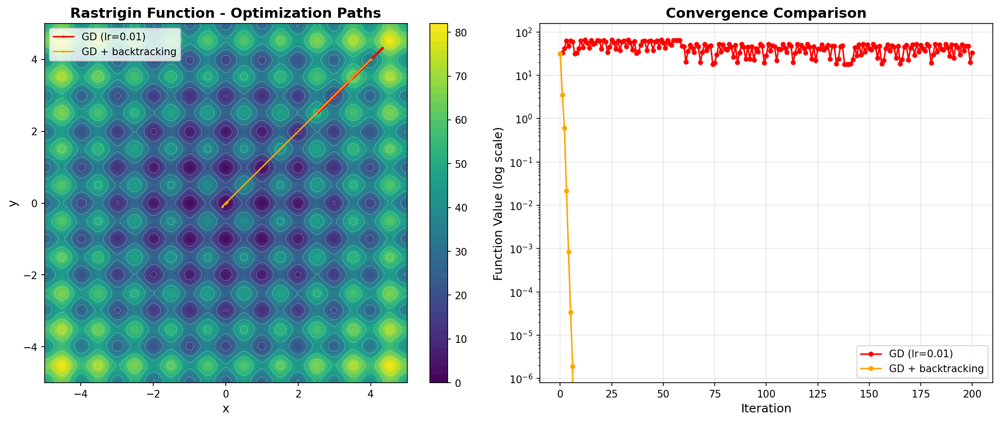
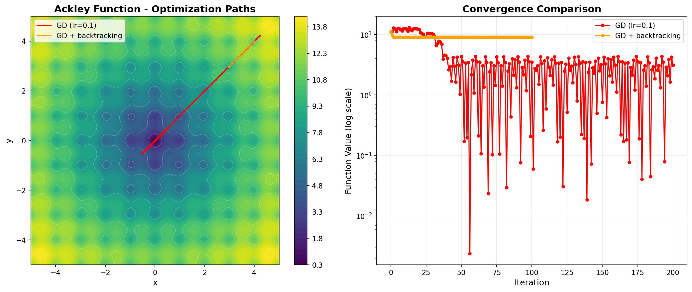
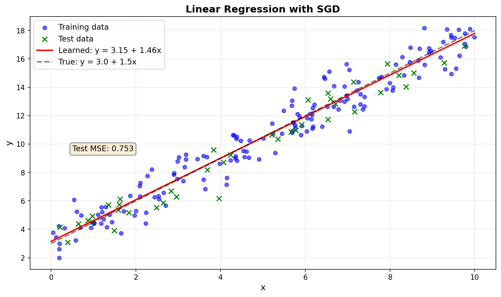
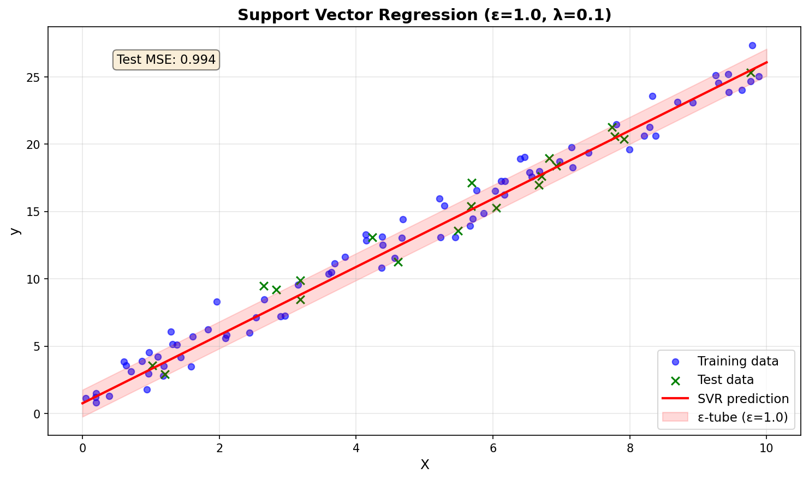
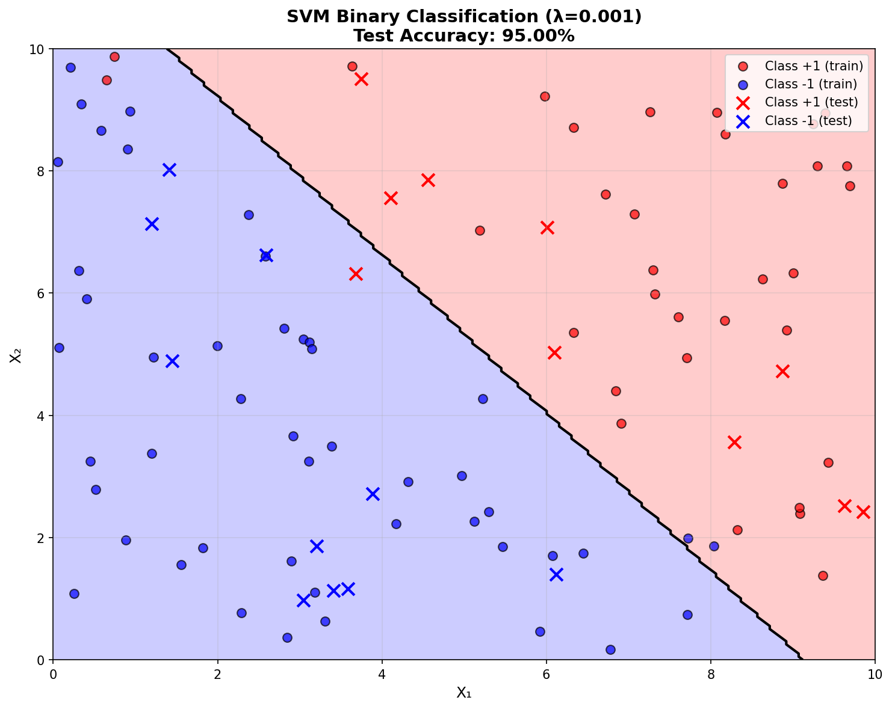

# Lab05 | GD, SDG and applications to LS and linear SVR and SVC

## [00:00] Introduzione e obiettivi del laboratorio
Contesto: questo è il quinto laboratorio, dedicato alla discesa del gradiente (gradient descent). Lavoreremo in due parti:
- Implementazione di gradient descent e varianti:
  - passo fisso (learning rate costante),
  - backtracking (passo adattivo per garantire diminuzione sufficiente),
  - exact line search per funzioni quadratiche (passo ottimo analitico).
- Applicazioni e test su funzioni di benchmark non convesse, quindi su due problemi di apprendimento:
  - regressione lineare (loss quadratica),
  - Support Vector Machine (SVM) per regressione e classificazione.
Nota operativa: useremo JAX per il calcolo automatico del gradiente (autodiff).
## [00:00] Controllo della soluzione e impostazione del problema
- Tutto a posto; procediamo con il controllo della soluzione.
- Punto di partenza: copiare/incollare il codice base e verificare le differenze. Nel caso del backtracking, non usiamo un learning rate fisso ma lo calcoliamo dinamicamente.
## [02:00] Perché iniziare dalla regressione lineare
- La regressione lineare è un caso di test ideale: semplice ma completo, contiene gli elementi base del training (loss, gradiente, learning rate, criteri di arresto, iterazioni).
- Nella prossima lezione useremo gli stessi “ingredienti” per addestrare reti neurali.
- Aggiungeremo poi una SVM per regressione o classificazione: gli ingredienti non cambiano, aumenta solo la complessità del modello.

```python
# Step SGD: singolo aggiornamento con mini-batch
@jax.jit
def sgd_update(theta, x_batch, y_batch, learning_rate):
    """Aggiornamento SGD: θ ← θ - lr * ∇MSE"""
    gradients = grad_mse(theta, x_batch, y_batch)
    return theta - learning_rate * gradients

# Ciclo di addestramento completo con SGD
def stochastic_gradient_descent(
    theta,
    training_input,
    training_labels,
    validation_input,
    validation_labels,
    learning_rate=0.01,
    epochs=100,
    batch_size=10,
    state=0,
):
    """Training con Stochastic Gradient Descent
    
    Args:
        theta: parametri iniziali [θ0, θ1]
        training_input, training_labels: dati di training
        validation_input, validation_labels: dati di validazione
        learning_rate: tasso di apprendimento
        epochs: numero di epoche (passaggi completi sul dataset)
        batch_size: dimensione del mini-batch
        state: seed per il random key di JAX
    
    Returns:
        theta: parametri ottimizzati
    """
    key = jax.random.PRNGKey(state)
    
    for epoch in range(epochs):
        # Permuta i dati a ogni epoca
        key, subkey = jax.random.split(key)
        perm = jax.random.permutation(subkey, len(training_input))
        
        # Itera sui mini-batch
        for i in range(0, len(training_input), batch_size):
            # Estrai indici del batch
            batch_idx = perm[i:i + batch_size]
            
            # Crea batch
            x_batch = training_input[batch_idx]
            y_batch = training_labels[batch_idx]
            
            # Aggiorna parametri
            theta = sgd_update(theta, x_batch, y_batch, learning_rate)
    
    return theta

# Esempio di utilizzo
theta = jnp.array([0.0, 0.0])  # inizializzazione
theta_opt = stochastic_gradient_descent(
    theta, X_train, y_train, X_test, y_test,
    learning_rate=0.01, epochs=100, batch_size=10
)
print(f"Parametri ottimizzati: θ = [{theta_opt[0]:.2f}, {theta_opt[1]:.2f}]")
# Output atteso: θ ≈ [3.00, 1.50] (vicino ai valori reali)
```

## [04:00] Piano del notebook
Implementeremo:
- Gradient descent “vanilla” (passo fisso).
- Gradient descent con backtracking (passo adattivo).
- Exact line search per funzioni quadratiche (passo analitico ottimale).
Testeremo gli algoritmi su tre funzioni di benchmark non convesse con molti minimi locali, ottime per valutare stabilità e convergenza. Il gradiente sarà calcolato con JAX.
## [06:00] Visualizzare funzioni 2D: meshgrid e contour
Obiettivo: visualizzare il comportamento del gradient descent su funzioni 2D, mostrando livelli (contour) e traiettorie iterative.
Passi:
1) Discretizzazioni 1D
- Scegli una griglia per x (es. da −5 a 5 con 50 punti).
- Scegli una griglia per y (es. da −5 a 5 con 30 punti).
2) Griglia 2D
- Usa meshgrid (np.meshgrid o jnp.meshgrid) con i vettori x e y.
- Ottieni matrici X e Y: X ripete i valori di x per riga; Y ripete i valori di y per colonna.
3) Valutazione della funzione
- Per z = sin(x) · sin(y), calcola Z applicando sin a X e Y.
4) Plot dei livelli
- Usa plt.contourf(X, Y, Z) per le linee di livello riempite.
- Sovrapponi le traiettorie del metodo con plt.plot.
- Aggiungi colorbar per mappare valori e colori (per sinusoidi: max 1, min −1).
Idea chiave: meshgrid trasforma griglie 1D in una griglia 2D per valutare e visualizzare funzioni f(x, y) su tutta la superficie.

```python
import matplotlib.pyplot as plt
import numpy as np

# Esempio: visualizzare z = sin(x) * sin(y)
x_vals = np.linspace(-5, 5, 50)
y_vals = np.linspace(-5, 5, 30)

# Crea griglia 2D con meshgrid
X, Y = np.meshgrid(x_vals, y_vals)

# Calcola z su tutta la griglia
Z = np.sin(X) * np.sin(Y)

# Plot con contourf (livelli riempiti)
plt.figure(figsize=(10, 6))
cs = plt.contourf(X, Y, Z, levels=20, cmap='viridis')
plt.colorbar(cs, label='Valore funzione')
plt.contour(X, Y, Z, colors='white', linewidths=0.5)  # linee di livello bianche
plt.xlabel('x')
plt.ylabel('y')
plt.title('z = sin(x) · sin(y)')
plt.show()
```

## [11:00] Funzioni di benchmark per ottimizzazione
- Useremo funzioni 2D note con più minimi locali (cfr. liste su Wikipedia).
- Obiettivo: valutare come gli algoritmi si comportano in scenari non convessi, dove è facile “bloccarsi” in minimi locali.
- Le formule esatte non sono centrali: le funzioni servono come test.
```python
import jax
import jax.numpy as jnp

# 1. Funzione di Rastrigin (multi-modale, molti minimi locali)
@jax.jit
def rastrigin(x):
    """f(x) = 10n + sum(x_i^2 - 10*cos(2π x_i))
    Minimo globale: f(0, 0, ...) = 0
    """
    return 10 * x.size + jnp.sum(x**2 - 10 * jnp.cos(2 * jnp.pi * x)) + 1e-10

# 2. Funzione di Ackley (non convessa, molti minimi locali)
@jax.jit
def ackley(x):
    """Funzione di Ackley
    Minimo globale: f(0, 0, ...) = 0
    """
    a = 20
    b = 0.2
    c = 2 * jnp.pi
    sum1 = jnp.sum(x**2)
    sum2 = jnp.sum(jnp.cos(c * x))
    return (
        -a * jnp.exp(-b * jnp.sqrt(sum1 / x.size))
        - jnp.exp(sum2 / x.size)
        + a
        + jnp.exp(1)
    )

# 3. Funzione quadratica (convessa, unico minimo)
quadratic_A = jnp.array([[3.0, 0.5], [0.5, 1.0]])
quadratic_b = jnp.array([-1.0, 2.0])
quadratic_c = jnp.dot(quadratic_b, jnp.linalg.solve(quadratic_A, quadratic_b)) / 2

@jax.jit
def quadratic(x):
    """f(x) = 1/2 x^T A x + b^T x + c
    A simmetrica definita positiva
    """
    return (
        0.5 * jnp.dot(x.T, jnp.dot(quadratic_A, x))
        + jnp.dot(quadratic_b, x)
        + quadratic_c
    )
```
## [13:00] Gradient Descent (passo fisso) – Algoritmo e parametri
Parametri:
- grad\_f: funzione che calcola il gradiente della loss.
- x0: punto iniziale.
- lr: learning rate (ampiezza del passo).
- tol: soglia per arresto su ||grad||.
- max\_iter: massimo numero di iterazioni.
Procedura:
1) Inizializza x = copia di x0 (per evitare aliasing) e crea “path” con x.
2) Loop per iterazione in [1, max\_iter]:
- Calcola g = grad\_f(x).
- Aggiorna x = x − lr · g.
- Salva x nel path.
- Se ||g|| < tol, arresta (punto stazionario, idealmente un minimo).
Buona pratica: usare “\_” per variabili non usate nel loop, per chiarezza.
```python
import jax
import jax.numpy as jnp

def gradient_descent(grad_func, x0, lr=0.01, tol=1e-6, max_iter=1000):
    """Gradient Descent con passo fisso
    
    Args:
        grad_func: funzione che calcola il gradiente
        x0: punto iniziale
        lr: learning rate (passo fisso)
        tol: tolleranza per ||grad|| < tol (criterio di arresto)
        max_iter: massimo numero di iterazioni
    
    Returns:
        x: punto finale
        path: lista dei punti visitati durante l'ottimizzazione
    """
    x = jnp.copy(x0)
    path = [x]
    
    for _ in range(max_iter):
        g = grad_func(x)
        x = x - lr * g
        path.append(x)
        
        # Criterio di arresto: gradiente piccolo
        if jnp.linalg.norm(g) < tol:
            break
    
    return x, path
```
## [15:30] Conclusione e note operative (prima parte)
- Verifica della soluzione: tutto ok.
- Indicazioni operative: proseguire con implementazioni e test.
## [18:00] Gradient Descent con backtracking (learning rate dinamico)
Idea: adattare il passo ad ogni iterazione per ottenere una diminuzione “sufficiente” (condizione tipo Armijo).
Procedura:
1) Copia la struttura di gradient descent standard.
2) A ogni iterazione:
- Imposta t = 1 (passo iniziale grande).
- Finché la condizione di backtracking non è soddisfatta, riduci t = β · t (β < 1, tipicamente 0.8).
- Aggiorna x = x − t · g.
- Salva nel path.
Vantaggi: evita overshooting (passi troppo grandi) e stagnazione (passi troppo piccoli), migliorando stabilità e velocità di convergenza. È più costoso per iterazione, ma riduce il numero di iterazioni necessarie.

```python
def gradient_descent_backtracking(func, grad_func, x0, alpha=0.3, beta=0.8, tol=1e-6, max_iter=100):
    """Gradient Descent con backtracking line search
    
    Condizione di Armijo: f(x - t*grad) <= f(x) - alpha*t*||grad||^2
    
    Args:
        func: funzione obiettivo f(x)
        grad_func: funzione che calcola il gradiente
        x0: punto iniziale
        alpha: parametro per sufficient decrease (tipicamente 0.3)
        beta: fattore di riduzione del passo (tipicamente 0.8)
        tol: tolleranza per ||grad|| < tol
        max_iter: massimo numero di iterazioni
    
    Returns:
        x: punto finale
        path: lista dei punti visitati
    """
    x = jnp.copy(x0)
    path = [x]
    
    for _ in range(max_iter):
        g = grad_func(x)
        
        # Backtracking line search
        t = 1.0  # passo iniziale
        fx = func(x)
        grad_norm_sq = jnp.dot(g, g)
        
        # Riduci t finché non soddisfa la condizione di Armijo
        while func(x - t * g) > fx - alpha * t * grad_norm_sq:
            t = beta * t
        
        # Aggiorna x con il passo ottimale trovato
        x = x - t * g
        path.append(x)
        
        # Criterio di arresto
        if jnp.linalg.norm(g) < tol:
            break
    
    return x, path
```

## [21:00] Exact line search per funzioni quadratiche
Scenario: funzione quadratica f(x) = 1/2 xᵀ A x − bᵀ x + c, con A simmetrica definita positiva.
Concetti:
- Gradiente: ∇f(x) = A x − b (o Ax + b, in base alla convenzione dei segni).
- Passo ottimo lungo −g: t* = (gᵀ g) / (gᵀ A g).
Procedura:
1) Calcola g = grad\_f(x).
2) Calcola t* con la formula analitica.
3) Aggiorna x = x − t* · g.
4) Salva nel path e verifica arresto su ||g||.
Vantaggi: passo ottimale lungo la direzione corrente, convergenza molto rapida su quadratiche (validità limitata a questo caso).

```python
def exact_line_search_quadratic(A, b, x0, tol=1e-6, max_iter=100):
    """Exact line search per funzione quadratica f(x) = 1/2 x^T A x + b^T x + c
    
    Passo ottimale: t* = (g^T g) / (g^T A g)
    dove g = grad f(x) = A x + b
    
    Args:
        A: matrice simmetrica definita positiva
        b: vettore dei termini lineari
        x0: punto iniziale
        tol: tolleranza per ||grad||
        max_iter: massimo numero di iterazioni
    
    Returns:
        x: punto finale (minimo)
        path: lista dei punti visitati
    """
    x = jnp.copy(x0)
    path = [x]
    
    for _ in range(max_iter):
        # Gradiente: grad f(x) = A x + b
        g = jnp.dot(A, x) + b
        
        # Passo ottimale analitico
        t_star = jnp.dot(g, g) / jnp.dot(g, jnp.dot(A, g))
        
        # Aggiorna x
        x = x - t_star * g
        path.append(x)
        
        # Criterio di arresto
        if jnp.linalg.norm(g) < tol:
            break
    
    return x, path
```

## [24:00] Suggerimenti pratici e controllo dei plot
- Farsi un’idea qualitativa della forma delle funzioni aiuta a validare i grafici.
- La colorbar permette di leggere i valori associati ai colori.
- Sovrapporre le traiettorie ai contour mostra il percorso verso i minimi (il blu indica valori bassi).
## [27:00] Criteri di arresto e implementazione
- Arresto tipico: ||grad\_f(x)|| < tol.
- Impostare sempre max\_iter per evitare loop infiniti.
- Salvare copie di x nel path per non sovrascrivere punti precedenti.
## [30:00] Conclusione del modulo su Gradient Descent
- Abbiamo implementato:
  - gradient descent “vanilla”,
  - backtracking,
  - exact line search su quadratiche.
- Prossimi passi:
  - completare varianti e test su benchmark,
  - visualizzare traiettorie e interpretare i risultati in scenari non connessi.
- Osservare come il learning rate influenza stabilità, velocità e capacità di evitare minimi locali.
## [03:15] Test automatici e visualizzazione
- Setup: si parte da x0 = (4, 4), si compila JIT il gradiente e si eseguono:
  - gradient descent standard,
  - gradient descent con backtracking.
- Salviamo ultimo punto e traiettoria, poi visualizziamo:
  - A sinistra: contorno della funzione (molti minimi locali, unico minimo globale in (0,0)).
  - A destra: numero di iterazioni vs errore dal minimo.
- Risultati:
  - Senza backtracking: passi piccoli, stagnazione dopo molte iterazioni.
  - Con backtracking: passo iniziale grande, poi adattivo, errore ridotto più rapidamente.




## [05:00] Parametri e stabilità del learning rate
- Esperimenti con lr = 1 nel metodo standard:
  - Possibile rallentamento o instabilità, dipende dalla funzione.
- Problemi di connessione e ripresa: si riparte dopo interruzioni tecniche, la registrazione continua.
## [06:30] Overshooting e minimi locali
- Con lr = 1: overshooting evidente, la linea rossa salta tra valli (minimi locali). Passo troppo grande, instabilità su funzioni non convesse.
- Con lr troppo piccolo (es. 0.001): progressi minimi, servono molte iterazioni.
- Anche su quadratiche, gradient descent standard può essere inefficiente: backtracking dà passi ragionevoli e convergenza in decine di iterazioni fino a ~1e−6, coerente con i limiti della precisione single (epsilon macchina ~1e−8).
## [09:00] Exact line search su quadratiche: effetti
- Passo ottimo lungo la direzione del gradiente a ogni iterazione.
- Richiede ancora meno iterazioni rispetto al backtracking, ma vale solo per quadratiche.
## [10:00] Collegamento al training di reti neurali
- Gli ingredienti usati (loss, gradiente, learning rate, criteri di arresto, iterazioni) sono gli stessi impiegati per addestrare reti neurali, anche modelli molto grandi.
- Comprendere bene questi concetti è essenziale.
## [10:30] Problema di regressione lineare: setup e obiettivi
- Dati sintetici: retta “vera” y = 1.5x + 3 con rumore gaussiano.
- Obiettivo: apprendere θ0 (intercetta) e θ1 (pendenza) minimizzando la MSE.
- Dataset: 200 punti, x uniformi in [0, 10]; seed = 0 per riproducibilità.

```python
import numpy as np
from sklearn.model_selection import train_test_split

# Genera dati sintetici: y = 1.5x + 3 + rumore
np.random.seed(0)
N = 200
x_data = np.random.uniform(size=(N,)) * 10
y_data = 1.5 * x_data + 3 + np.random.normal(size=(N,))

# Split train/test (80/20)
X_train, X_test, y_train, y_test = train_test_split(
    x_data, y_data, test_size=0.2, random_state=42
)

# Converti a JAX arrays
X_train = jnp.array(X_train)
X_test = jnp.array(X_test)
y_train = jnp.array(y_train)
y_test = jnp.array(y_test)
```

## [11:30] Train/Test split e validazione
- Suddividere i dati in training e test (in ML spesso anche validation).
- Test set: dati mai visti in addestramento, serve per valutare generalizzazione.
- Comodo usare train\_test\_split di scikit‑learn con percentuale e seed.
## [12:30] Definizione del modello, loss e gradiente (con JAX)
Ingredienti:
- Modello lineare: ŷ = θ0 + θ1 · x.
- Loss MSE: media dei quadrati degli errori ŷ − y.
- Gradiente della loss: si ottiene con jax.grad sulla funzione MSE.
Dettaglio sugli argomenti:
- jax.grad differenzia rispetto al primo argomento della funzione.
- Assicurarsi che la firma sia MSE(θ, x, y) per ottenere ∂/∂θ.

```python
import jax
import jax.numpy as jnp

# Modello lineare: y_pred = θ0 + θ1 * x
@jax.jit
def model(theta, x):
    """theta = [θ0, θ1]"""
    return theta[0] + theta[1] * x

# Loss MSE
@jax.jit
def mse_loss(theta, x, y):
    """Mean Squared Error"""
    y_pred = model(theta, x)
    return jnp.mean((y - y_pred) ** 2)

# Gradiente della loss rispetto a theta
grad_mse = jax.jit(jax.grad(mse_loss))
```

## [13:30] Aggiornamento dei parametri (Gradient Descent)
- A ogni iterazione:
  - Calcolare MSE(θ, x\_batch, y\_batch).
  - Calcolare ∇θ MSE.
  - Aggiornare θ ← θ − lr · ∇θ MSE.
- Questo corrisponde a muoversi nello spazio dei parametri verso il minimo della loss.
## [14:15] Stochastic Gradient Descent (SGD): principi
- Invece di usare tutto il dataset, si usa un mini-batch:
  - Vantaggio: costo per iterazione più basso.
  - Svantaggio: gradiente più rumoroso, ma spesso utile per generalizzare.
- Procedura:
  - Per ogni epoca, permutare il dataset.
  - Estrarre un batch.
  - Calcolare gradiente e aggiornare θ.
- Esercizio: implementare le funzioni fondamentali (brevi ma cruciali).
## [03:10] Ciclo di addestramento: epoche, permutazioni, mini-batch
Terminologia:
- Epoca: un passaggio completo sul training set.
- max\_epochs: quante volte ripetiamo il ciclo.
Procedura:
- A ogni epoca, aggiornare il random key di JAX e permutare gli indici.
- Iterare per i in 0..len(X\_train) a passo batch\_size:
  - Selezionare indici del batch.
  - Creare X\_batch e Y\_batch.
  - Aggiornare θ con lo step SGD.
## [04:10] Gestione della casualità in JAX
- JAX richiede gestione esplicita del random key.
- Aggiornare il key a ogni epoca e generare nuove permutazioni.
- Beneficio: batch casuali aumentano la stabilità media dei gradienti.
## [05:00] Parametri di training: inizializzazione e tuning
- Inizializzazione: θ = [0, 0].
- Parametri: θ iniziale, X\_train/Y\_train, X\_test/Y\_test, learning\_rate, max\_epochs, batch\_size.
- Effetto del batch\_size:
  - Grande: gradiente più accurato, LR potenzialmente maggiore, costo per aggiornamento più alto.
  - Piccolo: gradiente più rumoroso, LR più piccolo e più epoche.
- Esempio: 100 epoche di SGD portano θ vicino ai parametri reali (≈ [3, 1.5]).
## [06:10] Visualizzazione: dati e retta appresa
- Tracciare punti di train/test con scatter.
- Costruire x\_plot = linspace(0, 10, 1000).
- Valutare y\_plot = θ0 + θ1 · x\_plot e tracciare la retta.
- Obiettivo: verificare visivamente l’adattamento della retta ai dati.
## [06:40] Chiusura: importanza dei concetti
- Concetti fondamentali:
  - Modello (previsione),
  - Loss (MSE come esempio),
  - Gradiente (autodiff JAX),
  - Aggiornamento (SGD, mini-batch),
  - Casualità (random key, permutazioni),
  - Tuning (learning\_rate, batch\_size, epoche).
- Questi elementi saranno riutilizzati in modelli più complessi.
## [00:00] Modello – Idea chiave
Contesto: dato un input x e parametri θ, il modello produce una previsione ŷ.
Definizione:
- θ0: intercetta,
- θ1: pendenza,
- x: input,
- ŷ = θ0 + θ1 · x.
Estensione a modelli complessi (reti neurali):
- x diventa un vettore,
- θ diventa una collezione di matrici (pesi) per strati,
- si combinano trasformazioni lineari e attivazioni,
- il principio resta: dato x e θ, il modello produce ŷ.
## [00:45] Funzione di perdita (loss)
- Misura la differenza tra previsioni e dati reali.
- MSE: media dei quadrati degli errori e = ŷ − y.
- Se i dati sono più grandi (matrici ampie), aumentano i calcoli e il costo computazionale.
## [01:30] Gradiente della loss con JAX
- Definire MSE(θ, x, y).
- Usare jax.grad(MSE) per ottenere ∂MSE/∂θ.
- Importante: jax.grad differenzia rispetto al primo argomento, mantenere l’ordine corretto (θ come primo argomento).
## [02:05] Aggiornamento del gradiente
- Su un mini-batch: gradients = grad\_MSE(θ, X\_batch, Y\_batch).
- Aggiornare: θ ← θ − learning\_rate · gradients.
- È la discesa lungo la direzione opposta al gradiente.
## [02:30] SGD – differenze e motivazioni
- Mini-batch al posto del full-batch:
  - Meno costoso per iterazione,
  - Introduce rumore utile per generalizzazione.
- x e y sono necessari per calcolare loss e gradiente, anche se si differenzia rispetto a θ.
## [03:10] Ciclo di addestramento: epoche e mini-batch
- Permutare il dataset a ogni epoca (random key di JAX).
- Estrarre mini-batch con gli indici permutati.
- Aggiornare θ per ciascun batch.
## [04:10] Random key in JAX
- Gestire manualmente lo stato del generatore.
- Nuove permutazioni a ogni epoca migliorano la qualità media dei gradienti.
## [05:00] Parametri di training e effetti
- θ iniziale = [0, 0].
- Parametri: learning\_rate, max\_epochs, batch\_size.
- Trade-off del batch\_size:
  - Grande: gradiente più accurato, aggiornamenti più costosi.
  - Piccolo: gradiente più rumoroso, serve LR minore e più epoche.
## [06:10] Visualizzazione del modello
- Scatter dei dati di train/test.
- Tracciare la retta ŷ = θ0 + θ1 · x su un asse x continuo.
- Verifica visiva della bontà dell’adattamento.
## [00:00] Risultati e metrica sul test set
- Il modello è addestrato sul training (punti blu).
- Valutazione: calcolare la metrica sul test (punti arancioni), ad es. MSE(θ\_opt, X\_test, Y\_test) = 0.75.
- Tracciare la linea di regressione e interpretare il risultato.
- Regola fondamentale: le metriche si calcolano sempre sul test set, non sul training.
## [01:00] Verso modelli più complessi: SVR e SVM
- Dalla regressione lineare passiamo a:
  1) Support Vector Regression (SVR) con loss “tubolare” (epsilon-insensitive),
  2) SVM di classificazione lineare in 2D con un iperpiano separatore.
- L’idea generale resta: dati X e Y, definire loss, gradiente e aggiornamento.
## [02:00] Implementazione SVR: strumenti e organizzazione
- Librerie: JAX, NumPy, Matplotlib, train\_test\_split.
- Struttura in una classe “SupportVectorRegression” per gestire parametri, loss, training e predizione.
## [03:00] Loss epsilon-insensitive e regolarizzazione
Concetti:
- Loss tubolare: errori entro ±epsilon non sono penalizzati; oltre epsilon, la loss cresce.
- Regolarizzazione L2: λ · ||W||² per controllare la grandezza dei parametri ed evitare overfitting.
Formula operativa:
- ŷ = X · w\_slope + b.
- epsilon-loss per campione: max(0, |ŷ − y| − epsilon).
- Loss totale: mean(epsilon-loss) + λ · sum(params²).

```python
class SVR:
    """Support Vector Regression con epsilon-insensitive loss"""
    
    def __init__(self, epsilon=0.1, lmbda=1.0):
        """Inizializzazione SVR
        
        Args:
            epsilon: soglia del tubo (errori entro ±epsilon non sono penalizzati)
            lmbda: coefficiente di regolarizzazione L2
        """
        self.epsilon = epsilon
        self.lmbda = lmbda
        self.w = None
    
    def loss(self, params, X, y):
        """Loss epsilon-insensitive con regolarizzazione L2
        
        Loss = λ * ||w||^2 + mean(max(0, |y_pred - y| - epsilon))
        
        Args:
            params: [w_slope..., bias] (n_features + 1 parametri)
            X: matrice input (n_samples, n_features)
            y: target (n_samples,)
        
        Returns:
            loss: valore scalare della loss
        """
        # Separa pendenza e bias
        w_slope = params[:-1]
        bias = params[-1]
        
        # Predizioni
        y_pred = jnp.dot(X, w_slope) + bias
        
        # Epsilon-insensitive loss
        errors = jnp.abs(y_pred - y)
        epsilon_loss = jnp.maximum(0, errors - self.epsilon)
        
        # Regolarizzazione L2
        reg = self.lmbda * jnp.sum(params ** 2)
        
        return jnp.mean(epsilon_loss) + reg
    
    def train(self, X, y, lr=1e-2, max_iter=1000):
        """Training con gradient descent
        
        Args:
            X: matrice input (n_samples, n_features)
            y: target (n_samples,)
            lr: learning rate
            max_iter: numero di iterazioni
        """
        n_features = X.shape[1]
        
        # Inizializza parametri a zero
        self.w = jnp.zeros(n_features + 1)
        
        # Calcola gradiente con JAX
        grad_loss = jax.jit(jax.grad(self.loss))
        
        # Step update con JIT
        @jax.jit
        def step(w, X, y):
            return w - lr * grad_loss(w, X, y)
        
        # Training loop
        for _ in range(max_iter):
            self.w = step(self.w, X, y)
    
    def predict(self, X):
        """Predizione
        
        Args:
            X: input (n_samples, n_features) o (n_features,)
        
        Returns:
            y_pred: predizioni
        """
        # Gestisci input 1D
        if X.ndim == 1:
            X = X.reshape(-1, 1)
        
        w_slope = self.w[:-1]
        bias = self.w[-1]
        
        return jnp.dot(X, w_slope) + bias
```

## [04:30] Training SVR: inizializzazione, gradiente e update
- X come matrice (righe = campioni, colonne = feature).
- Inizializzazione: zeri, dimensione = n\_feature + 1 (bias).
- grad = jax.grad(loss).
- Step SGD con JIT: w ← w − lr · grad(w, X, Y).
- Loop su maxiter epoche, aggiornando i parametri ad ogni step.
## [06:00] Predizione SVR
- Per dati X e parametri w:
  - ŷ = X · w\_slope + b.
- Struttura identica al caso lineare, con loss diversa (epsilon-insensitive).
## [07:00] Dati, split e visualizzazione SVR
- Generare dati sintetici lineari con rumore e suddividere 80/20 train/test.
- Nota JAX: linspace produce un vettore 1D; fare reshape a una colonna (N × 1).
- Visualizzazione:
  - Linea rossa = modello,
  - Banda rosa = “tubo” ±epsilon (loss zero),
  - Punti blu = training,
  - Croci verdi = test.
- Valutazione: loss tubolare minimizzata sui blu; MSE calcolata sui verdi.
## [09:00] SVM di classificazione (hinge loss)
Obiettivo: classificazione binaria con separatore lineare.
Differenze:
- Y categoriale (tipicamente −1/+1).
- X 2D: due feature per campione.
- Loss hinge: max(0, 1 − y · decision), con decision = X · w + b.
- Regolarizzazione L2 come nella SVR.

```python
class SVM:
    """Support Vector Machine per classificazione binaria lineare"""
    
    def __init__(self, lmbda=1.0):
        """Inizializzazione SVM
        
        Args:
            lmbda: coefficiente di regolarizzazione L2
        """
        self.lmbda = lmbda
        self.w = None
    
    def loss(self, params, X, y):
        """Hinge loss con regolarizzazione L2
        
        Loss = λ * ||w||^2 + mean(max(0, 1 - y * decision))
        decision = X · w + b
        
        Args:
            params: [w1, w2, bias] per dati 2D
            X: matrice input (n_samples, 2)
            y: labels {-1, +1} (n_samples,)
        
        Returns:
            loss: valore scalare
        """
        # Separa pesi e bias
        w_slope = params[:-1].reshape(-1, 1)  # (n_features, 1)
        bias = params[-1]
        
        # Decision: y_decision = X · w + b
        decision = jnp.dot(X, w_slope).flatten() + bias
        
        # Hinge loss: max(0, 1 - y * decision)
        hinge = jnp.maximum(0, 1 - y * decision)
        
        # Regolarizzazione L2
        reg = self.lmbda * jnp.sum(params ** 2)
        
        return jnp.mean(hinge) + reg
    
    def train(self, X, y, lr=1e-2, max_iter=1000):
        """Training con gradient descent
        
        Args:
            X: matrice input (n_samples, 2) per dati 2D
            y: labels {-1, +1}
            lr: learning rate
            max_iter: numero di iterazioni
        """
        n_features = X.shape[1]
        
        # Inizializza parametri a zero
        self.w = jnp.zeros(n_features + 1)
        
        # Gradiente con JAX
        grad_loss = jax.jit(jax.grad(self.loss))
        
        # Step update (funzione pura per JIT)
        @jax.jit
        def step(w, X, y):
            return w - lr * grad_loss(w, X, y)
        
        # Training loop
        for _ in range(max_iter):
            self.w = step(self.w, X, y)
    
    def predict(self, X):
        """Predizione binaria
        
        Args:
            X: input (n_samples, 2)
        
        Returns:
            y_pred: {-1, +1}
        """
        w_slope = self.w[:-1].reshape(-1, 1)
        bias = self.w[-1]
        
        # Decision
        decision = jnp.dot(X, w_slope).flatten() + bias
        
        # Classifica: sign(decision)
        return jnp.sign(decision)
```

Esempio di utilizzo SVR:
```python
# Genera dati lineari con rumore
np.random.seed(0)
X = np.random.uniform(0, 10, size=(100, 1))
y = 2.5 * X.flatten() + 1.0 + np.random.normal(0, 1, size=100)

# Split train/test
X_train, X_test, y_train, y_test = train_test_split(X, y, test_size=0.2, random_state=42)
X_train, X_test = jnp.array(X_train), jnp.array(X_test)
y_train, y_test = jnp.array(y_train), jnp.array(y_test)

# Training
svr = SVR(epsilon=1.0, lmbda=0.1)
svr.train(X_train, y_train, lr=1e-2, max_iter=1000)

# Valutazione
y_pred = svr.predict(X_test)
mse = jnp.mean((y_test - y_pred) ** 2)
print(f"Test MSE: {mse:.4f}")
```

Esempio di utilizzo SVM:
```python
# Genera dati di classificazione 2D
np.random.seed(42)
X = np.random.uniform(0, 10, size=(100, 2))
y = np.where(X.sum(axis=1) > 10, 1, -1)  # classi {-1, +1}

# Split train/test
X_train, X_test, y_train, y_test = train_test_split(X, y, test_size=0.2, random_state=42)
X_train, X_test = jnp.array(X_train), jnp.array(X_test)
y_train, y_test = jnp.array(y_train), jnp.array(y_test)

# Training
svm = SVM(lmbda=0.001)
svm.train(X_train, y_train, lr=1e-1, max_iter=5000)

# Valutazione
y_pred = svm.predict(X_test)
accuracy = jnp.mean(y_pred == y_test)
print(f"Test Accuracy: {accuracy:.4f}")  # Output atteso: ~0.95
```

## [10:30] Visualizzazione dati di classificazione
- Scatter:
  - x[:, 0] sull’asse X,
  - x[:, 1] sull’asse Y,
  - colore c = y per classi 0/1.
- In 2D è intuitivo esaminare la separazione lineare.
## [11:00] Esercizio SVM: implementazione
- Copiare la struttura SVR e adattare:
  - la loss (hinge),
  - le dimensioni (due feature).
- Accuratezza attesa > 90% con parametri adeguati.
## [12:00] jnp.maximum elemento per elemento
- jnp.maximum applica l’operazione per elemento (con broadcasting).
- Esempio concettuale: per ogni componente, prende max(0, valore).
## [13:00] Soluzione SVM: decision, hinge loss, training
- Decision: decision = X · w\_slope + b (eventuale reshape di w\_slope per coerenza dimensionale).
- Hinge loss: mean(max(0, 1 − y · decision)) + λ · sum(params²).
- Training:
  - n\_feature = 2,
  - parametri iniziali a zero (w1, w2, b),
  - grad = jax.grad(loss),
  - step JIT: w ← w − lr · grad(w, X, Y),
  - loop su maxiter.
Purezza e JIT:
- Con jax.jit, le funzioni devono essere pure rispetto ai parametri aggiornati.
- Passare esplicitamente w alla funzione step; evitare di catturare self.w per non confondere il caching di JAX.
## [15:00] Predizione SVM
- Predizione binaria: y\_pred = sign(decision).
- Se serve mappare a 0/1: −1 → 0, +1 → 1.
## [16:00] Valutazione, risultati e debugging
Pipeline:
- Split train/test, training, parametri appresi, valutazione sul test.
- Consigli:
  - Verificare la loss (hinge),
  - Controllare forme di X e dei parametri (reshape),
  - Assicurare purezza delle funzioni JIT,
  - Tuning di learning rate ed epoche.
- Accuratezze tipiche ~95% se tutto è coerente.
## [17:00] Frontiera di decisione: meshgrid e contour
- Tecnica: meshgrid per coprire lo spazio, contour/contourf per linee di livello e regioni.
- Visualizzazione:
  - punti cerchi = training,
  - croci = test.
- Interpretazione: la frontiera separa le classi; qualche errore è atteso ma la maggior parte dei punti risulta corretta.


## [18:00] Conclusione
- Abbiamo visto:
  - SVR con loss epsilon-insensitive e regolarizzazione L2,
  - SVM di classificazione con hinge loss e regolarizzazione,
  - Importanza delle forme (matrici vs vettori) e della purezza con JIT in JAX,
  - Visualizzazione della frontiera di separazione e valutazione su test.
- I concetti presentati sono fondamentali e riutilizzabili in modelli più complessi.