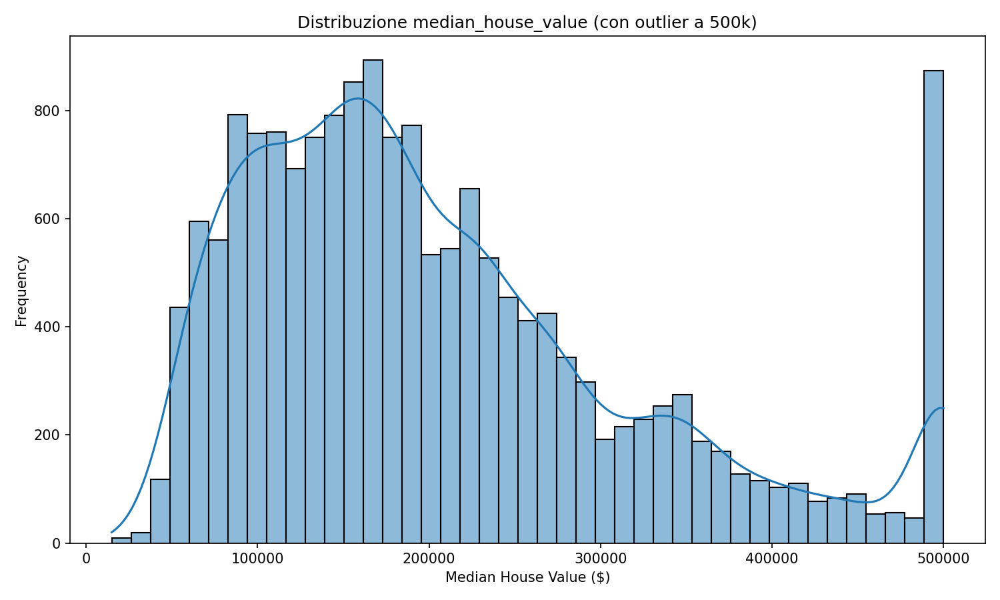
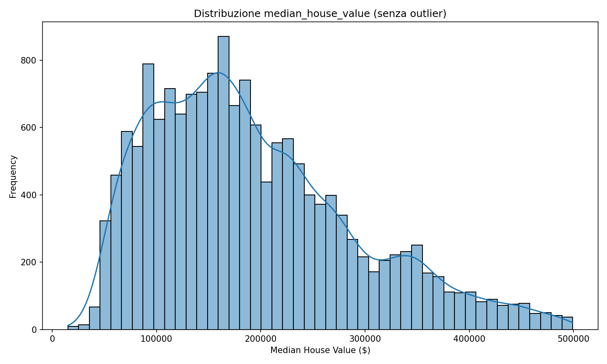
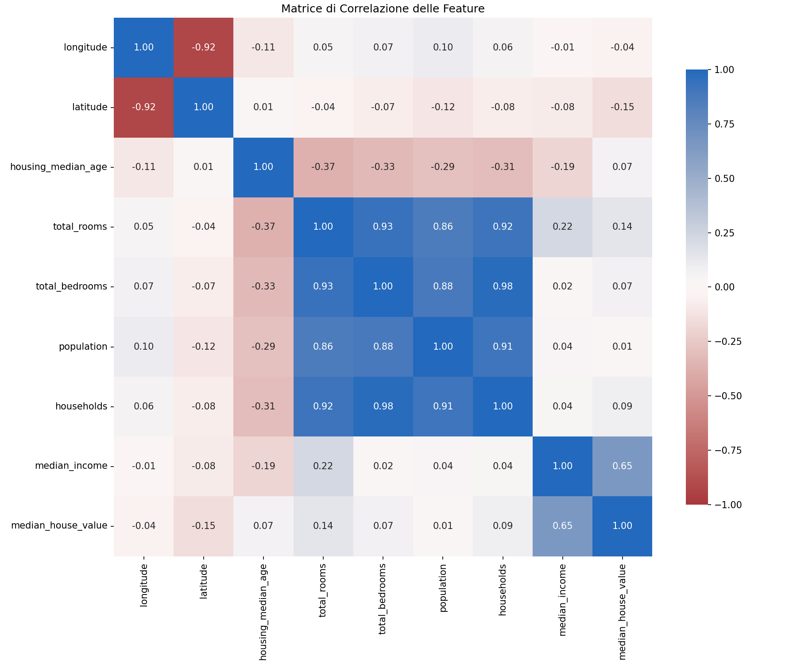
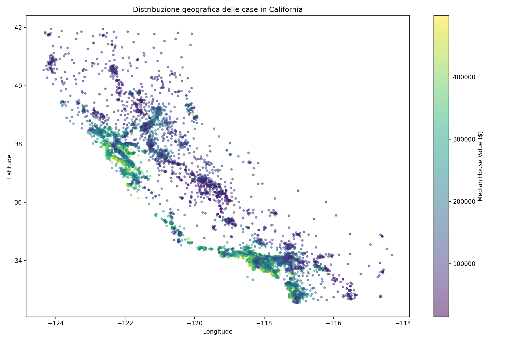
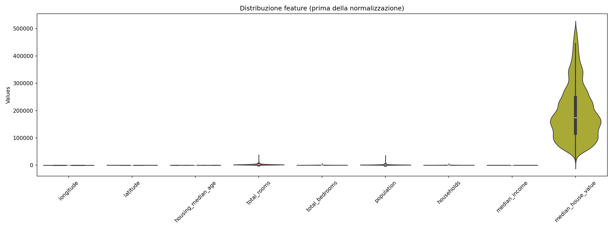
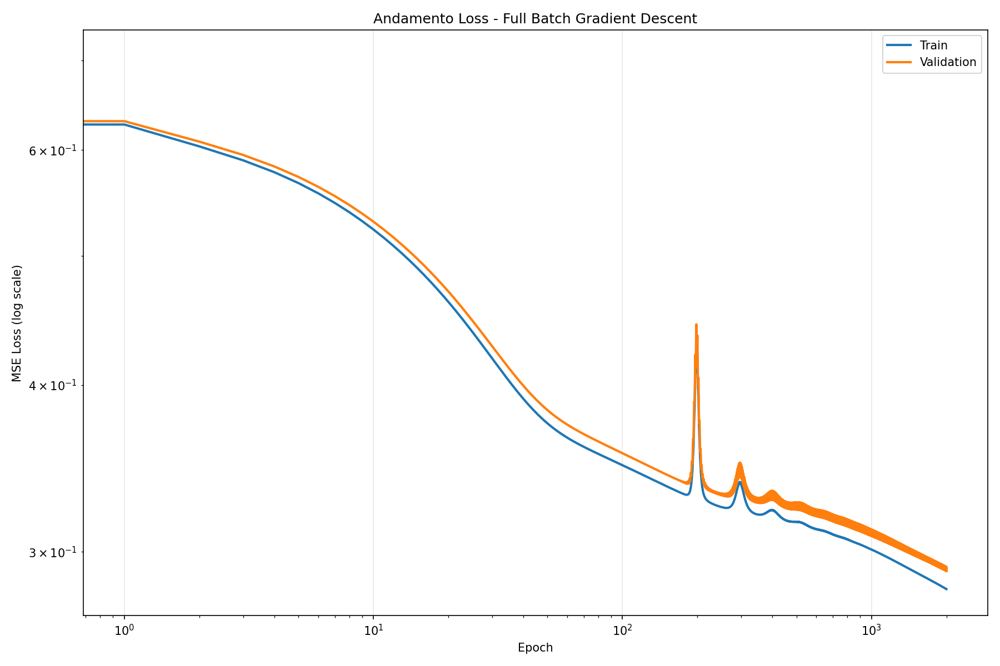
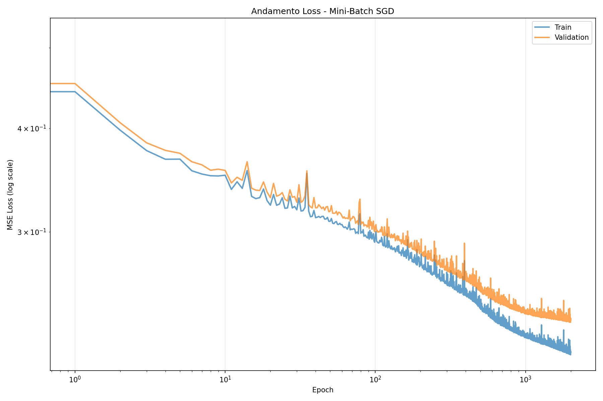
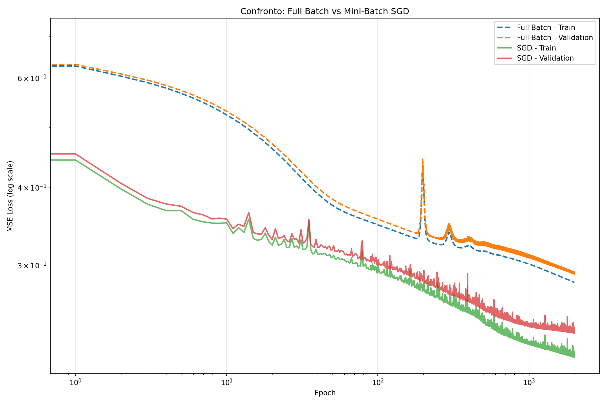
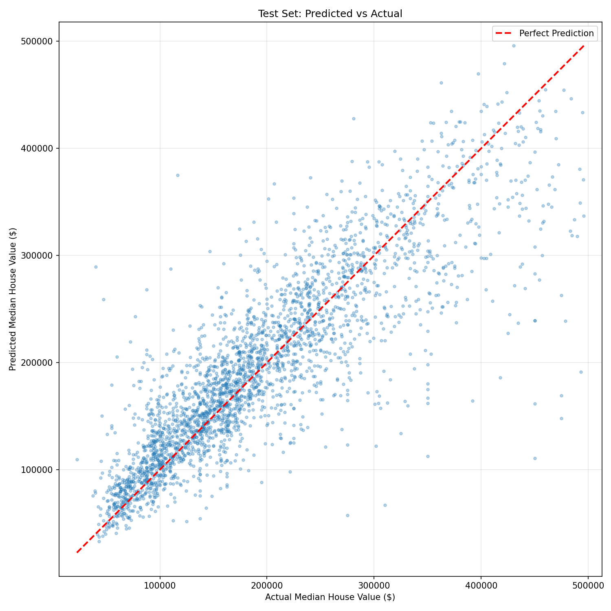

# Lab07 | ANN for regression

## Capitolo 1 – Introduzione, dataset e preparazione dei dati
---

### Import delle librerie necessarie

```python
import numpy as np
import matplotlib.pyplot as plt
import pandas as pd
import seaborn as sns
import time
import jax.numpy as jnp
import jax
```

---
## [00:00] Introduzione e obiettivo
**Contesto:**  
In questa lezione costruiamo da zero una rete neurale fully connected (ANN) in JAX per un problema di regressione sul **California Housing Dataset**.
**Dataset:**  
Si tratta di dati del censimento del 1990 per la California, con informazioni su:
- caratteristiche delle zone (coordinate geografiche, età delle abitazioni, numero di stanze, ecc.);
- caratteristiche socio‑demografiche (popolazione, nuclei familiari, reddito);
- **valore mediano delle case** nell’area (variabile target).
**Obiettivo:**  
Prevedere il **valore mediano di una casa** a partire dalle altre caratteristiche (feature).
---
## [00:45] Esplorazione iniziale del dataset

```python
# Caricamento del dataset
data = pd.read_csv("california_housing_train.csv")

# Prime righe
data.head()

# Informazioni sul dataset
data.info()

# Statistiche descrittive
data.describe()
```

Prima di costruire un modello è essenziale esaminare il dataset:
- verificare **valori mancanti** o righe vuote;
- capire il **tipo di variabili** presenti;
- controllare che i dati siano plausibili.
Le colonne principali sono:
- `longitude`: longitudine della zona;
- `latitude`: latitudine della zona;
- `housing\_median\_age`: età delle abitazioni;
- `total\_rooms`: numero totale di stanze;
- `total\_bedrooms`: numero totale di camere da letto;
- `population`: popolazione dell’area;
- `households`: numero di nuclei familiari;
- `median\_income`: reddito mediano;
- `median\_house\_value`: valore mediano delle case (**target**).
Con `head()` vediamo le prime righe, ma il dataset contiene circa **17 000** campioni.  
Con `info()` osserviamo:
- numero di campioni;
- tipo di dato per ogni colonna.
In questo dataset tutte le colonne sono `float`, il che è ideale perché:
- le reti neurali lavorano tipicamente con numeri in virgola mobile;
- se avessimo stringhe o interi categoriali, dovremmo prima trasformarli (per esempio con one‑hot encoding).
Con `describe()` otteniamo:
- media, deviazione standard;
- minimi, massimi;
- quartili.
Queste statistiche servono a:
- individuare **outlier**;
- trovare valori sospetti;
- scoprire eventuali `NaN` o problemi di qualità del dato.
---
## [03:10] Analisi della variabile target: `median\_house\_value`
Per la regressione useremo come target `median\_house\_value`.  
Tracciamo un **istogramma** con stima di densità (KDE).

```python
# Visualizzazione distribuzione del target
sns.histplot(data["median_house_value"], kde=True)
plt.title("Distribuzione median_house_value (con outlier a 500k)")
plt.xlabel("Median House Value ($)")
plt.ylabel("Frequency")
plt.show()
```



Osservazioni:
- c’è una coda verso valori alti;
- c’è un **picco molto netto** all’estremo superiore, intorno a **500 000**.
Questo è innaturale: nella realtà i prezzi molto alti dovrebbero essere rari e la densità decrescere gradualmente, non concentrarsi in un picco.
Motivo:
- nel dataset originale i valori di `median\_house\_value` sono stati **troncati**;
- tutte le case con valore superiore a una soglia sono state **tagliate a 500 000**.
Questa informazione è documentata, ma è facile dimenticarla se il dataset viene riutilizzato in contesti diversi.  
La **visualizzazione** permette di accorgersi subito di questo problema dalla forma dell’istogramma.
---
## [05:10] Gestione degli outlier e filtraggio con maschere booleane
Il troncamento a 500 000 fa perdere informazione sulla parte alta della distribuzione.  
Una scelta semplice è rimuovere queste righe:
- teniamo solo le righe con `median\_house\_value < 500000`.
In Pandas:
```python
# Filtro valori troncati
data = data[data["median_house_value"] < 500000]

# Nuova visualizzazione dopo il filtro
sns.histplot(data["median_house_value"], kde=True)
plt.title("Distribuzione median_house_value (senza outlier)")
plt.show()
```


Spiegazione:
1. `data["median\_house\_value"] < 500000`  
   restituisce una `Series` di booleani (`True`/`False`):
   - `True` se il valore è minore di 500 000;
   - `False` altrimenti.
2. Usando questa maschera nelle quadre, Pandas seleziona solo le righe con `True`.
È lo stesso meccanismo delle maschere in NumPy.
Dopo il filtraggio:
- la distribuzione di `median\_house\_value` appare più realistica;
- il picco artificiale a 500 000 scompare;
- lavoriamo con dati che rappresentano meglio l’andamento reale dei prezzi.
---
## [07:05] Matrice di correlazione e sua interpretazione
Per capire i rapporti tra le feature calcoliamo la **matrice di correlazione**:
```python
# Calcolo matrice di correlazione
corr = data.corr()

# Visualizzazione con heatmap
sns.heatmap(corr, annot=True, cmap="vlag_r", vmin=-1, vmax=1, 
            fmt=".2f", square=True)
plt.title("Matrice di Correlazione delle Feature")
plt.show()
```


Per ogni coppia di variabili otteniamo un coefficiente (es. Pearson):
- valori tra **−1** e **1**;
- vicino a **1** → forte correlazione positiva;
- vicino a **−1** → forte correlazione negativa;
- vicino a **0** → poca o nessuna correlazione lineare.
Questa analisi serve a:
1. **Capire meglio il dataset**  
   Correlazioni forti rivelano variabili che crescono/decrescono insieme.
2. **Ridurre le feature (feature selection)**  
   Se le feature sono moltissime, possiamo:
   - rimuovere variabili ridondanti;
   - mantenere solo quelle più significative.
Questo riduce:
- la dimensione di input della rete;
- la complessità dell’addestramento;
- spesso migliora la generalizzazione.
Per visualizzare la matrice usiamo:
```python
sns.heatmap(corr)
```
che mostra una mappa di colori con:
- righe e colonne = feature;
- colore = intensità e segno della correlazione.
**Correlazioni rilevanti:**
- `median\_house\_value` è fortemente correlata con `median\_income`:  
  zone con redditi più alti → case più costose.
- forte correlazione positiva all’interno del blocco:
  - `total\_rooms`, `total\_bedrooms`, `population`, `households`;  
  è coerente: più stanze, più camere, più famiglie, più popolazione.
- alcune correlazioni negative con `housing\_median\_age`: case più vecchie possono avere più stanze o configurazioni diverse.
- correlazione negativa tra `longitude` e `latitude`: le due coordinate non sono indipendenti nella distribuzione geografica della California.
---
## [10:10] Scatter plot: longitudine, latitudine e prezzo
Per visualizzare il legame tra **posizione geografica** e valore delle case:
```python
sns.scatterplot(
    data=data,
    x="longitude",
    y="latitude",
    hue="median_house_value",
    alpha=0.5
)
plt.title("Distribuzione geografica delle case in California")
plt.show()
```


Interpretazione:
- la nuvola di punti disegna la **forma della California**;
- le case più costose (colore associato a valori alti) sono:
  - concentrate vicino alla **costa**;
  - nell’entroterra, verso il deserto, i prezzi sono più bassi.
È coerente con la geografia: la costa pacifica è molto più costosa.
---
## [12:10] Altre correlazioni e idee di feature engineering
Possiamo esplorare altre coppie di variabili:
- `total\_rooms` vs `total\_bedrooms` mostra una correlazione quasi lineare: più stanze totali → più camere da letto.
- un grafico `latitude` vs `median\_house\_value` mostra due picchi significativi del valore delle case, che corrispondono probabilmente a grandi aree urbane, come:
  - San Francisco,
  - Los Angeles.
Le zone tra questi picchi sono tipicamente meno pregiate (rurali o meno urbanizzate).
### Feature engineering
Per migliorare un modello, oltre a scegliere bene la rete, è spesso decisivo **creare nuove feature**:
- ad esempio, potremmo aggiungere:
  - **distanza da San Francisco**;
  - **distanza da Los Angeles**.
Queste nuove variabili catturerebbero in modo esplicito la “vicinanza ai grandi centri urbani costosi” e potrebbero migliorare la capacità predittiva.
---
## [15:00] Normalizzazione dei dati: perché e come
Le reti neurali funzionano meglio se:
- tutte le feature hanno ordine di grandezza simile;
- sono approssimativamente centrate intorno allo zero;
- hanno varianza simile.
### Perché normalizzare?
Se una feature ha valori molto più grandi delle altre:
- i pesi associati a quella feature dominano le attivazioni;
- la rete si concentra troppo su quella variabile;
- la discesa del gradiente diventa squilibrata.
Normalizzando:
- rendiamo le feature comparabili;
- facilitiamo la convergenza;
- evitiamo che una sola variabile “schiacci” le altre.
### Analisi preliminare con violin plot
Prima di normalizzare, tracciamo un **violin plot** per ogni feature:
- mostra il box plot e la densità di probabilità stimata (simile alla KDE).
```python
# Violin plot prima della normalizzazione
fig, ax = plt.subplots(figsize=(16, 6))
sns.violinplot(data=data, ax=ax)
ax.set_title("Distribuzione feature (prima della normalizzazione)")
plt.xticks(rotation=45)
plt.show()
```


Risultato:
- le feature hanno scale molto diverse (alcune 10⁵, altre 10¹);
- `median\_house\_value` ha un ordine di grandezza diverso da molte altre.
È un’ulteriore conferma che la normalizzazione è necessaria.
### Come normalizziamo
Per ogni colonna:
\[
x\_{\text{norm}} = \frac{x - \mu}{\sigma}
\]
dove:
- \(\mu\) = media della colonna;
- \(\sigma\) = deviazione standard.
In Pandas:
```python
# Normalizzazione
data_mean = data.mean()
data_std = data.std()
data_normalized = (data - data_mean) / data_std

# Verifica statistiche dopo normalizzazione
data_normalized.describe()

# Violin plot dopo normalizzazione
fig, ax = plt.subplots(figsize=(16, 6))
sns.violinplot(data=data_normalized, ax=ax)
ax.set_title("Distribuzione feature (dopo normalizzazione)")
plt.xticks(rotation=45)
plt.show()
```


Pandas lavora per colonne:
- `mean()` e `std()` calcolano media e deviazione standard di ogni colonna;
- l’operazione si applica indipendentemente a ciascuna feature.
Dopo la normalizzazione:
- le distribuzioni sono centrate attorno a **0**;
- la deviazione standard è circa **1**;
- variabili come `population` mantengono code lunghe (outlier), ma il grosso delle distribuzioni è su scale confrontabili.
Molte feature sono ben approssimate da una **gaussiana** o da una distribuzione “ben comportata”, il che aiuta i modelli.
In scenari reali, per variabili con code molto lunghe si potrebbero applicare trasformazioni (log, clipping, ecc.).  
Per i nostri scopi attuali, la normalizzazione per media e deviazione standard è sufficiente.
---
## [20:30] Suddivisione del dataset: training, validation, test
Per valutare correttamente il modello, dividiamo i dati in tre insiemi:
1. **Training set**
2. **Validation set**
3. **Test set**
Nel nostro caso:
- il dataset originale è già separato in:
  - un file per **training + validation**;
  - un file per il **test**.
Carichiamo il file di training+validation, poi:
- mischiamo le righe (shuffle);
- dividiamo in:
  - training (circa 80%);
  - validation (circa 20%).
### Ruolo dei tre insiemi
- **Training set**  
  Serve per:
  - calcolare la loss;
  - fare la discesa del gradiente;
  - aggiornare pesi e bias.
- **Validation set**  
  Serve per:
  - scegliere gli **iperparametri**:
    - learning rate,
    - numero di layer,
    - numero di neuroni,
    - funzioni di attivazione, ecc.
  - confrontare diverse architetture/modelli.
  Importante:  
  sul validation **non** aggiorniamo i pesi. Lo usiamo solo per misurare le prestazioni e guidare le scelte.
- **Test set**  
  Lo usiamo **solo alla fine**, quando il modello è fissato.  
  È la stima migliore delle prestazioni su dati realmente nuovi.
### Implementazione pratica della split
1. Convertiamo il DataFrame normalizzato in NumPy:
   ```python
   data\_np = data\_normalized.to\_numpy()
   ```
   JAX lavora con array “grezzi” (tipo NumPy).
2. Rendiamo la permutazione riproducibile:
   ```python
   np.random.seed(0)
   np.random.shuffle(data\_np)
   ```
3. Calcoliamo il numero di esempi di training:
   ```python
   n\_samples = data\_np.shape[0]
   frac\_val = 0.2
   n\_train = int(n\_samples * (1 - frac\_val))  # 80% train
   ```
4. Separiamo feature e target (ultima colonna):
   ```python
   X\_train = data\_np[:n\_train, :-1]
   y\_train = data\_np[:n\_train, -1]
   X\_val = data\_np[n\_train:, :-1]
   y\_val = data\_np[n\_train:, -1]
   ```
Otteniamo:
- `X\_train`, `y\_train` per il training;
- `X\_val`, `y\_val` per la validation.
---
## Capitolo 2 – Inizializzazione dei parametri e forward pass dell’ANN
---
## [26:00] Inizializzazione dei parametri: obiettivo e metodi
Ora passiamo all’implementazione della rete neurale fully connected in JAX.
**Obiettivi:**
- inizializzare pesi e bias in modo sensato;
- definire il forward pass (`ann`);
- definire la loss per regressione;
- addestrare con gradient descent (full batch e poi mini‑batch);
- mantenere una convenzione coerente di shape e struttura dei parametri.
---
## [00:30] Seed casuale e struttura dei layer
Per avere esperimenti riproducibili:
- impostiamo un **random seed** all’interno della funzione di inizializzazione dei parametri;
- chiamando la funzione con gli stessi input, ottenremo gli stessi pesi.
Descriviamo l’architettura con una lista `layer\_sizes`:
- ad esempio `[input\_size, hidden1, hidden2, ..., output\_size]`.
Se `layer\_sizes = [8, 5, 1]`:
- 8 neuroni in input, 5 nel primo hidden, 1 in output;
- abbiamo **2** matrici di pesi (input→hidden, hidden→output).
Se `layer\_sizes = [8, 1]` (senza hidden):
- abbiamo **1** matrice di pesi (input→output).
Il pattern del loop sui layer è:
```python
for i in range(len(layer\_sizes) - 1):
    ...
```
Bisogna sempre considerare anche il caso limite con solo input e output.
---
## [28:00] Convenzioni su pesi e bias (shape)
Esistono due convenzioni comuni per la shape dei pesi `W`:
1. **Output sulle righe, input sulle colonne**  
   - `W` ha shape `(output\_size, input\_size)`.
2. **Input sulle righe, output sulle colonne**  
   - `W` ha shape `(input\_size, output\_size)`.
Entrambe funzionano, ma è fondamentale:
- sceglierne una;
- mantenerla ovunque (forward, loss, aggiornamento, ecc.).
Nel seguito assumiamo:
- `W` con **output sulle righe**, **input sulle colonne**:
  - `W` ha shape `(n\_out, n\_in)`:
    - `n\_out = layer\_sizes[i+1]` (neuroni del layer successivo),
    - `n\_in = layer\_sizes[i]` (neuroni in ingresso al layer).
Per i bias `b`:
- vogliamo che si sommino correttamente per broadcasting a `W @ layer`;
- se `layer` ha shape `(n\_in, batch\_size)`:
  - `W @ layer` ha shape `(n\_out, batch\_size)`;
  - scegliamo `b` come **vettore colonna** di shape `(n\_out, 1)`;
  - così `b` viene broadcastato sulla dimensione `batch\_size`.
---
## [26:00] Inizializzazione Xavier/Glorot e varianti
Una buona inizializzazione serve a:
- mantenere la varianza delle attivazioni relativamente stabile nei vari layer;
- limitare problemi di gradiente che esplode o scompare.
### Xavier/Glorot uniform
Per una matrice di pesi \( W \) di dimensione \( n \times m \):
\[
W\_{ij} \sim \mathcal{U}\left(-\sqrt{\frac{6}{n + m}},\; \sqrt{\frac{6}{n + m}}\right)
\]
dove:
- \( n \) = numero di neuroni in input al layer;
- \( m \) = numero di neuroni in output.
I bias di solito si inizializzano a **zero**.
### Variante Xavier/He “normal”
Un’alternativa è estrarre da una normale standard e scalare:
\[
\text{coefficiente} = \sqrt{\frac{2}{n + m}}, \quad
W \sim \mathcal{N}(0, 1) \times \text{coefficiente}
\]
In JAX:
```python
n = layer\_sizes[i+1]
m = layer\_sizes[i]
coef = jnp.sqrt(2.0 / (n + m))
W = coef * jax.random.normal(key, shape=(n, m))
```
Anche questa scelta mira a mantenere le attivazioni in un range ragionevole.
---
## [28:00] Implementazione di `initialize\_params(layer\_sizes)`
Vogliamo una funzione:
```python
def initialize_params(layers_size):
    """Inizializza parametri con Xavier/Glorot Normal
    
    Args:
        layers_size: lista [n_input, n_hidden1, ..., n_output]
    
    Returns:
        params: lista di coppie [W, b] per ogni layer
    """
    params = []
    np.random.seed(42)  # per riproducibilità
    
    for i in range(len(layers_size) - 1):
        n_in = layers_size[i]
        n_out = layers_size[i + 1]
        
        # Xavier/Glorot Normal initialization
        coef = np.sqrt(2.0 / (n_in + n_out))
        W = coef * np.random.randn(n_out, n_in)
        b = np.zeros((n_out, 1))
        
        params.append([W, b])
    
    return params

# Test
params = initialize_params([8, 5, 1])
print(f"Numero layer: {len(params)}")
print(f"W0 shape: {params[0][0].shape}")  # (5, 8)
print(f"b0 shape: {params[0][1].shape}")  # (5, 1)
print(f"W1 shape: {params[1][0].shape}")  # (1, 5)
print(f"b1 shape: {params[1][1].shape}")  # (1, 1)
```
Possiamo implementare l’inizializzazione con NumPy e, se necessario, convertire poi a JAX.
### Struttura di `params`
Conviene usare una lista di coppie `[W, b]` per ciascun layer:
```python
params = [
    [W0, b0],
    [W1, b1],
    ...
]
```
In questo modo:
- `len(params)` = numero di layer (trasformazioni);
- ogni elemento raggruppa i parametri di un layer, rendendo il codice più leggibile.
L’importante è mantenere la stessa struttura ovunque (forward, gradienti, aggiornamento).
### Test rapido
Per testare:
```python
params = initialize\_params([8, 1])
```
Ci aspettiamo:
- `W` con shape `(1, 8)`;
- `b` con shape `(1, 1)`.
Per una rete `[8, 5, 1]` avremo due coppie `(W, b)`:
- `W0` shape `(5, 8)`, `b0` shape `(5, 1)`;
- `W1` shape `(1, 5)`, `b1` shape `(1, 1)`.
---
## [08:30] Definizione della funzione di forward `ann`
Definiamo:
```python
def ann(x, params):
    """Forward pass della ANN
    
    Args:
        x: input shape (num_samples, num_features)
        params: lista di [W, b] per ogni layer
    
    Returns:
        output: predizioni shape (num_samples, output_dim)
    """
    # Trasponiamo per lavorare con vettori colonna
    layer = x.T  # shape: (num_features, num_samples)
    
    for i, (W, b) in enumerate(params):
        # Trasformazione lineare
        layer = W @ layer + b
        
        # Attivazione solo sui layer nascosti (non sull'ultimo)
        if i < len(params) - 1:
            layer = jnp.tanh(layer)
    
    # Ritorna al formato (num_samples, output_dim)
    return layer.T

# Test forward pass
y_pred = ann(x_train, params)
print(f"Input shape: {x_train.shape}")
print(f"Output shape: {y_pred.shape}")
```
### Convenzione per righe e colonne
Per coerenza con `W`:
- consideriamo `x` come `(num\_samples, num\_features)` (righe = campioni, colonne = feature);
- all’interno della funzione lavoriamo con vettori colonna:
  ```python
  layer = x.T  # shape: (num\_features, num\_samples)
  ```
Alla fine:
```python
return layer.T
```
così l’output torna al formato `(num\_samples, output\_dim)`.
### Struttura del forward pass
Nel loop sui layer:
```python
for i, (W, b) in enumerate(params):
    layer = W @ layer + b
    if i < len(params) - 1:
        layer = activation(layer)
```
- `W`: shape `(n\_out, n\_in)`;
- `layer` in ingresso: `(n\_in, batch\_size)`;
- `b`: `(n\_out, 1)` (broadcast sulla dimensione batch);
- risultato: `(n\_out, batch\_size)`.
Applichiamo una funzione di attivazione solo sui **layer nascosti**, non sull’ultimo.
### Nessuna attivazione sull’output per regressione
Per un problema di regressione vogliamo un output reale arbitrario:
- se applicassimo `tanh` all’ultimo layer, l’output sarebbe confinato in `(-1, 1)`;
- quindi **non** usiamo attivazioni non lineari sull’ultimo layer.
La regola:
- per `i < len(params) - 1` → attivazione (es. `tanh` o `ReLU`);
- per `i == len(params) - 1` → solo trasformazione lineare.
### Scelta dell’attivazione e uso di JAX
Un’azione molto comune è la **ReLU**:
\[
\text{ReLU}(x) = \max(0, x)
\]
In JAX:
```python
def relu(x):
    return jnp.maximum(0.0, x)
```
Tutto ciò che rientra nel calcolo della loss (forward, loss, gradienti) deve usare `jax.numpy` (`jnp`) e non `numpy`, altrimenti l’autodifferenziazione di JAX non funziona.
### Verifica della funzione `ann`
Esempio:
```python
y\_pred = ann(X\_train, params)
```
Se `X\_train` ha shape `(12000, 8)`:
- ci aspettiamo `y\_pred` con shape `(12000, 1)` (o `(12000,)` a seconda dell’implementazione finale).
Possiamo anche controllare che:
- l’output non sia limitato a `[-1, 1]` (per confermare che non abbiamo messo `tanh` sull’ultimo layer);
- le shape siano coerenti in tutto il flusso (input → hidden → output).
---
## [20:00] Nota sulle convenzioni di memoria
Le librerie numeriche spesso memorizzano i dati per righe (row‑major).  
Ciò può influire leggermente sulle prestazioni nell’accesso per righe/colonne, ma dal nostro punto di vista pratico la cosa fondamentale è:
- sapere quali shape abbiamo scelto;
- essere coerenti con trasposizioni e prodotti matrice‑matrice.
Se necessario, possiamo sempre trasporre o adattare il codice alla convenzione della libreria.
---
## Capitolo 3 – Funzione di loss e gradient descent full batch
---
## [22:00] Funzione di loss per regressione
La loss misura quanto bene la rete approssima i dati per un dato insieme di parametri. Deve restituire **uno scalare**, perché:
- JAX calcola il gradiente di uno scalare rispetto ai parametri.
Definiamo la loss come funzione di:
- `x`: input;
- `y`: target;
- `params`: parametri della rete.
### Mean Squared Error (MSE)
Per regressione si usa spesso la **MSE**:
\[
\text{MSE} = \frac{1}{N} \sum\_{i=1}^{N} (y^{\text{pred}}\_i - y\_i)^2
\]
In codice:
```python
def loss(x, y, params):
    """Mean Squared Error loss
    
    Args:
        x: input features
        y: target values
        params: network parameters
    
    Returns:
        scalar MSE loss
    """
    y_pred = ann(x, params)
    error = y_pred - y
    return jnp.mean(error * error)

# Test loss
params_test = initialize_params([8, 20, 20, 1])
L = loss(x_train, y_train, params_test)
print(f"Loss iniziale: {L:.4f}")
```
Il risultato è uno scalare.
### L1 loss (alternativa)
Un’alternativa è la **L1 loss**:
\[
\text{L1} = \frac{1}{N} \sum\_{i=1}^{N} |y^{\text{pred}}\_i - y\_i|
\]
In JAX:
```python
def loss\_l1(x, y, params):
    y\_pred = ann(x, params)
    error = y\_pred - y
    return jnp.mean(jnp.abs(error))
```
Differenze:
- MSE penalizza di più gli errori grandi (quadratico);
- L1 è più robusta agli outlier (penalizzazione lineare).
Per questo esempio useremo la MSE.
### Test della loss
Esempio:
```python
params = initialize\_params([8, 5, 5, 1])
L = loss(X\_train, y\_train, params)
```
Ci aspettiamo:
- `L` sia uno scalare (shape vuota o `()` in JAX);
- il valore sia ragionevole (non `NaN`, non infinito).
Se la loss restituisce un vettore o una matrice, manca probabilmente la media o la somma finale.
---
## [30:00] Addestramento con full batch gradient descent
Obiettivo: minimizzare la loss rispetto ai parametri della rete usando **gradient descent full batch**:
- a ogni aggiornamento usiamo **tutto il dataset** di training (`X\_train`, `y\_train`).
### Impostazione degli iperparametri
All’inizio definiamo:
- architettura (es. `[8, 5, 5, 1]`);
- numero di epoche (ad esempio 2000);
- learning rate;
- inizializzazione dei parametri;
- versioni JIT delle funzioni:
  - `ann`;
  - `loss`;
  - funzione per il gradiente (tramite `jax.grad`).
Inoltre teniamo traccia delle curve di loss:
- `train\_loss\_history`;
- `val\_loss\_history`.
### Struttura del loop di training (full batch)

```python
# Hyperparameters
layers_size = [8, 20, 20, 1]
num_epochs = 2000
learning_rate = 1e-1

# Inizializzazione
params = initialize_params(layers_size)

# Funzioni JIT-compiled per performance
grad_loss = jax.jit(jax.grad(loss, argnums=2))
loss_jit = jax.jit(loss)

history_train = []
history_valid = []

# Training loop
t0 = time.time()
for epoch in range(num_epochs):
    # 1. Calcolo gradiente
    grads = grad_loss(x_train, y_train, params)
    
    # 2. Aggiornamento parametri con tree_map
    params = jax.tree_util.tree_map(
        lambda p, g: p - learning_rate * g,
        params, grads
    )
    
    # 3. Salvataggio loss
    history_train.append(float(loss_jit(x_train, y_train, params)))
    history_valid.append(float(loss_jit(x_valid, y_valid, params)))
    
    if epoch % 200 == 0:
        print(f"Epoch {epoch}: train={history_train[-1]:.4f}, "
              f"val={history_valid[-1]:.4f}")

elapsed = time.time() - t0
print(f"\nTempo: {elapsed:.2f}s")
print(f"Loss train: {history_train[-1]:.4e}")
print(f"Loss validation: {history_valid[-1]:.4e}")

# Visualizzazione
fig, ax = plt.subplots(figsize=(12, 8))
ax.loglog(history_train, label="Train", linewidth=2)
ax.loglog(history_valid, label="Validation", linewidth=2)
ax.set_xlabel("Epoch")
ax.set_ylabel("MSE Loss (log scale)")
ax.legend()
ax.grid(True, alpha=0.3)
plt.show()
```


dove:
- `grad\_loss` è ottenuta da `jax.grad(loss, argnum=2)` (o equivalente);
- `update` applica:
  \[
  \theta\_{\text{new}} = \theta\_{\text{old}} - \eta \cdot \nabla\_{\theta}\text{loss}
  \]
per ciascun parametro `θ`, con `η` = learning rate.
### Aggiornamento manuale dei parametri
Se `params` è una lista di coppie `(W, b)` e `grads` ha la stessa struttura:
```python
for i in range(len(params)):
    params[i][0] -= learning\_rate * grads[i][0]  # pesi
    params[i][1] -= learning\_rate * grads[i][1]  # bias
```
Dopo aggiornare, calcoliamo e salviamo train e validation loss, oltre a misurare il tempo di esecuzione complessivo.
Con full batch:
- il gradiente è calcolato con precisione sul dataset completo;
- training e validation loss tendono a essere simili, salvo overfitting.
Se aumentiamo molto il numero di epoche, è normale che:
- la training loss scenda sotto la validation loss (overfitting);
- la validation loss possa essere leggermente più alta.
A volte può capitare anche il contrario (validation leggermente più bassa), ma in generale ci aspettiamo:
- `training\_loss ≤ validation\_loss`.
---
## Capitolo 4 – Aggiornamento dei parametri con `tree\_map` e introduzione allo SGD
---
## [06:00] Uso di `tree\_map` per strutture di parametri complesse
Aggiornare i parametri con un for esplicito è semplice quando:
- `params` è una lista corta e poco annidata.
Ma in reti complesse, `params` può essere:
- una lista di dizionari, nested list, dict di liste, ecc.
JAX fornisce `jax.tree\_util.tree\_map`, che è pensato per i cosiddetti **py-tree**:
- strutture annidate (liste, tuple, dizionari, ecc.) di JAX arrays.
L’idea:
- `params` è una struttura annidata;
- `grads` è una struttura con la **stessa forma** (stessa struttura intermedia, stesse chiavi, stessa annidazione).
Vogliamo applicare a ogni coppia (parametro, gradiente):
\[
\text{nuovo\\_parametro} = p - \text{learning\\_rate} \cdot g
\]
In JAX:
```python
new\_params = jax.tree\_util.tree\_map(
    lambda p, g: p - learning\_rate * g,
    params,
    grads
)
```
Oppure definendo prima la funzione:
```python
def grad\_update(p, g):
    return p - learning\_rate * g
new\_params = jax.tree\_util.tree\_map(grad\_update, params, grads)
```
`tree\_map` applica automaticamente la funzione a ogni coppia di foglie (array) nelle due strutture, senza dover scrivere cicli annidati.
---
## [00:00] Aggiornamento full batch con `gradjit` e salvataggio delle loss
Nel codice completo abbiamo una funzione `gradjit`:
- è la versione compilata JIT della funzione che calcola i gradienti della loss;
- ha la stessa firma della loss:
  - `gradjit(x\_train, y\_train, params)`.
Il loop full batch con `tree\_map` diventa:
```python
t0 = time.time()
for epoch in range(num\_epochs):
    grads = gradjit(x\_train, y\_train, params)
    params = jax.tree\_util.tree\_map(
        lambda p, g: p - learning\_rate * g,
        params, grads
    )
    train\_loss\_history.append(loss(x\_train, y\_train, params))
    val\_loss\_history.append(loss(x\_val, y\_val, params))
elapsed = time.time() - t0
```
L’aggiornamento ha così una forma compatta e generica, indipendente dalla struttura interna di `params`.
---
## [03:00] Andamento della loss e overfitting (scala log‑log)
Spesso si rappresentano le loss (training e validation) in scala **log‑log**:
- asse delle x (epoca) in scala logaritmica;
- asse delle y (loss) in scala logaritmica.
Motivi:
- la riduzione della loss in funzione del numero di iterazioni è spesso approssimativamente logaritmica;
- si vede meglio la diminuzione iniziale rapida e il successivo appiattimento.
Con full batch, la direzione del gradiente è precisa e:
- ci aspettiamo che training e validation loss siano simili;
- verso la fine, l’overfitting porta la validation loss a essere un po’ più grande della training loss.
---
## [11:00] Introduzione allo Stochastic Gradient Descent (SGD)
Dopo aver implementato il full batch, passiamo allo **Stochastic Gradient Descent** (SGD) con mini‑batch:
- invece di usare tutto il dataset per ogni aggiornamento;
- usiamo solo un **sottoinsieme** (mini‑batch) di campioni.
Gli elementi di base (modello, loss, gradiente) restano uguali.  
Cambiano:
- il **loop di training**;
- il **learning rate**, che diventa decrescente.
---
## [12:30] Learning rate decrescente (decaying learning rate)
Con SGD:
- il gradiente è calcolato su un mini‑batch, quindi è una **stima rumorosa** del gradiente reale;
- verso la fine dell’addestramento, un learning rate troppo grande rende gli aggiornamenti troppo instabili.
Per questo usiamo un learning rate che **decresce nel tempo**:
- all’inizio: valore più alto (es. 0.1);
- alla fine: valore più basso (es. 0.05);
- transizione **lineare** lungo le epoche.
Formula tipica:
```python
lr = max(
    learning\_rate\_min,
    learning\_rate\_max * (1 - epoch / learning\_rate\_decay)
)
```
Se `learning\_rate\_decay = num\_epochs`, l’andamento è:
- epoca 0: `lr ≈ learning\_rate\_max`;
- epoca finale: `lr ≈ learning\_rate\_min`.
Interpretazione:
- all’inizio: passi grandi per scendere velocemente;
- vicino al minimo: passi più piccoli per evitare overshooting e oscillazioni eccessive.
---
## [15:00] Struttura del loop per il mini‑batch SGD

```python
# Hyperparameters SGD
layers_size = [8, 20, 20, 1]
num_epochs = 2000
learning_rate_max = 1e-1
learning_rate_min = 5e-2
learning_rate_decay = num_epochs
batch_size = 1000

# Inizializzazione
params = initialize_params(layers_size)

history_train_sgd = []
history_valid_sgd = []

t0 = time.time()
for epoch in range(num_epochs):
    # 1. Learning rate decrescente
    lr = max(learning_rate_min, 
             learning_rate_max * (1 - epoch / learning_rate_decay))
    
    # 2. Shuffle dati
    n_samples = x_train.shape[0]
    perm_indices = np.random.permutation(n_samples)
    
    # 3. Mini-batch updates
    for i in range(0, n_samples, batch_size):
        batch_indices = perm_indices[i : i + batch_size]
        x_batch = x_train[batch_indices]
        y_batch = y_train[batch_indices]
        
        grads = grad_loss(x_batch, y_batch, params)
        params = jax.tree_util.tree_map(
            lambda p, g: p - lr * g, params, grads
        )
    
    # 4. Fine epoca: calcolo loss
    history_train_sgd.append(float(loss_jit(x_train, y_train, params)))
    history_valid_sgd.append(float(loss_jit(x_valid, y_valid, params)))
    
    if epoch % 200 == 0:
        print(f"Epoch {epoch}: train={history_train_sgd[-1]:.4f}, "
              f"val={history_valid_sgd[-1]:.4f}, lr={lr:.4f}")

elapsed = time.time() - t0
print(f"\nTempo: {elapsed:.2f}s")
print(f"Loss train: {history_train_sgd[-1]:.4e}")
print(f"Loss validation: {history_valid_sgd[-1]:.4e}")

# Visualizzazione SGD
fig, ax = plt.subplots(figsize=(12, 8))
ax.loglog(history_train_sgd, label="Train", linewidth=2)
ax.loglog(history_valid_sgd, label="Validation", linewidth=2)
ax.set_xlabel("Epoch")
ax.set_ylabel("MSE Loss (log scale)")
ax.legend()
ax.grid(True, alpha=0.3)
plt.show()
```



### Confronto Full Batch vs SGD

```python
# Confronto diretto
fig, ax = plt.subplots(figsize=(12, 8))
ax.loglog(history_train, label="Full Batch - Train", linestyle='--', linewidth=2)
ax.loglog(history_valid, label="Full Batch - Validation", linestyle='--', linewidth=2)
ax.loglog(history_train_sgd, label="SGD - Train", linewidth=2, alpha=0.7)
ax.loglog(history_valid_sgd, label="SGD - Validation", linewidth=2, alpha=0.7)
ax.set_xlabel("Epoch")
ax.set_ylabel("MSE Loss (log scale)")
ax.legend()
ax.grid(True, alpha=0.3)
plt.show()
```


Ricordiamo che per salvare i valori nella history bisogna usare `.append()`.
---
## [19:00] Full batch vs mini‑batch: ruolo del rumore
Differenze principali rispetto al full batch:
1. **Learning rate decrescente**, per compensare il rumore nel gradiente.
2. **Uso di mini‑batch**, invece del dataset completo.
Il gradiente calcolato su un mini‑batch:
- è una direzione rumorosa ma, in media, punta verso il minimo;
- quando siamo lontani dal minimo, il rumore non è un problema serio;
- vicino al minimo, invece, il rumore può farci oscillare attorno a una buona soluzione.
Riducendo il learning rate:
- diminuiamo le oscillazioni;
- permettiamo alla soluzione di stabilizzarsi.
---
## [05:00] Costo computazionale e miglioramento della loss
Con circa 17 000 campioni e mini‑batch di dimensione 1000:
- facciamo ~17 aggiornamenti di gradiente per epoca;
- il numero totale di aggiornamenti è molto superiore al caso full batch.
Risultati tipici:
- la loss finale può scendere (per esempio da circa 2.7 a 2.3);
- il tempo totale può aumentare, ma spesso il rapporto “miglioramento della loss / tempo” è migliore con mini‑batch (soprattutto con batch più piccoli).
---
## [07:00] Effetto del learning rate decay
Se impostiamo:
- poche epoche (es. 200);
- praticamente **nessun decay** (learning rate iniziale ≈ finale);
osserviamo che:
- verso la fine la loss comincia a **oscillare** molto;
- il grafico mostra salti marcati e manca stabilità.
Se, invece, usiamo un decay più deciso, ad esempio:
- `learning\_rate\_start = 0.1`;
- `learning\_rate\_end = 0.01`;
alla fine dell’addestramento:
- le oscillazioni nella loss sono ridotte;
- la curva è più liscia e tende a stabilizzarsi.
L’obiettivo è bilanciare:
- **esplorazione** del paesaggio della loss (learning rate più grande);
- **minimizzazione fine** (learning rate più piccolo).
---
## [10:00] Esplorazione vs minimizzazione nella loss
Immaginiamo la loss come un paesaggio con molte valli (minimi locali):
- con learning rate **piccolo**:  
  ci si muove con passi brevi, si resta nella stessa valle e si affina il minimo locale;
- con learning rate **grande**:  
  si possono “scavalcare” creste fra valli e raggiungere minimi migliori.
Lo **SGD** introduce anche un rumore naturale dovuto ai mini‑batch:
- la loss non è monotona decrescente ad ogni passo;
- a volte può aumentare temporaneamente, ma questo può aiutare a uscire da minimi locali subottimali.
Strategia:
- learning rate inizialmente grande → buona esplorazione;
- learning rate che decresce → stabilizzazione intorno a una buona soluzione.
---
## [13:00] Altri ottimizzatori: Momentum, Adam, ecc.
Il metodo usato è un gradient descent piuttosto semplice (con eventuale decay).  
Esistono ottimizzatori più sofisticati:
- **Momentum**;
- **Adam**, ecc.
Questi introducono ulteriori iperparametri (coefficiente di momentum, fattori per le medie mobili dei gradienti, ecc.) per:
- migliorare l’esplorazione;
- accelerare la convergenza;
- ottenere un compromesso migliore tra esplorazione e minimizzazione.
Nel seguito rimaniamo sul gradient descent base per semplicità, e ci concentriamo sulla fase di **test** del modello.
---
## Capitolo 5 – Training completo, test e valutazione finale
---
## [15:00] Preparazione del modello addestrato
Assumiamo di aver completato l’addestramento con una certa configurazione:
1. Dati di training normalizzati.
2. Modello definito (architettura e funzioni).
3. Iperparametri regolati in precedenza (learning rate, numero di epoche, ecc.).
4. Training effettuato fino a ottenere:
   - training loss bassa;
   - validation loss accettabile.
Abbiamo quindi:
- i **parametri finali** della rete;
- un modello ritenuto soddisfacente.
Ora vogliamo testarlo su un dataset di **test** mai utilizzato in precedenza.
---
## [17:00] Caricamento e pulizia del dataset di test

```python
# Caricamento test set
data_test = pd.read_csv("california_housing_test.csv")

# Stesso filtro outlier del training
data_test = data_test[data_test["median_house_value"] < 500000]

print(f"Test samples: {len(data_test)}")
```
In questo modo eliminiamo i valori troncati a 500 000 anche nel test.
---
## [19:00] Normalizzazione coerente tra training e test

```python
# IMPORTANTE: usare statistiche del TRAINING
data_test_norm = (data_test - data_mean) / data_std

# Conversione a NumPy
data_test_np = data_test_norm.to_numpy()
x_test = data_test_np[:, :-1]
y_test_norm = data_test_np[:, -1:]

print(f"x_test shape: {x_test.shape}")
print(f"y_test_norm shape: {y_test_norm.shape}")
```
Controlliamo le shape:
- `x\_test` → `(n\_test\_samples, 8)`;
- `y\_test` → `(n\_test\_samples,)` o `(n\_test\_samples, 1)`.
Devono essere compatibili con quelle usate in training.
---
## [22:00] Predizione sui dati di test

```python
# Predizione normalizzata
y_pred_norm = ann(x_test, params)

print(f"Predizioni (normalizzate): {y_pred_norm.shape}")
```

---
## [23:00] Denormalizzazione delle predizioni

```python
# Statistiche target dal training
mean_target = data_mean["median_house_value"]
std_target = data_std["median_house_value"]

# Denormalizzazione predizioni
y_pred = y_pred_norm * std_target + mean_target

# Valori reali (non normalizzati)
y_test_actual = data_test["median_house_value"].values.reshape(-1, 1)

print(f"y_pred range: [{y_pred.min():.0f}, {y_pred.max():.0f}]")
print(f"y_test range: [{y_test_actual.min():.0f}, {y_test_actual.max():.0f}]")
```
---
## [26:00] Confronto grafico tra valori veri e predetti

```python
# Scatter plot predetto vs vero
fig, ax = plt.subplots(figsize=(10, 10))
ax.scatter(y_test_actual, y_pred, alpha=0.3, s=10)

# Bisettrice (predizione perfetta)
min_val = min(y_test_actual.min(), y_pred.min())
max_val = max(y_test_actual.max(), y_pred.max())
ax.plot([min_val, max_val], [min_val, max_val], 'r--', 
        linewidth=2, label="Perfect Prediction")

ax.set_xlabel("Actual Median House Value ($)")
ax.set_ylabel("Predicted Median House Value ($)")
ax.set_title("Test Set: Predicted vs Actual")
ax.legend()
ax.grid(True, alpha=0.3)
ax.axis('equal')
plt.show()
```


Così possiamo vedere:
- quanto le predizioni si discostano dalla perfetta corrispondenza;
- se gli errori sono simmetrici rispetto alla bisettrice o se c’è una distorsione sistematica.
---
## [30:00] Interpretazione dello scatter plot
Osservando lo scatter:
- molte predizioni risultano a distanza moderata dalla bisettrice;
- gli errori più grandi tendono a concentrarsi:
  - in certe zone di prezzi alti,
  - in certe zone di prezzi più bassi.
Tuttavia:
- la nuvola è relativamente **simmetrica** rispetto alla bisettrice;
- molti punti sono raggruppati attorno alla zona centrale.
Conclusioni:
- il modello non è perfetto: ci sono errori anche grandi;
- non emergono però distorsioni sistematiche marcate;
- il comportamento è globalmente ragionevole per un primo modello di regressione con una ANN semplice.
---
## [33:00] Visualizzazione con pandas e Seaborn

```python
# Creazione DataFrame per Seaborn
test_df = pd.DataFrame({
    "Actual": y_test_actual.flatten(),
    "Predicted": y_pred.flatten()
})

# Joint plot con distribuzioni marginali
g = sns.jointplot(data=test_df, x="Actual", y="Predicted", 
                  kind="scatter", alpha=0.3, height=10)
g.ax_joint.plot([min_val, max_val], [min_val, max_val], 
                'r--', linewidth=2)
g.fig.suptitle("Test Set: Joint Distribution", y=1.02)
plt.show()
```


L’idea generale:
- Seaborn è molto potente per la visualizzazione;
- funziona molto bene in combinazione con DataFrame pandas;
- la documentazione offre molti esempi utili.
---
## [38:00] Calcolo dell’errore: RMSE in dollari

```python
# Calcolo RMSE in dollari
error = y_pred.flatten() - y_test_actual.flatten()
rmse = np.sqrt(np.mean(error ** 2))

print(f"\n=== Risultati Test Set ===")
print(f"RMSE: ${rmse:,.2f}")
print(f"RMSE (migliaia): ${rmse/1000:.2f}k")
print(f"Media prezzi test: ${y_test_actual.mean():,.2f}")
print(f"Errore relativo: {100 * rmse / y_test_actual.mean():.2f}%")
```

Qui:
- `error` è il vettore degli errori (predizione − valore vero);
- `error ** 2` è il quadrato elemento per elemento;
- la media dei quadrati è la MSE;
- la radice quadrata è l'RMSE.

Il risultato può essere, ad esempio, intorno a **49 000 dollari** di RMSE, che ci dà un’idea dell’errore medio (in termini quadratici) sulle stime del valore delle case.
### Attenzione a tipi e dimensioni
Prima c’era un errore perché:
- `Y\_pred` era un array NumPy 2D;
- `Y\_test` una `Series` pandas.
Per evitare problemi:
1. Convertiamo entrambi in NumPy;
2. Usiamo `.flatten()` per avere vettori 1D di uguale dimensione.
### Nota sul quadrato
Per il quadrato:
- `error * error` e `error ** 2` sono equivalenti dal punto di vista matematico;
- `error * error` è in genere più efficiente perché usa una semplice moltiplicazione invece dell’operazione generica di potenza.
---
## Riepilogo dei punti chiave
- **Preparazione dei dati**
  - Esplorazione iniziale, gestione degli outlier (taglio a 500 000).
  - Normalizzazione di tutte le feature (media 0, varianza 1).
  - Suddivisione in training, validation, test.
- **Modello**
  - Rete neurale fully connected con pesi `W` (output×input) e bias colonna.
  - Inizializzazione Xavier/Glorot o He‑like.
  - Attivazioni solo sui layer nascosti, nessuna attivazione sull’output.
- **Loss e ottimizzazione**
  - Loss di regressione: MSE (eventuale L1).
  - Gradient descent full batch e poi mini‑batch SGD.
  - Learning rate decrescente per stabilizzare l’SGD.
  - Aggiornamento dei parametri con `jax.tree\_util.tree\_map`.
- **Valutazione**
  - Monitoraggio di training e validation loss (overfitting).
  - Test su dataset separato, normalizzato con statistiche del training.
  - Denormalizzazione delle predizioni per leggerle in dollari.
  - Valutazione con scatter plot (predetto vs vero) e RMSE in dollari.