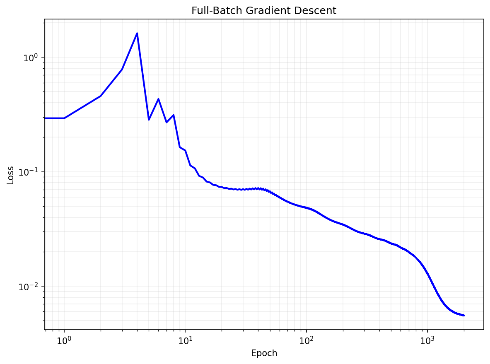
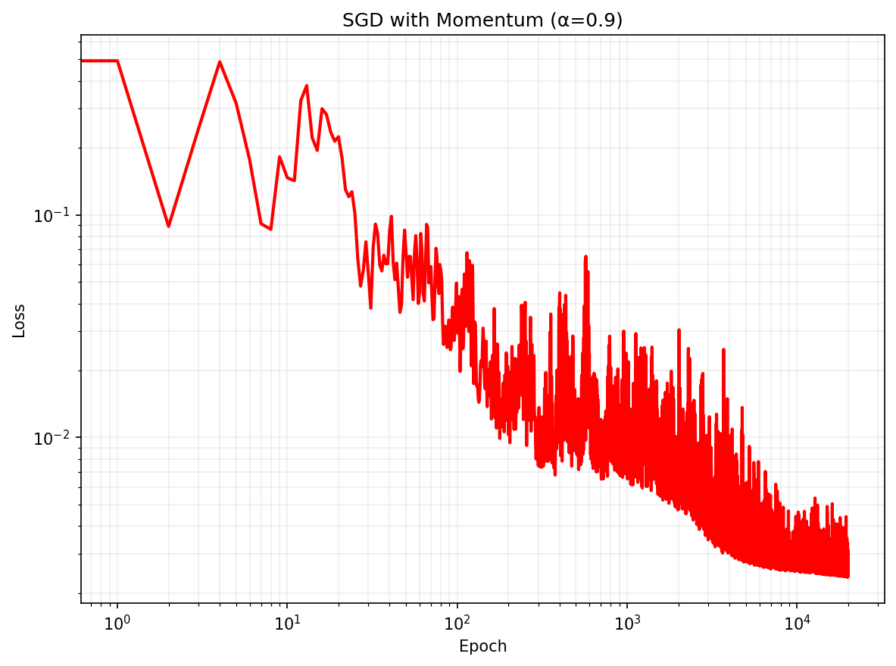
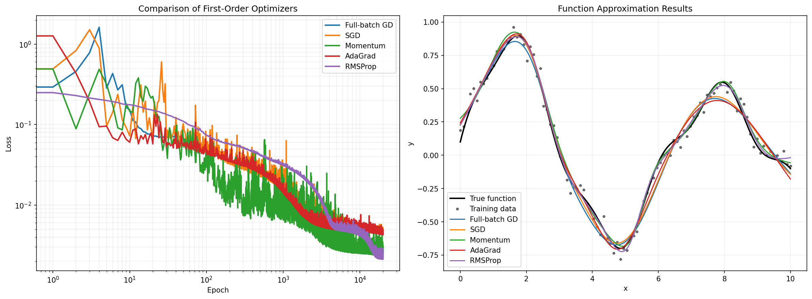
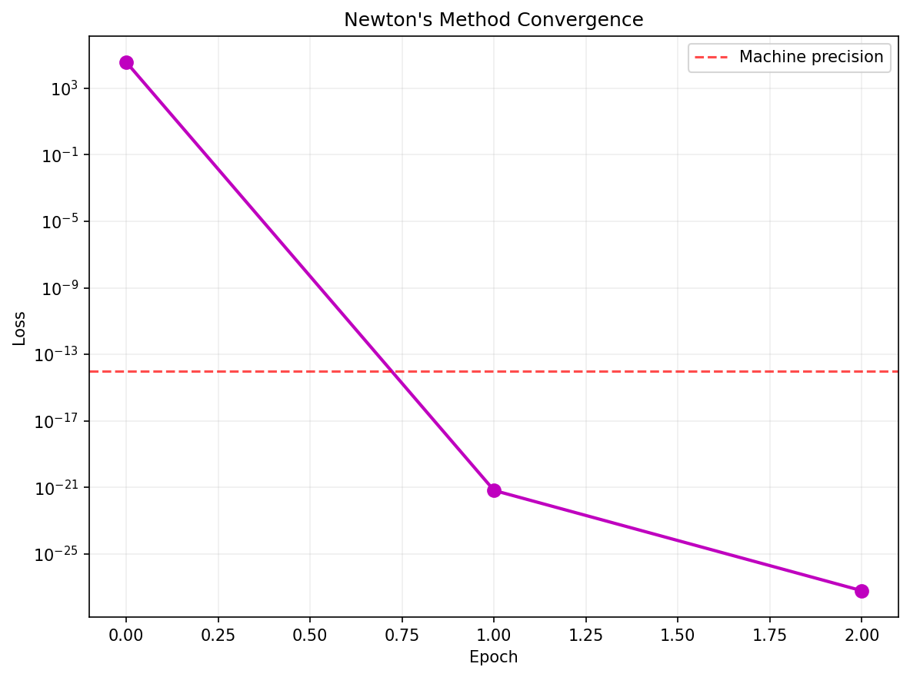
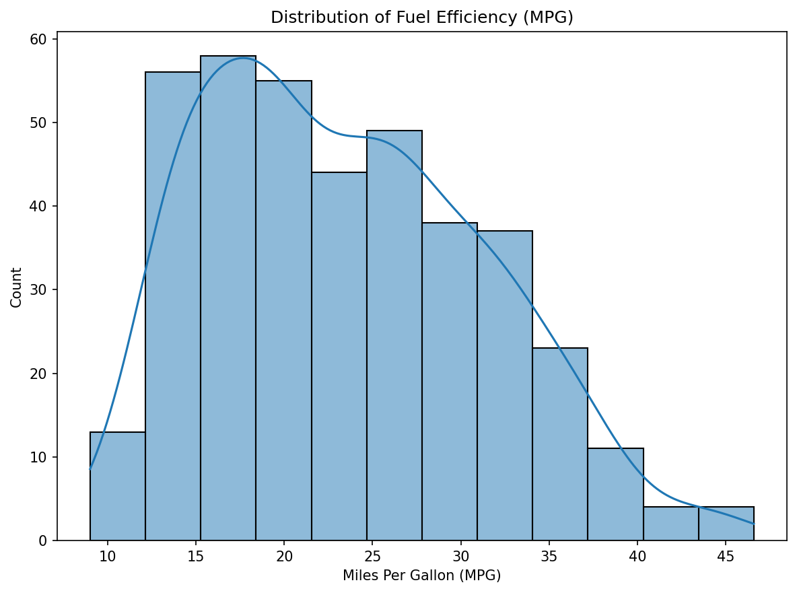
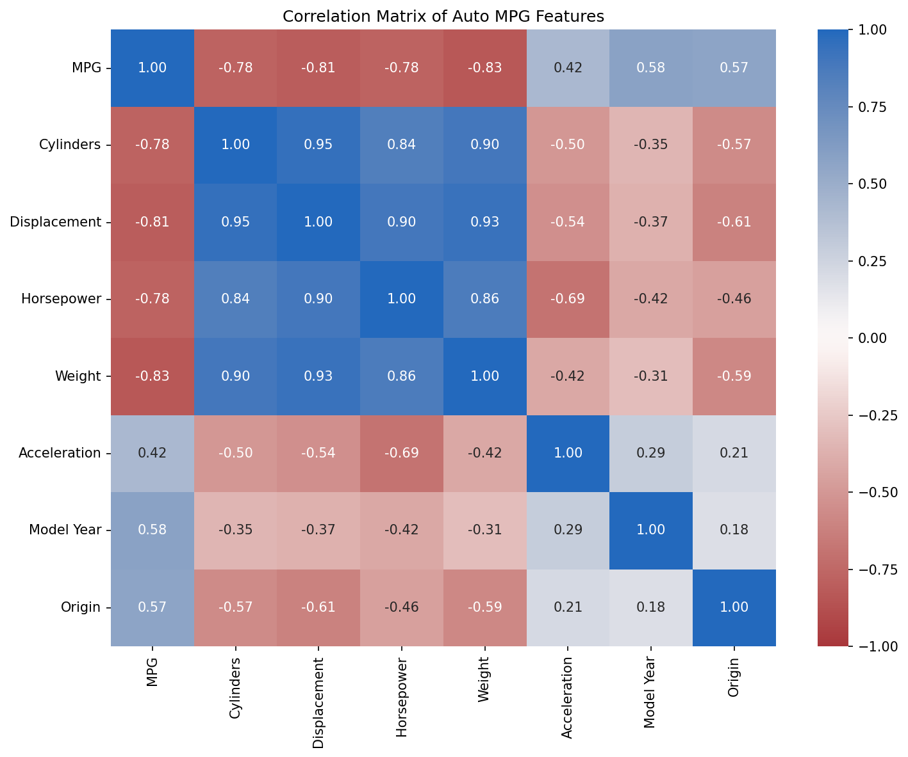
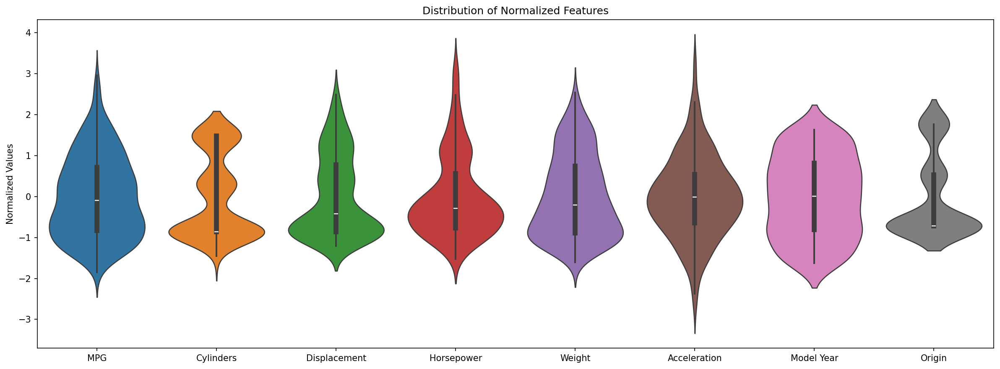
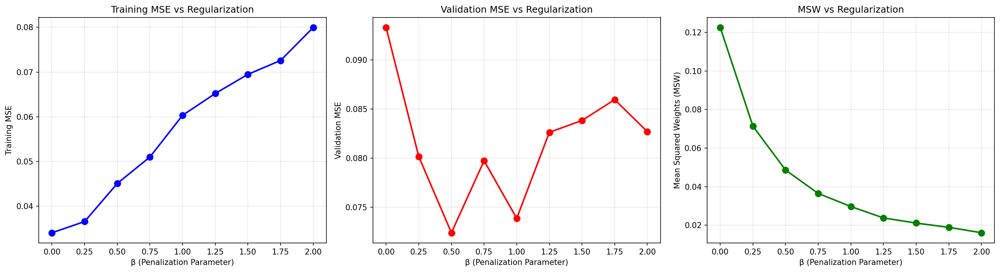
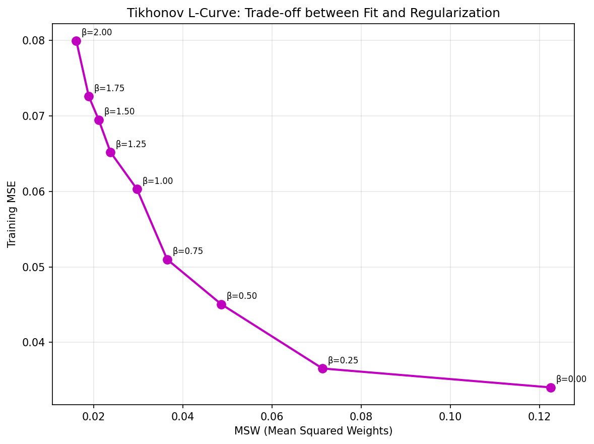

# Lab08 | 1st and 2nd order optimizer, regularization

# Optimizers for Neural Networks and Regularization
## [00:00] Introduction to the Lab
### Overview of the Lessons
The plan for today and the next two labs is to delve deeper into the use of neural networks. In each session, we will add new elements to improve our skills. Today, we will cover three main topics:
1.  **First-Order Optimizers:** We will implement more advanced versions of optimizers, similar to those available in major deep learning libraries, introducing concepts like *Momentum* and *RMSProp*.
2.  **Second-Order Optimizers:** We will analyze optimizers based on Newton's method. These are particularly useful in mathematical contexts, such as in *Physics-Informed Neural Networks* (PINNs) used to solve partial differential equations (PDEs).
3.  **Regularization:** We will see how adding a term to the cost function, which penalizes high-value parameters (as in Ridge regression or SVMs), positively affects the *validation loss*.
In the next two labs, we will focus on **convolutional neural networks (CNNs)**, which have had a huge impact in the field of *computer vision*.
### Preparing the Environment
You will find the notebook for the lesson in the `wibit` folder, as usual. We will start with the notebook dedicated to first-order optimization.
## [01:03] Chapter 1: Setting Up the Regression Problem

### Imports

```python
import numpy as np
import matplotlib.pyplot as plt
import jax.numpy as jnp
import jax
```

### The Goal: Approximating a 1D Function
Our goal is to use a neural network to approximate a one-dimensional function defined as the sum of an exponential, a sine, and a cosine. Using a 1D function allows us to easily visualize the optimizer's behavior at each training epoch.

The function is defined as:

$$
f(x) = e^{-\frac{x}{10}}\sin(x) + \frac{1}{10} \cos(\pi x)
$$

over the interval $[0, 10]$.

```python
f = lambda x: np.sin(x) * np.exp(-0.1 * x) + 0.1 * np.cos(np.pi * x)
a, b = 0, 10
```
### Data Visualization
First, we define and visualize the function.
*   The **blue line** represents the original function we want to approximate.
*   The **orange dots** represent the real data, obtained by adding Gaussian noise to the original function to simulate realistic conditions.

```python
def get_training_data(N, noise):
    np.random.seed(0)  # for reproducibility
    x = np.linspace(a, b, N)[:, None]
    y = f(x) + noise * np.random.randn(N, 1)
    return x, y

# Generate 100 training points with noise magnitude 0.05
n_training_points = 100
noise = 0.05
xx, yy = get_training_data(n_training_points, noise)

# Visualize
x_fine = np.linspace(a, b, 1000)[:, None]
plt.plot(x_fine, f(x_fine), label='True function')
plt.plot(xx, yy, 'o', label='Training data')
plt.legend()
plt.show()
```
### Neural Network Implementation
To focus on today's key aspects, many of the basic functions are already provided.
*   **Parameter Initialization:** Unlike previous times, all network parameters (weights `w` and biases `b`) are "flattened" and stored in a single list. This simplifies management.
*   **Network Architecture:** The neural network is designed for a regression task. It uses the **hyperbolic tangent (tanh)** as the activation function for all layers except the last one.
*   **Cost Function (Loss Function):** Since this is a regression problem, we use the **Mean Squared Error (MSE)**. The error is calculated as the difference between the network's prediction and the real value; the loss is the average of the square of this error.

```python
def initialize_params(layers_size):
    np.random.seed(0)  # for reproducibility
    params = list()
    for i in range(len(layers_size) - 1):
        W = np.random.randn(layers_size[i + 1], layers_size[i])
        b = np.zeros((layers_size[i + 1], 1))
        params.append(W)
        params.append(b)
    return params

def ANN(x, params):
    # Normalize input to [-1, 1]
    layer = (2 * x.T - (a + b)) / (b - a)
    num_layers = int(len(params) / 2 + 1)
    weights = params[0::2]
    biases = params[1::2]
    for i in range(num_layers - 1):
        layer = jnp.dot(weights[i], layer) - biases[i]
        if i < num_layers - 2:
            layer = jnp.tanh(layer)
    return layer.T

def loss(x, y, params):
    error = ANN(x, params) - y
    return jnp.mean(error * error)
```
### Startup and Dynamic Visualization
We initialize a network with a `[1, 5, 5, 1]` structure (one input, two hidden layers with 5 neurons, one output). A specific code cell allows us to dynamically visualize the training, showing the evolution of the approximated function and the loss.

```python
# Initialize network
layers_size = [1, 5, 5, 1]
params = initialize_params(layers_size)

# JIT compilation for speed
loss_jit = jax.jit(loss)
grad_jit = jax.jit(jax.grad(loss, argnums=2))

# Test initial loss
print(f"Initial loss: {loss_jit(xx, yy, params):.3e}")
```
## [03:20] Chapter 2: Gradient Descent and its Variants
### The Task: Implementing Optimizers
Our task will be to manually implement different variants of *gradient descent* to observe their differences during training.
### 2.1. Full-Batch Gradient Descent
We start with the implementation of the standard version, known as *Full-Batch Gradient Descent*.
1.  **Gradient Calculation:** Inside the training loop, we calculate the gradients of the cost function with respect to all parameters, using the entire dataset. The `gradjit` function (compiled *Just-In-Time* with JAX) returns a list of gradients.
2.  **Parameter Update:** We update each parameter by subtracting the corresponding gradient, multiplied by a `learning\_rate`. This moves the parameters in the direction of the steepest descent of the loss.
```python
# Pseudocode for the update
for i in range(len(params)):
    params[i] = params[i] - learning\_rate * grads[i]
```
#### Full-Batch Results
Running the code, we observe two plots:
*   **On the right:** The approximated function (orange) trying to fit the training data (green), with the original function as a reference (blue).
*   **On the left:** The trend of the cost function.

```python
# Full-Batch Gradient Descent
params_gd = initialize_params(layers_size)
num_epochs = 2000
learning_rate = 1e-1
history_gd = [loss_jit(xx, yy, params_gd)]

for epoch in range(num_epochs):
    grads = grad_jit(xx, yy, params_gd)
    for i in range(len(params_gd)):
        params_gd[i] = params_gd[i] - learning_rate * grads[i]
    history_gd.append(loss_jit(xx, yy, params_gd))

print(f"Final loss: {history_gd[-1]:.3e}")
```



**Observations:**
*   The loss can temporarily increase. This is normal for non-convex cost functions, where a first-order optimizer can move between different "valleys."
*   The loss oscillations are minimal, as the gradient calculated on the entire dataset provides a very stable descent direction.
*   The final loss settles around `5 * 10^-3`.
### 2.2. Stochastic Gradient Descent (SGD) with Learning Rate Decay
Now it's your turn to implement the variants.
*   **Stochastic Gradient Descent (SGD):** Instead of using the entire dataset, a small random subset of data, called a **mini-batch**, is drawn at each step. The gradient is calculated only on this mini-batch.
*   **Learning Rate Decay:** The `learning\_rate` is not fixed but decreases over time. The idea is to take large steps at the beginning of training and smaller steps as we get closer to the minimum, to avoid "jumping" over the optimal solution.

```python
# SGD with learning rate decay
params_sgd = initialize_params(layers_size)
num_epochs_sgd = 20000
learning_rate_max = 1e-1
learning_rate_min = 2e-2
learning_rate_decay = 10000
batch_size = 10
history_sgd = [loss_jit(xx, yy, params_sgd)]

for epoch in range(num_epochs_sgd):
    learning_rate = max(learning_rate_min, 
                       learning_rate_max * (1 - epoch / learning_rate_decay))
    idxs = np.random.choice(n_training_points, batch_size, replace=True)
    grads = grad_jit(xx[idxs, :], yy[idxs, :], params_sgd)
    for i in range(len(params_sgd)):
        params_sgd[i] = params_sgd[i] - learning_rate * grads[i]
    history_sgd.append(loss_jit(xx, yy, params_sgd))

print(f"Final loss: {history_sgd[-1]:.3e}")
```


### 2.3. Gradient Descent with Momentum
*Momentum* is a technique that adds "inertia" to the parameter update.
*   **Key Idea:** The update depends not only on the current gradient but also on the direction taken in previous steps. It's like a ball rolling down a hill: it maintains a certain velocity (momentum) in the direction it was already moving.
*   **Formula:** The update `v` (velocity) is a combination of the previous velocity and the current gradient. The parameters are then updated using this new velocity.

```python
# Momentum
params_momentum = initialize_params(layers_size)
alpha = 0.9
velocity = [0.0 for _ in range(len(params_momentum))]
history_momentum = [loss_jit(xx, yy, params_momentum)]

for epoch in range(num_epochs_sgd):
    learning_rate = max(learning_rate_min, 
                       learning_rate_max * (1 - epoch / learning_rate_decay))
    idxs = np.random.choice(n_training_points, batch_size, replace=True)
    grads = grad_jit(xx[idxs, :], yy[idxs, :], params_momentum)
    for i in range(len(params_momentum)):
        velocity[i] = alpha * velocity[i] - learning_rate * grads[i]
        params_momentum[i] = params_momentum[i] + velocity[i]
    history_momentum.append(loss_jit(xx, yy, params_momentum))

print(f"Final loss: {history_momentum[-1]:.3e}")
```


### 2.4. AdaGrad (Adaptive Gradient)
AdaGrad adapts the learning rate for each individual parameter.
*   **Key Idea:** It maintains a memory of past gradients for each parameter. Parameters that have received large gradients in the past will have a smaller learning rate, while those with small gradients will have a larger learning rate.
*   **Operations:** The operations are intended to be *component-wise*, i.e., applied element by element.
### 2.5. RMSProp (Root Mean Square Propagation)
RMSProp is an improvement on AdaGrad that introduces a decay factor (`decay\_rate`) for the gradient memory.
*   **Key Idea:** Instead of accumulating all past gradients, RMSProp gives more weight to recent ones, gradually "forgetting" older ones. This prevents the learning rate from becoming too small and stalling the learning process.

Your task is to implement these three variants and observe their behavior, also trying to modify parameters (e.g., `batch\_size`, `momentum`) to understand their effect.

### Comparison of All First-Order Optimizers



The comparison shows:
- **Full-batch GD**: Smooth convergence but requires many epochs
- **SGD**: Noisy but effective with proper learning rate decay  
- **Momentum**: Accelerates convergence and reduces oscillations
- **AdaGrad**: Adaptive learning rates, good initial progress but can stall
- **RMSProp**: Better than AdaGrad, prevents learning rate decay

## [08:58] Chapter 3: Analysis of the Results
### 3.1. SGD Implementation and Results
Let's look at the implementation of *Stochastic Gradient Descent* together.
1.  **Learning Rate Update:** We apply the decay formula to reduce the `learning\_rate` at each epoch.
2.  **Mini-Batch Extraction:** We select a random subset of data (`batch\_size` points) from the training dataset.
    *   **Technical Note:** In this implementation, to facilitate comparison, we draw a random mini-batch at each epoch. The correct approach for a full epoch would be to divide the entire dataset into mini-batches and iterate over all of them, ensuring each data point is used once. However, for our purposes, this simplified method is sufficient.
3.  **Gradient Calculation and Update:** We calculate the gradient only on the mini-batch and update the parameters.
#### Comparison between Full-Batch and SGD
*   **Oscillations:** The loss function with SGD oscillates much more. This is because the gradient calculated on a small sample is a "noisy" estimate of the real gradient.
*   **Efficiency:** We ran 10 times more epochs than full-batch, but each epoch uses only 1/10 of the data (batch size of 10 out of 100 points). The total amount of processed data is therefore similar.
*   **Final Result:** The final loss with SGD is slightly lower (`4.7 * 10^-3`), demonstrating that, for the same computational cost, SGD can achieve better results. The fairest comparison would be to measure execution time, as the goal is to minimize the total computational cost.
### 3.2. Momentum Implementation and Results
Let's move on to implementing *Gradient Descent with Momentum*.
1.  **Velocity Initialization:** We create a `velocity` variable to store the update "velocity" for each parameter.
2.  **Velocity Update:** At each step, the new velocity `v` is a combination of the old velocity (multiplied by an inertia factor `alpha`) and the current gradient (multiplied by the `learning\_rate`).
3.  **Parameter Update:** The parameters are updated by adding the new velocity.
#### Results with Momentum
*   **Better Loss:** The final loss is `2.5 * 10^-3`, about half that of SGD, for the same computational cost. This is an excellent result.
*   **Better Approximation:** Visually, the approximated function fits the data much better, especially at the peaks.
*   **Oscillations and Early Stopping:** The loss oscillations are even more pronounced. This highlights the importance of techniques like **early stopping**: you monitor the loss on a validation set and stop training when it reaches a minimum, to avoid ending on an "unlucky" epoch where the loss is high. Momentum, despite crossing local maxima, allows for better exploration of the parameter space and reaching a better global minimum.
### 3.3. AdaGrad: Adaptive Learning Rate
The fundamental idea of AdaGrad is to use a learning rate that adapts individually for each parameter of the model. Unlike a fixed learning rate, this approach aims to stabilize training.
#### How It Works
The parameter update `θ` at iteration `k+1` follows a formula similar to standard gradient descent:
`θ\_k+1 = θ\_k - λ * (gradient / denominator)`
The novelty lies in the **denominator**, which acts as an adaptive learning rate. This denominator depends on a variable `R`, which accumulates a history of the squares of past gradients for each parameter.
**Logic:**
1.  **History Accumulation:** The variable `R` stores the sum of the squares of the gradients calculated at each step. Being a square, it is always a positive quantity that represents the total "magnitude" of the changes a parameter has undergone.
2.  **Step Adaptation:** The effective learning rate for a parameter is inversely proportional to this accumulated history.
    *   **Parameters with large variations:** If a parameter has undergone significant updates in the past (i.e., its accumulated gradient in `R` is large), its update step will become smaller. This helps to dampen oscillations and stabilize the parameter.
    *   **Parameters with small variations:** If a parameter has changed little, its update step will be larger, encouraging it to explore the solution space more.
In summary, each parameter gets its own personalized learning rate that decreases faster the more that parameter has been modified in the past.
#### Practical Implementation
1.  **Initialization:** A variable (e.g., `accumulated\_squared\_grad`) is initialized to store the history of squared gradients.
2.  **Training Loop:**
    *   Calculate the gradient on the current mini-batch.
    *   For each parameter, update the history by summing the square of the newly calculated gradient:
        `accumulated\_squared\_grad[i] += grads[i] * grads[i]`
    *   Calculate the adaptive learning rate for that parameter:
        `learning\_rate\_adapt = learning\_rate / (delta + sqrt(accumulated\_squared\_grad[i]))`
        -   `delta`: A very small constant (e.g., `1e-7`) added to avoid division by zero and ensure numerical stability.
    *   Update the parameter using the newly calculated adaptive learning rate:
        `params[i] -= learning\_rate\_adapt * grads[i]`
#### Advantages and Disadvantages
*   **Advantage:** AdaGrad is very effective at reducing cost function oscillations by dampening updates for parameters that change too abruptly.
*   **Disadvantage:** Its main flaw is that the gradient history (`R`) grows continuously, never decreasing. In the long run, this causes the learning rate to become extremely small for all parameters, effectively "stalling" training and preventing further exploration. The model might stop prematurely in a local minimum.
### 3.4. RMSProp: Solving AdaGrad's Problem
RMSProp (Root Mean Square Propagation) is an improvement on AdaGrad designed to solve the problem of the vanishing learning rate. The key idea is to introduce a "forgetting" mechanism for the gradient history.
#### How It Works
The parameter update `θ` is identical to AdaGrad's, but the way the history `R` is updated changes. Instead of accumulating indefinitely, `R` becomes an **exponential moving average** of the squared gradients.
`R\_k = ρ * R\_{k-1} + (1 - ρ) * (gradient\_k * gradient\_k)`
**Logic:**
1.  **Exponential Memory:** The variable `R` is no longer a simple sum, but a weighted average between its past history (`R\_{k-1}`) and the new squared gradient.
2.  **Decay Factor (`ρ`):** The parameter `ρ` (decay rate), typically a value like 0.9, is less than 1. By multiplying the old history by `ρ` at each step, the contribution of older gradients decreases exponentially over time.
3.  **"Forgetting" the Past:** This mechanism allows the algorithm to "forget" the distant past and adapt the learning rate based mainly on recent gradients. If a parameter stops having large gradients for a while, its learning rate can start to increase again, allowing the model to continue exploring.
#### Practical Implementation
The implementation is similar to AdaGrad's, with a crucial change in the history update.
1.  **Training Loop:**
    *   Calculate the gradient.
    *   Update the `accumulated\_squared\_grad` history as a moving average:
        `accumulated\_squared\_grad[i] = decay\_rate * accumulated\_squared\_grad[i] + (1 - decay\_rate) * grads[i] * grads[i]`
    *   The calculation of the adaptive learning rate and the parameter update remain identical to AdaGrad's.
#### Advantages of RMSProp over AdaGrad
RMSProp is almost always superior to AdaGrad because it doesn't "stall" training. By maintaining a responsive learning rate, it allows for more effective and prolonged exploration, often leading to better results and faster, more stable convergence.
Although more advanced algorithms like **Adam** (which combines the ideas of RMSProp and momentum) are often used today, understanding AdaGrad and RMSProp is fundamental because they form the basis on which these modern methods are built.
## Chapter 4: Second-Order Methods: Newton's Method
Second-order methods, like Newton's method, are optimizers that use not only the gradient (first derivative) but also the Hessian matrix (second derivative) to find the minimum of a function.
**Idea:** They approximate the cost function locally with a parabola (in multiple dimensions, a paraboloid) and jump directly to its minimum. This can lead to much faster convergence than first-order methods.
### Main Problems
1.  **Memory Cost:** The Hessian matrix has a size of `n x n`, where `n` is the number of parameters. For a neural network with millions of parameters, storing an `n²` element matrix is prohibitive.
2.  **Convergence Guarantees:** Newton's method converges reliably only if you are already close to a minimum. Far from the minimum, its behavior can be unstable and worse than that of first-order methods.
Due to these limitations, pure Newton's methods are rarely used to train deep neural networks, but they are useful for specific problems and for understanding advanced concepts.
### Implementation in JAX: Gradient and Hessian
In JAX, we can calculate these ingredients efficiently:
*   **Gradient:** `jax.grad(loss\_function)`
*   **Hessian:** `jax.hessian(loss\_function)`
For computational efficiency, the best way to calculate the Hessian is by combining "forward" and "reverse" mode differentiation: `jax.jacfwd(jax.jacrev(loss\_function))`.
### The Hessian-Vector Product (HVP) Trick
The main problem remains memory. However, in many algorithms, we don't need the entire Hessian matrix, but only the result of its product with a vector: `H * v`.
**Key Idea:** It is possible to calculate the product `H * v` **without ever explicitly constructing the matrix `H`**.
This is based on a mathematical identity:
`H(x) * v = ∇\_x [ (∇\_x f(x)) ⋅ v ]`
**Explanation:**
1.  `∇\_x f(x)`: Calculate the gradient of the cost function `f` at point `x`. The result is a vector.
2.  `(∇\_x f(x)) ⋅ v`: Calculate the dot product between the gradient and the vector `v`. The result is a scalar.
3.  `∇\_x [...]`: Calculate the gradient of this scalar with respect to `x`. The result is a vector, which is exactly `H * v`.
**Advantage:** At no point in this process is an `n x n` matrix created. Only vectors and scalars are manipulated, making the calculation feasible even for a huge number of parameters.
### HVP Implementation in JAX
This trick translates very elegantly into JAX. To calculate `H(x) * v`:
```python
# Function that calculates the dot product between the gradient and vector v
def grad\_dot\_v(x, v):
  # jax.grad(loss)(x) calculates the gradient
  # jnp.dot calculates the dot product
  return jnp.dot(jax.grad(loss)(x), v)
# The HVP is the gradient of this function with respect to the first argument (x)
hvp = jax.grad(grad\_dot\_v, argnums=0)
# To use it:
result\_vector = hvp(x\_point, v\_vector) 
```
This technique is fundamental for making second-order methods (or "quasi-Newton" methods like BFGS) applicable to large-scale problems, such as those encountered in machine learning.
## Chapter 5: Comparing Computational Costs
### Efficiency of the Matrix-Free Version
I want to show you the difference in terms of computational cost. Let's look at the comparison right away.
The *matrix-free* version (without an explicit matrix) is significantly faster, over 20-25 times, compared to the one that uses the *full* matrix.
- **Full Version**: takes on average 600 microseconds.
- **Matrix-Free Version**: takes on average 20 microseconds.
#### Why is the Matrix-Free Version Faster?
The higher speed is not just due to the number of calculations, which is more or less the same, but also to **memory management**.
1.  **Data Transfer Cost**: There is a cost associated with moving data from RAM to the CPU (or GPU), where calculations occur.
2.  **Lower Memory Usage**: Code that requires less memory needs to transfer a smaller amount of data. This reduces waiting times and makes execution faster.
This approach not only reduces the memory footprint but also speeds up the entire process. The memory aspect is crucial, especially on GPUs. If a calculation, like that of the Hessian, grows quadratically with the number of parameters, it will end up occupying all the GPU's memory, leaving very little space for the model's parameters themselves.
## Chapter 6: Implementing Newton's Method
### Outline of the Standard Newton's Method
Now we are ready to implement Newton's method. Here are the fundamental steps:
1.  **Calculate the Hessian (H)**: Construct the Hessian matrix.
2.  **Calculate the Gradient (G)**: Calculate the gradient of the cost function.
3.  **Find the update direction (increment)**: Solve the linear system `H * increment = -G`. This step generalizes Newton's method to multiple dimensions.
4.  **Update the parameters**: Update the current estimate of the parameters `x` by adding the calculated increment: `x\_new = x + increment`.
For a convex problem like ours, Newton's method is extremely efficient, like a "Ferrari": it should reach the minimum in very few iterations (2 or 3 at most).
I'll give you five minutes to complete this part. If you have time, you can also try to implement the *matrix-free* version.
### Solution: Newton's Method with Explicit Matrix
Let's go through the solution together.

1.  **Calculation of Hessian and Gradient**:
    - `H = hessian\_jit(x)`: We calculate the Hessian at point `x`.
    - `G = grad\_jit(x)`: We calculate the gradient at point `x`.

2.  **Solving the Linear System**:
    - To find the increment, we solve the linear system `H * increment = -G`. The easiest way is to use the `solve` function from linear algebra libraries.
    - `increment = solve(H, -G)`
    - The `solve` function typically uses an LU decomposition to find the solution.

3.  **Parameter Update**:
    - `x = x + increment`

By running this code, we reach machine precision (machine epsilon, about 10⁻¹⁴) in just **two epochs**.

```python
# Enable double precision for Newton's method
jax.config.update("jax_enable_x64", True)

# Setup problem: minimize ||Ax - b||^2
n = 100
np.random.seed(0)
A = np.random.randn(n, n)
x_ex = np.random.randn(n)
b = A @ x_ex

def loss_newton(x):
    return jnp.sum(jnp.square(A @ x - b))

grad_newton = jax.grad(loss_newton)
hess_newton = jax.jacfwd(jax.jacrev(loss_newton))

loss_newton_jit = jax.jit(loss_newton)
grad_newton_jit = jax.jit(grad_newton)
hess_newton_jit = jax.jit(hess_newton)

# Newton's method
x_guess = np.random.randn(n)
x = x_guess.copy()
num_epochs_newton = 100
eps = 1e-8
history_newton = [loss_newton_jit(x)]

for epoch in range(num_epochs_newton):
    H = hess_newton_jit(x)
    G = grad_newton_jit(x)
    incr = np.linalg.solve(H, -G)
    x = x + incr
    history_newton.append(loss_newton_jit(x))
    
    print(f"Epoch {epoch}: loss={loss_newton_jit(x):.3e}, "
          f"grad_norm={np.linalg.norm(G):.3e}, "
          f"incr_norm={np.linalg.norm(incr):.3e}")
    
    if np.linalg.norm(incr) < eps:
        print("Convergence reached!")
        break

rel_err = np.linalg.norm(x - x_ex) / np.linalg.norm(x_ex)
print(f"Relative error: {rel_err:.3e}")
```



The main problem with this approach is the computational and memory cost associated with constructing and managing the Hessian matrix `H`.
2.  **Solving the Linear System**:
    - To find the increment, we solve the linear system `H * increment = -G`. The easiest way is to use the `solve` function from linear algebra libraries.
    - `increment = solve(H, -G)`
    - The `solve` function typically uses an LU decomposition to find the solution.
3.  **Parameter Update**:
    - `x = x + increment`
By running this code, we reach machine precision (machine epsilon, about 10⁻¹⁴) in just **two epochs**.
The main problem with this approach is the computational and memory cost associated with constructing and managing the Hessian matrix `H`.
### Solution: Matrix-Free Newton's Method with Conjugate Gradient
How can we avoid explicitly calculating the Hessian? The skeleton of Newton's method remains the same, but we need to change how we solve the linear system.
#### The Conjugate Gradient (CG)
There are linear algebra methods, such as the **conjugate gradient (CG)**, that allow solving a linear system without needing to construct the explicit matrix. These methods only require the ability to calculate the product of the matrix and a vector (the action of the matrix).
The conjugate gradient is particularly suitable when the matrix is **symmetric and positive definite**, just like the Hessian in many optimization problems.
#### Implementation with JAX
In JAX, we can use the `cg` function found in `jax.scipy.sparse.linalg.cg`.
- **Main Argument**: `cg` does not accept a matrix, but a **function** that performs the matrix-vector product. In our case, we will pass the `HVP` (Hessian-Vector Product) function we defined earlier.
- **Lambda Function**: We use a `lambda` function to "fix" the point `x` where the Hessian is evaluated: `lambda y: hvp\_jit(x, y)`. This function takes a vector `y` and returns the product `H(x) * y`.
- **Other arguments**:
    - The second argument is the right-hand side of the system, `-G`.
    - Since it is an iterative method, we must provide a tolerance (`epsilon`).
### Results and Comparison
With this approach, Newton's method requires one more iteration (three instead of two). This happens because the quality of the increment calculated by the conjugate gradient depends on the set tolerance (in our case, 10⁻⁸), whereas `solve` calculates the solution up to machine precision.
However, the final result is identical: we reach a very low relative error (5 * 10⁻¹⁵), which is still at the level of machine precision. We have obtained the same final result, but with a drastically lower impact on memory and computation.
**Key message**: It is possible to solve linear systems efficiently without constructing dense matrices, using only the action of the matrix on a vector.
### A More Complex Problem
Let's now consider a problem similar to the previous one, but with a cost function raised to the fourth power instead of squared. This makes the "valley" of the function much steeper. Consequently, Newton's method needs more iterations to converge (about 50 instead of 3), but it still manages to reach machine precision, as the problem remains convex.
## Chapter 7: The BFGS Method
### An Alternative to the Hessian: Iterative Approximation
The **BFGS (Broyden–Fletcher–Goldfarb–Shanno)** method is another solution to avoid the costly calculation of the Hessian. The key idea is to build an approximation of the Hessian (or its inverse) that is improved iteration by iteration.
#### The Fundamental Idea
The approximation of the Hessian, denoted by `B`, is updated at each step by adding a **rank-one matrix (rank-one update)**. This concept is similar to what we saw with SVD, where a matrix is approximated by summing rank-one matrices.
- **Low memory usage**: Rank-one updates require very little memory space.
- **Progressive approximation**: We start with a rough approximation (often the identity matrix) and refine it at each step.
### BFGS Implementation
Let's code the algorithm together.
1.  **Search direction (p)**: `p = -B\_inv * G`, where `B\_inv` is the approximation of the inverse of the Hessian and `G` is the gradient. Initially, `B\_inv` is the identity matrix, so the first step is simply a gradient descent.
2.  **Line Search (alpha)**: We search for the optimal *learning rate* (or step, `alpha`) along the direction `p`. This is an important step in quasi-Newton methods. We use a function from `scipy.optimize` to find `alpha`. If the search fails, we use a very small step.
3.  **Parameter update**: `x\_new = x + alpha * p`. This is similar to a gradient descent step, but the direction `p` is modulated by the Hessian approximation.
4.  **Calculate vectors for the update (s, y)**:
    - `s = x\_new - x` (the change in parameters).
    - `y = new\_grad - old\_grad` (the change in the gradient).
5.  **Update the inverse of the Hessian (B\_inv)**: Using `s` and `y`, the new `B\_inv` is calculated by adding two rank-one matrices. This is the core of BFGS.
### Analysis of the Results
- **Convergence**: The BFGS method requires more epochs to converge than Newton's method, as it starts with a rough approximation of the Hessian.
- **Behavior**: Initially, the method behaves like a gradient descent (plateau phase). As the Hessian approximation improves, convergence accelerates dramatically, leading to a rapid drop in error.
- **Efficiency**: Despite the higher number of iterations, it achieves excellent precision (10⁻⁸) with very low memory usage.
## Chapter 8: Regularization and Hyperparameter Tuning
### Introduction to Regularization
Let's now move on to a very interesting topic: **regularization** and **hyperparameter tuning**.
The idea is to add a term to the cost function that penalizes the model's parameters (e.g., the weights of a neural network). By modifying this penalty term, we can observe how the results on the **validation loss** change.
This process is exactly what is done during hyperparameter tuning: you modify hyperparameters such as the number of layers, the weights in the cost function, the architecture, or the learning rate, with the goal of minimizing the loss on the validation set.
### The Dataset: Fuel Consumption
For this example, we will use a famous dataset that relates the fuel consumption of cars to their various characteristics, such as:
- Number of cylinders
- Horsepower
- Weight
- Acceleration
- Year of production

```python
import pandas as pd
import seaborn as sns

# Load Auto MPG dataset
url = "http://archive.ics.uci.edu/ml/machine-learning-databases/auto-mpg/auto-mpg.data"
column_names = ["MPG", "Cylinders", "Displacement", "Horsepower", 
                "Weight", "Acceleration", "Model Year", "Origin"]
data = pd.read_csv(url, names=column_names, na_values="?", 
                  comment="\t", sep=" ", skipinitialspace=True)

# Check for missing values
print(data.isna().sum())

# Remove missing entries
data = data.dropna()
print(f"Dataset size after cleaning: {len(data)} samples")
```
## Chapter 9: Data Management and Analysis with Pandas
### Data Cleaning: Handling Missing Values
As we have done in the past, we manage our data using the Pandas library, which should become one of your favorite tools for data manipulation. The representation we get is in tabular form.
The first step is to check for missing data. It is very common for datasets to contain absent values, so it is crucial to identify columns with missing data and possibly remove them.
Missing data are often represented as "Not a Number" (NaN). To find them, we use the `isna()` method on our table and sum the results for each column. This way, we find out how many rows for each column contain NaN values. In our case, we notice that the "horsepower" column has six empty rows.
For now, our priority is to ensure we don't have "dirty" data in the dataset. Although there are more sophisticated techniques for handling missing data (like imputation, which consists of filling them with estimated values), for this exercise, we will choose the simplest path: removing the problematic rows. We can easily do this with the `dropna()` method, which eliminates all rows containing NaN values from our table.
### Data Inspection and Visualization
After cleaning, we move to the inspection phase. We analyze a few rows of the dataset and check the data types (`dtypes`). We notice that some columns, despite containing integers, actually represent categorical variables (like the number of cylinders). Since they are already in numerical format, the neural network will have no problem handling them. If they had been strings (text), we would have had to apply specific transformations.
Next, we use the `describe()` method to get a statistical overview of the data, which includes mean, standard deviation, quantiles, and other useful indicators.
#### Distribution of the Target Variable
Our target variable, the value we want to predict, is "mpg" (miles per gallon), an index that measures a vehicle's fuel efficiency (how many miles can be driven on one gallon of fuel).

We analyze its distribution to ensure it is reasonable. Unlike the housing dataset analyzed previously, where we had to remove outliers, here the graph shows an acceptable distribution and requires no intervention.

```python
# Plot MPG distribution
sns.histplot(data["MPG"], kde=True)
plt.xlabel('Miles Per Gallon (MPG)')
plt.ylabel('Count')
plt.title('Distribution of Fuel Efficiency (MPG)')
plt.show()
```


#### Correlation Between Variables
To explore the relationships between the different variables, we use a heatmap generated with Seaborn, a powerful library for data visualization. This allows us to gain valuable insights.

```python
# Correlation heatmap
sns.heatmap(data.corr(), annot=True, cmap="vlag_r", vmin=-1, vmax=1, fmt='.2f')
plt.title('Correlation Matrix of Auto MPG Features')
plt.show()
```



For example, we observe that:
*   The **number of cylinders** is strongly correlated with **horsepower**: the more cylinders a car has, the more powerful it is.
*   The **weight** of the vehicle is correlated with both the number of cylinders and horsepower.
*   All these variables, which measure the "power" of the vehicle, are **negatively correlated** with fuel efficiency (mpg). In other words, a heavier and more powerful car tends to consume more fuel.

Other variables like acceleration and model year can provide further insights, but we will not dwell on them for now.
#### Pair Plot: Pairwise Relationships
Another very useful plot that we didn't see last time is the `pairplot`. This tool visualizes the relationships between every pair of variables in the dataset.
*   On the **diagonal**, it shows the distribution of each single variable.
*   In the other panels, it shows **scatter plots** that relate two variables.
Thanks to this plot, we can visually notice different types of correlation:
*   An almost **linear** relationship between "displacement" and "horsepower".
*   A relationship that looks more like a **quadratic** curve between "horsepower" and fuel efficiency (mpg).
These plots are extremely useful for understanding the interconnections in the data at a glance.
### Model Preparation
#### Data Normalization
It is crucial to normalize the data before feeding it to the neural network. This process scales the values into a similar range, ensuring that the model works correctly and converges more easily. We use a "violin plot" to verify that the distributions are well-behaved, without long tails (log tails), and that the data are more or less in the same range of values.

```python
# Normalize data (zero mean, unit variance)
data_mean = data.mean()
data_std = data.std()
data_normalized = (data - data_mean) / data_std

# Violin plot to verify normalization
sns.violinplot(data=data_normalized)
plt.ylabel('Normalized Values')
plt.title('Distribution of Normalized Features')
plt.show()
```


#### Splitting into Training and Validation Sets
We divide our dataset into two parts:
*   **80% for training**: the data on which the neural network will be trained.
*   **20% for validation**: the data we will use to evaluate the model's performance on never-before-seen data.

```python
# Train-validation split
data_normalized_np = data_normalized.to_numpy()
np.random.seed(0)
np.random.shuffle(data_normalized_np)

fraction_validation = 0.2
num_train = int(data_normalized_np.shape[0] * (1 - fraction_validation))
x_train = data_normalized_np[:num_train, 1:]
y_train = data_normalized_np[:num_train, :1]
x_valid = data_normalized_np[num_train:, 1:]
y_valid = data_normalized_np[num_train:, :1]

print(f"Train set size: {x_train.shape[0]}")
print(f"Validation set size: {x_valid.shape[0]}")
```
## Chapter 10: Implementing the Neural Network with Regularization
### Network Structure and Loss Function
At this point, we define our neural network. We reuse the functions we've seen in the past:
1.  A function to **initialize the parameters** (weights and biases) given a list of dimensions for each layer.
2.  A function that implements the **neural network**, calculating predictions from the input data (`x`) and the current parameters.
The predictions for the first 10 samples will have a single column, as we are predicting a single scalar value (the mpg index).
### The Loss Function
Since this is a regression problem, the main component of our loss function will be the **Mean Squared Error (MSE)**. However, we will not call the function simply `loss`, but `mse`, because it will represent only a part of the total loss.
The MSE is calculated as the average of the squared difference between the network's predictions and the real target values.
Our complete loss function, which we will call `L`, will be the sum of two components:
`L = MSE + β * MSW`
*   **MSE**: The mean squared error, which measures the model's accuracy.
*   **MSW (Mean Squared Weights)**: The mean of the squared weights of the network. This is the **regularization term**.
*   **β (beta)**: A hyperparameter that balances the importance between accuracy (MSE) and regularization (MSW).
Empirically, we know that adding this regularization term should reduce the loss on the validation set, improving the model's ability to generalize.
### Code Implementation
Now let's implement the new components of the loss function.
#### MSW (Mean Squared Weights) Function
We define the `MSW` function that calculates the mean of the squared weights.

```python
def initialize_params_reg(layers_size):
    """Initialize with Glorot Normal initialization."""
    np.random.seed(0)
    params = list()
    for i in range(len(layers_size) - 1):
        W = np.random.randn(layers_size[i + 1], layers_size[i]) * np.sqrt(
            2 / (layers_size[i + 1] + layers_size[i])
        )
        b = np.zeros((layers_size[i + 1], 1))
        params.append(W)
        params.append(b)
    return params

activation = jax.nn.relu

def ANN_reg(x, params):
    """Feedforward ANN with ReLU activation."""
    layer = x.T
    num_layers = int(len(params) / 2 + 1)
    weights = params[0::2]
    biases = params[1::2]
    for i in range(num_layers - 1):
        layer = weights[i] @ layer - biases[i]
        if i < num_layers - 2:
            layer = activation(layer)
    return layer.T

def MSE(x, y, params):
    """Mean Squared Error loss."""
    error = ANN_reg(x, params) - y
    return jnp.mean(error * error)

def MSW(params):
    """Mean Squared Weights (L2 regularization term)."""
    # Extract only weights (W), not biases (b)
    weights = params[0::2]
    
    weight_sum = 0
    num_weights = 0
    
    for w in weights:
        # Sum the square of each weight
        weight_sum += jnp.sum(w * w)
        # Count the total number of weights
        num_weights += w.shape[0] * w.shape[1]
        
    # Return the average
    return weight_sum / num_weights
```

In practice, for each weight matrix in the network, we square it to get its "magnitude" and then calculate the average over all weights.
#### Complete Loss Function
Now we define the complete loss function that combines MSE and MSW.

```python
def loss_reg(x, y, params, beta):
    """Combined loss: MSE + beta * MSW."""
    # Calculate the MSE
    mse_val = MSE(x, y, params)
    # Calculate the MSW
    msw_val = MSW(params)
    
    # Return the weighted sum
    return mse_val + beta * msw_val
```

The idea is that the loss function now has two objectives:
1.  **Minimize the error** with respect to the target values (via MSE).
2.  **Regularize the network**, penalizing high-value weights to avoid overfitting (via MSW).

We expect the training loss to be slightly higher due to this additional term, but the validation loss to decrease, indicating better generalization. The correct choice of `beta` is crucial to balance these two objectives.
### Training and Initial Results
Let's proceed with training. The plot of the loss function during the epochs shows:
*   The **solid line** represents the total loss (`MSE + β * MSW`).
*   The **dashed line** represents only the MSE component.
As expected, the total loss is greater than the MSE component alone, as we are adding a positive term (the MSW). Furthermore, the validation loss (in red) is higher than the training loss (in blue), which is normal, since the model is being evaluated on data it has never seen.
## Chapter 11: Hyperparameter Tuning
### Finding the Best Value for Beta
The most interesting part is now to find the optimal value for the penalty hyperparameter, `beta`. To do this, we create a `train` function that, given a value of `beta`, trains the model and returns the performance (training and validation MSE, and MSW).
The goal is to find the `beta` that **minimizes the validation loss**.
To do this, we perform a **Grid Search**. We define a series of candidate values for `beta` (e.g., from 0 to 2 with increments of 0.25) and train a model for each of them.
Grid Search is a simple and effective technique when the number of hyperparameters to optimize is small (in this case, only one). If we had more hyperparameters, the number of combinations to test would grow exponentially (the "curse of dimensionality"), requiring more advanced techniques.
### Analysis of Grid Search Results
After training a model for each `beta` value, we collect the results in a table. We observe that:
*   As `beta` increases, the **MSW value decreases**. This is logical, as we are penalizing large weights more and more, and the optimizer tries to reduce them.
*   If `beta` is 0 (no regularization), the MSW is very high, because the model has no incentive to control it.
Let's analyze the results with a plot showing the trend of the three metrics (training MSE, validation MSE, MSW) as `beta` varies.
#### Plot 1: Training MSE
The MSE on the training set **increases** as `beta` increases. This happens because the optimization function no longer has the sole objective of minimizing the error, but must also keep the weights low. This "compromise" prevents the model from reaching the minimum possible error on the training data. The minimum is achieved, as expected, when `beta` is 0.
#### Plot 2: MSW
The MSW **decreases** as `beta` increases. As already mentioned, a greater penalty forces the model to use smaller weights.
#### Plot 3: Validation MSE (the most important)
This is the most interesting result.
*   When `beta` is 0, the validation loss is relatively high.
*   **By increasing `beta`**, even though the training loss worsens, the **validation loss improves (decreases)**.
This empirically demonstrates that **regularization works**: by sacrificing a bit of performance on the training data, we improve the model's ability to generalize to new data.
There is an optimal point (in this case, a range of `beta` values) after which, if `beta` becomes too large, the regularization becomes excessive and validation performance starts to worsen again.
**Note:** The stochastic nature of neural network training can cause small fluctuations and local maxima in the plot, which is completely normal.



The three plots show:
1. **Training MSE increases** with β (sacrifice accuracy for regularization)
2. **Validation MSE improves** initially, then worsens (optimal β exists)
3. **MSW decreases** monotonically with β (weights are penalized)
### The Tikhonov L-Curve
As a final exercise, we visualize the so-called **Tikhonov L-curve**. This plot relates the training MSE (y-axis) to the MSW (x-axis).

The plot shows a **trade-off** between the two quantities. The shape resembles a `1/x` type curve, where the product of the two values tends to remain constant. This visually highlights that when trying to reduce one of the two metrics (e.g., MSW), the other inevitably tends to increase. This curve is similar to a "Pareto frontier," which represents the optimal solutions in a problem with multiple conflicting objectives.



Each point on the curve corresponds to a different β value, showing the Pareto-optimal trade-off between model accuracy (MSE) and regularization (MSW).

That's all for today. We have covered many topics. If you have any questions, I'm here to answer, or you can email me. Have a great weekend.