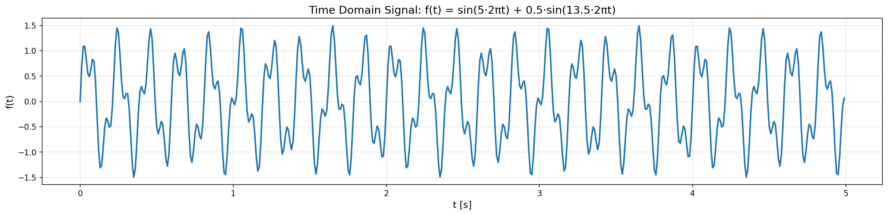
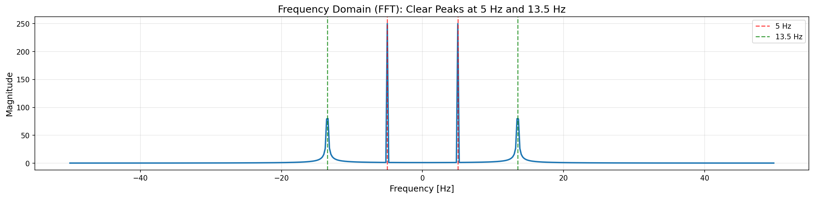
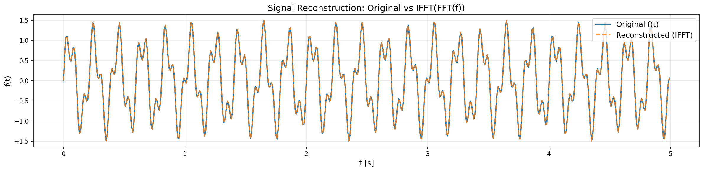
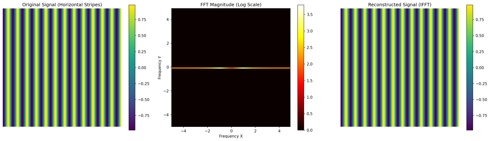
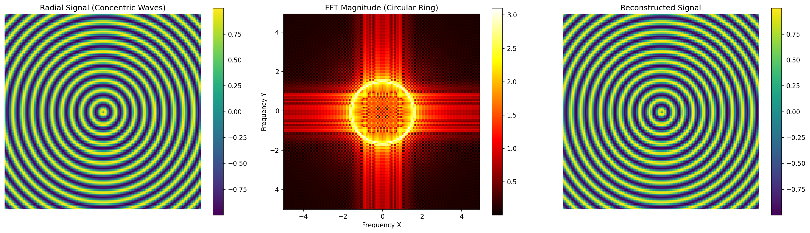
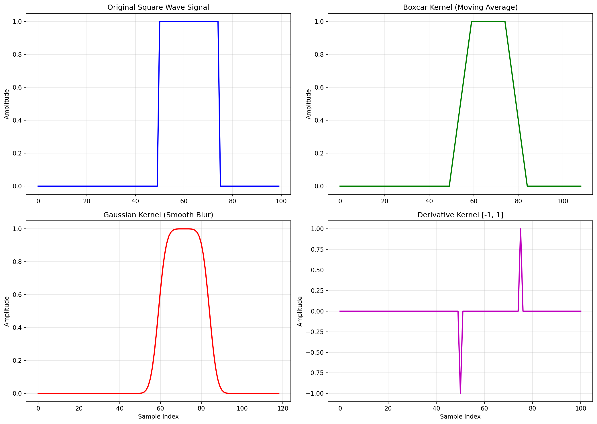
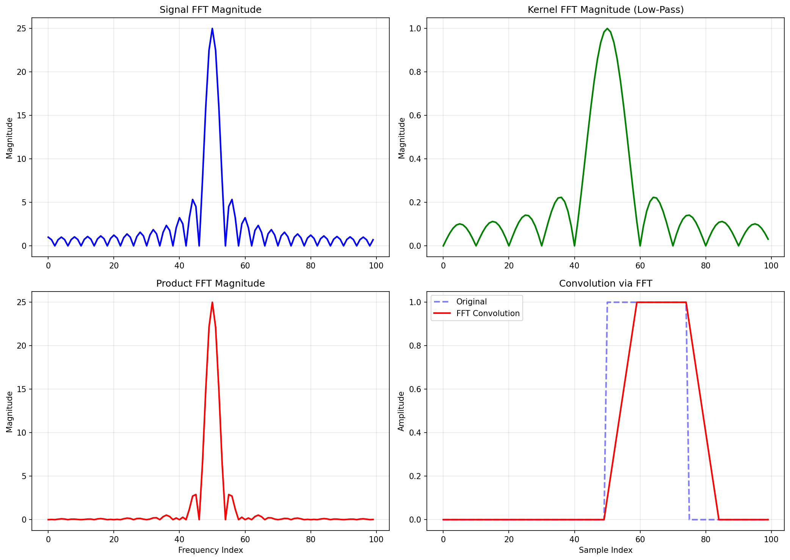
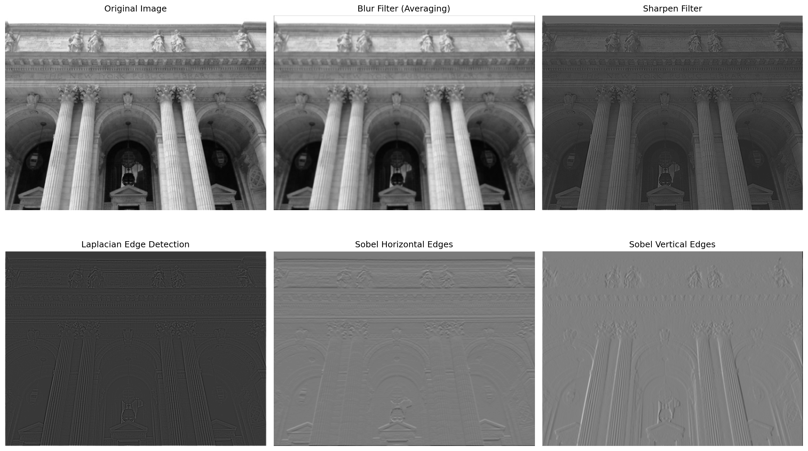
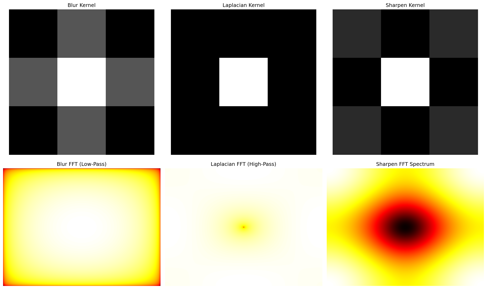

# LAB09 | Convolutions

# Chapter 1: Introduction to Convolutions and the Fourier Transform
## [00:00] Lab Overview: Convolutions and Neural Networks
In this lab and the next, we will tackle the topic of **convolutions**. Today, we will focus on the basics: how they are calculated and, most importantly, what their practical meaning is.
In the next lab, we will explore convolutions at a more advanced level. We will use the **JAX** library to implement convolutional neural networks (CNNs) and classify digits from the MNIST dataset, which we have used in the past. Thanks to this powerful tool, we will be able to achieve very high accuracy with reduced computational cost.
The main goal for today is to provide you with a practical understanding and a clear mental image of convolutions, beyond the theory seen in class.
## [00:48] The Practical Meaning of Convolutions
When I think of convolutions, the most useful image is that of a "sliding" action. Let's imagine we have:
*   A **kernel** (the blue square in the example).
*   A **signal** (the red line).
Convolutions work well, and almost exclusively, with **structured data** such as vectors, matrices, and tensors—that is, data with a well-defined matrix structure.
The operation consists of sliding the kernel along the entire signal. At each position, we multiply each element of the kernel by the corresponding element of the signal and sum all the results. This process is similar to a **moving average**.
For example, if we apply a kernel to a signal with a peak (spike), the result will be a "smoothed" version of the original signal, as if we were calculating a moving average over time.
### [01:40] 2D Convolutions and Padding Types
The operation can be extended to two dimensions (2D), as in the case of images. Here, the kernel (green) slides over a matrix (the blue signal). It is important to consider **padding**, which is the addition of values (usually zeros) to the borders of the signal. There are several types of padding:
1.  **Valid Padding**: No values are added. The kernel is applied only where it completely overlaps with the signal. As a result, the output dimension will be smaller than the input dimension.
2.  **Same Padding**: Values are added around the signal so that the output has the same dimension as the input.
3.  **Full Padding**: Many zeros are added around the signal to test the kernel in every possible position, even at the borders. This allows for the analysis of all possible interactions between the kernel and the signal, but it includes null information (the zeros) at the boundaries.
## [02:50] Tools for Calculating Convolutions
In this notebook, we will see some commands for calculating 1D and 2D convolutions, which we will also use in the upcoming exercises.
### [03:00] Toeplitz Matrices
The first tool is **Toeplitz matrices**. A Toeplitz matrix is a special matrix in which each diagonal (from left to right) contains constant values. The `scipy` library provides a function to create them.
This function accepts two arrays:
*   The first defines the initial values of each **row** (e.g., `[1, 2, 3]`).
*   The second defines the initial values of each **column** (e.g., `[1, 2, 5, 6]`).
Note: the first element is defined by both arrays. In case of a conflict (e.g., 1 and 9), the value from the first array prevails.
### [03:48] Circulant Matrices
**Circulant matrices** are a special case of square Toeplitz matrices. To define them, only a single array is needed, which determines the first column (e.g., `[1, 5, 3]`), from which the values of the first row and, consequently, the entire matrix can be derived.
We will use three methods to calculate the convolution:
1.  Toeplitz matrices.
2.  The direct definition.
3.  The Fast Fourier Transform (FFT).
## [04:15] The Fast Fourier Transform (FFT)
It is crucial to distinguish between:
*   **Discrete Fourier Transform (DFT)**: This is the mathematical operator that transforms a signal from the time (or space) domain to the frequency domain.
*   **Fast Fourier Transform (FFT)**: This is the practical **algorithm** that implements the DFT. Its discovery revolutionized computation, reducing the computational complexity to **O(n log n)**, a very low value for this type of algorithm. The FFT is ubiquitous in modern electronic devices.
### [05:15] The FFT in NumPy
The NumPy library offers a wide range of FFT functions:
*   `fft()`: Forward transform.
*   `ifft()`: Inverse transform. Applying `fft` and then `ifft` to a signal yields the original signal.
*   `fft2()` and `ifft2()`: Versions for 2-dimensional data.
*   Generalized versions for `n` dimensions.
*   Optimized implementations for signals with specific properties (real, Hermitian, etc.).
*   Helper functions that we will see shortly.
### [05:58] Practical Example: Signal Analysis
Let's consider a signal composed of the sum of two sinusoids with different frequencies: 5 Hz and 13.5 Hz. We sample this signal with a time interval `dt = 0.01` seconds, which corresponds to a sampling frequency of 100 Hz. This scenario is common in real-world applications, such as analyzing data from a sensor.
We define the signal and visualize it. By observing the plot, it is very difficult to distinguish the two component frequencies with the naked eye.
### [06:54] Applying the FFT
We apply the FFT to our signal `f` to get the result `F`. `F` is a vector of the same size as `f` (500 elements), but its values are **complex**.

```python
import numpy as np
import matplotlib.pyplot as plt

# Create signal: sum of two sinusoids
dt = 1e-2  # [s] - sampling interval
t = np.arange(0, 5, dt)  # 5 seconds
f = np.sin(5 * 2 * np.pi * t) + 0.5 * np.sin(13.5 * 2 * np.pi * t)

# Compute FFT
F = np.fft.fft(f)
freq = np.fft.fftfreq(len(t), d=dt)

# Reorder frequencies (shift zero frequency to center)
F_shift = np.fft.fftshift(F)
freq_shift = np.fft.fftshift(freq)

# Reconstruct signal with IFFT
f_reconstructed = np.fft.ifft(F)
f_reconstructed_real = np.real(f_reconstructed)
# Note: imaginary part is ~0 (numerical error ~1e-15)
```






This happens because the DFT performs a **change of basis** for the signal, moving from the spatial/temporal domain to the **frequency domain**. Unlike PCA, which performs a rotation, the FFT decomposes the signal into a basis of sines and cosines at different frequencies. Each element of the vector `F` represents the coefficient (the importance) of a specific frequency in the composition of the original signal.
### [07:44] Interpreting the FFT Frequencies
The vector `F` contains the coefficients, but we don't know which frequencies they correspond to. To find out, we use the helper function `fft.fftfreq()`, to which we pass the length of the signal (500) and the sampling interval (`dt`).
The result is an array of frequencies, but you will notice that they are **not sorted**: they start from zero, increase, and then become negative. This is the default order returned by the FFT algorithm.
### [08:20] Reordering Frequencies with `fftshift`
To make the result more readable, we use the `fft.fftshift()` function, which reorders the frequencies in ascending order (from -50 to +50 Hz in our case). This operation is not performed by default because it has an additional computational cost that may not always be necessary.
### [08:50] Visualizing the Frequency Spectrum
The vector `F` contains complex values, so we cannot plot it directly. Instead, we plot its **magnitude** (or absolute value).
The resulting graph shows two clear peaks, which correspond exactly to the two frequencies that make up our signal: one peak at **5 Hz** and a second peak at **13.5 Hz**. The FFT has allowed us to precisely identify the components of the original signal.
## [09:30] Returning to the Time Domain: The Inverse Transform
The FFT is useful for calculating convolutions because, in the frequency domain, a convolution becomes a simple **element-wise product**. The process will be:
1.  Transform the signals into the Fourier domain (with FFT).
2.  Perform the product.
3.  Return to the original domain (with the inverse transform, IFFT).
We apply the `ifft` to our transformed signal `F`. The result is still a vector of complex numbers. Why, if the original signal was real?
### [10:10] Handling Numerical Imprecision
The cause is the **numerical imprecision** inherent in floating-point calculations. However, if we analyze the values, we will notice that the imaginary part of each number is extremely small, comparable to machine epsilon. We can therefore consider the reconstructed signal as real, within a numerical tolerance.
To verify this, we extract the imaginary part of all values, calculate their absolute value, and find the maximum. The result is a number very close to zero, confirming our hypothesis.
### [11:00] Visual Confirmation
For a visual confirmation, we plot the real part of the reconstructed signal (orange) superimposed on the original signal (blue). The two graphs coincide perfectly.
## [11:20] 2D Convolutions
The process in 2D is analogous. We create a two-dimensional signal using `meshgrid`, as in previous labs.
We start with a signal that has frequency components only along the x-direction (vertical stripes).
1.  Calculate the 2D FFT (`fft2`).
2.  Reorder the frequencies with `fftshift`.
3.  Visualize the original signal, the magnitude of its transform, and the signal reconstructed via `ifft2`.
In the central graph (the frequency spectrum), we see two bright "blobs." These represent the positive and negative frequencies (+1 and -1) along the x-axis.
If we add a frequency component along the y-direction as well, we will see two "blobs" appear on the vertical axis too.
### [13:00] Example with Radial Frequencies
What happens if the signal is defined by `sin(10 * sqrt(x^2 + y^2))`? Since `x^2 + y^2` describes a circle, we expect to see a **circle** in the frequency domain.
Indeed, the original signal appears as concentric waves, and its frequency spectrum is a bright ring, representing all the radially distributed frequencies.
The `fftfreq` functions are also used here to determine the axis limits in the frequency spectrum plot by calculating the maximum frequencies along the x and y directions.

```python
# 2D FFT Examples

# Example 1: Horizontal stripes
x = np.arange(-2 * np.pi, 2 * np.pi, 0.1)
y = np.arange(-2 * np.pi, 2 * np.pi, 0.1)
xx, yy = np.meshgrid(x, y)
z = np.sin(2*np.pi*1*xx)  # Frequency only along x (vertical stripes)

# Compute 2D FFT
Z = np.fft.fft2(z)
Z_shift = np.fft.fftshift(Z)
z_reconstructed = np.fft.ifft2(Z)

# Example 2: Radial pattern
z_radial = np.sin(10 * np.sqrt(xx**2 + yy**2))
Z_radial = np.fft.fft2(z_radial)
Z_radial_shift = np.fft.fftshift(Z_radial)
```




# Chapter 2: Implementing 1D Convolutions
## [14:10] Practical Implementation of 1D Convolutions
We now move to the second notebook, dedicated to the practical implementation of 1D convolutions.
### [14:25] The Square Wave Signal
For our tests, we will use a very simple signal: a **square wave**. It is a signal that is 1 in a specific interval (between indices 50 and 75) and 0 elsewhere. Its simplicity will help us clearly understand the effect of different kernels.
### [14:50] The Role of Kernels in Convolutional Neural Networks
In this cell, several kernels are provided to test their action on the signal. This is a crucial point: in **convolutional neural networks (CNNs)**, the kernels are the parameters that the network **learns automatically** through gradient descent.
The idea is that the network learns on its own the most suitable kernels to extract the features useful for a given task. For example, a CNN trained to distinguish zebras from horses might learn a kernel that detects vertical stripes. The power of CNNs lies precisely in this ability for automatic learning, which also makes them more interpretable: by analyzing the learned kernels, we can understand what features the network is looking for.
### [15:55] Example: Moving Average Kernel
Let's go back to basics. The first kernel, `K1`, is a constant kernel. The sum of its elements is 1. Applying this kernel to the signal is equivalent to calculating a **moving average** (rolling average) with a 10-point window. The output will be a "smoothed" version of the original signal.
### [16:25] Exercise: Implementing Convolution
Now it's your turn. I'll give you 15 minutes to implement 1D convolution using two methods:
1.  Via **Toeplitz matrices**.
2.  Using the **direct definition** (with two nested `for` loops).
You can consult the slides for the formulas. I'll be here to help if you have any questions.
*(Dialogue between students and instructor during the exercise)*
# Chapter 3: Convolution via Toeplitz Matrices
## [00:00] The Basic Idea: Matrix-Vector Product
To perform a convolution between a signal and a kernel, we can use a special matrix called a **Toeplitz matrix**. The goal is to transform the convolution operation into a simple product between this matrix and the signal vector.
A Toeplitz matrix is characterized by having constant values along each of its diagonals. We leverage this property to simulate the sliding (or *shifting*) of the kernel along the signal.
Consider a signal `v = [v1, v2, v3, v4, v5, v6]` and a kernel `k = [k1, k2, k3]`. The convolution calculates the dot product between the kernel and successive portions of the signal.
To replicate this with a matrix, we construct the Toeplitz matrix `K` as follows:
1.  The first row of the matrix will contain the kernel `k` followed by zeros.
2.  Each subsequent row is a version of the previous row shifted one position to the right.
3.  Thanks to the constant-diagonal structure, the kernel "slides" along the rows of the matrix.
By multiplying the matrix `K` by the signal vector `v`, each element of the resulting vector will be the dot product between a row of `K` (which contains the kernel at a certain position) and the entire signal `v`. This is exactly equivalent to the convolution operation.
```
      [k1, k2, k3, 0,  0,  0]   [v1]
      [0,  k1, k2, k3, 0,  0]   [v2]
K * v = [0,  0,  k1, k2, k3, 0] * [v3]
      [0,  0,  0,  k1, k2, k3]   [v4]
      [...                   ]   [v5]
                                 [v6]
```
## [01:28] Implementation in Python
To implement this concept, we first need to define the correct dimensions for the matrix and vectors.
1.  **Kernel Padding**: The length of the signal resulting from the convolution is `length(signal) + length(kernel) - 1`. We create a new vector for the kernel (which we call `K\_padded`) of this dimension, initially filled with zeros.
2.  **Inserting the Kernel**: We copy the values of the original kernel to the beginning of `K\_padded`. This `K\_padded` vector will form the first column of our Toeplitz matrix.
3.  **Creating the Toeplitz Matrix**: Using a specific function from the `scipy.linalg` library (`toeplitz`), we can generate the entire matrix `K` starting from its first column (`K\_padded`) and its first row (which will be the first element of `K\_padded` followed by zeros).

```python
import numpy as np
from scipy.linalg import toeplitz, circulant

# Example of Toeplitz and Circulant matrices
T = toeplitz([1, 2, 3], [1, 2, 5, 6])
# Result:
# [[1, 2, 5, 6],
#  [2, 1, 2, 5],
#  [3, 2, 1, 2]]

C = circulant([1, 5, 3])
# Result:
# [[1, 3, 5],
#  [5, 1, 3],
#  [3, 5, 1]]

# Convolution using Toeplitz matrix
def convolve_toeplitz(signal_vec, kernel):
    n_signal = len(signal_vec)
    n_kernel = len(kernel)
    output_len = n_signal + n_kernel - 1
    
    # Pad kernel
    k_padded = np.zeros(output_len)
    k_padded[:n_kernel] = kernel
    
    # Create Toeplitz matrix
    first_row = np.zeros(n_signal)
    first_row[0] = k_padded[0]
    K = toeplitz(k_padded, first_row)
    
    # Convolve
    return K @ signal_vec

# Example with square wave
v = np.zeros(100)
v[50:75] = 1

k_boxcar = np.ones(10) / 10
v_conv = convolve_toeplitz(v, k_boxcar)
```
4.  **Calculating the Convolution**: Finally, we perform the matrix-vector product between `K` and the signal `v` to get the convolution result.
## [02:48] Analysis of Results and Kernel Types
By applying this technique to a step function signal, we can observe the effect of different kernels.
*   **Moving Average Kernel (Boxcar)**: A kernel with constant values (e.g., `[0.1, 0.1, ..., 0.1]`) calculates a moving average. As the kernel slides over the step, the output gradually increases, creating a smoothed ramp. The effect is a *smoothing* of sharp transitions.
*   **Gaussian Kernel**: A kernel whose values follow a Gaussian curve assigns greater weight to the central samples and less weight to those farther away. This produces an even more gradual and "natural" *smoothing* than the moving average, as the transition is gentler.
    *   *Note*: The `gaussian` function has been moved to the `scipy.signal.windows` module.
*   **Kernel for Derivative Calculation**: A kernel like `[1, -1]` (or its variants) is particularly interesting. Mathematically, it corresponds to a first-order finite difference stencil. Applying this kernel to a signal is equivalent to calculating its **first derivative**.
    *   On the step signal, the result is zero in the constant parts and a peak (an impulse) exactly at the point where the jump occurs, which represents the derivative of the step function.

```python
from scipy import signal

# Create square wave signal
v = np.zeros(100)
v[50:75] = 1

# Define different kernels
k_boxcar = np.ones(10) / 10
k_gaussian = signal.windows.gaussian(20, std=3)
k_gaussian = k_gaussian / np.sum(k_gaussian)
k_derivative = np.array([-1, 1])

# Apply convolutions
v_conv_boxcar = convolve_toeplitz(v, k_boxcar)
v_conv_gaussian = convolve_toeplitz(v, k_gaussian)
v_conv_derivative = convolve_toeplitz(v, k_derivative)
```


# Chapter 4: Convolution via Direct Definition
## [05:21] Implementation with Nested `for` Loops
Convolution can also be implemented by following its direct mathematical definition, which involves a summation. This translates into a nested `for` loop in code.
1.  **Initialization**: We create an output vector filled with zeros, of the appropriate size.
2.  **Outer Loop**: We iterate over each element `i` of the output vector.
3.  **Inner Loop**: For each `i`, we iterate over each element `j` of the kernel.
4.  **Calculation**: Inside the inner loop, we multiply the `j`-th element of the kernel (read backward) by the corresponding element of the signal and add it to the current value of the output `i`.
The formula is: `result[i] += kernel[end - j] * signal[i + j]`.
## [06:58] Differences in Padding
The implementation with the Toeplitz matrix and the one with the nested `for` loop can produce results of different lengths due to different handling of **padding** (the addition of zeros at the borders).
*   **Toeplitz Matrix ("Full" Padding)**: The matrix is constructed to handle the edges of the signal, where the kernel only partially overlaps. This implicitly uses zero padding, producing a longer output signal.
*   **Nested Loop ("Valid" Padding)**: In the direct implementation, if manual padding is not added to the signal, the convolution is calculated only where the kernel *completely* overlaps with the signal. This causes the output signal to be shorter, losing the initial and final parts of the transition.
## [08:28] Optimization: Vectorization
Nested `for` loops in Python are computationally inefficient. We can optimize the calculation by vectorizing the inner loop. For each element `i` of the output, the calculation can be rewritten as a single vector operation:
1.  **Flip the Kernel**: The order of the kernel elements is reversed (`np.flip(K)`).
2.  **Extract a Signal Subsection**: A portion of the signal `V` is selected, having the same length as the kernel, starting from index `i`.
3.  **Element-wise Product**: The element-wise product is performed between the flipped kernel and the signal subsection.
4.  **Sum**: All elements of the resulting vector are summed to get the final value for `output[i]`.
This operation is equivalent to a dot product (`np.dot`) between the two vectors. Although there is still an outer `for` loop, eliminating the inner loop makes the code much faster.

```python
# Direct convolution implementation (nested loops)
def convolve_direct(signal_vec, kernel):
    n_signal = len(signal_vec)
    n_kernel = len(kernel)
    output_len = n_signal + n_kernel - 1
    
    result = np.zeros(output_len)
    
    for i in range(output_len):
        for j in range(n_kernel):
            if 0 <= i - j < n_signal:
                result[i] += kernel[j] * signal_vec[i - j]
    
    return result

# Vectorized version using np.flip()
def convolve_vectorized(signal_vec, kernel):
    n_signal = len(signal_vec)
    n_kernel = len(kernel)
    output_len = n_signal + n_kernel - 1
    
    result = np.zeros(output_len)
    kernel_flipped = np.flip(kernel)
    
    # Pad signal for easier extraction
    signal_padded = np.pad(signal_vec, (n_kernel-1, n_kernel-1), mode='constant')
    
    for i in range(output_len):
        result[i] = np.dot(kernel_flipped, signal_padded[i:i+n_kernel])
    
    return result
```
# Chapter 5: Convolution in the Frequency Domain
## [09:54] The Convolution Theorem
The **Convolution Theorem** states that the convolution of two signals in the time domain is equivalent to the **element-wise product** of their Fourier transforms in the frequency domain.
`Fourier\_Transform(signal * kernel) = Fourier\_Transform(signal) ⋅ Fourier\_Transform(kernel)`
(*where `*` is convolution and `⋅` is the element-wise product*)
This provides us with a very efficient calculation method, especially for large signals and kernels.
## [10:27] Implementation with the Fast Fourier Transform (FFT)
The algorithm for calculating convolution using the Fast Fourier Transform (FFT) is as follows:
1.  **Signal Transform**: Calculate the FFT of the signal `V`.
2.  **Kernel Transform**: Calculate the FFT of the kernel `K`.
    *   **Dimension Problem**: The FFT of `V` and `K` will have different sizes. To perform the element-wise product, they must have the same length.
    *   **Solution**: Zero padding is applied to the kernel `K` to bring it to the same length as the signal `V` *before* calculating its FFT. The `fft` function allows specifying the desired output length, handling padding automatically and efficiently.
3.  **Product in the Frequency Domain**: Multiply the two resulting spectra, element by element.
4.  **Inverse Transform**: Calculate the Inverse Fast Fourier Transform (IFFT) of the product.
5.  **Real Part**: The result of the IFFT will be a complex number, but since the original signals were real, the imaginary part is due only to numerical errors. Therefore, only the real part of the result is extracted.
## [14:48] Analysis in the Frequency Domain
Visualizing the Fourier transforms of the signal, the kernel, and their product can provide valuable insights.
*   **Signal and Kernel Spectrum**: Shows which frequencies compose the signal and the kernel. For example, a step signal and a moving average kernel are both composed of a strong low-frequency component (the constant part) and many high-frequency components to create the sharp edges.
*   **Product Spectrum**: The product of the spectra shows how the kernel acts as a **filter**. For example, a blurring kernel (like a moving average or Gaussian) is a low-pass filter: its spectrum has high values for low frequencies and low values for high frequencies. Multiplying it by the signal's spectrum attenuates the high frequencies (responsible for details and sharp edges), resulting in a more blurred image.
This approach is very useful for designing and understanding the effect of filters.

```python
# FFT-based convolution
def convolve_fft(signal_vec, kernel):
    # Compute FFTs with same length
    V_fft = np.fft.fft(signal_vec)
    K_fft = np.fft.fft(kernel, n=len(signal_vec))
    
    # Element-wise product in frequency domain
    VK_fft = V_fft * K_fft
    
    # Inverse FFT and take real part
    result = np.real(np.fft.ifft(VK_fft))
    
    return result

# Example: analyze spectrum
v = np.zeros(100)
v[50:75] = 1
k_boxcar = np.ones(10) / 10

V_fft = np.fft.fft(v)
K_fft = np.fft.fft(k_boxcar, n=len(v))
VK_fft = V_fft * K_fft
v_conv_fft = np.real(np.fft.ifft(VK_fft))
```


## [17:00] Using Library Functions (`scipy.signal.convolve`)
Scientific libraries like SciPy offer optimized functions such as `signal.convolve`. This function requires the signal, the kernel, and a `mode` parameter that defines the type of padding to use:
*   `mode='full'`: Returns the complete convolution, equivalent to the Toeplitz matrix approach.
*   `mode='valid'`: Returns only the parts where the signal and kernel completely overlap.
*   `mode='same'`: Returns an output of the same size as the input signal, centering the result.
Changing the `mode` does not alter the central content of the resulting signal but modifies its length by trimming or keeping the parts at the edges.

```python
from scipy import signal

# Using scipy.signal.convolve with different modes
v = np.zeros(100)
v[50:75] = 1
k_boxcar = np.ones(10) / 10

v_conv_full = signal.convolve(v, k_boxcar, mode='full')   # length = 109
v_conv_valid = signal.convolve(v, k_boxcar, mode='valid') # length = 91
v_conv_same = signal.convolve(v, k_boxcar, mode='same')   # length = 100

print(f"Original length: {len(v)}")
print(f"Full mode: {len(v_conv_full)}")
print(f"Valid mode: {len(v_conv_valid)}")
print(f"Same mode: {len(v_conv_same)}")
```
# Chapter 6: 2D Convolution for Image Processing
## [18:45] Preparing the Image and 2D Kernels
The concept of convolution extends naturally to two dimensions for image processing. The image is our 2D signal, and the kernel is a small matrix.
1.  **Loading and Conversion**: The image is loaded and, for simplicity, converted to grayscale. The operations can be performed on a single channel (grayscale) or independently on each color channel (Red, Green, Blue).
2.  **Defining 2D Kernels**: Several 2D kernels are defined, each with a specific purpose:
    *   **Blurring**: A kernel that calculates a weighted average of neighboring pixels. For example, a 3x3 matrix with a higher central value and lower values around it. Since the sum of its elements is 1, the overall brightness of the image is preserved. The effect is to blend the pixels, reducing detail and noise.
    *   **Edge Detection**: Kernels designed to highlight areas with strong intensity variations (edges).
    *   **Sharpening**: Kernels that accentuate edges and details, making the image appear more "defined."
    *   **Random Kernel**: A kernel with random values, useful for observing unpredictable effects.
## [21:20] Implementing 2D Convolution
As in the 1D case, 2D convolution can be implemented in two main ways.
1.  **Direct Definition (Four `for` Loops)**:
    *   The direct implementation requires four nested loops: two to iterate over each pixel `(i, j)` of the output image and two to iterate over each element `(m, n)` of the kernel.
    *   For each output pixel, the weighted sum of neighboring pixels in the original image is calculated, using the kernel values as weights.
2.  **Frequency Domain (FFT2)**:
    *   The approach is identical to the 1D case, but using the 2D transform functions (`fft2` and `ifft2`).
    *   The FFT2 of the image and the kernel (after padding it to the same size as the image) is calculated.
    *   The 2D spectra are multiplied element-wise.
    *   The inverse IFFT2 of the result is calculated.
Analyzing the 2D spectrum of the kernel is particularly powerful for understanding how a filter acts on spatial frequencies (e.g., horizontal, vertical, or diagonal details).

```python
from matplotlib.image import imread
from scipy import signal

# Load image and convert to grayscale
v_img = np.mean(imread("NYlibrary.png"), axis=2)

# Define 2D kernels
kernel_blur = np.array([[1, 2, 1], [2, 4, 2], [1, 2, 1]])
kernel_blur = kernel_blur / np.sum(kernel_blur)

kernel_edge_laplacian = np.array([[-1, -1, -1], [-1, 8, -1], [-1, -1, -1]])
kernel_sharpen = np.array([[0, -1, 0], [-1, 5, -1], [0, -1, 0]])
kernel_sobel_horizontal = np.array([[1, 2, 1], [0, 0, 0], [-1, -2, -1]])
kernel_sobel_vertical = np.array([[1, 0, -1], [2, 0, -2], [1, 0, -1]])

# Apply 2D convolutions
v_blur = signal.convolve(v_img, kernel_blur, mode='same')
v_edge = signal.convolve(v_img, kernel_edge_laplacian, mode='same')
v_sharpen = signal.convolve(v_img, kernel_sharpen, mode='same')
v_sobel_h = signal.convolve(v_img, kernel_sobel_horizontal, mode='same')
v_sobel_v = signal.convolve(v_img, kernel_sobel_vertical, mode='same')
```




# Chapter 7: Manual 2D Convolution in Python
## [00:00] Introduction to the Manual Solution
Let's start by analyzing a possible solution for 2D convolution, beginning with a manual one, written from scratch. For simplicity, we define the dimensions of the image `B` and the kernel `K` as NumPy arrays. This allows us to perform arithmetic operations (addition, subtraction) on the dimensions very easily, applying them to both height and width simultaneously.
```python
# s1 represents the shape of the image B
s1 = np.array(b.shape) 
# s2 represents the shape of the kernel K
s2 = np.array(k.shape) 
```
Once the dimensions are defined, we can calculate the shape of the output. The formula is the same as for 1D convolution, but applied to both dimensions thanks to the use of NumPy arrays:
```python
# Calculation of the output shape
output\_shape = s1 - s2 + 1 
```
Next, we allocate memory for the output image, initializing it with zeros. This initialization is crucial if, as in this case, we accumulate the results manually within a loop.
```python
# Memory allocation for the result
v\_conv1 = np.zeros(output\_shape) 
```
**Note:** If we had used a vector sum function (as we will see later), we could have used `np.empty` instead of `np.zeros`, as zero-initialization would not have been necessary.
## [00:48] Implementation with Nested Loops
Now let's implement the actual convolution. For each pixel of the output image, we need to calculate the dot product between the kernel and the corresponding portion of the input image. This requires four nested `for` loops: two to iterate over the output pixels and two to iterate over the kernel elements.
```python
# Loops to iterate over the output image pixels
for i in range(output\_shape[0]):
    for j in range(output\_shape[1]):
        # Loops to iterate over the kernel elements
        for ki in range(s2[0]):
            for kj in range(s2[1]):
                # Convolution calculation
```
**Warning:** Using four nested loops in Python is extremely inefficient and, in a professional context, is almost always a sign that the approach is wrong. For educational purposes, however, it is useful for understanding the mechanism.
The core of the operation is the accumulation of the product between the kernel and image elements. Remember that convolution requires "flipping" the kernel. We do this by accessing the elements of kernel `K` with negative indices:
```python
v\_conv1[i, j] += k[-ki-1, -kj-1] * b[i+ki, j+kj]
```
Explanation of the flip:
- When `ki` is 0, `-ki-1` becomes `-1`, which in Python corresponds to the last element along that dimension.
- This effectively flips the kernel both horizontally and vertically, as required by the mathematical definition of convolution.
## [02:20] Optimization with NumPy Functions
We can significantly improve efficiency by eliminating the two inner loops. We leverage NumPy's `np.flip()` function, which can flip a matrix along both axes simultaneously, and element-wise multiplication.
The `np.flip()` function is perfect for this purpose. As the documentation states, if no axis is specified (`axis=None`), the function flips the array along all its axes. This is exactly what is needed for 2D convolution.
The operation for each output pixel `(i, j)` becomes:
```python
# Extract the image portion
sub\_image = b[i : i+s2[0], j : j+s2[1]] 
# Flip the kernel
flipped\_k = np.flip(k)
# Calculate the product and sum
v\_conv1[i, j] = np.sum(flipped\_k * sub\_image)
```
This approach is much more concise and performant, as NumPy's vector operations are implemented in C and optimized. The final result is a blurred image, where the kernel has acted as an averaging filter.

```python
# Manual 2D convolution implementation

# Method 1: Four nested loops (slow but educational)
def convolve2d_manual(image, kernel):
    s1 = np.array(image.shape)
    s2 = np.array(kernel.shape)
    output_shape = s1 - s2 + 1
    
    result = np.zeros(output_shape)
    
    for i in range(output_shape[0]):
        for j in range(output_shape[1]):
            for ki in range(s2[0]):
                for kj in range(s2[1]):
                    # Flip kernel with negative indexing
                    result[i, j] += kernel[-ki-1, -kj-1] * image[i+ki, j+kj]
    
    return result

# Method 2: Optimized with np.flip() (only 2 loops)
def convolve2d_optimized(image, kernel):
    s1 = np.array(image.shape)
    s2 = np.array(kernel.shape)
    output_shape = s1 - s2 + 1
    
    result = np.zeros(output_shape)
    flipped_k = np.flip(kernel)
    
    for i in range(output_shape[0]):
        for j in range(output_shape[1]):
            sub_image = image[i:i+s2[0], j:j+s2[1]]
            result[i, j] = np.sum(flipped_k * sub_image)
    
    return result
```
# Chapter 8: 2D Convolution in the Frequency Domain
## [04:08] The Convolution Theorem in 2D
An alternative and often more efficient method for calculating convolution is to use the Discrete Fourier Transform (DFT). The convolution theorem states that convolution in the spatial domain is equivalent to an element-wise multiplication in the frequency domain.
The steps are analogous to the 1D case, but using the 2D functions (`fft2` and `ifft2`):
1.  **Fourier Transform:** We calculate the 2D DFT of both the image (`v`) and the kernel (`k`).
    ```python
    v\_fft = np.fft.fft2(v)
    k\_fft = np.fft.fft2(k, s=v.shape) # Add padding to the kernel
    ```
    It is crucial to apply *padding* to the kernel to make it the same size as the image. This way, element-wise multiplication will be possible.
2.  **Multiplication in the Frequency Domain:** We multiply the two transforms.
    ```python
    vk\_fft = v\_fft * k\_fft
    ```
3.  **Inverse Fourier Transform:** We apply the 2D Inverse Fourier Transform (`ifft2`) to the result to return to the spatial domain.
    ```python
    v\_conv2 = np.fft.ifft2(vk\_fft)
    ```
## [05:35] Analysis of the Frequency Spectrum
Visualizing the frequency spectrum of the kernel provides valuable information about its behavior. For better visualization, a logarithmic scale is often applied, which allows for better distinction of amplitude variations between different frequencies.
**Low-Pass Filter:**
- **Kernel:** A blurring kernel (like a weighted average) has a frequency spectrum with high values at the center (low frequencies) and low values towards the outside (high frequencies).
- **Effect:** This type of filter "keeps" the low frequencies (areas of uniform color) and attenuates the high frequencies (sharp edges, details). The result is a softer, more blurred image. Edges, which represent rapid changes in intensity (high frequencies), are smoothed.
**High-Pass Filter:**
- **Kernel:** A kernel for edge detection (like the Laplacian filter) has an opposite spectrum: low values at the center and high values towards the outside.
- **Effect:** This filter removes low frequencies and preserves only high ones. The result is an image where only edges and details are highlighted, while uniform areas become dark.

```python
# 2D Convolution using FFT

def convolve2d_fft(image, kernel):
    # Compute 2D FFTs (pad kernel to image size)
    v_fft = np.fft.fft2(image)
    k_fft = np.fft.fft2(kernel, s=image.shape)
    
    # Element-wise product in frequency domain
    vk_fft = v_fft * k_fft
    
    # Inverse FFT and take real part
    result = np.real(np.fft.ifft2(vk_fft))
    
    return result

# Analyze kernel spectrum (log scale for visualization)
k_blur_fft = np.fft.fft2(kernel_blur, s=v_img.shape)
k_blur_fft_shift = np.fft.fftshift(k_blur_fft)

k_edge_fft = np.fft.fft2(kernel_edge_laplacian, s=v_img.shape)
k_edge_fft_shift = np.fft.fftshift(k_edge_fft)

# Log scale for better visualization
spectrum_blur = np.log10(np.abs(k_blur_fft_shift) + 1e-10)
spectrum_edge = np.log10(np.abs(k_edge_fft_shift) + 1e-10)
```
## [08:18] Examples of Kernels and Their Effects
Let's look at some specific kernels and their impact:
1.  **Averaging Kernel (Blur):**
    - **Definition:** A matrix of all `1`s, normalized by dividing by the number of elements.
    - **Effect:** Applies a simple average, blurring the image uniformly.
2.  **Laplacian Kernel (Edge Detection):**
    - **Definition:** A kernel with a positive value at the center (e.g., 4 or 8) and negative values (`-1`) around it. Mathematically, it is a discretization of the Laplacian differential operator.
    - **Spectrum:** It is a high-pass filter, with high values for high frequencies.
    - **Effect:** Detects edges in all directions, producing an image with highlighted contour lines on a uniform gray background.
3.  **Kernel for Horizontal/Vertical Edges:**
    - **Definition:** Kernels designed to detect edges in only one direction. For example, a filter for vertical edges will have non-zero values only in the side columns.
    - **Spectrum:** The frequency spectrum is no longer radially uniform but has "poles" (areas of high energy) only along one axis (the x-axis for vertical edges, the y-axis for horizontal ones).
    - **Effect:** Highlights only the contours oriented in the desired direction.
4.  **Sharpening Kernel:**
    - **Definition:** It is similar to the Laplacian filter but with a higher central value. For example, it can be seen as the sum of the Laplacian filter and an "identity kernel" (a `1` at the center and zeros elsewhere).
    - **Effect:** The operation is equivalent to taking the original image and adding its extracted edges to it. The result is an image that appears more defined and "sharper," as the contours have been reinforced.
# Chapter 9: Using Optimized Libraries
## [12:08] Convolution with SciPy
Scientific libraries like SciPy offer highly optimized functions to perform these operations. For convolution, we can use `signal.convolve`.
```python
from scipy import signal
# v: image, k: kernel
v\_conv3 = signal.convolve(v, k, mode='valid')
```
- **`v` and `k`:** The image and the kernel.
- **`mode='valid'`:** Specifies that the convolution should be calculated only where the image and kernel completely overlap. This corresponds to our manual calculation without padding.
This approach is simple, readable, and much faster than manual implementations.
## [12:45] Notes on Convolution in JAX (for Deep Learning)
In the context of deep learning and neural networks, convolution is a fundamental operation. Frameworks like JAX provide implementations for acceleration on GPUs/TPUs. However, JAX's low-level API (`jax.lax`) is much more complex and requires manual handling of many details.
**Complexity of the Low-Level API:**
To perform a convolution with `jax.lax.conv\_general\_dilated`, you need to:
1.  **Reshape the Kernel:** The 2D kernel must be expanded to a 4D tensor, adding dimensions for input and output channels: `(height, width, input\_channels, output\_channels)`.
2.  **Reshape the Input:** The input image must also be expanded to a 4D tensor, adding the *batch* dimension and the channel dimension: `(batch\_size, height, width, channels)`.
3.  **Calculate Padding Manually:** You must explicitly calculate the padding needed to maintain the output dimensions.
4.  **Specify Detailed Parameters:** You need to define the *stride* (the step with which the kernel moves over the image), the dimension order (e.g., `NHWC` for Batch, Height, Width, Channel), and other configuration parameters.
This level of detail, while powerful, makes the code verbose and complex. This is why in practice, high-level libraries (like Flax or Haiku, based on JAX) are used to abstract this complexity, allowing you to work with 2D or 3D tensors more intuitively.
The result obtained with JAX is identical to that of SciPy, apart from small numerical precision differences (JAX defaults to single precision, `float32`). This example serves to illustrate the complexity hidden "under the hood" of modern deep learning libraries.