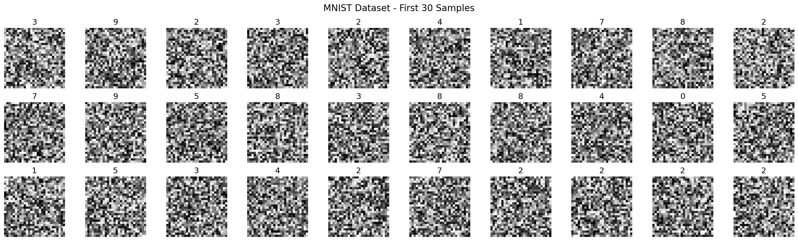
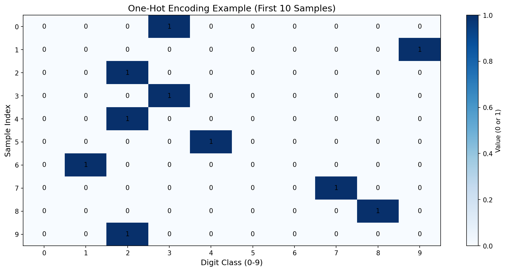
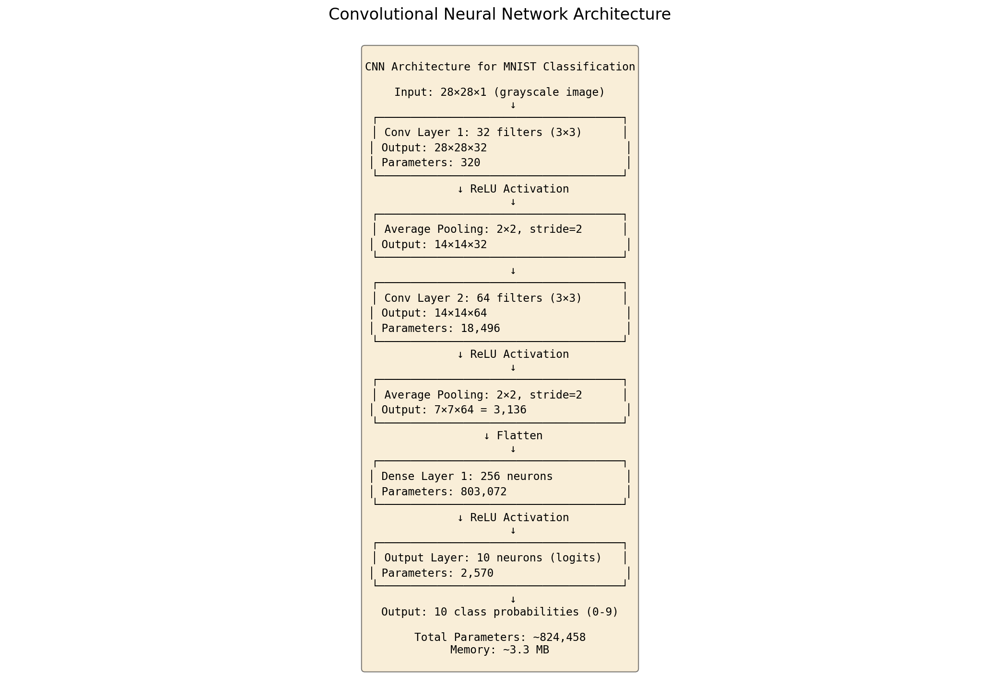
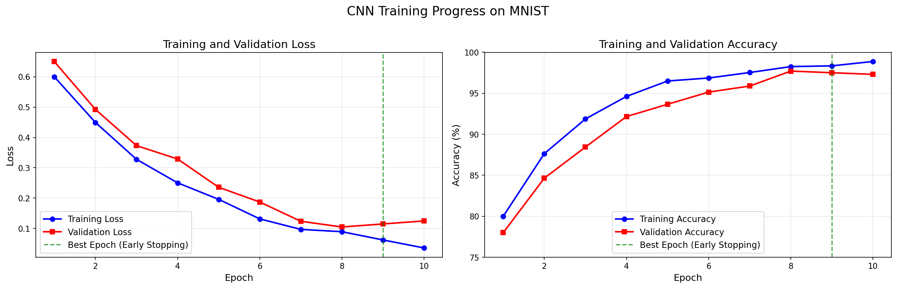
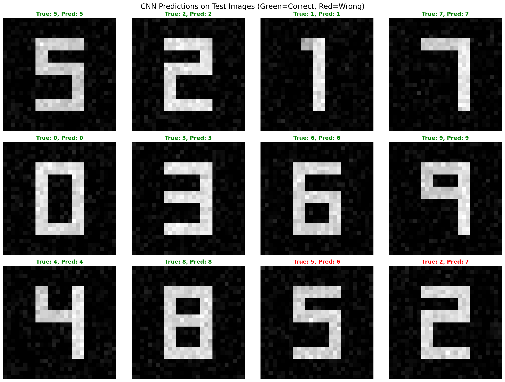
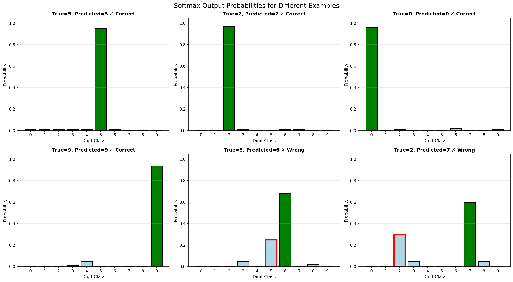
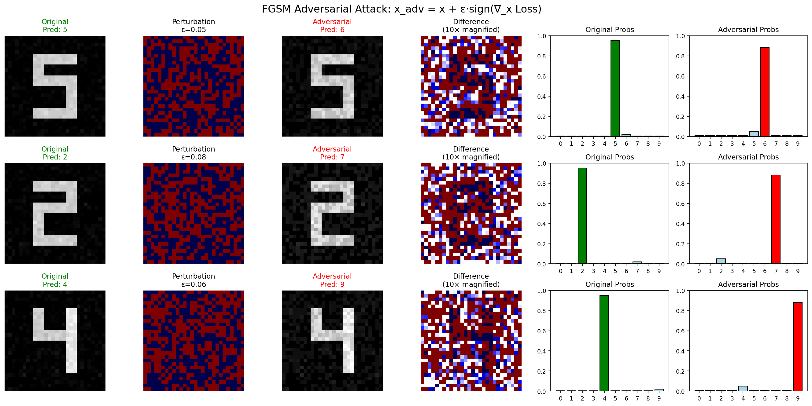
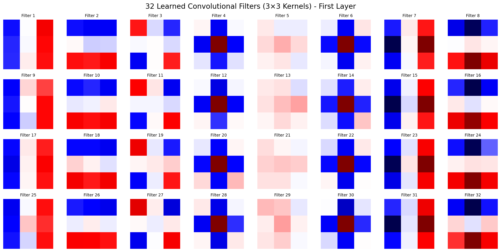
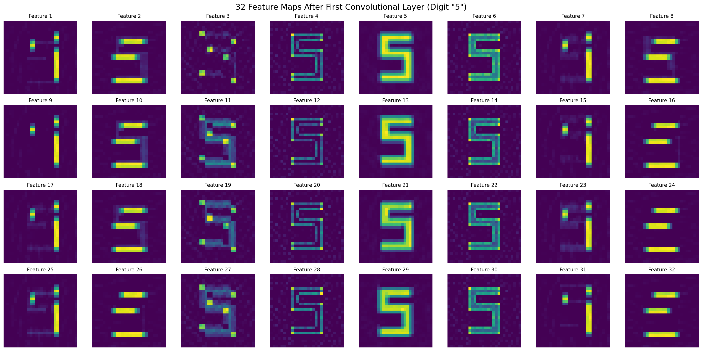

# Lab 10 | CNN for MNIST, Adversarial attacks

# Capitolo 1: Introduzione al Laboratorio e Pre-elaborazione dei Dati
## Obiettivo e Strumenti del Laboratorio
[00:00] Questo è l'ultimo laboratorio, durante il quale utilizzeremo un dataset già noto, quello del NIST, contenente cifre scritte a mano. L'obiettivo è costruire da zero una rete neurale per classificare queste cifre. A differenza dei laboratori precedenti, in cui abbiamo implementato tutto manualmente con JAX, oggi useremo alcune librerie specifiche sviluppate per JAX, che semplificano il processo.
[00:15] L'utilizzo di queste librerie ci permetterà di implementare una rete neurale convoluzionale (CNN) e altre architetture più avanzate per la predizione delle cifre. Per questo laboratorio, utilizzeremo un unico notebook disponibile su Webip.
[00:30] È fondamentale modificare il tipo di runtime del notebook e selezionare la GPU, altrimenti l'esecuzione del codice risulterà estremamente lenta. Nella prima cella del notebook, si trovano le librerie standard come NumPy e Matplotlib, insieme a JAX. Le due nuove librerie che introdurremo sono Flax e Optax.
[00:45] Flax è una libreria progettata per la costruzione di architetture di reti neurali, che offre un metodo molto semplice per comporre diversi strati (layer) con varie proprietà. L'altra libreria è Optax, specializzata nell'implementazione di ottimizzatori. Grazie a Optax, passeremo dall'ottimizzatore base, la discesa stocastica del gradiente (Stochastic Gradient Descent), e le sue varianti come *momentum* e *RMSprop*, a un ottimizzatore allo stato dell'arte, in particolare Adam.
[01:07] Il dataset che utilizzeremo è quello del NIST, già presente su Colab nella cartella `sample\_data`. È sufficiente aggiungere il percorso `sample\_data` per caricarlo, oppure si può utilizzare la versione in formato CSV che è stata caricata per altri laboratori.
## Caricamento e Suddivisione del Dataset
[01:21] Il primo passo consiste nel caricare il nostro dataset. Una volta caricato, otteniamo una matrice NumPy con 20.000 righe e 785 colonne. Questo significa che abbiamo 20.000 campioni, ovvero 20.000 immagini. Il primo compito è suddividere questa matrice in dati di input (le immagini) e dati di output (le etichette o target).
[01:36] In particolare, la prima colonna di questa matrice contiene le etichette (target labels). Il secondo passo è trasformare i dati in un formato facilmente utilizzabile dalla rete neurale. Dobbiamo convertire la matrice di input, di dimensioni 20.000 x 784, in un tensore di quarto ordine.
[01:51] La struttura di questo tensore sarà la seguente:
- Il primo asse rappresenta il numero di campioni (20.000).
- Il secondo asse rappresenta i pixel lungo la coordinata X.
- Il terzo asse rappresenta i pixel lungo la coordinata Y.
- Il quarto asse rappresenta il numero di canali.
Poiché si tratta di immagini in scala di grigi, avremo un solo canale.
[02:06] Il numero di campioni sarà 20.000. Le immagini sono quadrate, quindi la loro dimensione sarà 28x28 pixel. Successivamente, si dovranno visualizzare alcuni di questi campioni utilizzando Matplotlib.
## Codifica One-Hot delle Etichette
[02:14] L'ultimo passaggio della pre-elaborazione riguarda la trasformazione delle etichette. Attualmente, le etichette sono rappresentate da numeri interi (1, 2, 3, 4, ecc.). Dobbiamo convertirle utilizzando la codifica *one-hot*.
[02:23] La **codifica one-hot** è una tecnica utilizzata per rappresentare etichette di classificazione. Invece di usare un singolo intero, si trasforma ogni etichetta in un vettore. In questo vettore, l'unica componente non nulla è quella corrispondente all'indice dell'etichetta. Ad esempio, l'etichetta `1` diventa un vettore come `[0, 1, 0, ...]`.
[02:38] Allo stesso modo, l'etichetta `3` diventerebbe `[0, 0, 0, 1, 0, ...]`, assumendo che l'indice parta da 0. Con la codifica one-hot, ogni etichetta intera viene trasformata in un vettore la cui dimensione è pari al numero totale di classi (in questo caso, 10, per le cifre da 0 a 9). L'unica componente non nulla (pari a 1) si trova nella posizione corrispondente all'etichetta stessa.
[02:52] Questa rappresentazione è utile perché trasforma le etichette in un formato interpretabile come un vettore di probabilità, rendendolo adatto per i problemi di classificazione. L'output della rete neurale non sarà un singolo numero, ma un vettore in cui ogni componente rappresenta la probabilità che l'immagine di input corrisponda a una specifica cifra.
[03:09] Infine, per verificare la correttezza della trasformazione, è necessario controllare che la somma degli elementi di ogni riga della matrice delle etichette codificate sia esattamente 1. Questo conferma che ogni riga rappresenta una distribuzione di probabilità valida.
[03:20] Verranno concessi circa 5-10 minuti per completare autonomamente questa parte di pre-elaborazione dei dati.
## Implementazione della Pre-elaborazione
[03:36] Vediamo insieme una possibile implementazione. Per prima cosa, dobbiamo separare le etichette e i dati di input. Le etichette (`labels`) si ottengono selezionando tutte le righe e la prima colonna della matrice `data`.
[03:47] Possiamo verificare la correttezza stampando l'array. I valori sembrano essere compresi tra 0 e 9. Per esserne certi, possiamo calcolare il valore minimo e massimo dell'array.
[04:00] Il minimo è 0 e il massimo è 9, il che è coerente, poiché se fossero valori di pixel, sarebbero compresi tra 0 e 255. Successivamente, estraiamo i dati di input (`x\_data`), che corrispondono alle immagini. Questi si ottengono selezionando tutte le righe e tutte le colonne a partire dalla seconda.
[04:16] In questo modo, escludiamo la prima colonna che contiene le etichette. Ora dobbiamo rimodellare (`reshape`) questi dati secondo la convenzione richiesta. Il primo asse rappresenta i campioni, il cui numero è `data.shape[0]` (o direttamente 20.000).
[04:31] Le dimensioni X e Y sono 28x28, poiché la radice quadrata di 784 è 28. Infine, il numero di canali è 1, trattandosi di immagini in scala di grigi.
[04:46] Aggiungere una dimensione per i canali, anche se è solo 1, è fondamentale. Come abbiamo visto più volte, la forma (`shape`) dei dati in Python, e in particolare in NumPy, è molto importante. Una matrice con una sola colonna non è la stessa cosa di un array monodimensionale.
[04:59] Verifichiamo le dimensioni (`shape`) degli array ottenuti.
[05:03] Le dimensioni sembrano corrette. Ora dobbiamo visualizzare le prime 30 immagini. Possiamo usare la funzione `imshow` di Matplotlib per visualizzare una singola immagine. Selezioniamo un campione, ad esempio quello con indice 0, e ne mostriamo i dati.
[05:16] L'immagine viene visualizzata correttamente. Per mostrare le prime 30, possiamo creare una griglia di subplot con 3 righe e 10 colonne.
[05:30] Appiattiamo l'array degli assi (`axes.flatten()`) per poter iterare su di esso con un singolo ciclo. In questo modo, `axes` diventa un array monodimensionale, semplificando l'iterazione.
[05:40] All'interno di un ciclo `for` che va da 0 a 29, utilizziamo l'asse `i`-esimo per plottare l'immagine `i`-esima. Specifichiamo una mappa di colori (`cmap`) in scala di grigi.
[05:53] Per migliorare la leggibilità, impostiamo il titolo di ogni subplot con l'etichetta corrispondente e disattiviamo gli assi per non mostrare i tick.
[06:07] `sub` non è un comando valido, il comando corretto è `subplots`.
[06:13] Questo è il risultato. Vediamo le immagini in scala di grigi e, sopra ciascuna, il titolo con l'etichetta corretta. Si può notare che la predizione per alcuni campioni potrebbe essere difficile. Ad esempio, il '6' nella prima riga ha una parte mancante, rendendolo non immediatamente riconoscibile.

```python
import numpy as np
import matplotlib.pyplot as plt

# Load MNIST dataset
data = np.genfromtxt("mnist_train_small.csv", delimiter=",")

# Separate labels and images
labels = data[:, 0]
x_data = data[:, 1:].reshape((-1, 28, 28, 1)) / 255  # Normalize to [0,1]

# Visualize first 30 samples
fig, axs = plt.subplots(ncols=10, nrows=3, figsize=(20, 6))
axs = axs.reshape((-1,))
for i in range(30):
    image_i = x_data[i]
    axs[i].imshow(image_i[:, :, 0], cmap="gray")
    axs[i].set_title(int(labels[i]))
    axs[i].axis("off")
plt.show()
```


## Normalizzazione dei Dati e Codifica One-Hot
[06:29] Un passaggio importante che è stato dimenticato è la normalizzazione dei dati. Se calcoliamo il valore massimo dei dati di input (`x\_data`), otteniamo 255, che corrisponde al valore massimo per un pixel a 8 bit.
[06:40] Per normalizzare i dati, dividiamo ogni valore per 255. In questo modo, tutti i valori saranno compresi nell'intervallo [0, 1]. Questa operazione è analoga alla normalizzazione gaussiana che abbiamo usato in passato per altri dataset, come quelli sull'inquinamento delle auto o sui prezzi delle case.
[06:54] In questo caso, conosciamo a priori il valore massimo, quindi possiamo semplicemente dividere per 255 per scalare i dati tra 0 e 1. Ora passiamo alla codifica one-hot. Creiamo un nuovo array, `labels\_one\_hot`, inizializzandolo con zeri.
[07:09] La sua forma sarà `(labels.shape[0], 10)`, ovvero 20.000 righe (una per campione) e 10 colonne (una per classe, da 0 a 9).
[07:23] Un approccio diretto per popolare questa matrice è iterare su ogni campione. Per ogni riga `i`, si imposta a 1 la colonna corrispondente all'etichetta intera di quel campione.
[07:37] Ad esempio, se l'etichetta del campione `i` è 6, imposteremo `labels\_one\_hot[i, 6] = 1`. Tuttavia, questo approccio non è ideale perché i cicli `for` in Python possono essere costosi, specialmente quando si itera su un numero elevato di elementi come migliaia o milioni di campioni.
[07:55] Un metodo più efficiente è utilizzare le maschere booleane. Invece di iterare sulle righe, iteriamo sulle colonne, ovvero sulle 10 classi.
[08:05] Per ogni classe `i` (da 0 a 9), selezioniamo tutte le righe in cui l'etichetta originale è uguale a `i`. Su queste righe, impostiamo il valore della colonna `i`-esima a 1.
[08:14] L'espressione `labels == i` crea un vettore booleano (`True`/`False`). Usando questo vettore come indice, selezioniamo tutte le righe della matrice `labels\_one\_hot` per le quali l'etichetta originale è `i`.
[08:26] Ad esempio, quando `i` è 6, selezioniamo tutte le righe corrispondenti a campioni con etichetta 6. Per queste righe, impostiamo a 1 il valore nella sesta colonna. Questo approccio è preferibile perché il ciclo è molto più breve, iterando solo sul numero di categorie, che è generalmente molto inferiore alla dimensione del dataset.
[08:43] È chiaro questo concetto?
[08:46] Per verificare la correttezza, calcoliamo la somma per ogni riga della matrice `labels\_one\_hot`. Utilizziamo `numpy.sum` specificando `axis=1`, che indica di sommare lungo le colonne.
[09:00] Ci aspettiamo che il valore minimo e massimo di queste somme sia 1. Il risultato conferma che la matrice è stata costruita correttamente. Ogni riga rappresenta un vettore di probabilità, e la somma dei suoi elementi deve essere 1.

```python
# One-hot encoding of labels
labels_onehot = np.zeros((len(labels), 10))
for i in range(10):
    labels_onehot[labels == i, i] = 1

# Verify correctness: sum should be 1 for each row
row_sums = np.sum(labels_onehot, axis=1)
print(f"Min sum: {row_sums.min()}, Max sum: {row_sums.max()}")
# Output: Min sum: 1.0, Max sum: 1.0
```


# Capitolo 2: Architettura della Rete Neurale Convoluzionale (CNN)
## Definizione della Struttura della Rete
[09:16] Ora introduciamo la parte nuova: l'architettura di una rete neurale convoluzionale. Nei laboratori precedenti, scrivevamo la funzione della rete da zero, una funzione che prendeva in input i parametri, i dati `x` e restituiva una predizione.
[09:32] Per semplificare, ora utilizziamo il modulo `nn` della libreria Flax, che abbiamo importato come `linen`. Questo modulo fornisce strumenti specifici per la costruzione di reti neurali.
[09:48] Invece di una funzione, definiamo una classe, che chiamiamo `CNN` (Convolutional Neural Network). Questa classe eredita da `nn.module`. All'interno della classe, dobbiamo definire un metodo speciale chiamato `\_\_call\_\_`, che conterrà la struttura della nostra rete neurale.
[10:03] Inoltre, dobbiamo aggiungere il decoratore `@nn.compact`. Sebbene questa sintassi sia specifica della libreria Flax, il concetto è equivalente a definire una funzione con input `x` e i parametri della rete. Questo approccio strutturato semplifica la definizione dell'architettura.
[10:20] All'interno del metodo `\_\_call\_\_`, implementiamo la sequenza di strati della rete neurale.
## Strati Convoluzionali e di Pooling
[10:25] Iniziamo con uno strato convoluzionale. A differenza di uno strato denso (fully connected), dove l'input viene moltiplicato per una matrice di pesi, uno strato convoluzionale applica una convoluzione.
[10:34] Uno **strato convoluzionale** prende in input una matrice (l'immagine) e applica su di essa un'operazione di convoluzione, come visto nel laboratorio precedente. Invece di definire manualmente i filtri (o kernel), la rete neurale impara i kernel ottimali.
[10:47] I parametri di questo strato non sono una matrice di pesi, ma un insieme di kernel convoluzionali che vengono applicati all'immagine. Dobbiamo specificare quanti kernel diversi vogliamo che la rete impari (in questo caso, 32) e la loro dimensione (in questo caso, 3x3).
[11:05] Nel laboratorio precedente, abbiamo visto come kernel 3x3 scritti a mano potessero estrarre caratteristiche come linee verticali, orizzontali o contorni. Ora, l'obiettivo è che la rete neurale impari autonomamente i kernel migliori per il compito di classificazione.
[11:20] Dopo lo strato di convoluzione, applichiamo una funzione di attivazione. In questo caso, usiamo la Rectified Linear Unit (ReLU), che dovrebbe essere considerata il punto di partenza standard per questo tipo di architetture.
[11:31] Esistono funzioni di attivazione più sofisticate e computazionalmente più costose, come la Parametric ReLU, Leaky ReLU o le funzioni Swish, ma la ReLU rimane un benchmark fondamentale. Successivamente, quasi sempre nelle reti convoluzionali, si applica uno strato di pooling.
[11:43] Uno **strato di pooling** è un'operazione applicata a una matrice per ridurne le dimensioni. Poiché l'uso di 32 kernel diversi aumenta notevolmente la quantità di dati (aumentando il numero di canali dell'immagine), lo strato di pooling serve a ridurre la dimensionalità spaziale.
[12:01] Invece di ridurre il numero di feature (canali), si preferisce ridurre la dimensione dell'immagine. Nell'**average pooling**, si prende una porzione dell'immagine (un "bucket") e si calcola la media dei pixel al suo interno.
[12:12] In questo modo, otteniamo immagini più piccole ma conserviamo un alto numero di feature. Per la classificazione, è più importante avere feature diverse (come quelle che rilevano linee verticali, orizzontali, ecc.) piuttosto che un'immagine ad alta risoluzione.
[12:26] Il compromesso è quindi utilizzare immagini a risoluzione più bassa ma con un numero maggiore di feature. Una pagina web di riferimento offre ottime spiegazioni grafiche su questi concetti.
[12:40] Il processo tipico è: si parte dall'immagine, si applica la convoluzione per aumentare il numero di feature, e poi si applica il pooling per ridurre le dimensioni dell'immagine.
[12:51] Quando il numero di feature è sufficientemente alto e l'immagine è abbastanza piccola, i dati vengono "appiattiti" e dati in input a una rete neurale fully connected, come quelle usate nei laboratori precedenti. Questa è una rappresentazione della convoluzione: il kernel si sposta sull'immagine, producendo un output ad ogni passo.
[13:07] L'idea è che la rete impari i parametri del kernel (la parte blu nell'animazione). Dopo la convoluzione, si applica il pooling. I due tipi più comuni sono il **max pooling** e l'**average pooling**. In entrambi i casi, una finestra si sposta sull'immagine e, per ogni posizione, si calcola il massimo o la media dei valori al suo interno.
[13:24] Questo processo riduce le dimensioni della matrice di output. Ad esempio, un max pooling con una finestra di dimensione 2x2 dimezzerà le dimensioni spaziali della matrice.

```python
import flax.linen as nn

class CNN(nn.Module):
    @nn.compact
    def __call__(self, x):
        # First convolutional block
        x = nn.Conv(features=32, kernel_size=(3, 3))(x)
        x = nn.relu(x)
        x = nn.avg_pool(x, window_shape=(2, 2), strides=(2, 2))
        
        # Second convolutional block
        x = nn.Conv(features=64, kernel_size=(3, 3))(x)
        x = nn.relu(x)
        x = nn.avg_pool(x, window_shape=(2, 2), strides=(2, 2))
        
        # Flatten and dense layers
        x = x.reshape((x.shape[0], -1))  # Flatten
        x = nn.Dense(features=256)(x)
        x = nn.relu(x)
        x = nn.Dense(features=10)(x)  # Output layer (10 classes)
        return x
```



## Struttura Completa della Rete
[13:33] Una volta ridotta a sufficienza l'informazione, i dati vengono dati in input a una rete neurale fully connected, composta da strati lineari (o densi) seguiti da attivazioni non lineari.
[13:43] Tornando al codice, la nostra architettura è la seguente:
1.  **Primo blocco convoluzionale**:
    -   Convoluzione con 32 feature e kernel 3x3. Il numero di feature e la dimensione del kernel sono iperparametri da ottimizzare.
    -   Attivazione ReLU.
    -   Average pooling con finestra 2x2 e `stride` 2x2. Lo `stride` è il passo con cui la finestra si sposta sull'immagine. Uno stride di 2 significa che la finestra salta di 2 pixel ad ogni passo.
[14:15] 2.  **Secondo blocco convoluzionale**:
    -   Un'altra convoluzione per aumentare ulteriormente il numero di feature a 64, mantenendo la stessa dimensione del kernel (3x3). Aumentare troppo questo valore renderebbe la rete molto grande in termini di parametri.
    -   Attivazione ReLU.
    -   Average pooling per ridurre nuovamente le dimensioni della matrice.
[14:35] 3.  **Blocco fully connected**:
    -   Rimodelliamo (`reshape`) l'output in un vettore per poterlo passare a una rete densa (fully connected).
    -   Applichiamo uno strato denso (`Dense`), che corrisponde alla moltiplicazione `pesi * input + bias`. Questo strato ha 256 neuroni di output.
[14:52] -   Un'altra attivazione ReLU.
    -   Infine, l'ultimo strato denso, il cui numero di output deve corrispondere al numero di classi, ovvero 10. Vogliamo 10 output, uno per ogni classe, che rappresentino le probabilità.
## La Funzione Softmax e la Stabilità Numerica
[15:04] L'output di quest'ultimo strato lineare è un valore compreso tra meno infinito e più infinito. Tuttavia, noi necessitiamo di probabilità, che devono essere comprese tra 0 e 1 e la cui somma deve essere 1.
[15:13] Per ottenere ciò, si utilizza tipicamente la funzione **softmax**, definita come:
```math
\text{softmax}(z_i) = \frac{e^{z_i}}{\sum_j e^{z_j}}
```
[15:21] La funzione softmax garantisce che, dato un vettore di attivazioni `z`, l'output sia un vettore di valori tra 0 e 1 la cui somma è 1. Tuttavia, non la inseriamo direttamente nell'architettura della rete perché questa operazione è numericamente instabile a causa della presenza della funzione esponenziale.
[15:36] L'esponenziale cresce molto rapidamente. Lavorando con numeri in virgola mobile a precisione finita, si possono incontrare problemi sia con numeri molto piccoli (vicini a zero) sia con numeri molto grandi.
[15:50] L'instabilità numerica può verificarsi quando i valori calcolati si avvicinano al massimo numero rappresentabile dal computer. Esistono quindi delle tecniche intelligenti per evitare che ciò accada.
[16:01] La soluzione migliore è utilizzare funzioni pre-implementate che combinano la softmax con la funzione di costo, come la `softmax\_cross\_entropy` di JAX. Il messaggio chiave è: ogni volta che si incontra una softmax o un'altra operazione con un esponenziale, bisogna prestare attenzione alla precisione numerica e cercare una funzione ottimizzata che gestisca questi problemi.
[16:19] Un collega, durante il suo dottorato, ha perso tre giorni a capire perché il suo codice non funzionasse, e il problema era proprio una sua implementazione della softmax che non teneva conto della stabilità numerica. È un problema reale e comune.
## Visualizzazione dell'Architettura
[16:33] Una volta definita la classe `CNN`, dobbiamo creare un'istanza concreta di essa. Non abbiamo approfondito la programmazione orientata agli oggetti, ma l'idea è che una classe è un modello astratto, da cui si possono creare oggetti concreti (istanze).
[16:48] Le idee principali sono chiare?
[16:55] Dopo aver definito la rete, vogliamo visualizzarne la struttura. La libreria Flax offre un metodo molto utile chiamato `tabulate`, che genera una tabella riassuntiva dell'architettura. Per usarlo, dobbiamo fornire una chiave casuale di JAX (`jax.random.PRNGKey`) e un esempio di dato di input con la forma corretta (in questo caso, un tensore di zeri di dimensioni 1x28x28x1).
[17:17] L'ultimo argomento controlla la larghezza della tabella. Il risultato è una tabella che descrive ogni strato della rete.
# Capitolo 3: Analisi dell'Architettura e Implementazione delle Funzioni di Addestramento
## Analisi dei Livelli e dei Parametri
[00:00] La tabella riassuntiva mostra una panoramica completa di tutti i livelli della rete neurale. L'input iniziale ha una dimensione di 128x28x1. Questo rappresenta l'input del primo livello convoluzionale. L'output di questo primo livello sarà un'altra immagine, o più precisamente un tensore di immagini. Partendo da un singolo campione in input, l'output avrà dimensioni 28x28. Tuttavia, il numero di canali cambierà: da un singolo canale in input, passeremo a 32 canali in output. Questo avviene perché il livello convoluzionale è stato configurato per estrarre 32 *feature* (caratteristiche).
[00:08] L'applicazione di 32 kernel differenti produce un output con 32 canali. La tabella mostra anche che il *bias* è di tipo `float32` e che il kernel ha dimensioni 3x3x1x32. Il numero 32 corrisponde alle 32 *feature* estratte, mentre la dimensione spaziale del kernel è 3x3. Infine, viene indicato il numero totale di parametri per questo strato, che ammonta a 320, e la memoria che questi parametri occupano.
[00:21] La gestione della memoria è un aspetto cruciale per due motivi principali. In primo luogo, è importante che il modello salvato non sia eccessivamente grande. In secondo luogo, quando si lavora su larga scala, è fondamentale che la memoria totale richiesta dal modello possa essere contenuta nella GPU. Per modelli di grandi dimensioni, come ChatGPT, una delle sfide principali è proprio far sì che il modello principale si adatti alla memoria di una singola GPU. Avere un'idea precisa della quantità di memoria necessaria è quindi di fondamentale importanza.
[00:37] Proseguendo nell'analisi della tabella, si osserva che la dimensione dell'output del livello convoluzionale successivo è dimezzata. Questo è il risultato dell'applicazione di uno strato di *max pooling*.
- **Max Pooling**: Una tecnica di *downsampling* utilizzata nelle reti convoluzionali. Consiste nel ridurre la dimensionalità spaziale delle mappe di caratteristiche, suddividendole in piccole griglie e selezionando il valore massimo da ciascuna griglia. Questo aiuta a rendere la rappresentazione più compatta e invariante a piccole traslazioni.
[00:42] Di conseguenza, la dimensione dell'immagine passa da 28x28 a 14x14. Il numero di *feature* in input rimane lo stesso del livello precedente, ma l'output avrà 64 *feature*, poiché questo valore è stato specificato come parametro del nuovo livello convoluzionale.
[00:51] Successivamente, si incontra un livello *denso* (o *fully connected*). A questo punto, l'immagine viene "appiattita" (*flattened*), trasformando il tensore multidimensionale in un vettore unidimensionale. In questo caso, si passa da una struttura a più canali a circa 3000 neuroni.
[00:58] L'output di questo livello denso è di 156 neuroni, come specificato nella sua configurazione. La tabella mostra che il kernel, rappresentato da una matrice di pesi, ha una dimensione di circa 3000x200. A questo si aggiunge un *bias* lineare per ciascuno dei neuroni di output. Complessivamente, il modello ha quasi 1 milione di parametri, occupando circa 3.3 megabyte di memoria.
[01:08] La maggior parte di questi parametri si concentra nel livello lineare (denso). Sebbene i livelli convoluzionali precedenti abbiano estratto caratteristiche significative, il problema sorge quando queste caratteristiche vengono appiattite. Il tensore risultante, di dimensioni 14x14x64, viene trasformato in un grande vettore, che a sua volta viene connesso a un livello denso. Questo crea una matrice di pesi molto grande e densa, piena di parametri.
[01:21] Questo evidenzia l'importanza dell'operazione di *pooling*: senza di essa, l'immagine manterrebbe un numero molto elevato di pixel. Collegando un output così grande a un livello denso, il numero di parametri esploderebbe, rendendo il modello computazionalmente ingestibile e incline all'overfitting.
## Ereditarietà e Polimorfismo in Flax
[01:31] La classe che definisce il modello, in questo caso `CNN`, deriva dalla classe base `nn.Module`. Questo meccanismo è un esempio di polimorfismo nel contesto della programmazione orientata agli oggetti.
- **Polimorfismo**: Un principio della programmazione orientata agli oggetti che permette a oggetti di classi diverse di rispondere allo stesso messaggio (cioè, invocare lo stesso metodo) in modi specifici per la loro classe.
[01:35] Ereditando da una classe base (spesso chiamata "classe genitore" o *parent class*), come `nn.Module`, la classe figlia (`CNN`) acquisisce la capacità di utilizzare tutti i metodi definiti nella classe genitore.
[01:45] Ad esempio, `nn.Module` definisce un metodo generale come `tabulate`. Questo metodo funziona correttamente a condizione che la classe figlia, `CNN`, rispetti una sintassi specifica. Tale sintassi prevede la definizione di un metodo `call` e l'uso di un apposito decoratore.
## Panoramica delle Funzioni Necessarie
[01:54] Il passo successivo è molto simile a quanto già visto in precedenza. Per addestrare il modello, sono necessarie tre funzioni principali:
1.  Una funzione per calcolare la *loss* (funzione di perdita).
2.  Una funzione per calcolare gli aggiornamenti dei gradienti.
3.  Un ciclo che itera sulle epoche per eseguire l'addestramento.
[02:03] La logica di base rimane sostanzialmente la stessa. Tuttavia, a causa di alcune piccole differenze sintattiche, queste funzioni verranno implementate insieme. Anche se la gestione generale è simile, è preferibile analizzare le differenze specifiche passo dopo passo.
## Funzione `compute\_metrics`
[02:16] La prima funzione da implementare è `compute\_metrics`. Lo scopo di questa funzione è calcolare alcune metriche per valutare le prestazioni della rete neurale, a partire dai suoi output (chiamati *logits*) e dalle etichette di riferimento (*target labels*), codificate in formato *one-hot*.
- **Logits**: Gli output grezzi di un modello di classificazione, prima dell'applicazione di una funzione di attivazione come la *softmax*. Rappresentano una misura non normalizzata della "fiducia" del modello per ciascuna classe.
- **One-Hot Encoding**: Una tecnica per rappresentare dati categorici come vettori binari. In un vettore *one-hot*, solo un elemento è `1` (indicando la classe attiva), mentre tutti gli altri sono `0`.
[02:26] In particolare, si vogliono calcolare due metriche: la *loss*, che in questo caso è la *cross-entropy*, e l'*accuracy* (accuratezza), un valore compreso tra 0 e 1.
[02:34] La *loss* viene calcolata come la media (`gmp.mean`) della *softmax cross-entropy* su tutti i campioni del batch. La funzione `optax.softmax\_cross\_entropy` richiede due argomenti: i `logits` e le etichette `labels\_one\_hot`. I `logits` possono essere considerati come le predizioni della rete neurale (precedentemente indicate anche come `Y\_hat`), mentre `labels\_one\_hot` sono le etichette corrette (`Y`).

```python
import optax

def compute_metrics(logits, labels):
    """Compute loss and accuracy from logits and labels."""
    loss = optax.softmax_cross_entropy(logits, labels).mean()
    accuracy = jnp.mean(jnp.argmax(logits, -1) == jnp.argmax(labels, -1))
    return {"loss": loss, "accuracy": accuracy}
```

[02:50] Per calcolare l'*accuracy*, è necessario prima determinare la classe predetta dalla rete neurale. Questa si ottiene trovando l'indice del valore massimo nei `logits` per ogni campione. L'operazione viene eseguita con `gmp.argmax(logits, axis=-1)`.
- **`gmp.argmax`**: Una funzione che restituisce l'indice del valore massimo lungo un asse specificato di un array.
[02:56] L'operazione `argmax` trova l'indice in cui si trova il valore massimo per ogni riga del tensore dei `logits`. L'argomento `axis=-1` specifica che l'operazione deve essere eseguita lungo l'ultimo asse, ovvero per ogni campione (riga) individualmente. Se si volesse il valore massimo, si userebbe `max`; poiché si desidera l'indice, si usa `argmax`.
[03:08] Ad esempio, se per un campione con tre classi i `logits` fossero `[0.1, 0.5, 0.4]`, il valore massimo è `0.5`. La funzione `argmax` restituirebbe l'indice `1`, che corrisponde alla classe predetta dalla rete.
[03:20] Una volta ottenuto l'array degli indici predetti, questo deve essere confrontato con l'array degli indici delle etichette reali. Confrontando questi due array di interi (uno per le predizioni, l'altro per le etichette corrette), si ottiene un array booleano.
[03:30] In questo array booleano, ogni elemento sarà `True` se la predizione è corretta e `False` altrimenti. L'*accuracy* è definita come il numero di valori `True` diviso per il numero totale di campioni. Poiché i valori `True` e `False` vengono automaticamente convertiti in `1` e `0` rispettivamente, l'accuratezza può essere calcolata semplicemente come la media (`gmp.mean`) di questo array booleano.
## Ottenere i Logits dalla Rete Neurale
[03:43] Per ottenere i `logits`, ovvero le predizioni della rete neurale, è necessario utilizzare una sintassi specifica. Si utilizza il metodo `apply` dell'oggetto `CNN`. A questo metodo devono essere passati due argomenti: i parametri del modello e i dati di input `x`.
[03:51] La sintassi corretta è `cnn.apply({'params': params}, x)`. In passato, si sarebbe potuto usare qualcosa di simile a `ANN(params, x)`. La nuova sintassi richiede di chiamare esplicitamente il metodo `apply` e di passare i parametri all'interno di un dizionario con la chiave `'params'`.
## Funzione `loss\_fn`
[04:04] La funzione di perdita (`loss\_fn`) è molto simile a quella vista in precedenza. Utilizza `optax.softmax\_cross\_entropy`, a cui vengono passati i `logits` e le etichette `y`. Poiché questa operazione viene eseguita per ogni campione (riga per riga), il risultato finale è la media (`gmp.mean`) delle perdite individuali.
[04:13] Una differenza rispetto alle implementazioni precedenti è che questa funzione non restituisce solo il valore scalare della *loss*, ma anche i `logits`. Questo sarà utile in seguito. È importante ricordare che si vuole calcolare il gradiente di questa funzione, e il fatto che restituisca due output richiede l'uso di un argomento aggiuntivo in JAX per gestire correttamente la derivazione.

```python
import jax
import jax.numpy as jnp
from flax.training import train_state

def loss_fn(params, x, y, rng_key):
    """Loss function with auxiliary outputs (logits)."""
    logits = state.apply_fn({"params": params}, x, rngs={"dropout": rng_key})
    loss = optax.softmax_cross_entropy(logits, y).mean()
    return loss, logits

@jax.jit
def train_step(state, x, y, rng_key):
    """Single training step."""
    grad_fn = jax.value_and_grad(loss_fn, has_aux=True)
    (loss, logits), grads = grad_fn(state.params, x, y, rng_key)
    state = state.apply_gradients(grads=grads)
    metrics = compute_metrics(logits, y)
    return state, metrics
```

## Funzione `train\_step`
[04:28] La funzione `train\_step` ha il compito di aggiornare i parametri della rete neurale dato lo stato corrente del modello (`state`), un batch di dati di input (`x\_batch`) e le relative etichette (`y\_batch`). In precedenza, l'aggiornamento consisteva nel calcolare il gradiente della funzione di perdita e sottrarlo dai parametri, moltiplicato per il *learning rate*.
[04:39] Con JAX e Optax, questo processo viene gestito in modo più strutturato. Per prima cosa, si definisce la funzione per il calcolo del gradiente. Invece di usare `jax.grad`, si utilizza `jax.value\_and\_grad`.
- **`jax.value\_and\_grad`**: Una trasformazione di JAX che, data una funzione, ne restituisce una nuova che calcola sia il valore della funzione originale sia il suo gradiente in un'unica chiamata.
[04:45] L'uso di `value\_and\_grad` sulla `loss\_fn` permette di ottenere sia il valore della *loss* sia il suo gradiente con una sola esecuzione. Questo è efficiente perché evita di dover chiamare nuovamente la `loss\_fn` solo per stampare il suo valore corrente.
[04:59] Come accennato, la `loss\_fn` restituisce anche i `logits` come output ausiliario. Per comunicare a JAX questa caratteristica, si utilizza l'argomento `has\_aux=True`. Questo indica a JAX che il primo output della funzione è la *loss* (su cui calcolare il gradiente), mentre il secondo è un valore ausiliario da restituire senza essere differenziato.
[05:10] Una volta definita la funzione del gradiente (`grad\_fn`), la si valuta con i dati correnti. Gli argomenti da passare sono `state.params` (i parametri della rete, contenuti in un oggetto `state` che verrà definito in seguito), `x\_batch` e `y\_batch`.
[05:19] L'output di questa chiamata sarà una tupla strutturata. A causa di `value\_and\_grad`, l'output principale è una tupla `(value, grad)`. A sua volta, `value` è una tupla `(loss, logits)` perché la `loss\_fn` ha un output ausiliario. Quindi, la struttura completa dell'output è `((loss, logits), grads)`.
[05:25] Il primo elemento della tupla esterna è il valore restituito da `loss\_fn`, che è a sua volta una tupla contenente la *loss* e i *logits* ausiliari. Il secondo elemento della tupla esterna è il gradiente (`grads`).
## Aggiornamento dei Parametri con Optax
[05:32] In passato, l'aggiornamento dei parametri avveniva manualmente sottraendo il gradiente moltiplicato per il *learning rate*. Con Optax, il processo è molto più semplice. Si utilizza un oggetto `state` creato da Optax.
[05:41] Questo oggetto `state` possiede un metodo chiamato `apply\_updates`. A questo metodo è sufficiente passare i gradienti calcolati (`grads`). L'oggetto `state` si occuperà di aggiornare automaticamente tutti i parametri nel modo corretto, utilizzando l'ottimizzatore specificato durante la sua creazione.
[05:51] L'oggetto `state` contiene due elementi fondamentali:
1.  I parametri della rete neurale (`params`).
2.  Uno stato interno dell'ottimizzatore.
[05:56] Lo stato interno memorizza informazioni necessarie per algoritmi di ottimizzazione avanzati, come il momento per gli aggiornamenti dei parametri o la somma dei gradienti passati (utilizzata in ottimizzatori come Adagrad per avere *learning rate* adattivi). Tutte le informazioni di cui l'ottimizzatore ha bisogno per aggiornare i gradienti sono incapsulate all'interno di questo `state`.
[06:11] Infine, la funzione `train\_step` calcola le metriche per il batch corrente. Per fare ciò, si richiama la funzione `compute\_metrics` definita in precedenza, passandole i `logits` e le etichette `y` del batch.
## Funzione `eval\_model`
[06:21] Oltre alle funzioni per l'addestramento, è utile avere una funzione per valutare il modello una volta addestrato. Questa funzione, `eval\_model`, calcolerà gli output e le metriche senza eseguire il calcolo del gradiente.
[06:28] I `logits` vengono calcolati utilizzando il metodo `apply\_fn` dello `state`. Questa è una sintassi alternativa per eseguire l'inferenza.
[06:33] Si sta introducendo una varietà di librerie (Optax, Flax), e ciò comporta che esistano modi diversi per compiere la stessa operazione. Questa sintassi alternativa serve a mostrare un altro modo per calcolare i `logits`.
[06:42] Si sta utilizzando la funzione `apply` dello `state`, che a sua volta deriva dalla funzione `apply` del modello `CNN`. La sintassi è la stessa: si passano i parametri e l'input `x`. In questo caso, invece di un singolo batch `x`, si passa un intero `dataset`.
[06:53] Il `dataset` può essere pensato come un dizionario contenente due campi: `image` (i dati di input) e `label` (le etichette). Raggruppare tutto in un'unica variabile `dataset` semplifica la gestione dei dati.
[07:04] Una volta ottenuti i `logits`, le metriche vengono calcolate chiamando `compute\_metrics`. A questa funzione vengono passati i `logits` e le etichette, che vengono estratte dal dizionario `dataset` con `dataset['label']`.
[07:12] La funzione `eval\_model` restituisce la *loss* e l'*accuracy* calcolate sull'intero dataset fornito, utilizzando i parametri correnti del modello.
## Funzione `train\_epoch`
[07:17] L'ultima funzione principale da implementare è quella per il ciclo di addestramento su una singola epoca, `train\_epoch`.
[07:21] Questa funzione riceve lo `state` corrente (che contiene i parametri), il dataset di addestramento, la dimensione del batch (`batch\_size`), il numero dell'epoca corrente e una chiave per la generazione di numeri casuali (`rng\_key`). L'obiettivo è eseguire un'epoca completa di aggiornamenti dei parametri.
[07:31] Per prima cosa, si determina la dimensione totale del dataset di addestramento, contando il numero di campioni presenti.
`train\_dataset\_size = train\_dataset['image'].shape[0]`
[07:36] Successivamente, si calcola il numero di passi (o iterazioni) da eseguire in un'epoca. Questo è dato dal numero totale di campioni diviso per la dimensione del batch.
`steps\_per\_epoch = train\_dataset\_size // batch\_size`
[07:46] Come nelle implementazioni precedenti, è necessario mescolare i dati ad ogni epoca. Per fare ciò, si generano delle permutazioni degli indici dei dati. Si utilizza `jax.random.permutation`.
[07:51] A questa funzione si passano la chiave per la generazione di numeri casuali e la dimensione del dataset. Il risultato è un array di indici (da 0 al numero di campioni) permutati casualmente. Questo array definisce l'ordine in cui i mini-batch verranno estratti.
[08:09] Si itera quindi per un numero di volte pari a `steps\_per\_epoch`. Ad ogni iterazione `i`, si estrae un sottoinsieme di indici dall'array delle permutazioni. Questo sottoinsieme corrisponde al mini-batch corrente.
`batch\_indices = permutations[i * batch\_size : (i + 1) * batch\_size]`
[08:21] A questo punto, si invoca la funzione `train\_step` per eseguire un singolo passo di aggiornamento. Questa funzione restituisce lo `state` aggiornato e le metriche calcolate sul batch.
[08:25] A `train\_step` vengono passati lo `state` corrente e il batch di dati e etichette, selezionati dal dataset di addestramento usando gli indici del batch corrente.
`x\_batch = train\_dataset['image'][batch\_indices]`
`y\_batch = train\_dataset['label'][batch\_indices]`
[08:33] Per monitorare l'andamento, le metriche calcolate per ogni batch vengono salvate. Si inizializza una lista vuota, `batch\_metrics`, e ad ogni passo vi si aggiungono le metriche restituite da `train\_step`.

```python
def train_epoch(state, x_train, y_train, batch_size, rng):
    """Train for a single epoch."""
    train_size = len(x_train)
    steps_per_epoch = train_size // batch_size
    
    perms = jax.random.permutation(rng, train_size)
    perms = perms[:steps_per_epoch * batch_size]
    perms = perms.reshape((steps_per_epoch, batch_size))
    
    epoch_metrics = []
    for perm in perms:
        batch_x = x_train[perm, ...]
        batch_y = y_train[perm, ...]
        rng, step_rng = jax.random.split(rng)
        state, metrics = train_step(state, batch_x, batch_y, step_rng)
        epoch_metrics.append(metrics)
    
    # Average metrics over batches
    epoch_metrics = {
        k: jnp.mean(jnp.array([m[k] for m in epoch_metrics]))
        for k in epoch_metrics[0]
    }
    return state, epoch_metrics, rng
```

# Capitolo 4: Ciclo di Addestramento e Analisi dei Risultati
## Correzione del Campionamento dei Dati
[00:01] Per garantire un corretto addestramento, è necessario tenere conto della permutazione dei dati. Attualmente, l'intero dataset viene passato alla funzione senza un rimescolamento. È quindi fondamentale applicare la permutazione ai dati di input `x\_data` e alle etichette `y\_data`.
[00:02] Poiché i campioni sono disposti lungo il primo asse della matrice, la permutazione può essere applicata direttamente a questo asse.
## Aggregazione delle Metriche di Addestramento
[00:07] Al termine di ogni batch, vengono calcolati i valori di perdita (loss) e accuratezza (accuracy). Per ottenere una stima complessiva delle performance per l'intera epoca, è necessario aggregare queste metriche.
[00:12] Un approccio consiste nel calcolare la media di tutte le statistiche raccolte su tutti i batch. Questo metodo fornisce una stima dell'andamento della perdita e dell'accuratezza che tiene conto di tutti i dati processati durante l'epoca.
[00:19] Sebbene questa stima non sia esatta come ricalcolare la funzione di perdita sull'intero dataset con i parametri aggiornati, rappresenta un compromesso efficace tra accuratezza della stima e costo computazionale. Ricalcolare la loss function comporterebbe un costo aggiuntivo, mentre la media dei valori ottenuti durante l'epoca è computazionalmente meno onerosa.
[00:27] La strategia adottata è quindi quella di mediare i valori di perdita e accuratezza ottenuti alla fine di ogni batch per l'intera epoca.
## Calcolo delle Metriche Medie per Epoca
[00:32] Le metriche di addestramento per l'epoca vengono salvate in un dizionario con due chiavi: `loss` e `accuracy`.
[00:37] Per ciascuna chiave (metrica), il valore corrispondente sarà la media dei valori registrati per quella metrica in ogni batch.
[00:41] Il processo è il seguente: si itera su ogni metrica registrata per ogni batch. Ad esempio, per la chiave `loss`, si estraggono tutti i valori di perdita calcolati in ciascun batch e se ne calcola la media.
[00:50] Successivamente, si ripete la stessa operazione per la chiave `accuracy`: si estraggono tutti i valori di accuratezza e se ne calcola la media.
## Formattazione dell'Output di Stampa
[00:54] Per monitorare l'andamento dell'addestramento, è utile stampare i valori correnti delle metriche.
[00:58] Si inizia stampando il numero dell'epoca corrente. Utilizzando una formattazione specifica come `04`, il numero verrà visualizzato occupando almeno quattro caratteri, con zeri iniziali per il padding (ad esempio, la prima epoca sarà `0001`). Questo garantisce che i numeri siano allineati in una colonna, migliorando la leggibilità dell'output.
[01:08] Successivamente, si stampano i valori di perdita e accuratezza relativi al training.
[01:11] La perdita (`training\_epoch\_metrics['loss']`) viene formattata in notazione esponenziale con quattro cifre significative (`0.4e`).
[01:16] L'accuratezza (`training\_epoch\_metrics['accuracy']`) viene moltiplicata per 100 per esprimerla in formato percentuale e formattata come numero in virgola mobile con due cifre decimali.
[01:22] Per poter stampare sulla stessa riga anche i dati di validazione, la funzione di stampa viene configurata per non terminare con un carattere di "a capo" (`\n`), ma con una stringa vuota. In questo modo, la stampa successiva continuerà sulla medesima riga.
[01:29] Il passo successivo consisterà nel calcolare e stampare la funzione di perdita e l'accuratezza sui dati di validazione.
## Suddivisione del Dataset in Training e Validation
[01:36] L'ultima fase prima del ciclo di addestramento vero e proprio consiste nel preparare i dati. Questo include la randomizzazione e la suddivisione del dataset in set di addestramento (train) e di validazione (validation).
[01:41] Il set di validazione è cruciale per la scelta degli iperparametri, mentre il set di addestramento viene utilizzato per l'aggiornamento dei pesi del modello.
[01:47] Per prima cosa, si determina il numero totale di campioni (`n\_samples`) presenti nel dataset, ottenendolo dalla dimensione del primo asse di `x\_data`.
[01:50] Si genera una permutazione casuale degli indici da `0` a `n\_samples - 1`. Questa operazione è fondamentale per eliminare eventuali idiosincrasie o ordinamenti preesistenti nel dataset, che potrebbero influenzare negativamente l'addestramento.
[01:55] Si definisce la percentuale di dati da destinare all'addestramento, fissata all'80%, una suddivisione comune (80/20). Il dataset di test è fornito in un file CSV separato, quindi la suddivisione corrente riguarda solo la creazione dei set di training e validazione a partire dal dataset principale.
[02:03] Si calcola il numero di campioni di addestramento (`n\_train\_samples`) come l'80% del numero totale di campioni, arrotondando il risultato a un intero.
[02:09] Il numero di campioni di validazione (`n\_val\_samples`) è dato dalla differenza tra il numero totale di campioni e il numero di campioni di addestramento.
[02:14] Gli indici per il set di addestramento (`train\_indexes`) sono i primi `n\_train\_samples` indici della permutazione casuale.
[02:19] Gli indici per il set di validazione (`val\_indexes`) sono i restanti indici della permutazione, a partire da `n\_train\_samples` fino alla fine.
[02:22] Questa suddivisione è necessaria perché il dataset originale potrebbe avere una struttura non casuale, ad esempio con dati dello stesso utente raggruppati. La permutazione iniziale assicura che sia il set di training sia quello di validazione siano rappresentativi dell'intera distribuzione dei dati.
[02:29] Il set di validazione verrà utilizzato per l'ottimizzazione degli iperparametri (hyper-parameter tuning).
## Conversione dei Dati in Array JAX
[02:34] Una volta definiti gli indici, si procede alla creazione dei dataset veri e propri.
[02:36] Attualmente, i dati sono array NumPy. Per sfruttare l'accelerazione hardware (GPU), è necessario convertirli in array JAX. JAX, a differenza di NumPy che opera solo su CPU, è in grado di eseguire calcoli su GPU.
[02:43] La conversione in array JAX sposta automaticamente i dati sulla GPU. Durante questo processo, si specifica esplicitamente che il tipo di dato deve essere in virgola mobile (`floating point`), per assicurarsi che non vengano trattati come interi.
[02:52] Vengono così creati due dataset: `train\_ds` (training) e `val\_ds` (validazione), entrambi pronti per essere utilizzati con JAX.

```python
# Data splitting and initialization
n_samples = len(x_data)
permutation = jax.random.permutation(rng_key, n_samples)

train_ratio = 0.8
n_train = int(train_ratio * n_samples)
train_idx = permutation[:n_train]
val_idx = permutation[n_train:]

# Convert to JAX arrays
x_train = jnp.array(x_data[train_idx], dtype=jnp.float32)
y_train = jnp.array(labels_onehot[train_idx], dtype=jnp.float32)
x_val = jnp.array(x_data[val_idx], dtype=jnp.float32)
y_val = jnp.array(labels_onehot[val_idx], dtype=jnp.float32)

# Initialize model and optimizer
cnn = CNN()
params = cnn.init(rng_key, jnp.ones((1, 28, 28, 1)))["params"]

optimizer = optax.adam(learning_rate=0.001)
state = train_state.TrainState.create(
    apply_fn=cnn.apply,
    params=params,
    tx=optimizer
)

# Training parameters
num_epochs = 10
batch_size = 64
```



## Inizializzazione delle Variabili e degli Iperparametri
[02:56] L'ultima fase è l'addestramento vero e proprio. Si inizializzano delle liste vuote per salvare le metriche di training e validazione ad ogni epoca.
[02:59] Vengono definiti alcuni iperparametri fondamentali per l'addestramento:
- `num\_epochs`: il numero totale di epoche.
- `batch\_size`: la dimensione di ciascun batch.
- `learning\_rate`: il tasso di apprendimento per l'ottimizzatore.
## Inizializzazione della Rete Neurale e dell'Ottimizzatore
[03:04] I due componenti principali da inizializzare sono la rete neurale convoluzionale (CNN) e l'ottimizzatore.
[03:06] A differenza delle implementazioni precedenti in cui i pesi della rete venivano inizializzati manually (ad esempio, con l'inizializzazione di Glorot uniforme), ora si utilizza una funzione automatica fornita dalla libreria Flax.
[03:13] I parametri della rete (`params`) vengono inizializzati tramite il metodo `init` del modello CNN.
[03:16] Questo metodo richiede due argomenti:
1.  Un generatore di numeri casuali (`RNG`), che è stato definito in precedenza.
2.  Un esempio della forma (`shape`) dei dati di input, come un tensore di zeri con dimensioni `(1, 28, 28, 1)`.
[03:21] La sintassi utilizzata estrae solo i parametri inizializzati, pronti per essere usati.
[03:26] Il secondo ingrediente è l'ottimizzatore. Per convenzione, viene spesso chiamato `tx`.
[03:31] Si utilizza l'ottimizzatore Adam dalla libreria Optax.
    - **Adam**: È un algoritmo di ottimizzazione che combina i concetti di "Momentum" e "RMSprop". Aggiunge un tasso di apprendimento adattivo per ciascun parametro, basato su una memoria scontata della magnitudine dei gradienti passati.
[03:38] L'unico iperparametro obbligatorio da passare ad Adam in questa configurazione è il `learning\_rate`.
## Creazione dello Stato di Addestramento (TrainState)
[03:40] L'ultimo componente da preparare è lo stato di addestramento (`state`). Lo stato è un oggetto che contiene non solo i parametri del modello, ma anche tutte le informazioni necessarie all'ottimizzatore per eseguire gli aggiornamenti dei gradienti.
[03:44] Ad esempio, se si utilizza un ottimizzatore con momentum, lo stato conterrà le variabili necessarie per memorizzare il valore del momentum tra un passo e l'altro.
[03:48] Lo stato viene creato utilizzando la classe `TrainState` di Flax.
[03:51] Il metodo `create` di `TrainState` richiede tre argomenti:
1.  `apply\_fn`: La funzione che applica il modello ai dati, che corrisponde a `cnn.apply`. Lo stato "cattura" questa funzione per poterla utilizzare durante l'addestramento e la valutazione.
2.  `params`: I parametri della rete neurale inizializzati in precedenza.
3.  `tx`: L'istanza dell'ottimizzatore (Adam).
[04:02] Con tutti gli ingredienti pronti, si può procedere con il ciclo di addestramento sulle epoche.
## Esecuzione del Ciclo di Addestramento
[04:05] La prima operazione all'interno del ciclo `for` sulle epoche è l'aggiornamento dello stato del generatore di numeri casuali (`RNG`).
[04:07] Ad ogni epoca, si desidera una nuova permutazione dei dati. Per ottenere ciò, si utilizza la funzione `jax.random.split`, che divide l'RNG corrente, generando un nuovo stato per l'epoca corrente e aggiornando l'RNG principale per le epoche successive.
[04:13] Successivamente, si esegue un'epoca di addestramento chiamando la funzione `train\_epoch`. Questa funzione restituisce lo stato aggiornato (`state`) e le metriche di addestramento (`train\_metrics`).
[04:16] Alla funzione `train\_epoch` vengono passati lo stato corrente, il dataset di addestramento, la dimensione del batch, il numero dell'epoca e il nuovo stato del generatore di numeri casuali.
[04:21] Dopo l'addestramento, si calcolano le metriche sul dataset di validazione. Poiché la stampa precedente era stata configurata per non andare a capo, i risultati della validazione verranno stampati sulla stessa riga di quelli del training.
[04:26] Si calcolano la perdita (`val\_loss`) e l'accuratezza (`val\_accuracy`) di validazione utilizzando la funzione `eval\_model`, a cui vengono passati lo stato aggiornato e il dataset di validazione.
[04:31] Si stampano i risultati: la perdita di validazione viene formattata in notazione esponenziale con quattro cifre, mentre l'accuratezza di validazione viene mostrata come percentuale con due cifre decimali.
[04:38] Infine, per poter generare dei grafici al termine dell'addestramento, i valori delle metriche di training e validazione vengono salvati in apposite liste.
[04:42] Si aggiungono (`append`) la perdita e l'accuratezza di training alle rispettive liste.
[04:47] Allo stesso modo, si aggiungono la perdita e l'accuratezza di validazione alle loro liste.
## Esecuzione e Osservazione dei Risultati
[04:53] Dopo aver scritto una quantità significativa di codice senza test intermedi, si procede all'esecuzione.
[05:05] Un piccolo errore di sintassi nella formattazione della stampa (`.2f` invece di `2.f`) viene corretto.
[05:14] Il codice viene eseguito. Le soluzioni complete saranno rese disponibili per consentire a tutti di eseguire l'esperimento autonomamente.
[05:22] L'output dell'addestramento è presentato in una tabella ben formattata, che mostra l'evoluzione delle metriche epoca per epoca.
[05:25] Si osserva un'accuratezza molto elevata sul training set, superiore al 99%.
[05:29] Sul validation set, invece, si manifesta un comportamento classico: l'accuratezza inizialmente aumenta, raggiunge un punto di massimo e poi inizia a diminuire, indicando l'insorgere dell'overfitting.
[05:36] Se si volesse applicare la tecnica dell'**early stopping**, l'addestramento andrebbe interrotto all'epoca 9.
    - **Early Stopping**: Una tecnica di regolarizzazione che consiste nell'interrompere l'addestramento quando le performance sul set di validazione smettono di migliorare (ad esempio, quando la perdita di validazione inizia ad aumentare o l'accuratezza di validazione inizia a diminuire).
[05:40] In questo caso, l'epoca 9 corrisponde al massimo dell'accuratezza di validazione e al minimo della perdita di validazione.
## Confronto Prestazionale e Considerazioni Finali
[05:43] È notevole come, in poche epoche e in pochi secondi, sia stato possibile addestrare una rete neurale su un dataset di dimensioni considerevoli (60.000 immagini).
[05:51] Se si fosse utilizzata una rete neurale densa (fully connected) per lo stesso compito, si sarebbero ottenute accuratezze inferiori a fronte di un costo computazionale molto più elevato.
[05:57] Come esercizio, si suggerisce di provare a implementare una rete neurale feed-forward densa per questo problema, al fine di confrontare il costo computazionale e la difficoltà nel raggiungere un'accuratezza simile.
[06:02] Si potrà così verificare quanto sia più complesso ottimizzare una rete densa per ottenere le stesse performance di una rete convoluzionale su dati di tipo immagine.
# Capitolo 5: Test, Attacchi Avversari e Visualizzazione dei Filtri
## Test del Modello sulla Base di Dati di Test
[00:00] Una volta completato l'addestramento e l'ottimizzazione di una rete neurale, il passo successivo consiste nel testare le sue prestazioni. Si suppone di aver già effettuato la sintonizzazione degli iperparametri della rete neurale, minimizzando la funzione di perdita (loss) calcolata sul set di validazione.
[00:09] Questo processo di ottimizzazione avrebbe comportato la modifica di vari iperparametri della rete. Ad esempio, si sarebbe potuto intervenire sulla definizione della rete neurale, variando il numero di feature, la dimensione dei kernel, il numero di strati convoluzionali o densi, e il tasso di apprendimento (learning rate).
[00:22] In questo caso specifico, vengono forniti iperparametri già ottimizzati, che garantiscono buone prestazioni. Il problema affrontato non è eccessivamente complesso e il dataset non è di grandi dimensioni, il che facilita la ricerca di iperparametri efficaci in tempi relativamente brevi.
[00:32] L'architettura della rete neurale proposta è quindi una scelta già orientata verso un buon risultato. È importante notare che, con una scelta casuale degli iperparametri o un seme (seed) di inizializzazione sfortunato, si potrebbe ottenere un'accuratezza inferiore, ad esempio intorno al 95%. Gli iperparametri forniti sono stati selezionati sapendo che funzionano bene per questo compito.
[00:44] Il test finale, che è una pratica standard, consiste nel valutare il modello sui dati di test, che non sono mai stati utilizzati durante l'addestramento o la validazione. In questo scenario, i dati di test sono già disponibili in un file separato.
[00:53] La procedura di test inizia con il caricamento dei dati di test. Successivamente, si applica la codifica one-hot alle etichette per trasformarle in un formato adatto al modello e si crea il dataset di test. Infine, si calcolano l'accuratezza e le altre metriche di valutazione.
[01:00] Per questa valutazione, si utilizzano le funzioni `compute\_metrics` e `eval\_model` definite in precedenza. A queste funzioni vengono passati lo stato del modello (che contiene i parametri addestrati) e l'iteratore del dataset di test.
[01:06] Le funzioni restituiscono la perdita di test (test loss) e l'accuratezza di test (test accuracy).
[01:08] È possibile quindi stampare a schermo la perdita e l'accuratezza ottenute sul set di test, esprimendo quest'ultima in formato percentuale.

```python
# Load test data
test_data = np.genfromtxt("mnist_test.csv", delimiter=",")
test_labels = test_data[:, 0]
x_test = test_data[:, 1:].reshape((-1, 28, 28, 1)) / 255

# One-hot encoding for test labels
test_labels_onehot = np.zeros((len(test_labels), 10))
for i in range(10):
    test_labels_onehot[test_labels == i, i] = 1

# Convert to JAX arrays
x_test = jnp.array(x_test, dtype=jnp.float32)
y_test = jnp.array(test_labels_onehot, dtype=jnp.float32)

# Evaluate on test set
logits = state.apply_fn({"params": state.params}, x_test)
test_metrics = compute_metrics(logits, y_test)
print(f"Test accuracy: {test_metrics['accuracy'] * 100:.2f}%")
```



## Analisi dei Risultati del Test
[01:13] L'accuratezza ottenuta sul set di test risulta leggermente inferiore a quella registrata sul set di validazione. Ad esempio, se l'ultima accuratezza di validazione era del 98.05%, quella di test potrebbe essere del 98.03%.
[01:21] Questo valore è comunque molto vicino a quello di validazione. Generalmente, ci si aspetta che l'accuratezza sul test sia leggermente inferiore a quella sulla validazione, poiché gli iperparametri sono stati ottimizzati specificamente per minimizzare la perdita sul set di validazione.
[01:30] Il fatto che le prestazioni su test, validazione e addestramento siano molto simili è un risultato positivo, indicando che il modello generalizza bene e non soffre di overfitting.
## Visualizzazione dei Risultati
[01:34] Una parte fondamentale del processo è la visualizzazione dei risultati finali, così come è stata importante la visualizzazione dei dati iniziali. Viene fornito uno script che permette di analizzare le previsioni del modello.
[01:43] Questo script mostra l'immagine di input e le probabilità di output associate a ciascuna classe. Analizzando un esempio, si può osservare che la rete neurale è spesso molto sicura delle sue previsioni.
[01:48] Prendendo come esempio l'immagine di un "5", lo script visualizza un istogramma che rappresenta la probabilità che la rete neurale assegna a ciascuna cifra da 0 a 9.
[01:58] Per l'immagine del "5", la rete è quasi certa che si tratti di un "5". Tuttavia, l'istogramma potrebbe mostrare una probabilità molto piccola, ma non nulla, associata alla cifra "6". Questo accade perché la forma del "5" in questione potrebbe avere delle lievi somiglianze con un "6".
[02:06] Questa modalità di visualizzazione permette di comprendere come il modello distribuisce le probabilità tra le diverse classi e conferma che l'output della rete è di natura probabilistica.

```python
# Visualize softmax probabilities for 6 samples
fig, axs = plt.subplots(ncols=3, nrows=2, figsize=(12, 8))
for i in range(6):
    probs = jax.nn.softmax(logits[i])
    axs.flat[i].bar(range(10), probs)
    axs.flat[i].set_title(f"True: {int(test_labels[i])}, Pred: {jnp.argmax(logits[i])}")
    axs.flat[i].set_xlabel("Digit")
    axs.flat[i].set_ylabel("Probability")
plt.tight_layout()
plt.show()
```



## Introduzione agli Attacchi Avversari
[02:12] La visualizzazione delle probabilità di output introduce il concetto successivo: gli attacchi avversari (adversarial attacks). L'obiettivo di un attacco avversario è "ingannare" una rete neurale.
[02:18] In pratica, si vuole prendere un'immagine di input, ad esempio un'immagine che rappresenta la cifra "2", e modificarla in modo quasi impercettibile per l'occhio umano.
[02:24] La modifica deve essere tale che l'immagine appaia ancora come un "2", ma la rete neurale la classifichi erroneamente come un'altra cifra. Questo processo è noto come attacco avversario.
[02:30] Un esempio classico di questo fenomeno riguarda una rete neurale convoluzionale addestrata su un dataset con molte classi, tra cui animali. Un'immagine di un panda viene classificata correttamente.
[02:37] A questa immagine viene poi aggiunta una perturbazione specifica, calcolata matematicamente. Dopo questa modifica, l'immagine, che a un occhio umano appare ancora come un panda, viene classificata erroneamente dalla rete come un gibbone. L'obiettivo è replicare un simile attacco sulla nostra rete neurale.
## Meccanismo dell'Attacco: Fast Gradient Sign Method (FGSM)
[02:42] L'attacco si basa sull'aggiunta di una perturbazione calcolata. La formula per questa perturbazione è:
```math
\text{perturbazione} = \epsilon \cdot \text{sign}(\nabla_x J(\theta, x, y))
```
[02:45] Analizziamo i componenti di questa formula:
-   `$J(\theta, x, y)$` è la funzione di perdita (loss function), che misura l'errore della previsione del modello.
-   `$\theta$` sono i parametri della rete neurale.
-   `$x$` è l'immagine di input.
-   `$y$` è l'etichetta corretta dell'immagine.
-   `$\nabla_x J$` è il gradiente della funzione di perdita calcolato rispetto all'immagine di input `$x$`, non rispetto ai parametri `$\theta$`.
-   `$\text{sign}(\cdot)$` è la funzione segno, che restituisce +1 se l'argomento è positivo e -1 se è negativo.
-   `$\epsilon$` è un valore piccolo che determina l'intensità della perturbazione.
[02:52] Solitamente, durante l'addestramento, si calcola il gradiente della funzione di perdita rispetto ai parametri `$\theta$` per aggiornarli e minimizzare l'errore. In questo caso, invece, si calcola il gradiente rispetto all'immagine `$x$`.
[02:58] Il gradiente può essere interpretato come la direzione in cui una funzione cresce più rapidamente. Pertanto, il gradiente della loss rispetto all'immagine, `$\nabla_x J$`, indica la direzione in cui si devono modificare i pixel dell'immagine per massimizzare l'errore di classificazione della rete.
[03:08] L'attacco consiste nell'aggiungere all'immagine originale un piccolo passo, di ampiezza `$\epsilon$`, proprio in questa direzione che massimizza l'errore.
[03:15] Questo processo è concettualmente simile alla discesa del gradiente, ma con due differenze chiave: l'obiettivo è massimizzare l'errore anziché minimizzarlo, e la modifica viene applicata all'immagine di input invece che ai parametri del modello.
[03:21] L'uso della funzione `sign` serve a ignorare la magnitudine del gradiente, considerando solo la sua direzione. Questo evita che variazioni molto piccole o molto grandi nel gradiente influenzino eccessivamente la perturbazione.
## Implementazione dell'Attacco Avversario
[03:27] Vediamo come implementare questo attacco in codice. La funzione di attacco riceverà come input i parametri del modello, l'immagine da attaccare, la sua etichetta corretta e il valore di `$\epsilon$`.
[03:32] Il primo passo è definire una funzione per calcolare il gradiente della loss rispetto all'immagine. Utilizzando JAX, si può usare `jax.grad`.
[03:37] È fondamentale specificare che la differenziazione deve avvenire rispetto al primo argomento della funzione di perdita, che in questo caso è l'immagine. Si può creare una funzione lambda che accetta l'immagine come unico argomento, mentre gli altri valori (parametri ed etichetta) vengono catturati dal contesto esterno.
[03:46] La funzione di perdita utilizzata ha un output ausiliario (i logits), quindi è necessario specificare `has\_aux=True` quando si calcola il gradiente.
[03:53] Una volta definita la funzione gradiente, la si applica all'immagine di input per calcolare i gradienti effettivi.
[04:00] La funzione `grad` restituirà i gradienti e l'output ausiliario (i logits), che in questa fase non sono necessari. Il calcolo viene eseguito sull'immagine corrente che si desidera modificare.
[04:09] L'immagine modificata, o "avversaria", si ottiene sommando all'immagine originale la perturbazione calcolata:
```math
x_{\text{avversario}} = x_{\text{originale}} + \epsilon \cdot \text{sign}(\text{gradienti})
```
[04:16] Infine, per assicurarsi che l'immagine risultante sia ancora valida (cioè con valori di pixel compresi tra 0 e 1), si applica un'operazione di "clipping".
[04:22] Si utilizza la funzione `jnp.clip` per forzare tutti i valori dei pixel a rimanere nell'intervallo `$[0, 1]$`. Se un valore è maggiore di 1, viene impostato a 1; se è minore di 0, viene impostato a 0.

```python
def fgsm_attack(params, x, y, epsilon):
    """Fast Gradient Sign Method adversarial attack."""
    # Define gradient function w.r.t. input x
    def loss_wrapper(x_input):
        logits = state.apply_fn({"params": params}, x_input)
        loss = optax.softmax_cross_entropy(logits, y).mean()
        return loss, logits
    
    grad_fn = jax.grad(loss_wrapper, has_aux=True)
    grads, _ = grad_fn(x)
    
    # Create adversarial example
    x_adv = x + epsilon * jnp.sign(grads)
    x_adv = jnp.clip(x_adv, 0, 1)  # Ensure valid pixel values
    return x_adv

# Apply FGSM attack
epsilon = 0.1
x_original = x_test[0:1]
y_original = y_test[0:1]

# Original prediction
logits_orig = state.apply_fn({"params": state.params}, x_original)
pred_orig = jnp.argmax(logits_orig, -1)

# Adversarial prediction
x_adv = fgsm_attack(state.params, x_original, y_original, epsilon)
logits_adv = state.apply_fn({"params": state.params}, x_adv)
pred_adv = jnp.argmax(logits_adv, -1)

print(f"Original prediction: {pred_orig[0]}")
print(f"Adversarial prediction: {pred_adv[0]}")
```



## Esecuzione e Risultati dell'Attacco
[04:31] L'efficacia dell'attacco dipende dall'immagine scelta e dal valore di `$\epsilon$`. Per alcune immagini è più facile ingannare la rete, per altre è più difficile.
[04:39] Per dimostrare l'attacco, sono stati selezionati alcuni esempi dal dataset in cui l'effetto è particolarmente evidente, con valori di `$\epsilon$` già sintonizzati.
[04:47] A volte, per ingannare la rete, è necessario applicare una perturbazione abbastanza significativa. In altri casi, una modifica minima è sufficiente.
[04:53] La procedura per testare l'attacco è la seguente: si seleziona un'immagine (`X`) e la sua etichetta (`Y`) dal dataset di test.
[05:00] Si calcola la previsione del modello sull'immagine originale. Si utilizza la funzione `cnn.apply` passando i parametri del modello (contenuti nello stato) e l'immagine di input.
[05:08] La previsione originale viene ottenuta calcolando l'argmax dei logits di output. Questo risultato viene stampato a schermo.
[05:16] Successivamente, si genera l'immagine avversaria (`adversarial\_X`) chiamando la funzione di attacco `fgsm\_attack` con i parametri del modello, l'immagine, l'etichetta e `$\epsilon$`.
[05:27] Si calcola quindi la previsione del modello sulla nuova immagine avversaria, e anche questa viene stampata.
[05:37] Infine, si visualizzano l'immagine originale e quella modificata fianco a fianco, con le rispettive previsioni del modello come titoli.
[06:08] I risultati possono variare leggermente a seconda dell'hardware (CPU vs GPU) o di piccole differenze nell'implementazione, che portano a parametri del modello leggermente diversi dopo l'addestramento.
[06:14] Di conseguenza, con un valore di `$\epsilon$` basso, l'attacco potrebbe non riuscire a ingannare il modello. Aumentando `$\epsilon$` (ad esempio a 0.1), l'attacco ha successo, ma la perturbazione (rumore) aggiunta all'immagine potrebbe iniziare a diventare visibile.
[06:22] Nonostante la perturbazione, per un osservatore umano, specialmente se l'immagine è vista da lontano (come su un proiettore), le due immagini possono apparire identiche.
[06:28] Ad esempio, un'immagine originale classificata come "6" viene classificata come "0" dopo l'attacco.
[06:35] Un'altra immagine, originariamente un "4", viene classificata come "9". In altri casi, l'attacco potrebbe non avere successo.
[06:41] Questo dimostra che anche se i parametri del modello sono leggermente diversi (ad esempio, addestrati su hardware differente), il principio dell'attacco rimane valido. Cambieranno solo i valori specifici di `$\epsilon$` e le immagini per cui l'attacco funziona con maggiore o minore efficacia.
## Discussione sugli Attacchi Avversari
[07:00] L'idea fondamentale dell'attacco è chiara: si modifica l'immagine muovendosi nella direzione che massimizza l'errore del modello. Se il passo (`$\epsilon$`) è sufficientemente grande, l'errore aumenterà a tal punto da far cadere la previsione in una categoria errata.
[07:15] Esistono interi campi di ricerca nel deep learning dedicati allo studio di questi attacchi e alla creazione di modelli più robusti.
[07:20] Questi studi sono rilevanti anche per questioni di privacy. Se una rete neurale è stata addestrata su dati sensibili, si studiano metodi per garantire che attacchi di questo tipo non possano essere usati per estrarre o compromettere la privacy dei dati originali.
[07:34] Questo tipo di attacco è definito "avversario" perché un agente malintenzionato potrebbe sfruttarlo per compromettere il funzionamento di un classificatore. La perturbazione aggiunta è molto simile a del rumore, ma è strutturata per essere massimamente dannosa per il modello.
[07:44] La ragione per cui si usa la funzione `sign` è euristica. L'idea è che i valori del gradiente possono avere ordini di grandezza molto diversi.
[07:52] Per evitare che la magnitudine del gradiente influenzi la modifica, e per applicare una perturbazione uniforme, si preferisce considerare solo la direzione (+1 o -1). Se il gradiente fosse molto piccolo (es. `$10^{-13}$`), moltiplicarlo per un `$\epsilon$` di 0.1 produrrebbe una modifica quasi nulla.
[08:02] Utilizzando `sign`, si garantisce che la modifica abbia sempre una magnitudine legata a `$\epsilon$`, indipendentemente dal valore del gradiente, ma nella direzione corretta per massimizzare l'errore. Per una spiegazione più dettagliata, è necessario consultare la letteratura scientifica specifica.
## Obiettivo della Visualizzazione dei Filtri Convoluzionali
[08:16] È stato detto che una rete neurale convoluzionale apprende dei kernel per estrarre feature specifiche dalle immagini. Un modo per comprendere cosa il modello ha imparato è visualizzare l'output del primo strato convoluzionale.
[08:24] Questo permette di avere un'idea di quali caratteristiche dell'immagine vengono utilizzate dal modello dopo il primo livello di elaborazione e può fornire intuizioni euristiche sul suo funzionamento.
## Implementazione della Funzione di Visualizzazione
[08:33] Si definisce una funzione, `get\_first\_layer\_output`, che prende in input i parametri del modello e un'immagine.
[08:39] All'interno di questa funzione, si ricostruisce il primo strato convoluzionale, che era stato definito con 32 feature e un kernel di dimensione 3x3.
[08:49] L'output di questo strato si ottiene applicando lo strato all'immagine di input. La sintassi è simile a quella usata per un'intera rete neurale; si può pensare a questo come a una rete con un solo strato.
[08:56] Alla funzione `apply` devono essere passati i parametri. Tuttavia, non si passano tutti i parametri del modello, ma solo quelli relativi al primo strato convoluzionale.
[09:02] I parametri del modello sono strutturati come un dizionario (o un albero di dati), dove ogni chiave corrisponde a uno strato della rete. Questa struttura gerarchica è utile per gestire modelli complessi.
[09:10] Ogni strato della rete è indicizzato da una stringa (il suo nome), e al suo interno si trova la struttura dei parametri specifici di quello strato.

```python
# Visualize learned convolutional filters
conv_params = state.params["Conv_0"]["kernel"]  # Shape: (3, 3, 1, 32)

fig, axs = plt.subplots(ncols=8, nrows=4, figsize=(16, 8))
for i in range(32):
    ax = axs.flat[i]
    # Extract i-th filter (3x3x1)
    filter_i = conv_params[:, :, 0, i]
    ax.imshow(filter_i, cmap="viridis")
    ax.set_title(f"Kernel {i}")
    ax.axis("off")
plt.tight_layout()
plt.show()
```



[09:18] Pertanto, si estraggono e si passano solo i parametri del primo strato convoluzionale. La funzione restituirà l'output di questo strato.
[09:23] Per eseguire la visualizzazione, si seleziona un'immagine dal dataset di test (ad esempio, la prima, con indice 0).

```python
def get_first_layer_output(params, x):
    """Extract output from the first convolutional layer."""
    # Recreate first layer
    conv1 = nn.Conv(features=32, kernel_size=(3, 3))
    
    # Apply only first layer
    first_layer_params = {"params": {"Conv_0": params["Conv_0"]}}
    output = conv1.apply(first_layer_params, x)
    return output

# Visualize feature maps from first layer
sample_image = x_test[0:1]  # Select one image (shape: 1, 28, 28, 1)
feature_maps = get_first_layer_output(state.params, sample_image)

# Plot all 32 feature maps
fig, axs = plt.subplots(ncols=8, nrows=4, figsize=(16, 8))
for i in range(32):
    ax = axs.flat[i]
    ax.imshow(feature_maps[0, :, :, i], cmap="gray")
    ax.set_title(f"Filter {i}")
    ax.axis("off")
plt.tight_layout()
plt.show()
```



[09:28] Si chiama la funzione `get\_first\_layer\_output` passando i parametri del modello e l'immagine selezionata.
[09:35] L'output di questo strato avrà una dimensione corrispondente a 32 "immagini" o canali, poiché ogni canale rappresenta una diversa feature estratta dall'immagine originale.
[09:42] Ogni canale è il risultato dell'applicazione di un diverso kernel convoluzionale all'immagine di input. Si può quindi iterare su questi 32 canali e visualizzare ciascuno di essi come un'immagine in scala di grigi.
## Analisi dei Filtri Appresi
[09:51] I risultati mostrano le 32 mappe di attivazione prodotte dai filtri del primo strato.
[09:55] Analizzando queste mappe per un'immagine della cifra "7", si possono notare diverse specializzazioni. Ad esempio, un filtro potrebbe evidenziare chiaramente le linee non orizzontali, mentre la linea orizzontale del "7" appare quasi nera. Questo indica che quel filtro è sensibile alle linee oblique o verticali ma non a quelle orizzontali.
[10:06] Al contrario, un altro filtro potrebbe essere specializzato nel rilevare linee orizzontali. In questo caso, la linea obliqua del "7" apparirà scura, mentre quella orizzontale sarà evidenziata. Questo suggerisce che la rete potrebbe usare l'attivazione di questo filtro per dedurre la presenza di linee orizzontali nell'immagine.
[10:17] Un altro filtro ancora potrebbe comportarsi in modo simile a un rilevatore di contorni, evidenziando i bordi della cifra. Questo è analogo ai filtri per aumentare la nitidezza (sharpness) visti in precedenza.
[10:28] Si osserva quindi che la rete ha imparato autonomamente una varietà di filtri, ciascuno specializzato nell'estrarre un tipo diverso di caratteristica elementare (linee, contorni, orientamenti specifici).
[10:33] Queste azioni sono simili a quelle che erano state implementate manualmente in precedenza. Cambiando l'immagine di input (ad esempio, usando un "1" invece di un "7"), si possono osservare gli effetti di questi stessi filtri su caratteristiche diverse, come le linee verticali.
## Conclusione
[10:46] Se non ci sono ulteriori domande, la lezione si conclude qui. Per domande relative all'esame, è possibile contattare il docente via email.